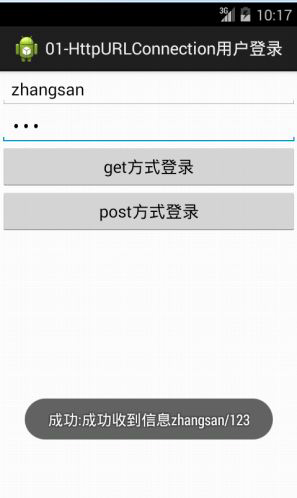
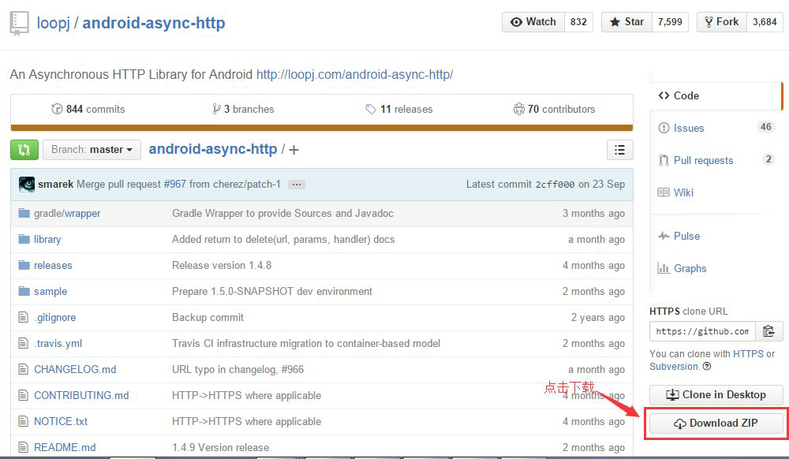
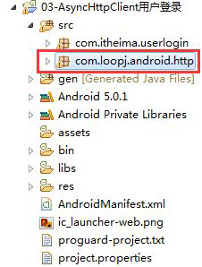
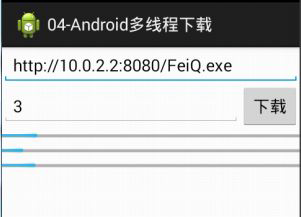
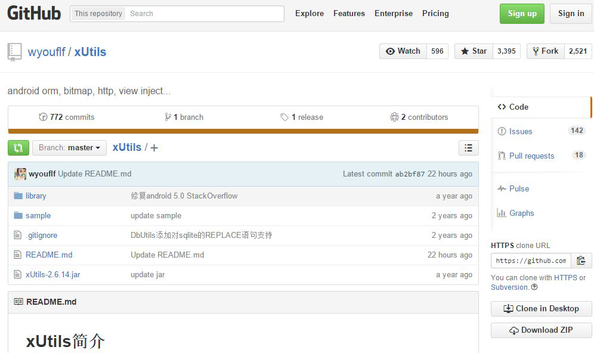
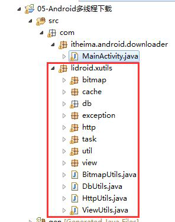
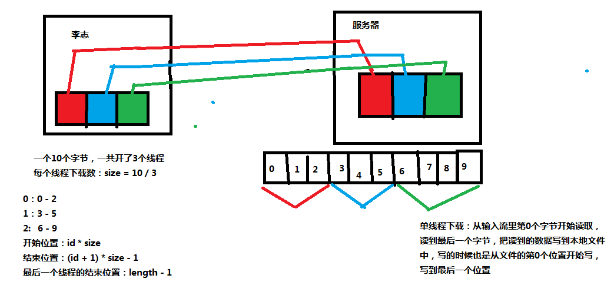
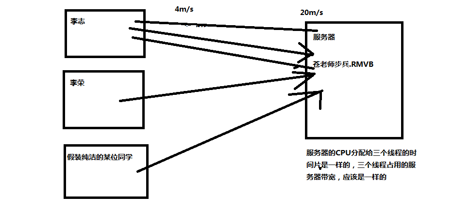

# 网络编程
- [Java基础：网络编程](http://blog.csdn.net/axi295309066/article/details/52854772)
- [Uri、URL、UriMatcher、ContentUris详解](http://blog.csdn.net/axi295309066/article/details/60129690)
- [Android应用开发：网络编程1](http://blog.csdn.net/axi295309066/article/details/60878041)
- [Android应用开发：网络编程2](http://blog.csdn.net/axi295309066/article/details/60878929)

# 1. 使用HttpClient发送get请求

HttpClient是Apache开发的第三方框架，Google把它封装到了Android API中，用于发送HTTP请求。

在Android.jar包中，可以看到有很多java的API，这些都是被Android改写的API，也可以看到Android封装了大量的Apache API。


示例：res\layout\activity_main.xml
```xml
<LinearLayout xmlns:android="http://schemas.android.com/apk/res/android"
    xmlns:tools="http://schemas.android.com/tools"
    android:layout_width="match_parent"
    android:layout_height="match_parent"
    tools:context=".MainActivity"
    android:orientation="vertical">

    <EditText
        android:id="@+id/et_name"
        android:layout_width="match_parent"
        android:layout_height="wrap_content"/>

    <EditText
        android:id="@+id/et_pass"
        android:layout_width="match_parent"
        android:layout_height="wrap_content"/>

    <Button
        android:layout_width="wrap_content"
        android:layout_height="wrap_content"
        android:text="get登陆"
        android:onClick="click1"
        />

    <Button
        android:layout_width="wrap_content"
        android:layout_height="wrap_content"
        android:text="post登陆"
        android:onClick="click2"
        />
</LinearLayout>
```
src/cn.itcast.getmethod/MainActivity.java
```java
package cn.itcast.getmethod;

import java.io.InputStream;
import java.net.URLEncoder;

import org.apache.http.HttpEntity;
import org.apache.http.HttpResponse;
import org.apache.http.StatusLine;
import org.apache.http.client.HttpClient;
import org.apache.http.client.methods.HttpGet;
import org.apache.http.impl.client.DefaultHttpClient;

import android.app.Activity;
import android.os.Bundle;
import android.os.Handler;
import android.os.Message;
import android.view.View;
import android.widget.EditText;
import android.widget.Toast;
import cn.itcast.getmethod.tool.Tools;

public class MainActivity extends Activity {

        Handler handler = new Handler(){
                @Override
                public void handleMessage(Message msg) {
                        Toast.makeText(MainActivity.this, (String)msg.obj, 0).show();
                }
        };

        @Override
        protected void onCreate(Bundle savedInstanceState) {
                super.onCreate(savedInstanceState);
                setContentView(R.layout.activity_main);
        }

        public void click1(View v){

                EditText et_name = (EditText)findViewById(R.id.et_name);
                EditText et_pass = (EditText)findViewById(R.id.et_pass);

                String name = et_name.getText().toString();
                String pass = et_pass.getText().toString();

                final String path = "http://192.168.1.100:8080/Web/servlet/Login?name="
                                      + URLEncoder.encode(name) + "&pass=" + pass;

                Thread t = new Thread(){
                        @Override
                        public void run() {
                                //1. 创建客户端对象
                                //HttpClient是一个接口，不要new一个HttpClient对象，否则要实现很多的方法
                                HttpClient client = new DefaultHttpClient();

                                //2. 创建Http GET请求对象
                                HttpGet get = new HttpGet(path);

                                try {
                                        //3. 使用客户端发送get请求
                                        HttpResponse response = client.execute(get);
                                        //获取状态行
                                        StatusLine line = response.getStatusLine();
                                        //从状态行中拿到状态码
                                        if(line.getStatusCode() == 200){
                                                //获取实体，实体里存放的是服务器返回的数据的相关信息
                                                HttpEntity entity = response.getEntity();
                                                //获取服务器返回的输入流
                                                InputStream is = entity.getContent();

                                                String text = Tools.getTextFromStream(is);

                                                //发送消息，让主线程刷新UI
                                                Message msg = handler.obtainMessage();
                                                msg.obj = text;
                                                handler.sendMessage(msg);
                                        }
                                } catch (Exception e) {
                                        e.printStackTrace();
                                }
                        }
                };
                t.start();
        }
}
```
添加权限：


点击get登陆按钮，运行结果：


# 2. 使用HttpClient发送post请求

src/cn.itcast.postmethod/MainActivity.java
```java
package cn.itcast.postmethod;

import java.io.InputStream;
import java.util.ArrayList;
import java.util.List;

import org.apache.http.HttpEntity;
import org.apache.http.HttpResponse;
import org.apache.http.NameValuePair;
import org.apache.http.StatusLine;
import org.apache.http.client.HttpClient;
import org.apache.http.client.entity.UrlEncodedFormEntity;
import org.apache.http.client.methods.HttpPost;
import org.apache.http.impl.client.DefaultHttpClient;
import org.apache.http.message.BasicNameValuePair;

import android.app.Activity;
import android.os.Bundle;
import android.os.Handler;
import android.os.Message;
import android.view.View;
import android.widget.EditText;
import android.widget.Toast;
import cn.itcast.getmethod.R;
import cn.itcast.getmethod.tool.Tools;

public class MainActivity extends Activity {

        Handler handler = new Handler(){
                @Override
                public void handleMessage(Message msg) {
                        Toast.makeText(MainActivity.this, (String)msg.obj, 0).show();
                }
        };

        @Override
        protected void onCreate(Bundle savedInstanceState) {
                super.onCreate(savedInstanceState);
                setContentView(R.layout.activity_main);
        }

        public void click2(View v){

                EditText et_name = (EditText)findViewById(R.id.et_name);
                EditText et_pass = (EditText)findViewById(R.id.et_pass);

                final String name = et_name.getText().toString();
                final String pass = et_pass.getText().toString();

                final String path = "http://:8080/Web/servlet/Login";

                Thread t = new Thread(){
                        @Override
                        public void run() {
                                //1. 创建客户端对象
                                HttpClient client = new DefaultHttpClient();

                                //2. 创建Http POST请求对象
                                HttpPost post = new HttpPost(path);

                                try{
                                        //通过此集合封装要提交的数据
                                        List<NameValuePair> parameters = new ArrayList<NameValuePair>();

                                        //集合的泛型是BasicNameValuePair类型，那么由此可以推算出，要提交的数据是封装在BasicNameValuePair对象中
                                        BasicNameValuePair bvp1 = new BasicNameValuePair("name", name);
                                        BasicNameValuePair bvp2 = new BasicNameValuePair("pass", pass);

                                        parameters.add(bvp1);
                                        parameters.add(bvp2);

                                        UrlEncodedFormEntity entity = new UrlEncodedFormEntity(parameters,"utf-8");
                                        //把实体类封装至post请求中，提交post请求时，实体中的数据就会用输出流写给服务器
                                        post.setEntity(entity);

                                        //客户端发送post请求
                                        HttpResponse response = client.execute(post);

                                        //获取状态行
                                       StatusLine line = response.getStatusLine();
                                       //从状态行中拿到状态码
                                       if(line.getStatusCode() == 200){
                                              //获取实体，实体里存放的是服务器返回的数据的相关信息
                                               HttpEntity et = response.getEntity();
                                               //获取服务器返回的输入流
                                               InputStream is = et.getContent();

                                               String text = Tools.getTextFromStream(is);

                                               //发送消息，让主线程刷新UI
                                               Message msg = handler.obtainMessage();
                                               msg.obj = text;
                                              handler.sendMessage(msg);
                                      }
                                } catch (Exception e) {
                                        e.printStackTrace();
                                }
                        }
                };
                t.start();
        }
}
```
点击post登陆按钮，运行结果：


# 3. 异步HttpClient框架

从github上下载android-async-http-master开源jar包，拷贝library/src/main/java目录下的内容到我们自己的项目中。


拷贝后，发现有错误，这是由于Base64.java中的BuildConfig类导包问题，Ctrl+Shift+O自动导包即可修复。


使用异步HttpClient框架实现上面示例中的功能，activity.xml与上面的示例相同，修改MainActivity.java代码。
src/cn.itcast.asynchttpclient/MainActivity.java
```java
package cn.itcast.asynchttpclient;

import org.apache.http.Header;

import android.app.Activity;
import android.os.Bundle;
import android.view.View;
import android.widget.EditText;
import android.widget.Toast;

import com.loopj.android.http.AsyncHttpClient;
import com.loopj.android.http.AsyncHttpResponseHandler;
import com.loopj.android.http.RequestParams;

public class MainActivity extends Activity {

        @Override
        protected void onCreate(Bundle savedInstanceState) {
                super.onCreate(savedInstanceState);
                setContentView(R.layout.activity_main);
        }

        public void click1(View v){

                EditText et_name = (EditText)findViewById(R.id.et_name);
                EditText et_pass = (EditText)findViewById(R.id.et_pass);

                final String name = et_name.getText().toString();
                final String pass = et_pass.getText().toString();

                final String path = "http://192.168.1.100:8080/Web/servlet/Login";

                //使用异步HttpClient发送get请求
                AsyncHttpClient client = new AsyncHttpClient();

                //定义一个请求参数对象，封装要提交的数据
                RequestParams rp = new RequestParams();
                rp.add("name", name);
                rp.add("pass", pass);

                //发送get请求
                client.get(path, rp, new MyResponseHandler());
        }

        public void click2(View v){
                EditText et_name = (EditText)findViewById(R.id.et_name);
                EditText et_pass = (EditText)findViewById(R.id.et_pass);

                final String name = et_name.getText().toString();
                final String pass = et_pass.getText().toString();

                final String path = "http://192.168.1.100:8080/Web/servlet/Login";

                AsyncHttpClient client = new AsyncHttpClient();

                RequestParams rp = new RequestParams();
                rp.add("name", name);
                rp.add("pass", pass);

                //发送post请求
                client.post(path, rp, new MyResponseHandler());
        }

        class MyResponseHandler extends AsyncHttpResponseHandler{

                //请求成功时（响应码为200开头），此方法调用
                //登陆成功或者登录失败，只要请求成功，都会调用onSuccess方法
                @Override
                public void onSuccess(int statusCode, Header[] headers,
                                byte[] responseBody) {
                        Toast.makeText(MainActivity.this, new String(responseBody), 0).show();
                }

                //请求失败时（响应码非200开头）调用
                @Override
                public void onFailure(int statusCode, Header[] headers,
                                byte[] responseBody, Throwable error) {
                        //请求不成功，也显示登录失败
                        Toast.makeText(MainActivity.this, "登陆失败", 0).show();
                }
        }
}
```
添加权限：


运行结果：分别点击“get登陆”和“post登陆”按钮。


# 4. 多线程下载的原理和过程

断点续传：上次下载到哪，这次就从哪开始下。
多线程：下载速度更快。
原理：抢占服务器资源。例如：带宽为20M/s，3个人去下载同一部电影，那么每人分别占6.66M/s带宽。如果有一人A开了3个线程同时下载，那么5个线程，各占4M/s带宽，那么A所占带宽就是4*3=12M/s，其他两人各占4M/s带宽。也就是说A抢占了更多的服务器资源。


多线程下载示例说明：
例如有一个10KB的文件，分成0~10，3个线程去下载，第0个线程下载0~2，也就是3KB数据，第1个线程下载3~5，也就是3KB数据，余下的6~9，4KB的数据由最后一个线程下载。

总结出公式就是：
每个线程下载的数据开始点：threadId*size，结束点：(threadId + 1) * size -1。

最后一个线程除外，下载结束点：length - 1。

计算每条线程的下载区间

多线程断点续传的API全部都是Java API，Java项目测试比较容易，所以，我们先创建一个Java项目。
将待下载的资源放入Tomcat服务器中。


src/cn.itcast.MultiDownLoad/Main.java
```java
package cn.itcast.MultiDownLoad;

import java.net.HttpURLConnection;
import java.net.URL;

public class Main {

        static int threadCount = 3;
        static String path = "http://localhost:8080/QQPlayer.exe";

        public static void main(String[] args) {
                URL url;
                try {
                        url = new URL(path);

                        //打开连接对象，做初始化设置
                        HttpURLConnection conn = (HttpURLConnection)url.openConnection();
                        conn.setConnectTimeout(8000);
                        conn.setReadTimeout(8000);

                        if(conn.getResponseCode() == 200){
                                //获取要下载的目标文件的总长度
                                int length = conn.getContentLength();

                                //计算每条线程要下载的长度
                                int size = length / threadCount;
                                System.out.println("size:" + size);

                                //计算每条线程下载的开始位置和结束位置
                                for(int threadId = 0; threadId < threadCount; threadId++){
                                        int startIndex = threadId * size;
                                        int endIndex = (threadId + 1) * size - 1;

                                        //如果是最后一条线程，那么需要把余数也一块下载
                                        if(threadId == threadCount - 1){
                                                endIndex = length - 1;
                                        }
                                        System.out.println("线程" + threadId + "，下载区间为：" + startIndex + "-" + endIndex);
                                }
                        }
                } catch (Exception e) {
                        e.printStackTrace();
                }
        }
}
```
运行结果：


创建临时文件
src/cn.itcast.MultiDownLoad/Main.java
```java
package cn.itcast.MultiDownLoad;

import java.io.File;
import java.io.RandomAccessFile;
import java.net.HttpURLConnection;
import java.net.URL;

public class Main {

        static int threadCount = 3;
        static String path = "http://localhost:8080/QQPlayer.exe";

        public static void main(String[] args) {
                URL url;
                try {
                        url = new URL(path);

                        HttpURLConnection conn = (HttpURLConnection)url.openConnection();
                        conn.setConnectTimeout(8000);
                        conn.setReadTimeout(8000);

                        if(conn.getResponseCode() == 200){
                                int length = conn.getContentLength();

                                int size = length / threadCount;
                                System.out.println("size:" + size);

                                //创建一个与目标文件大小一致的临时文件
                                File file = new File(getFileNameFromPath(path));
                                //打开文件的访问模式设置为rwd，表示除了读取和写入，还要求对文件内容的每个更新都同步写入到底层存储设备。
                                //设计到下载的程序，文件访问模式一定要使用rwd，不经过缓冲区，直接写入硬盘。
                                //如果下载到的数据让写入到缓冲区，一旦断电，缓冲区数据丢失，并且下次服务器断点续传也不会再传输这部分数据，那么下载的文件就不能用了
                                RandomAccessFile raf = new RandomAccessFile(file, "rwd");
                                //设置临时文件的大小
                                raf.setLength(length);

                                for(int threadId = 0; threadId < threadCount; threadId++){
                                        int startIndex = threadId * size;
                                        int endIndex = (threadId + 1) * size - 1;

                                        if(threadId == threadCount - 1){
                                                endIndex = length - 1;
                                        }
                                        System.out.println("线程" + threadId + "，下载区间为：" + startIndex + "-" + endIndex);
                                }
                        }
                } catch (Exception e) {
                        e.printStackTrace();
                }
        }

        public static String getFileNameFromPath(String path){
                int index = path.lastIndexOf("/");
                return path.substring(index + 1);
        }
}
```
开启多个线程下载文件

src/cn.itcast.MultiDownLoad/Main.java
```java
package cn.itcast.MultiDownLoad;

import java.io.File;
import java.io.InputStream;
import java.io.RandomAccessFile;
import java.net.HttpURLConnection;
import java.net.URL;

public class Main {

        static int threadCount = 3;
        static String path = "http://localhost:8080/QQPlayer.exe";

        public static void main(String[] args) {
                URL url;
                try {
                        url = new URL(path);

                        HttpURLConnection conn = (HttpURLConnection)url.openConnection();
                        conn.setConnectTimeout(8000);
                        conn.setReadTimeout(8000);

                        if(conn.getResponseCode() == 200){
                                int length = conn.getContentLength();

                                int size = length / threadCount;
                                System.out.println("size:" + size);

                                for(int threadId = 0; threadId < threadCount; threadId++){
                                        int startIndex = threadId * size;
                                        int endIndex = (threadId + 1) * size - 1;

                                        if(threadId == threadCount - 1){
                                                endIndex = length - 1;
                                        }
                                        System.out.println("线程" + threadId + "，下载区间为：" + startIndex + "-" + endIndex);

                                        DownLoadThread dt = new DownLoadThread(threadId, startIndex, endIndex);
                                        dt.start();
                                }
                        }
                } catch (Exception e) {
                        e.printStackTrace();
                }
        }

        public static String getFileNameFromPath(String path){
                int index = path.lastIndexOf("/");
                return path.substring(index + 1);
        }
}

class DownLoadThread extends Thread{
        int threadId;
        int startIndex;
        int endIndex;

        public DownLoadThread(int threadId, int startIndex, int endIndex) {
                super();
                this.threadId = threadId;
                this.startIndex = startIndex;
                this.endIndex = endIndex;
        }

        public void run(){
                URL url;
                try{
                        url = new URL(Main.path);

                        HttpURLConnection conn = (HttpURLConnection)url.openConnection();
                        conn.setConnectTimeout(8000);
                        conn.setReadTimeout(8000);
                        //Range表示指定请求的数据区间
                        conn.setRequestProperty("Range", "bytes=" + startIndex + "-" + endIndex);

                        //请求部分数据，返回的是206
                        if(conn.getResponseCode() == 206){
                                InputStream is = conn.getInputStream();

                                //打开临时文件的IO流
                                File file = new File(Main.getFileNameFromPath(Main.path));
                                RandomAccessFile raf = new RandomAccessFile(file, "rwd");
                                //修改写入临时文件的开始位置
                                raf.seek(startIndex);

                                byte[] b = new byte[1024];
                                int len = 0;
                                //当前线程下载的总进度
                                int total = 0;
                                while((len = is.read(b)) != -1){
                                        //把读取到的字节写入临时文件中
                                        raf.write(b, 0, len);
                                        total += len;
                                        System.out.println("线程" + threadId + "下载的进度为：" + total);
                                }
                                raf.close();
                        }
                        System.out.println("线程" + threadId + "下载完毕---------------------");
                }catch(Exception e){
                        e.printStackTrace();
                }
        }
}
```
运行结果：刷新，即可看到文件已经下载好了


创建进度临时文件保存下载进度

src/cn.itcast.MultiDownLoad/Main.java

```java
package cn.itcast.MultiDownLoad;

import java.io.File;
import java.io.InputStream;
import java.io.RandomAccessFile;
import java.net.HttpURLConnection;
import java.net.URL;

public class Main {

        static int threadCount = 3;
        static String path = "http://localhost:8080/QQPlayer.exe";

        public static void main(String[] args) {
                URL url;
                try {
                        url = new URL(path);

                        HttpURLConnection conn = (HttpURLConnection)url.openConnection();
                        conn.setConnectTimeout(8000);
                        conn.setReadTimeout(8000);

                        if(conn.getResponseCode() == 200){
                                int length = conn.getContentLength();

                                int size = length / threadCount;
                                System.out.println("size:" + size);

                                for(int threadId = 0; threadId < threadCount; threadId++){
                                        int startIndex = threadId * size;
                                        int endIndex = (threadId + 1) * size - 1;

                                        if(threadId == threadCount - 1){
                                                endIndex = length - 1;
                                        }
                                        System.out.println("线程" + threadId + "，下载区间为：" + startIndex + "-" + endIndex);

                                        DownLoadThread dt = new DownLoadThread(threadId, startIndex, endIndex);
                                        dt.start();
                                }
                        }
                } catch (Exception e) {
                        e.printStackTrace();
                }
        }

        public static String getFileNameFromPath(String path){
                int index = path.lastIndexOf("/");
                return path.substring(index + 1);
        }
}

class DownLoadThread extends Thread{
        int threadId;
        int startIndex;
        int endIndex;

        public DownLoadThread(int threadId, int startIndex, int endIndex) {
                super();
                this.threadId = threadId;
                this.startIndex = startIndex;
                this.endIndex = endIndex;
        }

        public void run(){
                URL url;
                try{
                        url = new URL(Main.path);

                        HttpURLConnection conn = (HttpURLConnection)url.openConnection();
                        conn.setConnectTimeout(8000);
                        conn.setReadTimeout(8000);
                        conn.setRequestProperty("Range", "bytes=" + startIndex + "-" + endIndex);

                        if(conn.getResponseCode() == 206){
                                InputStream is = conn.getInputStream();

                                File file = new File(Main.getFileNameFromPath(Main.path));
                                RandomAccessFile raf = new RandomAccessFile(file, "rwd");
                                raf.seek(startIndex);

                                byte[] b = new byte[1024];
                                int len = 0;
                                int total = 0;
                                while((len = is.read(b)) != -1){
                                        raf.write(b, 0, len);
                                        total += len;
                                        System.out.println("线程" + threadId + "下载的进度为：" + total);

                                        //创建一个进度临时文件，保存下载进度
                                        File fileProgress = new File(threadId + ".txt");
                                        RandomAccessFile rafProgress = new RandomAccessFile(fileProgress, "rwd");
                                        rafProgress.write((total + "").getBytes());
                                        rafProgress.close();
                                }
                                raf.close();
                        }
                        System.out.println("线程" + threadId + "下载完毕---------------------");
                }catch(Exception e){
                        e.printStackTrace();
                }
        }
}
```
运行结果：执行程序，然后，在没下载完成时，就点击右上角的停止按钮。


刷新，可以看到记录文件已经产生。


完成断点续传下载

src/cn.itcast.MultiDownLoad/Main.java
```java
package cn.itcast.MultiDownLoad;

import java.io.BufferedReader;
import java.io.File;
import java.io.FileInputStream;
import java.io.InputStream;
import java.io.InputStreamReader;
import java.io.RandomAccessFile;
import java.net.HttpURLConnection;
import java.net.URL;

public class Main {

        static int threadCount = 3;
        static String path = "http://localhost:8080/QQPlayer.exe";

        public static void main(String[] args) {

                URL url;

                try {
                        url = new URL(path);

                        HttpURLConnection conn = (HttpURLConnection)url.openConnection();
                        conn.setConnectTimeout(8000);
                        conn.setReadTimeout(8000);

                        if(conn.getResponseCode() == 200){
                                int length = conn.getContentLength();

                                int size = length / threadCount;
                                System.out.println("size:" + size);

                                for(int threadId = 0; threadId < threadCount; threadId++){
                                        int startIndex = threadId * size;
                                        int endIndex = (threadId + 1) * size - 1;

                                        if(threadId == threadCount - 1){
                                                endIndex = length - 1;
                                        }
                                        DownLoadThread dt = new DownLoadThread(threadId, startIndex, endIndex);
                                        dt.start();
                                }
                        }
                } catch (Exception e) {
                        e.printStackTrace();
                }
        }

        public static String getFileNameFromPath(String path){
                int index = path.lastIndexOf("/");
                return path.substring(index + 1);
        }
}

class DownLoadThread extends Thread{
        int threadId;
        int startIndex;
        int endIndex;

        public DownLoadThread(int threadId, int startIndex, int endIndex) {
                super();
                this.threadId = threadId;
                this.startIndex = startIndex;
                this.endIndex = endIndex;
        }

        public void run(){

                URL url;

                try{
                        int lastProgress = 0;
                        //下载之前，先判断进度临时文件是否存在
                        File fileProgress1 = new File(threadId + ".txt");
                        if(fileProgress1.exists()){
                                FileInputStream fis = new FileInputStream(fileProgress1);
                                BufferedReader br = new BufferedReader(new InputStreamReader(fis));
                                //读取进度临时文件中的值
                                lastProgress = Integer.parseInt(br.readLine());
                                //把上一次下载的进度加到下载开始位置
                                startIndex += lastProgress;
                                fis.close();
                        }

                        System.out.println("线程" + threadId + "，下载区间为：" + startIndex + "-" + endIndex);

                        url = new URL(Main.path);

                        HttpURLConnection conn = (HttpURLConnection)url.openConnection();
                        conn.setConnectTimeout(8000);
                        conn.setReadTimeout(8000);
                        conn.setRequestProperty("Range", "bytes=" + startIndex + "-" + endIndex);

                        if(conn.getResponseCode() == 206){
                                InputStream is = conn.getInputStream();

                                File file = new File(Main.getFileNameFromPath(Main.path));
                                RandomAccessFile raf = new RandomAccessFile(file, "rwd");
                                raf.seek(startIndex);

                                byte[] b = new byte[1024];
                                int len = 0;
                                //从之前下载的地方开始下载
                                int total = lastProgress;
                                while((len = is.read(b)) != -1){
                                        raf.write(b, 0, len);
                                        total += len;
                                        System.out.println("线程" + threadId + "下载的进度为：" + total);

                                        File fileProgress = new File(threadId + ".txt");
                                        RandomAccessFile rafProgress = new RandomAccessFile(fileProgress, "rwd");
                                        rafProgress.write((total + "").getBytes());
                                        rafProgress.close();
                                }
                                raf.close();
                                System.out.println("线程" + threadId + "下载完毕---------------------");
                        }
                }catch(Exception e){
                        e.printStackTrace();
                }
        }
}
```
运行结果：

执行Main.java程序，然后，在还没有下载完，停止。然后，再次执行Main.java，可以看到如下显示，也就是实现了断点续传。


下载后删除进度临时文件
src/cn.itcast.MultiDownLoad/Main.java
```java
package cn.itcast.MultiDownLoad;

import java.io.BufferedReader;
import java.io.File;
import java.io.FileInputStream;
import java.io.InputStream;
import java.io.InputStreamReader;
import java.io.RandomAccessFile;
import java.net.HttpURLConnection;
import java.net.URL;

public class Main {

        //记录当前已经下载完成的线程的数量
        static int finishedThreadCount = 0;
        static int threadCount = 3;
        static String path = "http://localhost:8080/QQPlayer.exe";

        public static void main(String[] args) {

                URL url;

                try {
                        url = new URL(path);

                        HttpURLConnection conn = (HttpURLConnection)url.openConnection();
                        conn.setConnectTimeout(8000);
                        conn.setReadTimeout(8000);

                        if(conn.getResponseCode() == 200){
                                int length = conn.getContentLength();

                                int size = length / threadCount;
                                System.out.println("size:" + size);

                                for(int threadId = 0; threadId < threadCount; threadId++){
                                        int startIndex = threadId * size;
                                        int endIndex = (threadId + 1) * size - 1;

                                        if(threadId == threadCount - 1){
                                                endIndex = length - 1;
                                        }
                                        DownLoadThread dt = new DownLoadThread(threadId, startIndex, endIndex);
                                        dt.start();
                                }
                        }
                } catch (Exception e) {
                        e.printStackTrace();
                }
        }

        public static String getFileNameFromPath(String path){
                int index = path.lastIndexOf("/");
                return path.substring(index + 1);
        }
}

class DownLoadThread extends Thread{
        int threadId;
        int startIndex;
        int endIndex;

        public DownLoadThread(int threadId, int startIndex, int endIndex) {
                super();
                this.threadId = threadId;
                this.startIndex = startIndex;
                this.endIndex = endIndex;
        }

        public void run(){

                URL url;

                try{
                        int lastProgress = 0;
                        File fileProgress1 = new File(threadId + ".txt");
                        if(fileProgress1.exists()){
                                FileInputStream fis = new FileInputStream(fileProgress1);
                                BufferedReader br = new BufferedReader(new InputStreamReader(fis));
                                lastProgress = Integer.parseInt(br.readLine());
                                startIndex += lastProgress;
                                fis.close();
                        }

                        System.out.println("线程" + threadId + "，下载区间为：" + startIndex + "-" + endIndex);

                        url = new URL(Main.path);

                        HttpURLConnection conn = (HttpURLConnection)url.openConnection();
                        conn.setConnectTimeout(8000);
                        conn.setReadTimeout(8000);
                        conn.setRequestProperty("Range", "bytes=" + startIndex + "-" + endIndex);

                        if(conn.getResponseCode() == 206){
                                InputStream is = conn.getInputStream();

                                File file = new File(Main.getFileNameFromPath(Main.path));
                                RandomAccessFile raf = new RandomAccessFile(file, "rwd");
                                raf.seek(startIndex);

                                byte[] b = new byte[1024];
                                int len = 0;
                                int total = lastProgress;
                                while((len = is.read(b)) != -1){
                                        raf.write(b, 0, len);
                                        total += len;
                                        System.out.println("线程" + threadId + "下载的进度为：" + total);

                                        File fileProgress = new File(threadId + ".txt");
                                        RandomAccessFile rafProgress = new RandomAccessFile(fileProgress, "rwd");
                                        rafProgress.write((total + "").getBytes());
                                        rafProgress.close();
                                }
                                raf.close();
                                System.out.println("线程" + threadId + "下载完毕---------------------");

                                //在所有线程都下载完毕后，一起删除所有进度临时文件
                                //有一个线程完成下载，已经下载完成的线程的数量+1
                                Main.finishedThreadCount++;

                                synchronized(Main.path){
                                        if(Main.finishedThreadCount == 3){
                                                //删除所有进度临时文件
                                                for(int i = 0; i < Main.finishedThreadCount; i++){
                                                        File f = new File(i + ".txt");
                                                        f.delete();
                                                }
                                                //为了防止所有线程都执行到上面的Main.finishedThreadCount++;，然后三个线程都执行删除所有临时文件的代码。
                                                //所以，一方面使用同步代码块，另一方面将Main.finishedThreadCount设置为0。
                                                Main.finishedThreadCount = 0;
                                        }
                                }
                        }
                }catch(Exception e){
                        e.printStackTrace();
                }
        }
}
```
运行结果：运行Main.java，断点续传完成后，刷新。可以看到，临时文件已经被删除。


# 5. Android版多线程断点续传下载

res/layout/activity.xml

```xml
<RelativeLayout xmlns:android="http://schemas.android.com/apk/res/android"
    xmlns:tools="http://schemas.android.com/tools"
    android:layout_width="match_parent"
    android:layout_height="match_parent"
    tools:context=".MainActivity" >

    <Button
        android:layout_width="wrap_content"
        android:layout_height="wrap_content"
        android:text="下载"
        android:onClick="click" />

</RelativeLayout>
```
src/cn.itcast.androidmultidownload/MainActivity.xml

```java
package cn.itcast.androidmultidownload;

import java.io.BufferedReader;
import java.io.File;
import java.io.FileInputStream;
import java.io.InputStream;
import java.io.InputStreamReader;
import java.io.RandomAccessFile;
import java.net.HttpURLConnection;
import java.net.URL;
import android.app.Activity;
import android.os.Bundle;
import android.os.Environment;
import android.view.View;

public class MainActivity extends Activity {

        int finishedThreadCount = 0;
        int threadCount = 3;
        String path = "http://192.168.1.100:8080/QQPlayer.exe";

        @Override
        protected void onCreate(Bundle savedInstanceState) {
                super.onCreate(savedInstanceState);
                setContentView(R.layout.activity_main);
        }

    public void click(View v){
            Thread t = new Thread(){
                    @Override
                    public void run() {

                            URL url;

                            try {
                                    url = new URL(path);

                                    HttpURLConnection conn = (HttpURLConnection)url.openConnection();
                                    conn.setConnectTimeout(8000);
                                    conn.setReadTimeout(8000);

                                    if(conn.getResponseCode() == 200){
                                            int length = conn.getContentLength();

                                            int size = length / threadCount;
                                            System.out.println("size:" + size);

                                            for(int threadId = 0; threadId < threadCount; threadId++){
                                                    int startIndex = threadId * size;
                                                    int endIndex = (threadId + 1) * size - 1;

                                                    if(threadId == threadCount - 1){
                                                            endIndex = length - 1;
                                                    }
                                                    DownLoadThread dt = new DownLoadThread(threadId, startIndex, endIndex);
                                                    dt.start();
                                            }
                                    }
                            } catch (Exception e) {
                                    e.printStackTrace();
                            }
                    }
            };
            t.start();
    }

        public String getFileNameFromPath(String path){
                int index = path.lastIndexOf("/");
                return path.substring(index + 1);
        }

        class DownLoadThread extends Thread{
                int threadId;
                int startIndex;
                int endIndex;

                public DownLoadThread(int threadId, int startIndex, int endIndex) {
                        super();
                        this.threadId = threadId;
                        this.startIndex = startIndex;
                        this.endIndex = endIndex;
                }

                public void run(){

                        URL url;

                        try{
                                int lastProgress = 0;
                                //修改文件路径，存在外部存储器中
                                File fileProgress1 = new File(Environment.getExternalStorageDirectory(), threadId + ".txt");
                                if(fileProgress1.exists()){
                                        FileInputStream fis = new FileInputStream(fileProgress1);
                                        BufferedReader br = new BufferedReader(new InputStreamReader(fis));
                                        lastProgress = Integer.parseInt(br.readLine());
                                        startIndex += lastProgress;
                                        fis.close();
                                }

                                System.out.println("线程" + threadId + "，下载区间为：" + startIndex + "-" + endIndex);

                                url = new URL(path);

                                HttpURLConnection conn = (HttpURLConnection)url.openConnection();
                                conn.setConnectTimeout(8000);
                                conn.setReadTimeout(8000);
                                conn.setRequestProperty("Range", "bytes=" + startIndex + "-" + endIndex);

                                if(conn.getResponseCode() == 206){
                                        InputStream is = conn.getInputStream();

                                        File file = new File(Environment.getExternalStorageDirectory(), getFileNameFromPath(path));
                                        RandomAccessFile raf = new RandomAccessFile(file, "rwd");
                                        raf.seek(startIndex);

                                        byte[] b = new byte[1024];
                                        int len = 0;
                                        int total = lastProgress;
                                        while((len = is.read(b)) != -1){
                                                raf.write(b, 0, len);
                                                total += len;
                                                System.out.println("线程" + threadId + "下载的进度为：" + total);

                                                File fileProgress = new File(Environment.getExternalStorageDirectory(), threadId + ".txt");
                                                RandomAccessFile rafProgress = new RandomAccessFile(fileProgress, "rwd");
                                                rafProgress.write((total + "").getBytes());
                                                rafProgress.close();
                                        }
                                        raf.close();
                                        System.out.println("线程" + threadId + "下载完毕---------------------");

                                        finishedThreadCount++;

                                        synchronized(path){
                                                if(finishedThreadCount == 3){
                                                        for(int i = 0; i < finishedThreadCount; i++){
                                                                File f = new File(Environment.getExternalStorageDirectory(), i + ".txt");
                                                                f.delete();
                                                        }
                                                        finishedThreadCount = 0;
                                                }
                                        }
                                }
                        }catch(Exception e){
                                e.printStackTrace();
                        }
                }
        }
}
```
添加权限：


运行结果：点击“下载”按钮，在下载完成之前，杀死线程。


   可以看到临时文件生成。


再次运行应用程序，点击“下载”按钮，接着下载，断点续传成功实现。


下载完成后，可以看到临时文件删除成功。


添加进度条反应下载进度，res/layout/activity.xml

```xml
<LinearLayout xmlns:android="http://schemas.android.com/apk/res/android"
    xmlns:tools="http://schemas.android.com/tools"
    android:layout_width="match_parent"
    android:layout_height="match_parent"
    tools:context=".MainActivity"
    android:orientation="vertical">

    <Button
        android:layout_width="wrap_content"
        android:layout_height="wrap_content"
        android:text="下载"
        android:onClick="click" />

    <ProgressBar
        android:id="@+id/pb"
        style="@android:style/Widget.ProgressBar.Horizontal"
        android:layout_width="match_parent"
        android:layout_height="wrap_content"
        />

</LinearLayout>
```
src/cn.itcast.androidmultidownload/MainActivity.xml

```java
package cn.itcast.androidmultidownload;

import java.io.BufferedReader;
import java.io.File;
import java.io.FileInputStream;
import java.io.InputStream;
import java.io.InputStreamReader;
import java.io.RandomAccessFile;
import java.net.HttpURLConnection;
import java.net.URL;

import android.app.Activity;
import android.os.Bundle;
import android.os.Environment;
import android.view.View;
import android.widget.ProgressBar;

public class MainActivity extends Activity {

        int finishedThreadCount = 0;
        int threadCount = 3;
        String path = "http://192.168.1.100:8080/QQPlayer.exe";

        private ProgressBar pb;
        //记录进度条的当前进度
        int currentProgress = 0;

        @Override
        protected void onCreate(Bundle savedInstanceState) {
                super.onCreate(savedInstanceState);
                setContentView(R.layout.activity_main);

                //进度条
                pb = (ProgressBar) findViewById(R.id.pb);
        }

    public void click(View v){
            Thread t = new Thread(){
                    @Override
                    public void run() {

                            URL url;

                            try {
                                    url = new URL(path);

                                    HttpURLConnection conn = (HttpURLConnection)url.openConnection();
                                    conn.setConnectTimeout(8000);
                                    conn.setReadTimeout(8000);

                                    if(conn.getResponseCode() == 200){
                                            int length = conn.getContentLength();

                                            //设定进度条的最大值
                                            pb.setMax(length);

                                            int size = length / threadCount;
                                            System.out.println("size:" + size);

                                            for(int threadId = 0; threadId < threadCount; threadId++){
                                                    int startIndex = threadId * size;
                                                    int endIndex = (threadId + 1) * size - 1;

                                                    if(threadId == threadCount - 1){
                                                            endIndex = length - 1;
                                                    }
                                                    DownLoadThread dt = new DownLoadThread(threadId, startIndex, endIndex);
                                                    dt.start();
                                            }
                                    }
                            } catch (Exception e) {
                                    e.printStackTrace();
                            }
                    }
            };
            t.start();
    }

        public String getFileNameFromPath(String path){
                int index = path.lastIndexOf("/");
                return path.substring(index + 1);
        }

        class DownLoadThread extends Thread{
                int threadId;
                int startIndex;
                int endIndex;

                public DownLoadThread(int threadId, int startIndex, int endIndex) {
                        super();
                        this.threadId = threadId;
                        this.startIndex = startIndex;
                        this.endIndex = endIndex;
                }

                public void run(){

                        URL url;

                        try{
                                int lastProgress = 0;
                                File fileProgress1 = new File(Environment.getExternalStorageDirectory(), threadId + ".txt");
                                if(fileProgress1.exists()){
                                        FileInputStream fis = new FileInputStream(fileProgress1);
                                        BufferedReader br = new BufferedReader(new InputStreamReader(fis));
                                        lastProgress = Integer.parseInt(br.readLine());
                                        startIndex += lastProgress;

                                        //如果开始位置大于或等于endIndex，说明上一次下载中，此线程就已经下载完了
                                        if(startIndex >= endIndex){
                                                finishedThreadCount++;
                                        }

                                        //如果上一次下载过，把上次的进度加到当前进度中
                                        currentProgress += lastProgress;
                                        pb.setProgress(currentProgress);
                                        fis.close();
                                }

                                System.out.println("线程" + threadId + "，下载区间为：" + startIndex + "-" + endIndex);

                                url = new URL(path);

                                HttpURLConnection conn = (HttpURLConnection)url.openConnection();
                                conn.setConnectTimeout(8000);
                                conn.setReadTimeout(8000);
                                conn.setRequestProperty("Range", "bytes=" + startIndex + "-" + endIndex);

                                if(conn.getResponseCode() == 206){
                                        InputStream is = conn.getInputStream();

                                        File file = new File(Environment.getExternalStorageDirectory(), getFileNameFromPath(path));
                                        RandomAccessFile raf = new RandomAccessFile(file, "rwd");
                                        raf.seek(startIndex);

                                        byte[] b = new byte[1024];
                                        int len = 0;
                                        int total = lastProgress;
                                        while((len = is.read(b)) != -1){
                                                raf.write(b, 0, len);
                                                total += len;

                                                System.out.println("线程" + threadId + "下载的进度为：" + total);

                                                File fileProgress = new File(Environment.getExternalStorageDirectory(), threadId + ".txt");
                                                RandomAccessFile rafProgress = new RandomAccessFile(fileProgress, "rwd");
                                                rafProgress.write((total + "").getBytes());
                                                rafProgress.close();

                                                //每一条线程下载的数据，都应该加到全局进度里
                                                currentProgress += len;
                                                //设置进度条当前进度
                                                //进度条内部也是通过handler让主线程刷新UI的
                                                pb.setProgress(currentProgress);
                                        }
                                        raf.close();
                                        System.out.println("线程" + threadId + "下载完毕---------------------");

                                        finishedThreadCount++;

                                        synchronized(path){
                                                if(finishedThreadCount == 3){
                                                        for(int i = 0; i < finishedThreadCount; i++){
                                                                File f = new File(Environment.getExternalStorageDirectory(), i + ".txt");
                                                                f.delete();
                                                        }
                                                        finishedThreadCount = 0;
                                                }
                                        }
                                }
                        }catch(Exception e){
                                e.printStackTrace();
                        }
                }
        }
}
```
运行结果：点击“下载”按钮，可以通过进度条看到下载进度。然后，杀死进程，再重新运行应用程序，点击“下载”按钮，可以看到进度条在原有的基础上继续向前移动，也就是实现了断点续传的进度条实现。


添加文本进度，res/layout/activity.xml

```xml
<LinearLayout xmlns:android="http://schemas.android.com/apk/res/android"
    xmlns:tools="http://schemas.android.com/tools"
    android:layout_width="match_parent"
    android:layout_height="match_parent"
    tools:context=".MainActivity"
    android:orientation="vertical">

    <Button
        android:layout_width="wrap_content"
        android:layout_height="wrap_content"
        android:text="下载"
        android:onClick="click" />

    <ProgressBar
        android:id="@+id/pb"
        style="@android:style/Widget.ProgressBar.Horizontal"
        android:layout_width="match_parent"
        android:layout_height="wrap_content"
        />

    <TextView
        android:id="@+id/tv"
        android:layout_width="wrap_content"
        android:layout_height="wrap_content"
        android:text="0%"
        android:layout_gravity="right"
        />

</LinearLayout>
```
src/cn.itcast.androidmultidownload/MainActivity.xml

```java
package cn.itcast.androidmultidownload;

import java.io.BufferedReader;
import java.io.File;
import java.io.FileInputStream;
import java.io.InputStream;
import java.io.InputStreamReader;
import java.io.RandomAccessFile;
import java.net.HttpURLConnection;
import java.net.URL;

import android.app.Activity;
import android.os.Bundle;
import android.os.Environment;
import android.os.Handler;
import android.view.View;
import android.widget.ProgressBar;
import android.widget.TextView;

public class MainActivity extends Activity {

        int finishedThreadCount = 0;
        int threadCount = 3;
        String path = "http://192.168.1.100:8080/QQPlayer.exe";

        private ProgressBar pb;
        int currentProgress = 0;

        private TextView tv;

        //刷新TextView
        Handler handler = new Handler(){
                public void handleMessage(android.os.Message msg) {
                        //当前进度除以最大进度，得到下载进度的百分比
                        tv.setText(pb.getProgress() * 100 /pb.getMax() + "%");
                }
        };

        @Override
        protected void onCreate(Bundle savedInstanceState) {
                super.onCreate(savedInstanceState);
                setContentView(R.layout.activity_main);

                pb = (ProgressBar) findViewById(R.id.pb);
                tv = (TextView)findViewById(R.id.tv);
        }

    public void click(View v){
            Thread t = new Thread(){
                    @Override
                    public void run() {

                            URL url;

                            try {
                                    url = new URL(path);

                                    HttpURLConnection conn = (HttpURLConnection)url.openConnection();
                                    conn.setConnectTimeout(8000);
                                    conn.setReadTimeout(8000);

                                    if(conn.getResponseCode() == 200){
                                            int length = conn.getContentLength();

                                            pb.setMax(length);

                                            int size = length / threadCount;
                                            System.out.println("size:" + size);

                                            for(int threadId = 0; threadId < threadCount; threadId++){
                                                    int startIndex = threadId * size;
                                                    int endIndex = (threadId + 1) * size - 1;

                                                    if(threadId == threadCount - 1){
                                                            endIndex = length - 1;
                                                    }
                                                    DownLoadThread dt = new DownLoadThread(threadId, startIndex, endIndex);
                                                    dt.start();
                                            }
                                    }
                            } catch (Exception e) {
                                    e.printStackTrace();
                            }
                    }
            };
            t.start();
    }

        public String getFileNameFromPath(String path){
                int index = path.lastIndexOf("/");
                return path.substring(index + 1);
        }

        class DownLoadThread extends Thread{
                int threadId;
                int startIndex;
                int endIndex;

                public DownLoadThread(int threadId, int startIndex, int endIndex) {
                        super();
                        this.threadId = threadId;
                        this.startIndex = startIndex;
                        this.endIndex = endIndex;
                }

                public void run(){

                        URL url;

                        try{
                                int lastProgress = 0;
                                File fileProgress1 = new File(Environment.getExternalStorageDirectory(), threadId + ".txt");
                                if(fileProgress1.exists()){
                                        FileInputStream fis = new FileInputStream(fileProgress1);
                                        BufferedReader br = new BufferedReader(new InputStreamReader(fis));
                                        lastProgress = Integer.parseInt(br.readLine());
                                        startIndex += lastProgress;

                                        if(startIndex >= endIndex){
                                                finishedThreadCount++;
                                        }

                                        currentProgress += lastProgress;
                                        pb.setProgress(currentProgress);

                                        //发送消息，让主线程刷新文本进度
                                        handler.sendEmptyMessage(1);
                                        fis.close();
                                }

                                System.out.println("线程" + threadId + "，下载区间为：" + startIndex + "-" + endIndex);

                                url = new URL(path);

                                HttpURLConnection conn = (HttpURLConnection)url.openConnection();
                                conn.setConnectTimeout(8000);
                                conn.setReadTimeout(8000);
                                conn.setRequestProperty("Range", "bytes=" + startIndex + "-" + endIndex);

                                if(conn.getResponseCode() == 206){
                                        InputStream is = conn.getInputStream();

                                        File file = new File(Environment.getExternalStorageDirectory(), getFileNameFromPath(path));
                                        RandomAccessFile raf = new RandomAccessFile(file, "rwd");
                                        raf.seek(startIndex);

                                        byte[] b = new byte[1024];
                                        int len = 0;
                                        int total = lastProgress;
                                        while((len = is.read(b)) != -1){
                                                raf.write(b, 0, len);
                                                total += len;

                                                System.out.println("线程" + threadId + "下载的进度为：" + total);

                                                File fileProgress = new File(Environment.getExternalStorageDirectory(), threadId + ".txt");
                                                RandomAccessFile rafProgress = new RandomAccessFile(fileProgress, "rwd");
                                                rafProgress.write((total + "").getBytes());
                                                rafProgress.close();

                                                currentProgress += len;
                                                pb.setProgress(currentProgress);

                                                //发送消息，让主线程刷新文本进度
                                                handler.sendEmptyMessage(1);
                                        }
                                        raf.close();
                                        System.out.println("线程" + threadId + "下载完毕---------------------");

                                        finishedThreadCount++;

                                        synchronized(path){
                                                if(finishedThreadCount == 3){
                                                        for(int i = 0; i < finishedThreadCount; i++){
                                                                File f = new File(Environment.getExternalStorageDirectory(), i + ".txt");
                                                                f.delete();
                                                        }
                                                        finishedThreadCount = 0;
                                                }
                                        }
                                }
                        }catch(Exception e){
                                e.printStackTrace();
                        }
                }
        }
}
```
运行结果：


文本进度计算的bug：当文件较大时，就会出现bug，文本进度计算数据变成了负数。


这是因为文件大小超出了int所能表示的最大范围。


只需要修改代码如下即可。


如果最终显示为99%，那么只需要在下载完成之后，直接在程序中写死为100%即可。

# 6. xUtils多线程断点续传下载

从github上下载xUtils，将xUtils的jar复制到libs目录下。


如果无法关联源码，可以通过在libs目录下新建一个properties文件解决。


properties文件的内容为"src=源码目录"，即可成功关联源码。


res/layout/activity.xml

```xml
<LinearLayout xmlns:android="http://schemas.android.com/apk/res/android"
    xmlns:tools="http://schemas.android.com/tools"
    android:layout_width="match_parent"
    android:layout_height="match_parent"
    android:paddingBottom="@dimen/activity_vertical_margin"
    android:paddingLeft="@dimen/activity_horizontal_margin"
    android:paddingRight="@dimen/activity_horizontal_margin"
    android:paddingTop="@dimen/activity_vertical_margin"
    tools:context=".MainActivity"
    android:orientation="vertical"
    >

    <Button
        android:layout_width="wrap_content"
        android:layout_height="wrap_content"
        android:text="下载"
        android:onClick="click" />

    <TextView
            android:id="@+id/tv_success"
            android:layout_width="wrap_content"
        android:layout_height="wrap_content"
    />

    <TextView
            android:id="@+id/tv_failure"
            android:layout_width="wrap_content"
        android:layout_height="wrap_content"
        android:textColor="#ff0000"
    />

    <ProgressBar
            android:id="@+id/tv_pb"
            style="@android:style/Widget.ProgressBar.Horizontal"
            android:layout_width="match_parent"
        android:layout_height="wrap_content"
    />

    <TextView
            android:id="@+id/tv_progress"
            android:layout_width="wrap_content"
        android:layout_height="wrap_content"
    />
</LinearLayout>
```
src/cn.itcast.androidmultidownload/MainActivity.xml

```java
package cn.itcast.xutils;

import java.io.File;

import android.app.Activity;
import android.os.Bundle;
import android.view.View;
import android.widget.ProgressBar;
import android.widget.TextView;

import com.lidroid.xutils.HttpUtils;
import com.lidroid.xutils.exception.HttpException;
import com.lidroid.xutils.http.HttpHandler;
import com.lidroid.xutils.http.ResponseInfo;
import com.lidroid.xutils.http.callback.RequestCallBack;

public class MainActivity extends Activity {

        String path = "http://192.168.1.100:8080/QQPlayer.exe";

        private TextView tv;
        private ProgressBar pb;

        @Override
        protected void onCreate(Bundle savedInstanceState) {
                super.onCreate(savedInstanceState);
                setContentView(R.layout.activity_main);

                pb = (ProgressBar)findViewById(R.id.tv_pb);
                tv = (TextView)findViewById(R.id.tv_progress);
        }

    public void click(View v){
            HttpUtils utils = new HttpUtils();

            HttpHandler handler = utils.download(path, //请求的网址
                            "sdcard/QQPlayer.exe", //文件保存的路径及文件名
                        true, // 是否支持断点续传
                        true, // 如果相应头中包含文件名，那么下载完毕后，自动以该名字重命名文件
                        new RequestCallBack<File>() {

                                    //下载完成调用
                            @Override
                            public void onSuccess(ResponseInfo<File> responseInfo) {
                                    TextView tv = (TextView)findViewById(R.id.tv_success);
                                    tv.setText(responseInfo.result.getPath());
                            }

                            //下载失败后调用
                            @Override
                            public void onFailure(HttpException error, String msg) {
                                    TextView tv = (TextView)findViewById(R.id.tv_success);
                                    tv.setText(msg);
                            }

                            //下载过程中不断调用
                            @Override
                                    public void onLoading(long total, long current,
                                                    boolean isUploading) {
                                    pb.setMax((int)total);
                                    pb.setProgress((int)current);
                                    tv.setText((current * 100)/ total + "%");
                                    }
                    });
    }
}
```
添加权限：


运行结果：


---

# 1. 内容摘要

- 使用HttpURLConnection 提交数据
- 使用HttpClient 提交数据
- 使用AsyncHttpClient 框架提交数据
- Android 实现多线程下载
- 使用xUtils 框架实现多线程下载

# 2. 前言
移动互联网时代哪个app 不需要跟服务器进行交互呢？Android 给服务器提交数据的方式都有哪些呢？这正是本文3、4、5节讨论的话题，每一节介绍一种提交数据的方式，但是Android 提交数据的方式绝非仅仅这三种，这里给出的只是最基础的3 中方式。将这些基础的方式学会了，其他再高级的方式对我们来说也不过是小菜一碟了。
本文的3、4、5 三节中使用的需求和布局是一模一样的，甚至4.2 和5.3 节的工程就是直接从3.1节中的工程拷贝过来的，唯一不同的就是使用提交数据的框架（类）不同。因此这里一次性将需求给出。

## 2.1 需求说明
如图1-1 所示，界面整体采用垂直的线性布局，前两行为两个EditText，分别代表用户名和密码。第三、四两行为两个Button，前者点击后采用get 方式提交数据，后者点击后采用post 方式提交数据。数据提交成功后，服务器会有返回值，并将返回值用Toast 显示出来。

## 2.2 服务器搭建
服务端采用Servlet 编写，名为LoginServlet，并使用Tomcat 作为其服务器。LoginServlet.java 源码见【文件1-1】，其中黄色高亮部分为核心代码。该Servlet 在web.xml 中的配置见【文件1-2】。因为服务器不是本文的重点，因此这里只简单介绍。

【文件1-1】LoginServlet.java
```java
package com.itheima.servlet;
import java.io.IOException;
import javax.servlet.ServletException;
import javax.servlet.http.HttpServlet;
import javax.servlet.http.HttpServletRequest;
import javax.servlet.http.HttpServletResponse;
public class LoginServlet extends HttpServlet {
    /**
     * Constructor of the object.
     */
    public LoginServlet() {
        super();
    }
    /**
     * Destruction of the servlet. <br>
     */
    public void destroy() {
        super.destroy(); // Just puts "destroy" string in log
        // Put your code here
    }
    /**
     * The doGet method of the servlet. <br>
     *
     * This method is called when a form has its tag value method equals to get.
     *
     * @param request the request send by the client to the server
     * @param response the response send by the server to the client
     * @throws ServletException if an error occurred
     * @throws IOException if an error occurred
     */
    public void doGet(HttpServletRequest request, HttpServletResponse response)
            throws ServletException, IOException {
        request.setCharacterEncoding("utf-8");
        String username = request.getParameter("username");
        String password = request.getParameter("password");
        if ("GET".equals(request.getMethod().toUpperCase())) {
            byte[] bytes = username.getBytes("iso-8859-1");
            username = new String(bytes, "utf-8");
        }
        System.out.println("usernmae===="+username);
        System.out.println("password==="+password);
        response.setCharacterEncoding("utf-8");
        response.getWriter().write("成功收到信息"+username+"/"+password);
    }
    /**
     * The doPost method of the servlet. <br>
     *
     * This method is called when a form has its tag value method equals to post.
     *
     * @param request the request send by the client to the server
     * @param response the response send by the server to the client
     * @throws ServletException if an error occurred
     * @throws IOException if an error occurred
     */
    public void doPost(HttpServletRequest request, HttpServletResponse response)
            throws ServletException, IOException {
        doGet(request, response);
    }
    /**
     * Initialization of the servlet. <br>
     *
     * @throws ServletException if an error occurs
     */
    public void init() throws ServletException {
        // Put your code here
    }
}
```
【文件1-2】web.xml
```xml
<?xml version="1.0" encoding="UTF-8"?>
<web-app version="2.5"
         xmlns="http://java.sun.com/xml/ns/javaee"
         xmlns:xsi="http://www.w3.org/2001/XMLSchema-instance"
         xsi:schemaLocation="http://java.sun.com/xml/ns/javaee
         http://java.sun.com/xml/ns/javaee/web-app_2_5.xsd">

    <servlet>
        <servlet-name>LoginServlet</servlet-name>
        <servlet-class>com.itheima.servlet.LoginServlet</servlet-class>
    </servlet>

    <servlet>
        <servlet-name>FileuploadServlet</servlet-name>
        <servlet-class>com.itheima.servlet.FileuploadServlet</servlet-class>
    </servlet>

    <servlet-mapping>
        <servlet-name>LoginServlet</servlet-name>
        <url-pattern>/servlet/LoginServlet</url-pattern>
    </servlet-mapping>

    <servlet-mapping>
        <servlet-name>FileuploadServlet</servlet-name>
        <url-pattern>/servlet/FileuploadServlet</url-pattern>
    </servlet-mapping>

    <welcome-file-list>
        <welcome-file>index.jsp</welcome-file>
    </welcome-file-list>
</web-app>
```



## 2.3 编写布局
考虑到3、4、5节使用的工程布局是一模一样的，因此在这里先将布局给出。

【文件1-3】activity_main.java
```xml
<LinearLayout xmlns:android="http://schemas.android.com/apk/res/android"
              xmlns:tools="http://schemas.android.com/tools"
              android:layout_width="match_parent"
              android:layout_height="match_parent"
              android:orientation="vertical">

    <EditText
        android:id="@+id/et_username"
        android:layout_width="match_parent"
        android:layout_height="wrap_content"
        android:hint="请输入用户名" />
    <EditText
        android:id="@+id/et_password"
        android:inputType="textPassword"
        android:layout_width="match_parent"
        android:layout_height="wrap_content"
        android:hint="请输入密码" />
    <Button
        android:onClick="login"
        android:layout_width="match_parent"
        android:layout_height="wrap_content"
        android:layout_gravity="right"
        android:text="get 方式登录" />
    <Button
        android:onClick="login2"
        android:layout_width="match_parent"
        android:layout_height="wrap_content"
        android:layout_gravity="right"
        android:text="post 方式登录" />

</LinearLayout>
```
## 2.4 添加权限

凡是网络访问的操作，必须添加如下权限。
```xml
<uses-permission android:name="android.permission.INTERNET"/>
```

# 3. 使用HttpURLConnection 提交数据

```java
URL newURL = new URL(url);
URLConnection urlConnection = newURL.openConnection();
urlConnection.setConnectTimeout(mConfig.connTimeOut);
urlConnection.setReadTimeout(mConfig.soTimeOut);
urlConnection.setDoInput(true);
urlConnection.setUseCaches(false);

// HttpsURLConnection
HttpsURLConnection.setDefaultSSLSocketFactory(sslFactory);
HttpsURLConnection.setDefaultHostnameVerifier();
```
HttpURLConnection常用方法

| 方法声明                 | 功能描述   |
| :------------------- | :----- |
| addRequestProperty() | 添加请求属性 |
| setRequestMethod()   | 设置请求方式 |
| setDoOutput()        |        |
| setDoInput()         |        |
| setConnectTimeout()  |        |
| setReadTimeout()     |        |
| setUseCaches()       |        |
| getResponseCode()    |        |
| getOutputStream()    |        |
| getInputStream()     |        |
| getErrorStream()     |        |
| getResponseMessage() |        |
| getContentLength()   |        |
| getContentEncoding() |        |
| getContentType()     |        |
| getHeaderFields()    |        |

## 3.1 代码

MainActivity.java 代码清单见【文件1-4】。
【文件1-4】MainActivity.java
```java
package com.itheima.userlogin;
import java.io.InputStream;
import java.io.OutputStream;
import java.net.HttpURLConnection;
import java.net.URL;
import java.net.URLEncoder;
import com.itheima.userlogin1.R;
import android.os.Bundle;
import android.os.Handler;
import android.app.Activity;
import android.text.TextUtils;
import android.view.View;
import android.widget.EditText;
import android.widget.Toast;
/**
 * 使用HttpURLConnection 提交数据
 * 在该案例中分别使用了get 和post 两种
 * 方式提交数据。
 * 大家可以对比这两种方式使用上的不同。
 */
public class MainActivity extends Activity {
    protected static final int TIME_OUT = 5000;
    private EditText et_password;
    private EditText et_username;
    private Handler handler = new Handler() {
        @Override
        public void handleMessage(android.os.Message msg) {
            switch (msg.what) {
                case RESULT_OK:
                    Toast.makeText(MainActivity.this, "成功:"
                            + msg.obj.toString(), Toast.LENGTH_LONG).show();
                    break;
                case RESULT_CANCELED:
                    Toast.makeText(MainActivity.this, "失败:"
                            + msg.obj.toString(), Toast.LENGTH_LONG).show();
                    break;
            }
        }
    };
    @Override
    protected void onCreate(Bundle savedInstanceState) {
        super.onCreate(savedInstanceState);
        setContentView(R.layout.activity_main);
        //获取控件
        et_username = (EditText) findViewById(R.id.et_username);
        et_password = (EditText) findViewById(R.id.et_password);
    }
    public void login(View view) { // 使用get 方式完成用户的登录
        //获取用户数据
        final String username = et_username.getText().toString().trim();
        final String password = et_password.getText().toString().trim();
        //校验数据
        if (TextUtils.isEmpty(password) || TextUtils.isEmpty(username)) {
            Toast.makeText(this, "用户名或密码不能为空!", Toast.LENGTH_SHORT).show();
            return;
        }
        //开启子线程
        new Thread(new Runnable() {
            @Override
            public void run() {
                // 因为是get 方式提交参数，因此对提交的参数必须使用URLEncoder.encode(String)方法进行编码，
                // 该编码可以将中文、空格、特殊字符等转义为16 进制的数字，这样可以兼容不同平台的差异性，
                // 而Tomcat 内部会自动将这些16 进制数给重新变为普通文本
                String path = "http://10.0.2.2:8080/userlogin/servlet/LoginServlet?username="
                        + URLEncoder.encode(username) + "&password=" + password;
                try {
                    URL url = new URL(path);
                    HttpURLConnection connection = (HttpURLConnection) url.openConnection();
                    //配置参数
                    connection.setRequestMethod("GET");
                    connection.setConnectTimeout(TIME_OUT);
                    connection.setReadTimeout(TIME_OUT);
                    //打开链接
                    connection.connect();
                    //获取状态码
                    int responseCode = connection.getResponseCode();
                    // 判断返回的状态码是否等于200，如果返回200 则代表请求成功
                    if (200 == responseCode) {
                        //获取返回值
                        InputStream inputStream = connection.getInputStream();
                        //将字节输入流转化为字符串
                        String data = StreamUtils.inputStream2String(inputStream);
                        //将数据通过handler 发送出去
                        handler.obtainMessage(RESULT_OK, data).sendToTarget();
                    } else {
                        //如果返回状态码不等于200 则代码请求失败
                        //将失败消息也发送出去
                        handler.obtainMessage(RESULT_CANCELED, responseCode).sendToTarget();
                    }
                } catch (Exception e) {
                    e.printStackTrace();
                    //将异常消息发送出去
                    handler.obtainMessage(RESULT_CANCELED, e).sendToTarget();
                }
            }
        }).start();
    }
    public void login2(View view) { // 使用post 方式完成用户的登录
        //获取用户数据
        final String username = et_username.getText().toString().trim();
        final String password = et_password.getText().toString().trim();
        //校验数据
        if (TextUtils.isEmpty(password) || TextUtils.isEmpty(username)) {
            Toast.makeText(this, "用户名或密码不能为空!", Toast.LENGTH_SHORT).show();
            return;
        }
        //开启子线程
        new Thread(new Runnable() {
            @Override
            public void run() {
                String path = "http://10.0.2.2:8080/userlogin/servlet/LoginServlet";
                try {
                    URL url = new URL(path);
                    HttpURLConnection connection = (HttpURLConnection) url.openConnection();
                    //配置参数
                    connection.setRequestMethod("POST");
                    // 设置该参数,才能以流的形式提交数据,需要将要提交的数据转换为字节输出流
                    connection.setDoOutput(true);
                    connection.setConnectTimeout(TIME_OUT);
                    connection.setReadTimeout(TIME_OUT);
                    //将提交的参数进行URL 编码
                    String param = "username=" + URLEncoder.encode(username) + "&password=" +
                            password;
                    // 设置请求属性,相当于封装http 的请求头参数,设置请求体的的长度
                    connection.setRequestProperty("Content-Length", param.length() + "");
                    //设置请求体的类型
                    connection.setRequestProperty("Content-Type", "application / x - www - " +
                            "form - urlencoded");
                    connection.connect(); //打开链接
                    //获取输出流
                    OutputStream os = connection.getOutputStream();
                    //通过输出流将要提交的数据提交出去
                    os.write(param.getBytes());
                    //关闭输出流
                    os.close();
                    //判断状态码
                    int responseCode = connection.getResponseCode();
                    if (200 == responseCode) {
                        //获取返回值
                        InputStream inputStream = connection.getInputStream();
                        //将字节流转换为字符串
                        String data = StreamUtils.inputStream2String(inputStream);
                        handler.obtainMessage(RESULT_OK, data).sendToTarget();
                    } else {
                        handler.obtainMessage(RESULT_CANCELED, responseCode).sendToTarget();
                    }
                } catch (Exception e) {
                    e.printStackTrace();
                    handler.obtainMessage(RESULT_CANCELED, e).sendToTarget();
                }
            }
        }).start();
    }
}
```

## 3.2 总结
在http 协议中，get 请求协议没有请求体，只有请求头和请求行，因此如果想使用get 方式提交数据，只能通过在url 后面加上要提交的参数。这也意味着get 方式只能提交比较小的参数。

如果get 方式提交的参数有特殊字符或者中文字符那么必须对其进行URL 编码，不然会导致服务器接收到的数据乱码。


对于post 请求，提交的数据位于请求体中，因此需要设置connection.setDoOutput(true);参数，该参数设置后才允许将提交的数据通过输出流的形式提交。不过需要说明的是虽然采用post 方式提交，依然需要将参数进行URL 编码。


其实当我们使用浏览器进行form 表单提交的时候，浏览器内部已经帮我们实现了URL 编码。因为我们这里是使用代码模拟浏览器的提交数据过程，因此需要使用代码特殊处理。

# 4. 使用HttpClient 提交数据
HttpClient 是Apache Jakarta Common 下的子项目，提供了高效的、最新的、功能丰富的支持HTTP 协议的客户端编程工具包，并且它支持HTTP 协议最新的版本。
HttpClient 被内置到Android SDK 中，因此可以在不添加任何额外jar 包情况下，直接使用。（PS：Android 6.0 后HttpClient 已经被删除）

## 4.1 get 方式提交

在1.2 节工程的基础上，只需要修改部分代码即可。因此这里只给出核心代码。

【文件1-5】get 方式提交数据代码片段
```java
/**HttpCLient 使用get 方式完成用户的登录*/
public void login3(View view) {
    // 获取用户数据
    final String username = et_username.getText().toString().trim();
    final String password = et_password.getText().toString().trim();
    // 校验数据
    if (TextUtils.isEmpty(password) || TextUtils.isEmpty(username)) {
        Toast.makeText(this, "用户名或密码不能为空!", Toast.LENGTH_SHORT).show();
        return;
    }
    // 开启子线程
    new Thread(new Runnable() {

        @Override
        public void run() {
            String path = "http://10.0.2.2:8080/userlogin/servlet/LoginServlet?username="
                            + URLEncoder.encode(username) + "&password=" + password;
            try {
                // 创建一个httpClient 对象
                HttpClient client = new DefaultHttpClient();
                // 创建一个请求方式
                HttpGet request = new HttpGet(path);
                // 执行操作
                HttpResponse response = client.execute(request);
                // 获取放回状态对象
                StatusLine statusLine = response.getStatusLine();
                // 获取状态码
                int statusCode = statusLine.getStatusCode();
                if (200 == statusCode) {
                    // 获取服务器返回的对象
                    HttpEntity entity = response.getEntity();
                    // 获取输入流
                    InputStream inputStream = entity.getContent();
                    // 将输入流转化为字符串
                    String data = StreamUtils.inputStream2String(inputStream);
                    handler.obtainMessage(RESULT_OK, data).sendToTarget();
                } else {
                    handler.obtainMessage(RESULT_CANCELED, statusCode).sendToTarget();
                }

            } catch (Exception e) {
                e.printStackTrace();
                handler.obtainMessage(RESULT_CANCELED, e).sendToTarget();
            }
        }
    }).start();
}
```
## 4.2 post 方式提交

【文件1-6】post 方式提交数据代码片段
```java
/**HttpCLient 使用post 方式完成用户的登录*/
public void login4(View view) {
    // 获取用户数据
    final String username = et_username.getText().toString().trim();
    final String password = et_password.getText().toString().trim();
    // 校验数据
    if (TextUtils.isEmpty(password) || TextUtils.isEmpty(username)) {
        Toast.makeText(this, "用户名或密码不能为空!", Toast.LENGTH_SHORT).show();
        return;
    }
    // 开启子线程
    new Thread(new Runnable() {

        @Override
        public void run() {
            String path = "http://10.0.2.2:8080/userlogin/servlet/LoginServlet";
            try {
                // 创建一个httpClient 对象
                HttpClient client = new DefaultHttpClient();
                // 创建一个post 请求方式
                HttpPost request = new HttpPost(path);
                //创建集合用于添加请求的数据
                List<BasicNameValuePair> parameters = new ArrayList<BasicNameValuePair>();
                //将请求数据添加到集合中
                parameters.add(new BasicNameValuePair("username", username));
                parameters.add(new BasicNameValuePair("password", password));
                /*
                * 创建请求实体对象
                * UrlEncodedFormEntity 是HttpEntity 的子类，
                * 该类专门用于封装字符串类型的参数
                * 指定数据的编码格式
                */
                HttpEntity requestEntity = new UrlEncodedFormEntity(parameters, "utf-8");
                //设置请求体
                request.setEntity(requestEntity);
                // 执行操作
                HttpResponse response = client.execute(request);
                // 获取放回状态对象
                StatusLine statusLine = response.getStatusLine();
                // 获取状态码
                int statusCode = statusLine.getStatusCode();
                if (200 == statusCode) {
                    // 获取服务器返回的对象
                    HttpEntity entity = response.getEntity();
                    // 获取输入流
                    InputStream inputStream = entity.getContent();
                    // 将输入流转化为字符串
                    String data = StreamUtils.inputStream2String(inputStream);
                    handler.obtainMessage(RESULT_OK, data).sendToTarget();
                } else {
                    handler.obtainMessage(RESULT_CANCELED, statusCode).sendToTarget();
                }

            } catch (Exception e) {
                e.printStackTrace();
                handler.obtainMessage(RESULT_CANCELED, e).sendToTarget();
            }
        }
    }).start();
}
```

## 4.3 总结

### 4.3.1 get 请求方式步骤

1、创建一个httpClient 对象

```java
HttpClient client = new DefaultHttpClient();
```

2、创建一个请求方式
```java
String path ="http://10.0.2.2:8080/userlogin/servlet/LoginServlet?username="
			+ URLEncoder.encode(username) + "&password=" + password;
//因为是get 方式，因此需要在path 中添加请求参数
HttpGet request = new HttpGet(path);
```
3、开始访问网络，并接收返回值
```java
HttpResponse response = client.execute(request);
```

4、获取返回状态码

```java
//获取返回值的状态行
StatusLine statusLine = response.getStatusLine();
// 获取状态码
int statusCode = statusLine.getStatusCode();
```
5、判断状态码

```java
//如果状态码为200 则代表请求成功
if (200 == statusCode) {//TODO}
```
6、获取返回数据
```java
// 获取服务器返回的对象
HttpEntity entity = response.getEntity();
// 获取输入流
InputStream inputStream = entity.getContent();
```

### 4.3.2 post 请求方式步骤

1、创建一个httpClient 对象

```java
HttpClient client = new DefaultHttpClient();
```

2、创建一个post 请求方式

```java
String path = "http://10.0.2.2:8080/userlogin/servlet/LoginServlet";
HttpPost request = new HttpPost(path);
```

3、设置请求体
```java
//创建集合用于添加请求的数据
List<BasicNameValuePair> parameters = new ArrayList<BasicNameValuePair>();
//将请求数据添加到集合中
parameters.add(new BasicNameValuePair("username", username));
parameters.add(new BasicNameValuePair("password", password));
 /*
  * 创建请求实体对象
  * UrlEncodedFormEntity 是HttpEntity 的子类，该类专门用于封装字符串类型的参数
  * 指定数据的编码格式
  */
HttpEntity requestEntity = new UrlEncodedFormEntity(parameters, "utf-8");
//设置请求体
request.setEntity(requestEntity);
```
4、开始访问网络，并接收返回值
```java
// 执行操作
HttpResponse response = client.execute(request);
```
5、获取返回状态码
```java
//获取返回值的状态行
StatusLine statusLine = response.getStatusLine();
// 获取状态码
int statusCode = statusLine.getStatusCode();
```
6、判断状态码
```java
//如果状态码为200 则代表请求成功
if (200 == statusCode) {//TODO}
```
7、获取返回数据
```java
// 获取服务器返回的对象
HttpEntity entity = response.getEntity();
// 获取输入流
InputStream inputStream = entity.getContent();
```
# 5. 使用AsyncHttpClient 框架提交数据

AsyncHttpClient 是开源免费的基于HttpClient 的网络请求框架，其源码托管在githu 上。[下载地址]( https://github.com/loopj/android-async-http)
如图5-1 所示为AsyncHttpClient 在github 的网页，大家可以点击右下角的按钮，将源码下载下来，然后将下载好的压缩包解压，把src 目录中源码拷贝到自己的工程的src 目录下，比如图5-2所示。





## 5.1 get 方式提交
在1.2 节工程的基础上，只需要修改部分代码即可。因此这里只给出核心代码。
【文件1-7】get 方式提交数据代码片段
```java
/**使用AsyncHttpClient 的get 方式提交数据*/
public void login5(View view) {
    // 获取用户数据
    final String username = et_username.getText().toString().trim();
    final String password = et_password.getText().toString().trim();
    // 校验数据
    if (TextUtils.isEmpty(password) || TextUtils.isEmpty(username)) {
        Toast.makeText(this, "用户名或密码不能为空!", Toast.LENGTH_SHORT).show();
        return;
    }
    String path = "http://10.0.2.2:8080/userlogin/servlet/LoginServlet?username="
            + URLEncoder.encode(username) + "&password=" + password;
    // 创建一个AsyncHttpClient
    AsyncHttpClient client = new AsyncHttpClient();
    //执行get 方式请求
    client.get(path, new DataAsyncHttpResponseHandler() {
        /*
        * 请求网络是在子线程中进行的，当请求成功后回调onSuccess 方法，
        * 该方法是在主线程中被调用了，其内部是通过Handler 实现的
        * 当请求成功后回调该方法
        * 参数1：返回的状态码
        * 参数2：响应头
        * 参数3：返回的数据
        */
        @Override
        public void onSuccess(int statusCode, Header[] headers, byte[] responseBody) {
            Log.d("tag", Thread.currentThread().getName());
            //将responseBody 字节数组转化为字符串
            Toast.makeText(MainActivity.this, new String(responseBody), Toast.LENGTH_LONG).show();
        }

        // 当请求失败后回调该方法，该方法依然在主线程中被执行
        @Override
        public void onFailure(int statusCode, Header[] headers, byte[] responseBody, Throwable error) {
            Toast.makeText(MainActivity.this, new String(responseBody), Toast.LENGTH_LONG).show();
        }
    });
}
```
## 5.2 post 方式提交

【文件1-8】post 方式提交数据代码片段
```java
/**使用AsyncHttpClient 的post 方式提交数据*/
public void login6(View view) {
    // 获取用户数据
    final String username = et_username.getText().toString().trim();
    final String password = et_password.getText().toString().trim();
    // 校验数据
    if (TextUtils.isEmpty(password) || TextUtils.isEmpty(username)) {
        Toast.makeText(this, "用户名或密码不能为空!", Toast.LENGTH_SHORT).show();
        return;
    }
    String path = "http://10.0.2.2:8080/userlogin/servlet/LoginServlet";
    // 创建一个AsyncHttpClient
    AsyncHttpClient client = new AsyncHttpClient();
    //封装请求参数
    RequestParams params = new RequestParams();
    params.put("username", username);
    params.put("password", password);
     /*
      * 执行post 请求
      * 参数1：url 地址
      * 参数2：请求参数
      * 参数3：回调接口，在该接口中实现成功和失败方法，该过程是异步的。
      */
    client.post(path, params, new DataAsyncHttpResponseHandler() {

        @Override
        public void onSuccess(int statusCode, Header[] headers, byte[] responseBody)
        {
            Toast.makeText(MainActivity.this, new String(responseBody), Toast.LENGTH_LONG).show();
        }

        @Override
        public void onFailure(int statusCode, Header[] headers, byte[] responseBody,
                              Throwable error) {
            Toast.makeText(MainActivity.this, new String(responseBody), Toast.LENGTH_LONG).show();
        }
    });
}
```
## 5.3 总结
### 5.3.1 get 请求方式步骤

1、创建一个AsyncHttpClient 对象

```java
AsyncHttpClient client = new AsyncHttpClient();
```

2、执行get 方法

```java
  /*
   * 执行get 方式请求
   * 参数1：请求的url 地址
   * 参数2：回调接口。在该接口中实现相应成功和失败方法，该过程是异步的。
   */
   client.get(path, new DataAsyncHttpResponseHandler() {
    /*
     * 请求网络是在子线程中进行的，当请求成功后回调onSuccess 方法，
     * 该方法是在主线程中被调用了，其内部是通过Handler 实现的
     * 当请求成功后回调该方法
     * 参数1：返回的状态码
     * 参数2：响应头
     * 参数3：返回的数据
    */
    @Override
    public void onSuccess(int statusCode, Header[] headers, byte[] responseBody) {
        Log.d("tag", Thread.currentThread().getName());
        //将responseBody 字节数组转化为字符串
        Toast.makeText(MainActivity.this, new String(responseBody), Toast.LENGTH_LONG).show();
    }

    // 当请求失败后回调该方法，该方法依然在主线程中被执行
    @Override
    public void onFailure(int statusCode, Header[] headers, byte[] responseBody, Throwable error) {
        Toast.makeText(MainActivity.this, new String(responseBody), Toast.LENGTH_LONG).show();
    }
});
```
在执行get 方法的时候需要传递一个ResponseHandlerInterface 接口的子类， 在上面使用了DataAsyncHttpResponseHandler 抽象类，除此之外其实ResponseHandlerInterface 还有很多子类，比如用于接收json 字符串的TextHttpResponseHandler，用于接收文件下载的TextHttpResponseHandler。因为我们只需要接收字节数组，并将字节数组转化为字符串即可，因此我们使用DataAsyncHttpResponseHandler 抽象类。

### 5.3.2 post 方式请求步骤

1、创建一个AsyncHttpClient 对象
```java
AsyncHttpClient client = new AsyncHttpClient();
```
2、封装请求参数
```java
//封装请求参数
RequestParams params = new RequestParams();
params.put("username", username);
params.put("password", password);
```
3、执行post 方法
```java
  /*
   * 执行post 请求
   * 参数1：url 地址
   * 参数2：请求参数
   * 参数3：回调接口，在该接口中实现成功和失败方法，该过程是异步的。
   */
client.post(path, params, new DataAsyncHttpResponseHandler() {
    @Override
    public void onSuccess(int statusCode, Header[] headers, byte[] responseBody) {
        Toast.makeText(MainActivity.this, new String(responseBody), Toast.LENGTH_LONG).show();
    }
    @Override
    public void onFailure(int statusCode, Header[] headers, byte[] responseBody,
    Throwable error) {
        Toast.makeText(MainActivity.this, new String(responseBody), Toast.LENGTH_LONG).show();
    }
});
```
post 方法跟get 方式不同的就是多了一个RequestParams 参数。

# 6. JavaSE 实现多线程下载

## 6.1 多线程下载原理
多线程下载就是将同一个网络上的原始文件根据线程个数分成均等份，然后每个单独的线程下载对应的一部分，然后再将下载好的文件按照原始文件的顺序“拼接”起来就构成了完整的文件了。这样就大大提高了文件的下载效率。


多线程下载大致可分为以下几个步骤：

1）获取服务器上的目标文件的大小

显然这一步是需要先访问一下网络，只需要获取到目标文件的总大小即可。目的是为了计算每个线程应该分配的下载任务。

2）计算每个线程下载的起始位置和结束位置

我们可以把原始文件当成一个字节数组，每个线程只下载该“数组”的指定起始位置和指定结束位置之间的部分。在第一步中我们已经知道了“数组”的总长度。因此只要再知道总共开启的线程的个数就好
计算每个线程要下载的范围了。


每个线程需要下载的字节个数（blockSize）= 总字节数（totalSize）/线程数（threadCount）
假设给线程按照0,1,2,3...n 的方式依次进行编号，那么第n 个线程下载文件的范围为：
起始脚标 startIndex=n*blockSize
结束脚标 endIndex=(n-1)*blockSize-1
考虑到totalSize/threadCount 不一定能整除，因此对已最后一个线程应该特殊处理，最后一个线程的起始脚标计算公式不变，但是结束脚标endIndex=totalSize-1;即可。

3）在本地创建一个跟原始文件同样大小的文件
在本地可以通过RandomAccessFile 创建一个跟目标文件同样大小的文件，该api 支持文件任意位置的读写操作。这样就给多线程下载提供了方便，每个线程只需在指定起始和结束脚标范围内写数据即可。
4）开启多个子线程开始下载
5）记录下载进度
为每一个单独的线程创建一个临时文件，用于记录该线程下载的进度。对于单独的一个线程，每下载一部分数据就在本地文件中记录下当前下载的字节数。这样子如果下载任务异常终止了，那么下次重新开
始下载时就可以接着上次的进度下载。
6）删除临时文件
当多个线程都下载完成之后，最后一个下载完的线程将所有的临时文件删除。

## 6.2 代码实现

【文件1-9】多线程下载JavaSE 代码
```java
package com.itheima.se.download;
import java.io.BufferedReader;
import java.io.BufferedWriter;
import java.io.File;
import java.io.FileReader;
import java.io.FileWriter;
import java.io.InputStream;
import java.io.RandomAccessFile;
import java.net.HttpURLConnection;
import java.net.URL;
public class MultiDownlodTest { // 实现多线程断点续下载

    public static void main(String[] args) {
        String sourcePath = "http://localhost:8080/FeiQ.exe";
        String targetPath = "d://FeiQ.exe";
        new MultiDownloader(sourcePath,3,targetPath).download();
    }
    static class MultiDownloader {
        private String sourcePath;
        private int threadCount;
        private String targetPath;
        //未完成任务的线程
        private int threadRunning;
        public MultiDownloader(String sourcePath,int threadCount,String targetPath){
            this.sourcePath = sourcePath;
            this.threadCount = threadCount;
            this.targetPath = targetPath;
        }
        public void download(){
            try {
                URL url = new URL(sourcePath);
                HttpURLConnection connection = (HttpURLConnection) url.openConnection();
                //配置连接参数
                connection.setRequestMethod("GET");
                connection.setConnectTimeout(5000);
                //打开连接
                connection.connect();
                int responseCode = connection.getResponseCode();
                if (responseCode==200) {
                    int totalSize = connection.getContentLength();
                    //计算每个线程下载的平均字节数
                    int avgSize = totalSize/threadCount;
                    for(int i=0;i<threadCount;i++){
                        final int startIndex = i*avgSize;
                        int endIndex = 0;
                        if (i==threadCount-1) {
                            endIndex = totalSize-1;
                        }else {
                            endIndex = (i+1)*avgSize-1;
                        }
                        threadRunning++;
                        //开启子线程,实现下载
                        new MyDownloadThread(i, startIndex, endIndex,targetPath,sourcePath).start();
                    }
                }else {
                    System.out.println("返回码为:"+responseCode+" 请求文件长度失败!");
                    return;
                }
            } catch (Exception e) {
                e.printStackTrace();
            }
        }

        class MyDownloadThread extends Thread{
            private int id;
            private int startIndex;
            private int endIndex;
            private String targetPath;
            private String sourcePath;
            public MyDownloadThread(int id,int startIndex, int endIndex,String targetPath,String sourcePath){
                this.id = id;
                this.startIndex = startIndex;
                this.endIndex = endIndex;
                this.targetPath = targetPath;
                this.sourcePath = sourcePath;
            }
            @Override
            public void run() {
                try {
                    URL url = new URL(sourcePath);
                    HttpURLConnection connection = (HttpURLConnection) url.openConnection();
                    //设置断点下载参数
                    connection.setRequestMethod("GET");
                    File file = new File("d://"+id+".tmp");
                    // 该属性设置后,返回的状态码就不再是200,而是206
                    int currentIndex = -1;
                    //读进度
                    if (file.exists()) {
                        BufferedReader reader = new BufferedReader(new FileReader(file));
                        String readLine = reader.readLine();
                        currentIndex = Integer.valueOf(readLine);
                        reader.close();
                    }else {
                        currentIndex = startIndex;
                    }
                    // 只有设置了该属性才能下载指定范围的文件
                    connection.setRequestProperty("Range", "bytes="+currentIndex+"-"+endIndex);
                    connection.setConnectTimeout(5000);
                    connection.setReadTimeout(5000);
                    connection.connect();
                    int responseCode = connection.getResponseCode();
                    //因为请求的是一个文件的部分，因此返回的状体码是206
                    if (responseCode==206) {
                        InputStream inputStream = connection.getInputStream();
                        //支持随机读写的文件类
                        RandomAccessFile raf = new RandomAccessFile(targetPath, "rws");
                        //将文件指针定位到要写的位置
                        raf.seek(currentIndex);
                        byte[] buffer = new byte[1024*16];
                        int len = -1;
                        int totalDownloded = 0;
                        while((len=inputStream.read(buffer))!=-1){
                            raf.write(buffer, 0, len);
                            totalDownloded+=len;
                            //写进度
                            BufferedWriter writer = new BufferedWriter(new FileWriter(file));
                            writer.write(currentIndex+totalDownloded+"");
                            writer.close();
                            System.out.println(id+"下载了:"+totalDownloded+","+
                                    (totalDownloded+currentIndex-startIndex)*100/(endIndex-startIndex)+"%");
                        }
                        raf.close();
                        inputStream.close();
                        connection.disconnect();
                        //线程执行完了
                        threadRunning--;
                        if (threadRunning==0) {
                            for(int i=0;i<threadCount;i++){
                                File tmpFile = new File("d://"+i+".tmp");
                                tmpFile.delete();
                            }
                        }
                    }else {
                        System.out.println("返回的状态码为:"+responseCode+ " 下载失败!");
                    }
                } catch (Exception e) {
                    e.printStackTrace();
                }
            }
        }
    }
}
```
## 6.3 新技能：
- 多线程下载文件的请求属性

如果我们想请求服务器上某文件的一部分，而不是将整个文件都下载下来，那么就必须设置如下属性：

```java
connection.setRequestProperty("Range", "bytes="+currentIndex+"-"+endIndex);
```

- 请求部分文件返回成功的状态码是206

当我们请求部分文件成功后，服务器返回的状态码不是200，而是206。

# 7. Android 实现多线程下载

将上面JavaSE 实现多线程下载的代码经过一定的改造，便可移植到Android 上。有所不同的是Android有界面可以跟用户进行良好的交互，在界面（如图1-4）上让用户输入原文件地址、线程个数，然后点击确定开始下载。为了让用户可以清晰的看到每个线程下载的进度根据线程个数动态的生成等量的进度条（ProgressBar）。
图1-4 Android 实现多线程下载




## 7.1 ProgressBar 的使用

ProgressBar 是一个进度条控件，用于显示一项任务的完成进度。其有两种样式，一种是圆形的，该种样式是系统默认的，由于无法显示具体的进度值，适合用于不确定要等待多久的情形下；另一种是长条形的， ，此类进度条有两种颜色，高亮颜色代表任务完成的总进度。对于我们下载任务来说，由于总任务（要下载的字节数）是明确的，当前已经完成的任务（已经下载的字节数）也是明确的，因此特别适合使用后者。

由于在我们的需求里ProgressBar 是需要根据线程的个数动态添加的，而且要求是长条形的。因此可以事先在布局文件中编写好ProgressBar 的样式。当需要用到的时候再将该布局（见【文件1-11】）填充起来。
ProgressBar 的max 属性代表其最大刻度值，progress 属性代表当前进度值。使用方法如下：

```java
ProgressBar.setMax(int max); // 设置最大刻度值。
ProgressBar.setProgress(int progress); // 设置当前进度值。
```

给ProgressBar 设置最大刻度值和修改进度值可以在子线程中操作的，其内部已经特殊处理过了，因此不需要再通过发送Message 让主线程修改进度。

## 7.2 编写布局

这里给出两个布局，【文件1-10】是MainActivity 的布局，其显示效果如图1-4。【文件1-11】是ProgressBar布局。

【文件1-10】activity_main.java
```xml
<LinearLayout xmlns:android="http://schemas.android.com/apk/res/android"
              xmlns:tools="http://schemas.android.com/tools"
              android:layout_width="match_parent"
              android:layout_height="match_parent"
              android:orientation="vertical">

    <EditText
        android:id="@+id/et_url"
        android:layout_width="match_parent"
        android:layout_height="wrap_content"
        android:text="http://10.0.2.2:8080/FeiQ.exe" />
    <LinearLayout
        android:layout_width="match_parent"
        android:layout_height="wrap_content"
        android:orientation="horizontal"
        >
        <EditText
            android:id="@+id/et_threadCount"
            android:layout_width="0dp"
            android:layout_weight="1"
            android:layout_height="wrap_content"
            android:text="3"
            />
        <Button
            android:onClick="download"
            android:layout_width="wrap_content"
            android:layout_height="wrap_content"
            android:text="下载"
            />
    </LinearLayout>
    <LinearLayout
        android:id="@+id/ll_pbs"
        android:layout_width="match_parent"
        android:layout_height="wrap_content"
        android:orientation="vertical">

    </LinearLayout>

</LinearLayout>
```
【文件1-11】progress_bar.xml
```xml
<?xml version="1.0" encoding="utf-8"?>
<ProgressBar xmlns:android="http://schemas.android.com/apk/res/android"
    style="?android:attr/progressBarStyleHorizontal"
    android:layout_width="match_parent"
    android:layout_height="wrap_content" >
</ProgressBar>
```

## 7.3 编写代码
【文件1-12】MainActivity.java
```java
package com.itheima.android.downloader;
import java.io.BufferedReader;
import java.io.BufferedWriter;
import java.io.File;
import java.io.FileReader;
import java.io.FileWriter;
import java.io.InputStream;
import java.io.RandomAccessFile;
import java.net.HttpURLConnection;
import java.net.URL;
import android.os.Bundle;
import android.support.v4.app.FragmentActivity;
import android.text.TextUtils;
import android.view.View;
import android.widget.EditText;
import android.widget.LinearLayout;
import android.widget.ProgressBar;
import android.widget.Toast;
/**Android 实现多线程断点续传*/
public class MainActivity extends FragmentActivity {
    private EditText     et_url;
    private EditText     et_threadCount;
    //用于添加ProgressBar 的容器
    private LinearLayout ll_pbs;
    @Override
    protected void onCreate(Bundle savedInstanceState) {
        super.onCreate(savedInstanceState);
        setContentView(R.layout.activity_main);
        //初始化控件
        et_url = (EditText) findViewById(R.id.et_url);
        et_threadCount = (EditText) findViewById(R.id.et_threadCount);
        ll_pbs = (LinearLayout) findViewById(R.id.ll_pbs);
    }

    /**点击Button 绑定的方法开始下载任务*/
    public void download(View view) {
        // 获取用户输入的初始值
        final String sourcePath = et_url.getText().toString().trim();
        final int threadCount = Integer.valueOf(et_threadCount.getText().toString().trim());
        // 校验数据
        if (TextUtils.isEmpty(sourcePath) || threadCount < 1) {
            Toast.makeText(this, "输入的内容不合法!", Toast.LENGTH_SHORT).show();
            return;
        }
        //存储到Android 本地的位置
        final String targetPath = "/mnt/sdcard/FeiQ.exe";
        //初始化进度条
        //填充一个ProgressBar
        for(int i=0;i<threadCount;i++){
            //将进度条布局填充为ProgressBar
            ProgressBar pb = (ProgressBar) View.inflate(MainActivity.this, R.layout.progress_bar, null);
            //将ProgressBar 添加到LinearLayout 中
            ll_pbs.addView(pb);
        }
        //开启子线程开始下载任务
        new Thread(new Runnable() {
            @Override
            public void run() {
                //开启多线程下载器
                new MultiDownloader(sourcePath,threadCount,targetPath).download();
            }
        }).start();
    }
    class MultiDownloader {
        //服务器原始文件地址
        private String sourcePath;
        //线程个数
        private int threadCount;
        //本地目标存储文件路径
        private String targetPath;
        //未完成任务的线程
        private int threadRunning;
        public MultiDownloader(String sourcePath,int threadCount,String targetPath){
            this.sourcePath = sourcePath;
            this.threadCount = threadCount;
            this.targetPath = targetPath;
        }
        public void download(){
            try {
                URL url = new URL(sourcePath);
                HttpURLConnection connection = (HttpURLConnection) url.openConnection();
                //配置连接参数
                connection.setRequestMethod("GET");
                connection.setConnectTimeout(5000);
                //打开连接
                connection.connect();
                int responseCode = connection.getResponseCode();
                if (responseCode==200) {
                    //获取总字节数
                    int totalSize = connection.getContentLength();
                    //计算每个线程下载的平均字节数
                    int avgSize = totalSize/threadCount;
                    //计算每个线程下载的范围
                    for(int i=0;i<threadCount;i++){
                        final int startIndex = i*avgSize;
                        int endIndex = 0;
                        if (i==threadCount-1) {
                            endIndex = totalSize-1;
                        }else {
                            endIndex = (i+1)*avgSize-1;
                        }
                        threadRunning++;
                        //开启子线程,实现下载
                        new MyDownloadThread(i, startIndex, endIndex,targetPath,sourcePath).start();
                    }
                }else {
                    System.out.println("返回码为:"+responseCode+" 请求文件长度失败!");
                    return;
                }
            } catch (Exception e) {
                e.printStackTrace();
            }
        }
        /**下载线程*/
        class MyDownloadThread extends Thread{
            private int id;
            private int startIndex;
            private int endIndex;
            private String targetPath;
            private String sourcePath;
            public MyDownloadThread(int id,int startIndex,
                                    int endIndex,String targetPath,String sourcePath){
                this.id = id;
                this.startIndex = startIndex;
                this.endIndex = endIndex;
                this.targetPath = targetPath;
                this.sourcePath = sourcePath;
            }
            @Override
            public void run() {
                try {
                    URL url = new URL(sourcePath);
                    HttpURLConnection connection =
                            (HttpURLConnection) url.openConnection();
                    //设置断点下载参数
                    connection.setRequestMethod("GET");
                    //根据线程的id 创建临时文件，用于记录下载的进度
                    File file = new File("/mnt/sdcard/"+id+".tmp");
                    // 该属性设置后,返回的状态码就不再是200,而是206
                    int currentIndex = -1;
                    //读进度
                    if (file.exists()) {
                        BufferedReader reader = new BufferedReader(new FileReader(file));
                        String readLine = reader.readLine();
                        //读取历史进度
                        currentIndex = Integer.valueOf(readLine);
                        reader.close();
                    }else {
                        currentIndex = startIndex;
                    }
                    //设置多线程下载属性
                    connection.setRequestProperty("Range", "bytes="+currentIndex+"-"+endIndex);
                    connection.setConnectTimeout(5000);
                    connection.setReadTimeout(5000);
                    connection.connect();
                    int responseCode = connection.getResponseCode();
                    if (responseCode==206) {
                        InputStream inputStream = connection.getInputStream();
                        //支持随机读写的文件类
                        RandomAccessFile raf = new RandomAccessFile(targetPath, "rws");
                        //将文件指针定位到要写的位置
                        raf.seek(currentIndex);
                        byte[] buffer = new byte[1024*16];
                        int len = -1;
                        int totalDownloded = 0;
                        //获取线性布局的子控件(ProgressBar)
                        ProgressBar pb = (ProgressBar) ll_pbs.getChildAt(id);
                        //设置对打的进度值
                        pb.setMax(endIndex-startIndex);
                        while((len=inputStream.read(buffer))!=-1){
                            raf.write(buffer, 0, len);
                            totalDownloded+=len;
                            //写进度
                            BufferedWriter writer = new BufferedWriter(new FileWriter(file));
                            writer.write(currentIndex+totalDownloded+"");
                            writer.close();
                            //修改进度条
                            pb.setProgress(currentIndex+totalDownloded-startIndex);
                            System.out.println(id+"下载了:"+totalDownloded+","+
                                    (totalDownloded+currentIndex-startIndex)*100/(endIndex-startIndex)+"%");
                        }
                        raf.close();
                        inputStream.close();
                        connection.disconnect();
                        //线程执行完了
                        threadRunning--;
                        //如果所有的线程都下载完了，则删除所有的临时文件
                        if (threadRunning==0) {
                            for(int i=0;i<threadCount;i++){
                                File tmpFile = new File("/mnt/sdcard/"+i+".tmp");
                                tmpFile.delete();
                            }
                        }
                    }else {
                        System.out.println("返回的状态码为:"+responseCode+ " 下载失败!");
                    }
                } catch (Exception e) {
                    e.printStackTrace();
                }
            }
        }
    }
}
```
添加权限，在该工程中不仅用到了网络访问还用到了sdcard 存储，因此需要添加两个权限。
```xml
<uses-permission android:name="android.permission.INTERNET"/>
<uses-permission android:name="android.permission.WRITE_EXTERNAL_STORAGE"/>
```

# 8. xUtils 实现多线程下载

## 8.1 xUtils 简介

xUtils 是开源免费的Android 工具包，代码托管在github 上。目前xUtils 主要有四大模块：

- DbUtils 模块：操作数据库的框架。
- ViewUtils 模块：通过注解的方式可以对UI，资源和事件绑定进行管理。
- HttpUtils 模块：提供了方便的网络访问，断点续传等功能。
- BitmapUtils 模块：提供了强大的图片处理工具。

我们在这里只简单实用xUtils 工具中的HttpUtils 工具。xUtils 的[下载地址](https://github.com/wyouflf/xUtils)



## 8.2 xUtils 之HttpUtils 的使用
- 下载xUtils 工具如图1-5 所示，右下角“Download ZIP”
- 将下载好的zip 包解压，然后将src 下的源代码拷贝在自己工程中如图8-6



## 8.3 使用HttpUtils
HttpUtils 的使用非常简单，因此这里直接给出核心代码。【文件1-13】使用HttpUtils 完成文件下载

```java
/**使用xUtils 中的HttpUtils 模块进行下载*/
public void downloadHttpUtils(View view){
    HttpUtils httpUtils = new HttpUtils();
    String url="http://10.0.2.2:8080/FeiQ.exe";
    String target = "/mnt/sdcard/FeiQ2.exe";
    /*
     * 参数1：原文件网络地址
     * 参数2：本地保存的地址
     * 参数3：是否支持断点续传,true：支持，false:不支持
     * 参数4：回调接口，该接口中的方法都是在主线程中被调用的，
     * 也就是该接口中的方法都可以修改UI
     */
    httpUtils.download(url, target, true, new RequestCallBack<File>() {
        //当下载任务开始时被调用
        @Override
        public void onStart() {
            Log.d("tag", "onStart"+Thread.currentThread().getName());
        }

         /*
          * 每下载一部分就被调用一次，通过该方法可以知道当前下载进度
          * 参数1：原文件总字节数
          * 参数2：当前已经下载好的字节数
          * 参数3：是否在上传，对于下载，该值为false
          */
        @Override
        public void onLoading(long total, long current, boolean isUploading) {
            Log.d("tag", "onLoading"+Thread.currentThread().getName()+"//"+
                    "current"+current+"//"+"total="+total);
        }
        //下载成功后调用一次
        @Override
        public void onSuccess(ResponseInfo<File> responseInfo) {
            Toast.makeText(MainActivity.this, "下载成功", Toast.LENGTH_SHORT).show();
        }
        //失败后调用一次
        @Override
        public void onFailure(HttpException error, String msg) {
            Toast.makeText(MainActivity.this, "下载失败："+msg, Toast.LENGTH_LONG).show();
        }
    });
}
```
---
# **1. HttpClient**
## **1.1 发送get请求**
* 创建一个客户端对象

```java
HttpClient client = new DefaultHttpClient();

```

* 创建一个get请求对象

```java
HttpGet hg = new HttpGet(path);
```

* 发送get请求，建立连接，返回响应头对象

```java
HttpResponse hr = hc.execute(hg);
```

* 获取状态行对象，获取状态码，如果为200则说明请求成功

```java
if(hr.getStatusLine().getStatusCode() == 200){
    //拿到服务器返回的输入流
    InputStream is = hr.getEntity().getContent();
    String text = Utils.getTextFromStream(is);
}
```

## **1.2 发送post请求**

```java
//创建一个客户端对象
HttpClient client = new DefaultHttpClient();
//创建一个post请求对象
HttpPost hp = new HttpPost(path);
```

* 往post对象里放入要提交给服务器的数据

```java
//要提交的数据以键值对的形式存在BasicNameValuePair对象中
List<NameValuePair> parameters = new ArrayList<NameValuePair>();
BasicNameValuePair bnvp = new BasicNameValuePair("name", name);
BasicNameValuePair bnvp2 = new BasicNameValuePair("pass", pass);
parameters.add(bnvp);
parameters.add(bnvp2);
//创建实体对象，指定进行URL编码的码表
UrlEncodedFormEntity entity = new UrlEncodedFormEntity(parameters, "utf-8");
//为post请求设置实体
hp.setEntity(entity);
```

## **1.3 案例1：HttpClient框架提交数据**

```java
public class MainActivity extends Activity {

	Handler handler = new Handler(){
		@Override
		public void handleMessage(android.os.Message msg) {
			Toast.makeText(MainActivity.this, (String)msg.obj, 0).show();
		}
	};
    @Override
    protected void onCreate(Bundle savedInstanceState) {
        super.onCreate(savedInstanceState);
        setContentView(R.layout.activity_main);
    }


    public void get(View v){
    	EditText et_name = (EditText) findViewById(R.id.et_name);
    	EditText et_pass = (EditText) findViewById(R.id.et_pass);

    	final String name = et_name.getText().toString();
    	final String pass = et_pass.getText().toString();


    	Thread t = new Thread(){
    		@Override
    		public void run() {
    			String path = "http://192.168.13.13/Web/servlet/CheckLogin?name=" + URLEncoder.encode(name) + "&pass=" + pass;
    	    	//使用httpClient框架做get方式提交
    	    	//1.创建HttpClient对象
    	    	HttpClient hc = new DefaultHttpClient();

    	    	//2.创建httpGet对象，构造方法的参数就是网址
    	    	HttpGet hg = new HttpGet(path);

    	    	//3.使用客户端对象，把get请求对象发送出去
    	    	try {
    				HttpResponse hr = hc.execute(hg);
    				//拿到响应头中的状态行
    				StatusLine sl = hr.getStatusLine();
    				if(sl.getStatusCode() == 200){
    					//拿到响应头的实体
    					HttpEntity he = hr.getEntity();
    					//拿到实体中的内容，其实就是服务器返回的输入流
    					InputStream is = he.getContent();
    					String text = Utils.getTextFromStream(is);

    					//发送消息，让主线程刷新ui显示text
    					Message msg = handler.obtainMessage();
    					msg.obj = text;
    					handler.sendMessage(msg);
    				}
    			} catch (Exception e) {
    				// TODO Auto-generated catch block
    				e.printStackTrace();
    			}
    		}
    	};
    	t.start();

    }

    public void post(View v){
    	EditText et_name = (EditText) findViewById(R.id.et_name);
    	EditText et_pass = (EditText) findViewById(R.id.et_pass);

    	final String name = et_name.getText().toString();
    	final String pass = et_pass.getText().toString();

    	Thread t = new Thread(){
    		@Override
    		public void run() {
    			String path = "http://192.168.13.13/Web/servlet/CheckLogin";
    	    	//1.创建客户端对象
    	    	HttpClient hc = new DefaultHttpClient();
    	    	//2.创建post请求对象
    	    	HttpPost hp = new HttpPost(path);

    	    	//封装form表单提交的数据
    	    	BasicNameValuePair bnvp = new BasicNameValuePair("name", name);
    	    	BasicNameValuePair bnvp2 = new BasicNameValuePair("pass", pass);
    	    	List<BasicNameValuePair> parameters = new ArrayList<BasicNameValuePair>();
    	    	//把BasicNameValuePair放入集合中
    	    	parameters.add(bnvp);
    	    	parameters.add(bnvp2);

    	    	try {
    	    		//要提交的数据都已经在集合中了，把集合传给实体对象
    		    	UrlEncodedFormEntity entity = new UrlEncodedFormEntity(parameters, "utf-8");
    		    	//设置post请求对象的实体，其实就是把要提交的数据封装至post请求的输出流中
    		    	hp.setEntity(entity);
    		    	//3.使用客户端发送post请求
    				HttpResponse hr = hc.execute(hp);
    				if(hr.getStatusLine().getStatusCode() == 200){
    					InputStream is = hr.getEntity().getContent();
    					String text = Utils.getTextFromStream(is);

    					//发送消息，让主线程刷新ui显示text
    					Message msg = handler.obtainMessage();
    					msg.obj = text;
    					handler.sendMessage(msg);
    				}
    			} catch (Exception e) {
    				// TODO Auto-generated catch block
    				e.printStackTrace();
    			}
    		}
    	};
    	t.start();

    }
}
```

```java
if (code == 200) {// 数据获取成功
    // 获取读取的字节流
    InputStream is = conn.getInputStream();
    // 把字节流转换成字符流
    bfr = new BufferedReader(new InputStreamReader(is));
    // 读取一行信息
    String line = bfr.readLine();
    // json字符串数据的封装
    StringBuilder json = new StringBuilder();
    while (line != null) {
        json.append(line);
        line = bfr.readLine();
    }
    parseJson = parseJson(json);//返回数据封装信息

}
```

```java
public class Utils {

	public static String getTextFromStream(InputStream is){

		byte[] b = new byte[1024];
		int len = 0;
		ByteArrayOutputStream bos = new ByteArrayOutputStream();
		try {
			while((len = is.read(b)) != -1){
				bos.write(b, 0, len);
			}
			String text = new String(bos.toByteArray());
			bos.close();
			return text;
		} catch (IOException e) {
			// TODO Auto-generated catch block
			e.printStackTrace();
		}
		return null;
	}
}
```
StreamUtils.java
```java
public class StreamUtils {

	/**
	 * 将输入流读取成String后返回
	 *
	 * @param in
	 * @return
	 * @throws IOException
	 */
	public static String readFromStream(InputStream in) throws IOException {
		ByteArrayOutputStream out = new ByteArrayOutputStream();
		int len = 0;
		byte[] buffer = new byte[1024];

		while ((len = in.read(buffer)) != -1) {
			out.write(buffer, 0, len);
		}

		String result = out.toString();
		in.close();
		out.close();
		return result;
	}
}
```
# **2. 异步HttpClient框架**

## **2.1 发送get请求**

```java
//创建异步的httpclient对象
AsyncHttpClient ahc = new AsyncHttpClient();
//发送get请求
ahc.get(path, new MyHandler());
```
* 注意AsyncHttpResponseHandler两个方法的调用时机

```java
class MyHandler extends AsyncHttpResponseHandler{

    //http请求成功，返回码为200，系统回调此方法
    @Override
    public void onSuccess(int statusCode, Header[] headers,
            //responseBody的内容就是服务器返回的数据
            byte[] responseBody) {
        Toast.makeText(MainActivity.this, new String(responseBody), 0).show();

    }

    //http请求失败，返回码不为200，系统回调此方法
    @Override
    public void onFailure(int statusCode, Header[] headers,
            byte[] responseBody, Throwable error) {
        Toast.makeText(MainActivity.this, "返回码不为200", 0).show();   
    }
}
```

## **2.2 发送post请求**

* 使用RequestParams对象封装要携带的数据

```java
//创建异步httpclient对象
AsyncHttpClient ahc = new AsyncHttpClient();
//创建RequestParams封装要携带的数据
RequestParams rp = new RequestParams();
rp.add("name", name);
rp.add("pass", pass);
//发送post请求
ahc.post(path, rp, new MyHandler());
```

## **2.3 案例2：异步HttpClient框架**

```java
public class MainActivity extends Activity {

    @Override
    protected void onCreate(Bundle savedInstanceState) {
        super.onCreate(savedInstanceState);
        setContentView(R.layout.activity_main);
    }


    public void get(View v){
    	EditText et_name = (EditText) findViewById(R.id.et_name);
    	EditText et_pass = (EditText) findViewById(R.id.et_pass);

    	final String name = et_name.getText().toString();
    	final String pass = et_pass.getText().toString();
    	String url = "http://192.168.13.13/Web/servlet/CheckLogin?name=" + URLEncoder.encode(name) + "&pass=" + pass;
    	//创建异步httpclient
    	AsyncHttpClient ahc = new AsyncHttpClient();

    	//发送get请求提交数据
    	ahc.get(url, new MyResponseHandler());
    }

    public void post(View v){
    	EditText et_name = (EditText) findViewById(R.id.et_name);
    	EditText et_pass = (EditText) findViewById(R.id.et_pass);

    	final String name = et_name.getText().toString();
    	final String pass = et_pass.getText().toString();
    	String url = "http://192.168.13.13/Web/servlet/CheckLogin";

    	//创建异步httpclient
    	AsyncHttpClient ahc = new AsyncHttpClient();

    	//发送post请求提交数据
    	//把要提交的数据封装至RequestParams对象
    	RequestParams params = new RequestParams();
    	params.add("name", name);
    	params.add("pass", pass);
    	ahc.post(url, params, new MyResponseHandler());
    }

    class MyResponseHandler extends AsyncHttpResponseHandler{

    	//请求服务器成功时，此方法调用
		@Override
		public void onSuccess(int statusCode, Header[] headers,
				byte[] responseBody) {
			Toast.makeText(MainActivity.this, new String(responseBody), 0).show();

		}

		//请求失败此方法调用
		@Override
		public void onFailure(int statusCode, Header[] headers,
				byte[] responseBody, Throwable error) {
			Toast.makeText(MainActivity.this, "请求失败", 0).show();

		}

    }

}
```
# **3. 多线程下载**

原理：服务器CPU分配给每条线程的时间片相同，服务器带宽平均分配给每条线程，所以客户端开启的线程越多，就能抢占到更多的服务器资源







## **3.1 确定每条线程下载多少数据**
* 发送http请求至下载地址

```java
String path = "http://192.168.1.102:8080/editplus.exe";     
URL url = new URL(path);
HttpURLConnection conn = (HttpURLConnection) url.openConnection();
conn.setReadTimeout(5000);
conn.setConnectTimeout(5000);
conn.setRequestMethod("GET");  	
```
* 获取文件总长度，然后创建长度一致的临时文件
```java
if(conn.getResponseCode() == 200){
//获得服务器流中数据的长度
int length = conn.getContentLength();
//创建一个临时文件存储下载的数据
RandomAccessFile raf = new RandomAccessFile(getFileName(path), "rwd");
//设置临时文件的大小
raf.setLength(length);
raf.close();
```
* 确定线程下载多少数据
```java
//计算每个线程下载多少数据
int blockSize = length / THREAD_COUNT;
```

## **3.2 计算每条线程下载数据的开始位置和结束位置**

```java
for(int id = 1; id <= 3; id++){
    //计算每个线程下载数据的开始位置和结束位置
    int startIndex = (id - 1) * blockSize;
    int endIndex = id * blockSize - 1;
    if(id == THREAD_COUNT){
        endIndex = length;
    }

    //开启线程，按照计算出来的开始结束位置开始下载数据
    new DownLoadThread(startIndex, endIndex, id).start();
}
```

## **3.3 再次发送请求至下载地址，请求开始位置至结束位置的数据**

```java
String path = "http://192.168.1.102:8080/editplus.exe";

URL url = new URL(path);
HttpURLConnection conn = (HttpURLConnection) url.openConnection();
conn.setReadTimeout(5000);
conn.setConnectTimeout(5000);
conn.setRequestMethod("GET");

//向服务器请求部分数据
conn.setRequestProperty("Range", "bytes=" + startIndex + "-" + endIndex);
conn.connect();
```
* 下载请求到的数据，存放至临时文件中
```java
if(conn.getResponseCode() == 206){
    InputStream is = conn.getInputStream();
    RandomAccessFile raf = new RandomAccessFile(getFileName(path), "rwd");
    //指定从哪个位置开始存放数据
    raf.seek(startIndex);
    byte[] b = new byte[1024];
    int len;
    while((len = is.read(b)) != -1){
        raf.write(b, 0, len);
    }
    raf.close();
}
```

## **3.4 案例3：多线程下载**

```java
public class MultiDownload {

	static int ThreadCount = 3;
	static int finishedThread = 0;
	//确定下载地址
	static String path = "http://192.168.13.13:8080/QQPlayer.exe";
	public static void main(String[] args) {

		//发送get请求，请求这个地址的资源
		try {
			URL url = new URL(path);
			HttpURLConnection conn = (HttpURLConnection) url.openConnection();
			conn.setRequestMethod("GET");
			conn.setConnectTimeout(5000);
			conn.setReadTimeout(5000);

			if(conn.getResponseCode() == 200){
				//拿到所请求资源文件的长度
				int length = conn.getContentLength();

				File file = new File("QQPlayer.exe");
				//生成临时文件
				RandomAccessFile raf = new RandomAccessFile(file, "rwd");
				//设置临时文件的大小
				raf.setLength(length);
				raf.close();
				//计算出每个线程应该下载多少字节
				int size = length / ThreadCount;

				for (int i = 0; i < ThreadCount; i++) {
					//计算线程下载的开始位置和结束位置
					int startIndex = i * size;
					int endIndex = (i + 1) * size - 1;
					//如果是最后一个线程，那么结束位置写死
					if(i == ThreadCount - 1){
						endIndex = length - 1;
					}
//					System.out.println("线程" + i + "的下载区间是：" + startIndex + "---" + endIndex);
					new DownLoadThread(startIndex, endIndex, i).start();
				}
			}
		} catch (Exception e) {
			// TODO Auto-generated catch block
			e.printStackTrace();
		}
	}


}
class DownLoadThread extends Thread{
	int startIndex;
	int endIndex;
	int threadId;

	public DownLoadThread(int startIndex, int endIndex, int threadId) {
		super();
		this.startIndex = startIndex;
		this.endIndex = endIndex;
		this.threadId = threadId;
	}

	@Override
	public void run() {
		//再次发送http请求，下载原文件
		try {
			File progressFile = new File(threadId + ".txt");
			//判断进度临时文件是否存在
			if(progressFile.exists()){
				FileInputStream fis = new FileInputStream(progressFile);
				BufferedReader br = new BufferedReader(new InputStreamReader(fis));
				//从进度临时文件中读取出上一次下载的总进度，然后与原本的开始位置相加，得到新的开始位置
				startIndex += Integer.parseInt(br.readLine());
				fis.close();
			}
			System.out.println("线程" + threadId + "的下载区间是：" + startIndex + "---" + endIndex);
			HttpURLConnection conn;
			URL url = new URL(MultiDownload.path);
			conn = (HttpURLConnection) url.openConnection();
			conn.setRequestMethod("GET");
			conn.setConnectTimeout(5000);
			conn.setReadTimeout(5000);
			//设置本次http请求所请求的数据的区间
			conn.setRequestProperty("Range", "bytes=" + startIndex + "-" + endIndex);

			//请求部分数据，相应码是206
			if(conn.getResponseCode() == 206){
				//流里此时只有1/3原文件的数据
				InputStream is = conn.getInputStream();
				byte[] b = new byte[1024];
				int len = 0;
				int total = 0;
				//拿到临时文件的输出流
				File file = new File("QQPlayer.exe");
				RandomAccessFile raf = new RandomAccessFile(file, "rwd");
				//把文件的写入位置移动至startIndex
				raf.seek(startIndex);
				while((len = is.read(b)) != -1){
					//每次读取流里数据之后，同步把数据写入临时文件
					raf.write(b, 0, len);
					total += len;
//					System.out.println("线程" + threadId + "下载了" + total);

					//生成一个专门用来记录下载进度的临时文件
					RandomAccessFile progressRaf = new RandomAccessFile(progressFile, "rwd");
					//每次读取流里数据之后，同步把当前线程下载的总进度写入进度临时文件中
					progressRaf.write((total + "").getBytes());
					progressRaf.close();
				}
				System.out.println("线程" + threadId + "下载完毕-------------------小志参上！");
				raf.close();

				MultiDownload.finishedThread++;
				synchronized (MultiDownload.path) {
					if(MultiDownload.finishedThread == MultiDownload.ThreadCount){
						for (int i = 0; i < MultiDownload.ThreadCount; i++) {
							File f = new File(i + ".txt");
							f.delete();
						}
						MultiDownload.finishedThread = 0;
					}
				}

			}
		} catch (Exception e) {
			// TODO Auto-generated catch block
			e.printStackTrace();
		}
	}
}
```
# **4. 带断点续传的多线程下载**

* 定义一个int变量记录每条线程下载的数据总长度，然后加上该线程的下载开始位置，得到的结果就是下次下载时，该线程的开始位置，把得到的结果存入缓存文件

```java
//用来记录当前线程总的下载长度
int total = 0;
while((len = is.read(b)) != -1){
    raf.write(b, 0, len);
    total += len;
    //每次下载都把新的下载位置写入缓存文本文件
    RandomAccessFile raf2 = new RandomAccessFile(threadId + ".txt", "rwd");
    raf2.write((startIndex + total + "").getBytes());
    raf2.close();
}
```

* 下次下载开始时，先读取缓存文件中的值，得到的值就是该线程新的开始位置

```java
FileInputStream fis = new FileInputStream(file);
BufferedReader br = new BufferedReader(new InputStreamReader(fis));
String text = br.readLine();
int newStartIndex = Integer.parseInt(text);
//把读到的值作为新的开始位置
startIndex = newStartIndex;
fis.close();
```
* 三条线程都下载完毕之后，删除缓存文件

```
RUNNING_THREAD--;
if(RUNNING_THREAD == 0){
    for(int i = 0; i <= 3; i++){
        File f = new File(i + ".txt");
        f.delete();
    }
}
```

# **5. 手机版的断点续传多线程下载器**
* 把刚才的代码直接粘贴过来就能用，记得在访问文件时的路径要改成Android的目录，添加访问网络和外部存储的路径
## **5.1 用进度条显示下载进度**
* 拿到下载文件总长度时，设置进度条的最大值

```java
pb.setMax(length);//设置进度条的最大值
```

* 进度条需要显示三条线程的整体下载进度，所以三条线程每下载一次，就要把新下载的长度加入进度条
  * 定义一个int全局变量，记录三条线程的总下载长度
```
int progress;
```

* 刷新进度条
```java
while((len = is.read(b)) != -1){
raf.write(b, 0, len);

//把当前线程本次下载的长度加到进度条里
progress += len;
pb.setProgress(progress);
```

* 每次断点下载时，从新的开始位置开始下载，进度条也要从新的位置开始显示，在读取缓存文件获取新的下载开始位置时，也要处理进度条进度

```java
FileInputStream fis = new FileInputStream(file);
BufferedReader br = new BufferedReader(new InputStreamReader(fis));
String text = br.readLine();
int newStartIndex = Integer.parseInt(text);

//新开始位置减去原本的开始位置，得到已经下载的数据长度
int alreadyDownload = newStartIndex - startIndex;
//把已经下载的长度设置入进度条
progress += alreadyDownload;
```

## **5.2 添加文本框显示百分比进度**

```java
tv.setText(progress * 100 / pb.getMax() + "%");
```

## **5.3 案例4：断点续传**

```java
public class MainActivity extends Activity {

	static int ThreadCount = 3;
	static int finishedThread = 0;

	int currentProgress;
	String fileName = "QQPlayer.exe";
	//确定下载地址
	String path = "http://192.168.13.13:8080/" + fileName;
	private ProgressBar pb;
	TextView tv;

	Handler handler = new Handler(){
		public void handleMessage(android.os.Message msg) {
			//把变量改成long，在long下运算
			tv.setText((long)pb.getProgress() * 100 / pb.getMax() + "%");
		}
	};
	@Override
	protected void onCreate(Bundle savedInstanceState) {
		super.onCreate(savedInstanceState);
		setContentView(R.layout.activity_main);
		pb = (ProgressBar) findViewById(R.id.pb);
		tv = (TextView) findViewById(R.id.tv);
	}

	public void click(View v){

		Thread t = new Thread(){
			@Override
			public void run() {
				//发送get请求，请求这个地址的资源
				try {
					URL url = new URL(path);
					HttpURLConnection conn = (HttpURLConnection) url.openConnection();
					conn.setRequestMethod("GET");
					conn.setConnectTimeout(5000);
					conn.setReadTimeout(5000);

					if(conn.getResponseCode() == 200){
						//拿到所请求资源文件的长度
						int length = conn.getContentLength();

						//设置进度条的最大值就是原文件的总长度
						pb.setMax(length);

						File file = new File(Environment.getExternalStorageDirectory(), fileName);
						//生成临时文件
						RandomAccessFile raf = new RandomAccessFile(file, "rwd");
						//设置临时文件的大小
						raf.setLength(length);
						raf.close();
						//计算出每个线程应该下载多少字节
						int size = length / ThreadCount;

						for (int i = 0; i < ThreadCount; i++) {
							//计算线程下载的开始位置和结束位置
							int startIndex = i * size;
							int endIndex = (i + 1) * size - 1;
							//如果是最后一个线程，那么结束位置写死
							if(i == ThreadCount - 1){
								endIndex = length - 1;
							}
//							System.out.println("线程" + i + "的下载区间是：" + startIndex + "---" + endIndex);
							new DownLoadThread(startIndex, endIndex, i).start();
						}
					}
				} catch (Exception e) {
					// TODO Auto-generated catch block
					e.printStackTrace();
				}
			}
		};
		t.start();
	}

	class DownLoadThread extends Thread{
		int startIndex;
		int endIndex;
		int threadId;

		public DownLoadThread(int startIndex, int endIndex, int threadId) {
			super();
			this.startIndex = startIndex;
			this.endIndex = endIndex;
			this.threadId = threadId;
		}

		@Override
		public void run() {
			//再次发送http请求，下载原文件
			try {
				File progressFile = new File(Environment.getExternalStorageDirectory(), threadId + ".txt");
				//判断进度临时文件是否存在
				if(progressFile.exists()){
					FileInputStream fis = new FileInputStream(progressFile);
					BufferedReader br = new BufferedReader(new InputStreamReader(fis));
					//从进度临时文件中读取出上一次下载的总进度，然后与原本的开始位置相加，得到新的开始位置
					int lastProgress = Integer.parseInt(br.readLine());
					startIndex += lastProgress;

					//把上次下载的进度显示至进度条
					currentProgress += lastProgress;
					pb.setProgress(currentProgress);

					//发送消息，让主线程刷新文本进度
					handler.sendEmptyMessage(1);
					fis.close();
				}
				System.out.println("线程" + threadId + "的下载区间是：" + startIndex + "---" + endIndex);
				HttpURLConnection conn;
				URL url = new URL(path);
				conn = (HttpURLConnection) url.openConnection();
				conn.setRequestMethod("GET");
				conn.setConnectTimeout(5000);
				conn.setReadTimeout(5000);
				//设置本次http请求所请求的数据的区间
				conn.setRequestProperty("Range", "bytes=" + startIndex + "-" + endIndex);

				//请求部分数据，相应码是206
				if(conn.getResponseCode() == 206){
					//流里此时只有1/3原文件的数据
					InputStream is = conn.getInputStream();
					byte[] b = new byte[1024];
					int len = 0;
					int total = 0;
					//拿到临时文件的输出流
					File file = new File(Environment.getExternalStorageDirectory(), fileName);
					RandomAccessFile raf = new RandomAccessFile(file, "rwd");
					//把文件的写入位置移动至startIndex
					raf.seek(startIndex);
					while((len = is.read(b)) != -1){
						//每次读取流里数据之后，同步把数据写入临时文件
						raf.write(b, 0, len);
						total += len;
						System.out.println("线程" + threadId + "下载了" + total);

						//每次读取流里数据之后，把本次读取的数据的长度显示至进度条
						currentProgress += len;
						pb.setProgress(currentProgress);
						//发送消息，让主线程刷新文本进度
						handler.sendEmptyMessage(1);

						//生成一个专门用来记录下载进度的临时文件
						RandomAccessFile progressRaf = new RandomAccessFile(progressFile, "rwd");
						//每次读取流里数据之后，同步把当前线程下载的总进度写入进度临时文件中
						progressRaf.write((total + "").getBytes());
						progressRaf.close();
					}
					System.out.println("线程" + threadId + "下载完毕-------------------小志参上！");
					raf.close();

					finishedThread++;
					synchronized (path) {
						if(finishedThread == ThreadCount){
							for (int i = 0; i < ThreadCount; i++) {
								File f = new File(Environment.getExternalStorageDirectory(), i + ".txt");
								f.delete();
							}
							finishedThread = 0;
						}
					}

				}
			} catch (Exception e) {
				// TODO Auto-generated catch block
				e.printStackTrace();
			}
		}
	}
}
```
# **6. HttpUtils的使用**

>HttpUtils本身就支持多线程断点续传，使用起来非常的方便

* 创建HttpUtils对象
```java
HttpUtils http = new HttpUtils();
```

* 下载文件 

```java
http.download(
        url, //下载请求的网址
        target, //下载的数据保存路径和文件名
        true, //是否开启断点续传
        true, //如果服务器响应头中包含了文件名，那么下载完毕后自动重命名
        new RequestCallBack<File>() {//侦听下载状态
    //下载成功此方法调用
    @Override
    public void onSuccess(ResponseInfo<File> arg0) {
        tv.setText("下载成功" + arg0.result.getPath());
    }
    //下载失败此方法调用，比如文件已经下载、没有网络权限、文件访问不到，方法传入一个字符串参数告知失败原因
    @Override
    public void onFailure(HttpException arg0, String arg1) {
        tv.setText("下载失败" + arg1);
    }
    //在下载过程中不断的调用，用于刷新进度条
    @Override
    public void onLoading(long total, long current, boolean isUploading) {
        super.onLoading(total, current, isUploading);
        //设置进度条总长度
        pb.setMax((int) total);
        //设置进度条当前进度
        pb.setProgress((int) current);
        tv_progress.setText(current * 100 / total + "%");
    }
});
```
## **6.1 案例5：开源框架xUtils的使用**

```java
public class MainActivity extends Activity {

	private TextView tv_failure;
	private TextView tv_progress;
	private ProgressBar pb;

	@Override
	protected void onCreate(Bundle savedInstanceState) {
		super.onCreate(savedInstanceState);
		setContentView(R.layout.activity_main);
		tv_failure = (TextView) findViewById(R.id.tv_failure);
		tv_progress = (TextView) findViewById(R.id.tv_progress);
		pb = (ProgressBar) findViewById(R.id.pb);
	}

	public void click(View v){
		HttpUtils utils = new HttpUtils();
		String fileName = "QQPlayer.exe";
		//确定下载地址
		String path = "http://192.168.13.13:8080/" + fileName;
		utils.download(path, //下载地址
				"sdcard/QQPlayer.exe", //文件保存路径
				true,//是否支持断点续传
				true, new RequestCallBack<File>() {

					//下载成功后调用
					@Override
					public void onSuccess(ResponseInfo<File> arg0) {
						Toast.makeText(MainActivity.this, arg0.result.getPath(), 0).show();

					}

					//下载失败调用
					@Override
					public void onFailure(HttpException arg0, String arg1) {
						// TODO Auto-generated method stub
						tv_failure.setText(arg1);
					}

					@Override
					public void onLoading(long total, long current,
							boolean isUploading) {
						// TODO Auto-generated method stub
						super.onLoading(total, current, isUploading);
						pb.setMax((int)total);
						pb.setProgress((int)current);
						tv_progress.setText(current * 100 / total + "%");
					}
				});
	}
}
```
