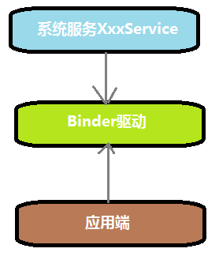
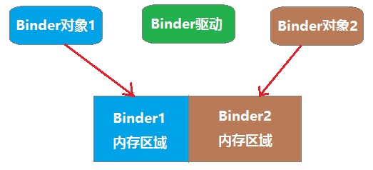
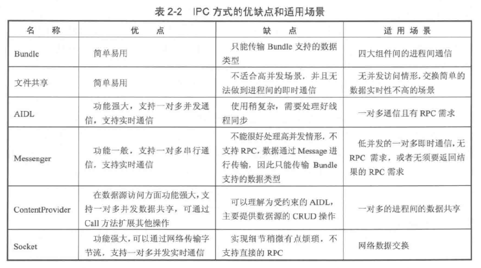
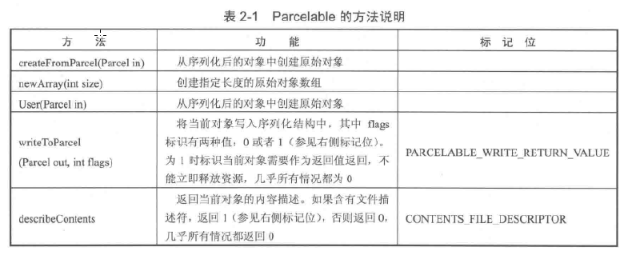
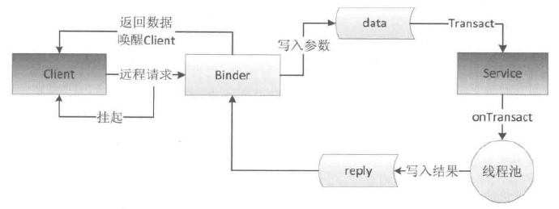
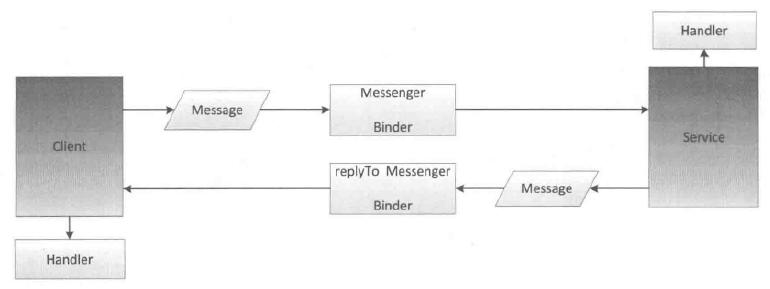

# **Android系统的跨进程简介**

## **为什么不能直接跨进程通信？**

为了安全考虑，应用之间的内存是无法互相访问的，各自的数据都存在于自身的内存区域内。

## **如何跨进程通信？**

要想跨进程通信，就要找到一个大家都能访问的地方，例如硬盘上的文件，多个进程都可以读写该文件，通过对该文件进行读写约定好的数据，来达到通信的目的。

Android中的跨进程通信采用的是Binder机制，其底层原理是共享内存。

# **Binder机制**

- Android中的跨进程通信采用的是Binder机制。
- Binder在linux层面属于一个驱动，但是这个驱动不是去驱动一个硬件，而且驱动一小段内存。
- 不同的应用通过对一块内存区域进行数据的读、写操作来达到通信的目的。
- 不同的应用在同一内存区域读写数据，为了告知其他应用如何理解写入的数据，就需要一个说明文件，这就是AIDL。当两个应用持有相同的AIDL文件，就能互相理解对方的的意图，就能做出相应的回应，达到通信的目的。

# **系统服务**

## 什么是系统服务？
由android系统提供的服务，以供应用程序调用，来操作手机。如果应用能直接操作手机，后果将不堪设想，为了安全性和统一性，所有手机操作都将由系统来完成，应用通过发送消息给系统服务来请求操作。系统服务就是系统开放给应用端的操作接口，类似于Web服务开放出来的接口。

我们通过context. getSystemService()可以获取到系统服务的代理对象，该代理对象内部有一个系统服务的远程对象引用。代理对象和系统服务有相同的api接口，我们调用代理对象，代理对象会调用远程对象，远程对象通知系统服务，这样操作起来就像直接访问系统服务一样轻松。

# 系统服务和应用端的通信机制



- 系统服务XxxService

  是一个Binder类的子类，一旦创建后，就开启一个线程死循环用来检测某段内存是否有数据写入

- Binder驱动

  自身创建时，创建一个XxxRemote远程对象，存放到Binder驱动中，XxxRemote远程对象可以和XxxService系统服务通信

- 应用端

  通过context. getSystemService()获取XxxServiceProxy对象，该对象内部引用了XxxRemote对象， XxxServiceProxy和XxxService具有相同的API，我们调用XxxServiceProxy时，XxxServiceProxy就调用XxxRemote并等待XxxRemote返回。XxxRemote会往某段内存中写入数据，写完后就开始监视该内存区域，Binder驱动会把XxxRemote写入的数据拷贝到XxxService监视着的内存区域，当XxxService一旦发现有数据，就读取并进行处理，处理完毕后，就写入该区域，这时Binder驱动又会把该数据拷贝到XxxRemote监视的内存区域，当XxxService发现内存区域有数据读取该区域数据，并把内容返回给XxxServiceProxy。这样就完成了一次进程间的通信。

所以一个系统服务会产生两个Binder对象，一个是运行在系统中的系统服务本身，一个是存放到Binder驱动中的远程对象。所不同的是系统服务Binder对象对开启一个线程监听消息，远程对象不会，它是运行在调用者的线程中。

客户端也可以不使用系统服务的远程Binder对象，而是自己创建一个Binder对象，通过Binder驱动和系统服务进行关联，这样的好处客户端可以随时通知系统服务，系统服务也可以随时通知客户端，而不是像上面所说的系统服务只能被动的等着客户端调用。

# **Binder间的通信机制**



Binder对象都有各自的内存区域，当Binder1想要向Binder2发送数据时，就会把数据写入自己的内存区域，然后通知Binder驱动，Binder驱动会把数据拷贝到Binder2的内存区域，然后通知Binder2进行读取，Binder读取完毕后，将把数据写入binder2的内存区域，然后通知Binder驱动，Binder驱动将会把数据拷贝到Binder1的内存区域中。这样就完成了一次通信。

如果Binder1是系统服务，Binder2是系统服务的远程对象，这样任何应用程序在获取了Binder2的引用后，都可以和Binder1进行通信。但是缺点也很明显，只能由应用端请求系统服务，系统服务不能主动去联系应用端。WifiManagerService之类的就是采用这种方式。

还有一种方式是Binder1是系统服务，Binder2是应用端创建的Binder对象，他们两者通过Binder驱动进行连接后，应用端可以主动调系统服务，系统服务也可以主动调用应用端。WindowManagerService就是采用的这种方式。

## IPC

IPC：进程间通信或跨进程通信，是指两个进程间进行数据交互的过程。

PRC：远程过程调用

## 多进程

线程是CPU调度的最小单元，是程序执行的线索，同时线程是一种有限的系统资源，即线程不可能无限制地产生，并且线程的创建和销毁都有相应的开销。而进程一般指一个执行单元，在PC和移动设备上指一个程序或者一个应用。一个进程可以包含多个线程，因此进程和线程是包含与被包含的关系。

- Intent
- Bundle
- 共享文件
- SharedPrefrence
- ContentProvider
- Messenger
- AIDL
- Binder
- Socket



### Android中的多进程模式

- 一个应用中存在多个进程的情况
- 多个应用间的多进程

```
android:process=":remote" 私有进程
android:process="com.google.googleplay.remote" 全局进程
```

## 序列化

序列化，反序列化，持久化

### Serializable

Java提供的一个序列化接口

序列化流

- ObjectInputStream
- ObjectOutputStream

### Parcelable

Android提供的序列化接口



Serializable是Java中的序列化接口，其使用起来简单但是开销很大，序列化和反序列化过程需要大量I/O操作。而Parcelable是Android中的序列化方式，因此，更适合用在Android平台上，它的缺点就是用起来稍微麻烦点，但是它的效率很高，这是Android推荐的序列化方式，因此，我们要首选Parcelable。Parcelable主要用在内存序列化上，通过Parcelable将对象序列化到存储设备中或者将对象序列化后通过网络传输也都是可以的，但是这个过程会稍显复杂，因此在这两种情况下建议大家使用Parcelable。

## Binder

实现IBinder接口，是Android的一种跨进程通信方式，是客户端和服务端进行通信的媒介。

Android Binder框架分为服务器接口、Binder驱动、以及客户端接口；简单想一下，需要提供一个全局服务，那么全局服务那端即是服务器接口，任何程序即客户端接口，它们之间通过一个Binder驱动访问。

服务器端接口：实际上是Binder类的对象，该对象一旦创建，内部则会启动一个隐藏线程，会接收Binder驱动发送的消息，收到消息后，会执行Binder对象中的onTransact()函数，并按照该函数的参数执行不同的服务器端代码。

Binder驱动：该对象也为Binder类的实例，客户端通过该对象访问远程服务。

客户端接口：获得Binder驱动，调用其transact()发送消息至服务器

```java
public class Binder implements IBinder {
}
```

- IBinder
- Binder
- Stub
- Binder线程池

当客户端发起远程请求时，由于当前线程会被挂起直至服务端进程返回数据，所有一个远程方法是很耗时的，那么不能在UI线程中发起此远程请求；由于服务端的Binder运行在Binder的线程池中，所以Binder方法不管是否耗时都采用同步的方式去实现，因为它已经运行在一个线程中了



Binder死亡代理

- IBinder.DeathRecipient


- linkToDeath()
- unlinkToDeath()
- isBinderAlive()

### 共享文件

一个进程序列化对象到sd上的一个文件，另一个进程反序列化sd上的一文件

### Messenger

底层实现是AIDL，一次处理一个请求，不用考虑线程同步的问题，主要作用是传递消息



### AIDL

- 只支持方法，不支持静态常量
- AIDL的包结构在服务端和客户端要保持一致
- AIDL中无法使用普通接口，只能使用AIDL接口
- 对象是不能跨进程直接传输的，对象的跨进程传输本质上都是反序列化的过程，这就是为什么AIDL中的自定义对象都必须要实现Parcelable接口的原因


首先创建一个Service和一个AIDL接口，接着创建一个类继承自AIDL接口中的Stub类并实现Stub类中的抽象方法，在Service的onBind()方法返回这个类的对象，然后客户端就可以帮到服务端Service，建立连接后就可以访问远程服务端的方法了。


客户端调用远程服务的方法，被调用的方法允运行在服务端的Binder线程池中，同时客户端线程会被挂起，这个时候如果服务端方法执行比较耗时，就会导致客户端线程长时间的阻塞在哪里，而如果这个客户端线程是UI线程的话，就会导致客户端ANR，这当然不是我们想要看到的。因此，如果我们明确知道某个远程方法是耗时的，那么，我们就应该避免在客户端的UI线程去访问远程方法。由于客户端的onServiceConnected()和onServiceDisconnected()方法都运行在UI线程中，所以也不可以在它们里面直接调用服务端的耗时方法，这点要尤其注意。另外，由于服务端的方法本身就运行在服务端的Binder线程池中，所以服务端方法本身可以执行大量耗时操作，这个时候切记不要在服务端方法中开线程去进行异步任务，除非你明确知道自己在干什么，否则不建议这么做。

### RemoteCallbackList

```java
public class RemoteCallbackList<E extends IInterface>{
}
```

- 系统专门提供的用于删除跨进程listener的接口
- 客户端终止后会自动删除客户端注册的listener
- 实现了线程同步功能


### 权限验证

- onBind()方法中验证

  - permission验证，checkCallingOrSelfPermission()
- onTransact()中验证
- Uid和Pid验证
  - getCallingPid()
  - getCallingUid()
- 为Service指定android:permission属性

## 客户端和服务端在同一进程

扩展 Binder 类

### 服务端

```java
public class LocalService extends Service {
    // Binder given to clients
    private final IBinder mBinder = new LocalBinder();
    // Random number generator
    private final Random mGenerator = new Random();

    /**
     * Class used for the client Binder.  Because we know this service always
     * runs in the same process as its clients, we don't need to deal with IPC.
     */
    public class LocalBinder extends Binder {
        LocalService getService() {
            // Return this instance of LocalService so clients can call public methods
            return LocalService.this;
        }
    }

    @Override
    public IBinder onBind(Intent intent) {
        return mBinder;
    }

    /** method for clients */
    public int getRandomNumber() {
      return mGenerator.nextInt(100);
    }
}
```

### 客户端

```java
public class BindingActivity extends Activity {
    LocalService mService;
    boolean mBound = false;

    @Override
    protected void onCreate(Bundle savedInstanceState) {
        super.onCreate(savedInstanceState);
        setContentView(R.layout.main);
    }

    @Override
    protected void onStart() {
        super.onStart();
        // Bind to LocalService
        Intent intent = new Intent(this, LocalService.class);
        bindService(intent, mConnection, Context.BIND_AUTO_CREATE);
    }

    @Override
    protected void onStop() {
        super.onStop();
        // Unbind from the service
        if (mBound) {
            unbindService(mConnection);
            mBound = false;
        }
    }

    /** Called when a button is clicked (the button in the layout file attaches to
      * this method with the android:onClick attribute) */
    public void onButtonClick(View v) {
        if (mBound) {
            // Call a method from the LocalService.
            // However, if this call were something that might hang, then this request should
            // occur in a separate thread to avoid slowing down the activity performance.
            int num = mService.getRandomNumber();
            Toast.makeText(this, "number: " + num, Toast.LENGTH_SHORT).show();
        }
    }

    /** Defines callbacks for service binding, passed to bindService() */
    private ServiceConnection mConnection = new ServiceConnection() {

        @Override
        public void onServiceConnected(ComponentName className,
                IBinder service) {
            // We've bound to LocalService, cast the IBinder and get LocalService instance
            LocalBinder binder = (LocalBinder) service;
            mService = binder.getService();
            mBound = true;
        }

        @Override
        public void onServiceDisconnected(ComponentName arg0) {
            mBound = false;
        }
    };
}
```