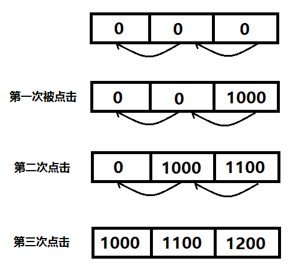

## Runtime

```
Runtime.getRuntime().availableProcessors(); // 获取CPU核心数
Runtime.getRuntime().maxMemory();
```

## Process

```
Process.THREAD_PRIORITY_BACKGROUND; // 后台线程
Process.killProcess();// 杀死进程
Process.myTid();
Process.setThreadPriority(); // 设置线程优先级
System.exit(1);
```

```java
public static String getProcessName(Context cxt, int pid) {
        ActivityManager am = (ActivityManager) cxt
                .getSystemService(Context.ACTIVITY_SERVICE);
        List<RunningAppProcessInfo> runningApps = am.getRunningAppProcesses();
        if (runningApps == null) {
            return null;
        }
        for (RunningAppProcessInfo procInfo : runningApps) {
            if (procInfo.pid == pid) {
                return procInfo.processName;
            }
        }
        return null;
    }
```

## Handler

```
Looper.getMainLooper() == Looper.myLooper(); // 判断是否是主线程
Handler mHandler = new Handler(Looper.getMainLooper());
mhandler.post(Runnable);// handler在那个线程创建的，任务就在那个线程执行
```

## 多线程

- AtomicInteger incrementAndGet()
- BlockingQueue，PriorityBlockingQueue
- AtomicInteger incrementAndGet()

## ViewCompat

ViewCompat.SCROLL_AXIS_VERTICAL

ViewCompat.offsetTopAndBottom

## Activity

public void onWindowFocusChanged(boolean hasFocus)

package保护的类，新建一个一样的包，把类移到新建的包下即可

## TextUtils

- isEmpty()
- join()

## TaskStackBuilder

任务栈Builder

## UncaughtExceptionHandler

```
public class CrashHandler implements Thread.UncaughtExceptionHandler {
    @Override
    public void uncaughtException(Thread thread, Throwable throwable) {
        
    }
}
```
子线程弹土司
```
new Thread(new Runnable() {
    @Override
    public void run() {
        Looper.prepare();
        Toast.makeText(context,"很抱歉，程序出现异常，即将退出。",Toast.LENGTH_SHORT).show();
        Looper.loop();
    }
}).start();
```
## ViewFlipper

实现左右滑动的效果。

通常情况下都是用ViewPager 来实现的
viewPager可以兼容低版本,而ViewFlipper是android4.0才引入的新控件
viewPager是一页一页的,可以带动画效果
而ViewFlipper 是一层一层的,当然也可以实现切换的动画效果,但是比viewpager复杂些

## FragmentTabHost

## Activity

    recreate();
    setTheme();
## GZIP压缩解压缩

GZIPOutputStream

GZIPInputStream

## 网络请求CallBack封装

```
public abstract class BaseCallBack<T> {
    
    Type type;
    static Type getSuperclassTypeParameter(Class<?> subclass)
    {
        Type superclass = subclass.getGenericSuperclass();
        if (superclass instanceof Class)
        {
            throw new RuntimeException("Missing type parameter.");
        }
        ParameterizedType parameterized = (ParameterizedType) superclass;

        return $Gson$Types.canonicalize(parameterized.getActualTypeArguments()[0]);
    }

    public BaseCallBack()
    {
        type = getSuperclassTypeParameter(getClass());
    }

    public abstract void onFailure(Call call, IOException e);

    public abstract void onSuccess(Call call, T t);
}
```
## System

- System.currentTimeMillis()
- System.arraycopy()
- SystemClock.uptimeMillis()



### 模拟双击事件

```java
public class MainActivity extends Activity {

	private long firstClickTime;

	@Override
	protected void onCreate(Bundle savedInstanceState) {
		super.onCreate(savedInstanceState);
		setContentView(R.layout.activity_main);
	}

	public void onClick(View view) {
		if (firstClickTime > 0) {// 发现之前点击过一次
			if (System.currentTimeMillis() - firstClickTime < 500) {// 判断两次点击是否小于500毫秒
				Toast.makeText(this, "双击啦!", Toast.LENGTH_SHORT).show();
				firstClickTime = 0;//重置时间, 重新开始
				return;
			}
		}

		firstClickTime = System.currentTimeMillis();
	}
}
```

### 模拟三击事件

```java
public class MainActivity extends Activity {

	@Override
	protected void onCreate(Bundle savedInstanceState) {
		super.onCreate(savedInstanceState);
		setContentView(R.layout.activity_main);
	}

	long[] mHits = new long[3];// 数组长度表示要点击的次数

	public void onClick(View view) {
		System.arraycopy(mHits, 1, mHits, 0, mHits.length - 1);
		mHits[mHits.length - 1] = SystemClock.uptimeMillis();// 开机后开始计算的时间
		if (mHits[0] >= (SystemClock.uptimeMillis() - 500)) {
			Toast.makeText(this, "是男人!!!", Toast.LENGTH_SHORT).show();
		}
	}
}
```
## ImageView

```
adjustViewBounds
```

ImageView的android:adjustViewBounds属性为是否保持原图的长宽比，单独设置不起作用，需要配合maxWidth或maxHeight一起使用。