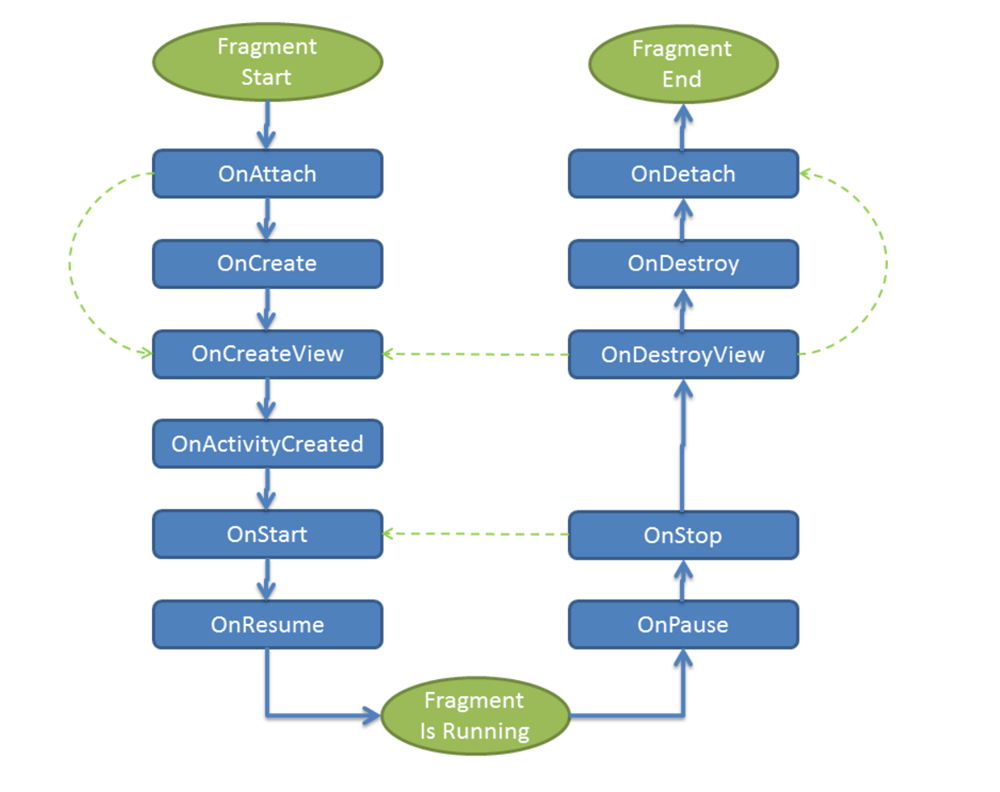
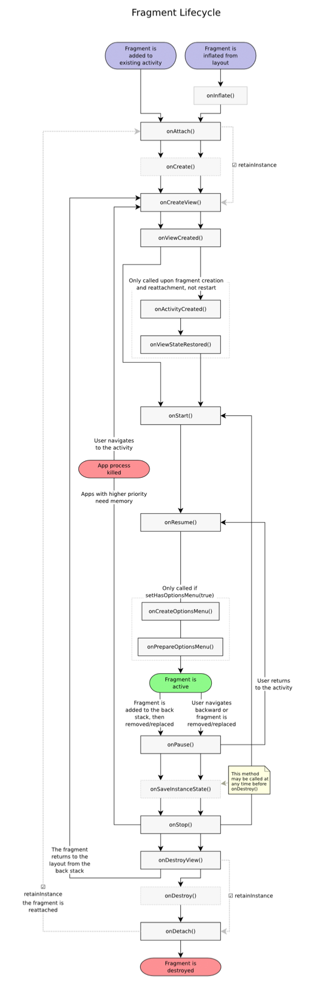

Fragment使用的基本知识点总结, 包括Fragment的添加, 参数传递和通信, 生命周期和各种操作.

# Fragment使用基础

## Fragment添加

方法一: 布局里的标签
标识符: tag, id, 如果都没有, container的id将会被使用.

方法二: 动态添加
动态添加利用了一个transaction:

```java
        FragmentManager fragmentManager = getFragmentManager();
        Fragment fragment = fragmentManager.findFragmentByTag(FragmentB.TAG);
        if (null == fragment) {
            FragmentB fragmentB = new FragmentB();
            FragmentTransaction fragmentTransaction = fragmentManager.beginTransaction();
            fragmentTransaction.add(R.id.fragment_container, fragmentB, FragmentB.TAG)
                               .commit();
        }
```

`commit()`方法并不立即执行transaction中包含的动作,而是把它加入到UI线程队列中.
如果想要立即执行,可以在commit之后立即调用FragmentManager的[`executePendingTransactions()`](https://developer.android.com/reference/android/app/FragmentManager.html#executePendingTransactions())方法.

`commit()`方法必须在状态存储之前调用,否则会抛出异常,如果觉得状态丢失没关系,可以调用`commitAllowingStateLoss()`. 但是除非万不得已, 一般不推荐用这个方法, 会掩盖很多错误.

## Back Stack

Activity的back stack: 系统维护, 每个task一个back stack.
Fragment的back stack: 宿主activity掌管, 每个activity一个.

通过调用`addToBackStack()`,commit()的一系列转换作为一个transaction被存储在back stack中,
用户按Back键, 从栈中pop出一个transaction, 逆转操作, 可以返回上一个转换前的状态.

一个transaction可以包含多种操作, 并且不局限于对同一个Fragment, 所以每一个transaction实际上可以是一系列对多个fragment的操作的组合.
加入到back stack中去的时候, 是把这一系列的组合作为一个原子, 加入到back stack中.

## 构造和参数传递

所有的Fragment都必须有一个`public的无参构造函数`, 因为framework经常会在需要的时候重新创建实例(状态恢复时), 它需要的就是这个构造.
如果无参构造没有提供,会有异常.

所以`不要给Fragment写有参数的构造函数, 也不要企图搞个什么单例的Fragment`. 这些都是反设计的.

参数传递的正确姿势:

```java
    public static FragmentWithParameters newInstance(int num) {
        FragmentWithParameters fragmentWithParameter = new FragmentWithParameters();
        Bundle args = new Bundle();
        args.putInt(NUM, num);
        fragmentWithParameter.setArguments(args);
        return fragmentWithParameter;
    }

    @Override
    public void onCreate(Bundle savedInstanceState) {
        super.onCreate(savedInstanceState);
        num = getArguments() != null ? getArguments().getInt(NUM) : 0;
    }
```

这里是提供了一个静态方法, 也可以new出对象后自己set Bundle参数.

## Fragment的通信

除了DialogFragment和嵌套Fragment需要与自己的parent fragment通信以外, 一般的fragment是不与其他fragment有任何通信的. 因为要求应尽量独立, 模块化, 可复用.
fragment与自己的parent activity (除了嵌套和dialog的情况外, 这个parent通常是activity) 有直接通信, 一般以这三种方式:

1. 在构造fragment的时候, 通过Bundle传递参数.
2. parent可以直接调用fragment的public方法, 这里也可以传递一些参数.
3. Listener, 也即parent实现的callback接口, fragment可以在自己内部调用, 这里fragment也可以传递参数出去.

对于DialogFragment来说, 可以通过一个public的set方法将外面的target设置进去.
比如用Fragment的这个方法: [setTargetFragment()](https://developer.android.com/reference/android/app/Fragment.html#setTargetFragment(android.app.Fragment,%20int))

[例子](https://guides.codepath.com/android/Using-DialogFragment#passing-data-to-parent-fragment)
对于嵌套(nested)Fragment, 通信方式与上面普通的fragment类似, 只不过parent此时不是activity而是一个fragment.
后面会单独有一个文章说嵌套Fragment的使用, 敬请期待.

# Fragment的生命周期

Fragment的生命周期首先和Activity的生命周期密切相关,
如果activity stopped,其中所有的fragment都不能start;
如果activity destroyed, 其中所有的fragment都会被destroyed.
只有activity在resumed状态下,fragment的生命周期可以独立改变,否则它被activity控制.








# FragmentTransaction基础操作

## 操作类型

[FragmentTransaction](https://developer.android.com/reference/android/app/FragmentTransaction.html) 中对Fragment有如下几种操作:

```
attach(), detach()
add(), remove(),
show(), hide(),
replace()
```

除了`replace()`以外其他都是成对的.

其中`attach()`和`detach()`不是很常用.
调用`detach()`之后, fragment实际的生命周期会走到onDestroyView(), 但不会走onDestroy()和onDetach(), 也即fragment本身并没有被销毁, 只是view被销毁了. 这和addToBackStack()的情况一样, 尽管调用detach()的时候没有addToBackStack(), 仍然只是走到view被销毁的阶段.

`add()`和`remove()`是将fragment添加和移除.
remove()比detach()要彻底一些, 如果不加入到back stack, remove()的时候, fragment的生命周期会一直走到onDetach().

`show()`和`hide()`是用来设置fragment的显示和隐藏状态, 这两个方法并不对应fragment的状态变化,只是将view设置为visible和gone,然后调用onHiddenChanged()的回调.

实际上`replace() == remove() + add()`, 所以它的反操作也是replace(), 只不过把add和remove的东西交换一下.

关于replace()和show(), hide()的选择, 要根据实际使用情形来定.
`replace()`的好处是会减少内存占用, 但是返回时需要重新走完初始化的过程.
`show()`和`hide()`只是控制了fragment的显示和隐藏, 不会改变生命周期状态, 也即fragment始终是处于running状态的, 被保持在内存中, 适用于频繁切换的情形.

## remove(), replace()是否加到back stack对生命周期的影响

前面说过, `replace() == remove() + add()`
新的fragment将取代在容器布局中的fragment, 如果没有,将直接添加新的fragment.

是否添加到back stack对fragment的生命周期是有影响的.
`remove()`或者`replace()`的时候,如果`commit()`之前没有调用`addToBackStack()`,那个旧fragment将会被destroyed和detach; 即完全销毁和移除.

如果调用了`addToBackStack()`,旧的fragment会处在stopped状态,调用到`onDestroyView()`, 可以通过返回键来resume.
这个时候对于旧的Fragment来说, 成员变量依然在,但是View被销毁了. 所以返回时它的生命周期从`onCreateView()`开始重建View.

## 参考资料

[Android Reference Fragment](https://developer.android.com/reference/android/app/Fragment.html)
[Android Reference FragmentTransaction](https://developer.android.com/reference/android/app/FragmentTransaction.html)
[CodePath Guides: Creating and Using Fragments](https://guides.codepath.com/android/Creating-and-Using-Fragments)