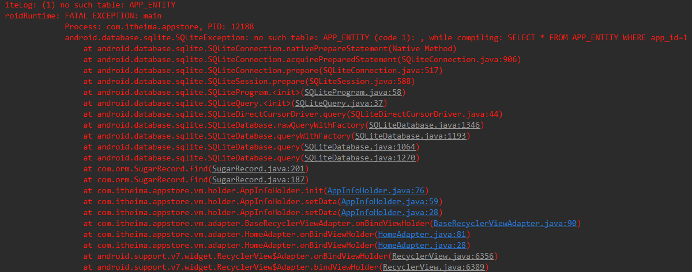
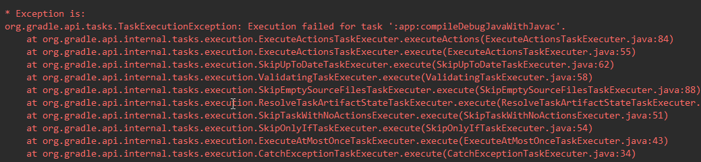
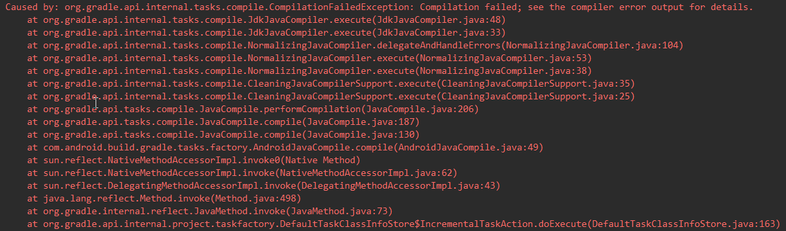

## IndexOutOfBoundsException

java.lang.IndexOutOfBoundsException: Invalid index 0, size is 0

## 构造方法和成员变量初始化顺序

- 执行父类静态代码 执行子类静态代码
- 初始化父类成员变量（我们常说的赋值语句）
- 初始化父类构造函数
- 初始化子类成员变量
- 初始化子类构造函数

```java
public abstract class BaseMenuDetailPager {

	public Activity mActivity;
	public View mRootView;

	public BaseMenuDetailPager(Activity activity) {
		mActivity = activity;
		mRootView = initView();
		// initData();
	}

	protected abstract View initView();

	public void initData() {
	}

}
```

```java
public abstract class BaseTabDetailPager extends BaseMenuDetailPager{
    
  	protected MultiItemTypeAdapter<NewsData> mMultiItemTypeAdapter;
    protected TopNewsAdapter  mTopNewsAdapter;

  	// 在initView()方法调用后才初始化
    protected List<NewsData>     mNewsData = new ArrayList<>();
    protected List<NewsData.Ads> mAdsData = new ArrayList<>();
  
    @Override
    protected View initView() {
      ...
      // mNewsData，mAdsData空指针异常
      mMultiItemTypeAdapter = new MultiItemTypeAdapter<>(mActivity, mNewsData);
      mTopNewsAdapter = new TopNewsAdapter(mAdsData);
    }
}
```

先初始化父类BaseMenuDetailPager的构造方法，在父类的构造方法中调用的initView()方法，而此时子类BaseTabDetailPager的成员变量还没有初始化，即mNewsData和mAdsData还没有初始化，因此导致了空指针异常

## 权限问题

没有申请权限，例如：网络权限，读写SDcard权限，读取联系人权限

## RecyclerView

没有设置setLayoutManager()

## Application没有注册

```xml
<application
        android:name=".base.BaseApplication"
        android:allowBackup="true"
        android:icon="@mipmap/ic_launcher"
        android:label="@string/app_name"
        android:theme="@style/AppTheme">
```
## method.invoke()
```
警告: 最后一个参数使用了不准确的变量类型的 varargs 方法的非 varargs 调用;
对于 varargs 调用, 应使用 Object
对于非 varargs 调用, 应使用 Object[], 这样也可以抑制此警告
```
```
method.invoke(obj, null);
method.invoke(obj, new Object[]{});
```
## 判断RecyclerView到达底部出错

```java
    //滑动状态改变
    @Override
    public void onScrollStateChanged(int state) {
        super.onScrollStateChanged(state);
        //在静止的状态下   && 必须是最后显示的条目就是RecyclerView的最后一个条目 && 没有在加载更多的数据
        boolean isState = state == RecyclerView.SCROLL_STATE_IDLE;
        //最后一个条目显示的下标
        int lastVisibleItemPosition = lm.findLastVisibleItemPosition();
        boolean isLastVisibleItem = lastVisibleItemPosition == getAdapter().getItemCount() - 1;

        if(isState && isLastVisibleItem && !hasLoadMoreData && mOnLoadMoreListener != null){
            hasLoadMoreData = true;
            //显示脚
            mFooterView.setPadding(0,0,0,0);
            //滑动到显示的脚的位置
            smoothScrollToPosition(lastVisibleItemPosition);
            //加载数据
            mOnLoadMoreListener.onLoadMore();
        }
    }
```

在RecyclerView设置了分割线（addItemDecoration()）的情况下是没有问题的，但是当没有设置分割线的情况下，出现了上拉无法加载更多数据的问题，通过打印lastVisibleItemPosition和getAdapter().getItemCount()发现，lastVisibleItemPosition的值在设置了分割线的情况下比没有设置的情况下大1，于是查看findLastVisibleItemPosition()的源码，If RecyclerView has item decorators, they will be considered in calculations as well。原来当RecyclerView添加了分割线，分割线会被计算在内

## sugar no such table



关掉Instant Run，因为Sugar ORM在使用过程中还需注意meta-data 中DOMAIN_PACKAGE_NAME的value所写的包名为自己的包名

app:compileDebugJavaWithJavac



Compilation failed; see the compiler error output for details.



## android-apt

[android-apt 即将退出历史舞台](http://blog.csdn.net/asce1885/article/details/52878076)

伴随着 Android Gradle 插件 2.2 版本的发布，近期 `android-apt` 作者在官网发表声明证实了后续将不会继续维护 `android-apt`，并推荐大家使用 Android 官方插件提供的相同能力。也就是说，大约三年前推出的 `android-apt` 即将告别开发者，退出历史舞台，Android Gradle 插件提供了名为 `annotationProcessor` 的功能来完全代替 `android-apt`。

## Fragment重影问题

```java
private void initFirstFragment() {
        List<Fragment> fragments = getSupportFragmentManager().getFragments();
        FragmentTransaction transaction = getSupportFragmentManager().beginTransaction();
        if(fragments!=null && fragments.size()>0){
            //说明有之前缓存的fragment 处理fragment重影的问题
            for(int i = 0;i<fragments.size();i++){
                transaction.remove(fragments.get(i));
            }
            transaction.commit();
        }

        BaseFragment fragment = FragmentFactory.getFragment(0);
        transaction = getSupportFragmentManager().beginTransaction();
        transaction.add(R.id.fl_container,fragment,"0").commit();
}
```

## 方法数超65535问题

```
Error:Execution failed for task ':app:transformClassesWithDexForDebug'.
> com.android.build.api.transform.TransformException: com.android.ide.common.process.ProcessException: java.util.concurrent.ExecutionException: com.android.dex.DexException: Multiple dex files define Lorg/apache/commons/collections/Buffer;

Error:Execution failed for task ':app:transformClassesWithJarMergingForDebug'.
> com.android.build.api.transform.TransformException: java.util.zip.ZipException: duplicate entry: org/apache/commons/collections/ArrayStack.class
```

解决方法：https://developer.android.com/studio/build/multidex.html

## 错误 编码GBK的不可映射字符

```
tasks.withType(JavaCompile) {  
    options.encoding = "UTF-8"  
}  
```
## ViewPager翻页bug

当ViewPager页数比较多的时候，翻页的时候两页之间相隔页数比较大，会有翻页动画，可以通过setCurrentItemPosition(pos,false)把默认的动画去掉，但是当页数比较多的时候，这种方法不管用。使用SuperViewPager