# 1. 前言

## 1.1 Android SDK介绍

Android是基于Linux内核的一个手机操作系统，谷歌提供了开发包（Android SDK），程序员可以通过开发包开发Android App(应用程序)。Android SDK提供Java语言接口，因此Android应用是使用Java开发的。

## 1.2 使用纯Java开发App的缺点

在某些场合下，使用纯Java开发Android应用程序不完美，比如：

- 有高性能算法，Java语言无法满足
- 有跨平台需求，希望将App移植到iOS
- 已有代码的重用

## 1.3 引入NDK

早在Android 1.6(2009年)时，google就提供了NDK（native development kit），NDK包括了一套Android的交叉编译环境和开发库，利用它可以编写C/C++程序，并编译成Android环境下使用的动态库，Java代码通过Jni规范，调用C/C++写的动态库。

目前最新的Android Studio 2.2中，集成了C/C++开发环境，开发人员在使用C/C++更加简单了。

# 2. 课程内容

## 2.1 搭建Android开发环境

### 2.1.1 安装JDK

- [下载地址](http://www.oracle.com/technetwork/java/javase/downloads/index.html)

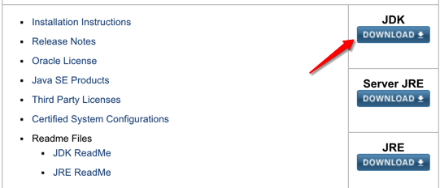

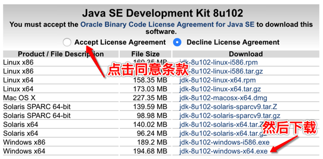

- 安装

双击安装文件进行安装，选项保持默认即可

- 配置

将安装路径中的JDK的bin目录，设置到PATH环境变量中，比如电脑上的路径为：`C:\Program Files\Java\jdk1.8.0_05\bin`

### 2.1.2 安装Android Studio和SDK

- [下载](http://www.android-studio.org/)地址

这里选择的是无安装，无SDK的版本
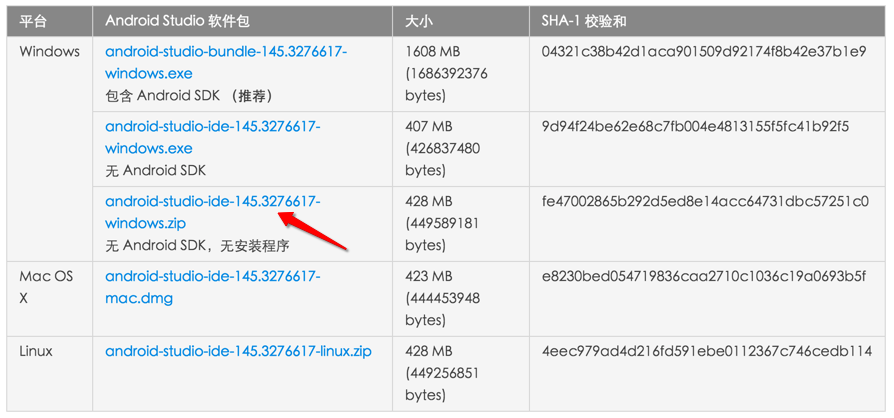

- 配置

解压即可，不需要安装。然后运行解压目录下的`android64.exe`，按照下图指示完成配置。
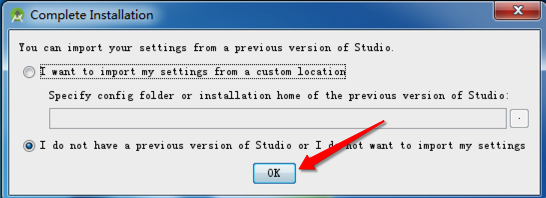


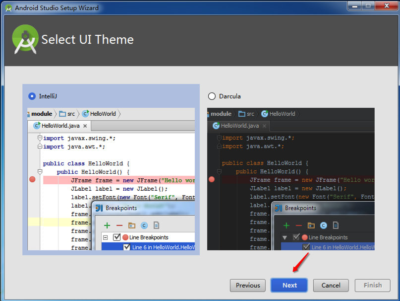
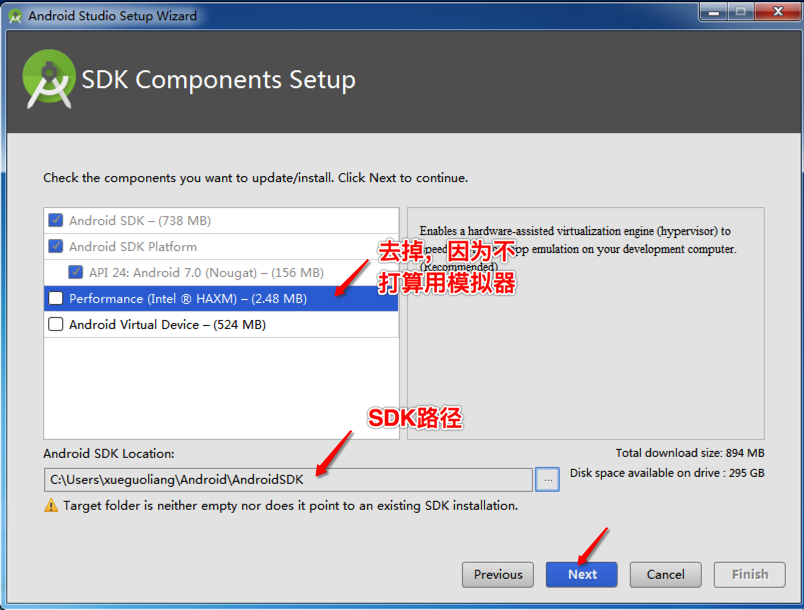
Android SDK Location指定一个空目录即可，解析来会自动安装。
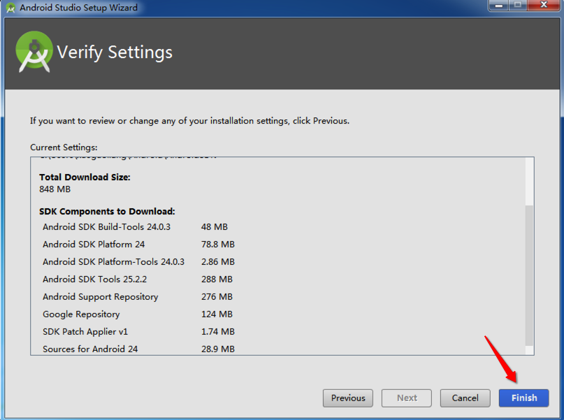
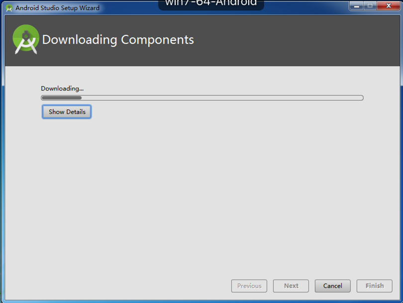
此阶段下载需要费不少时间。
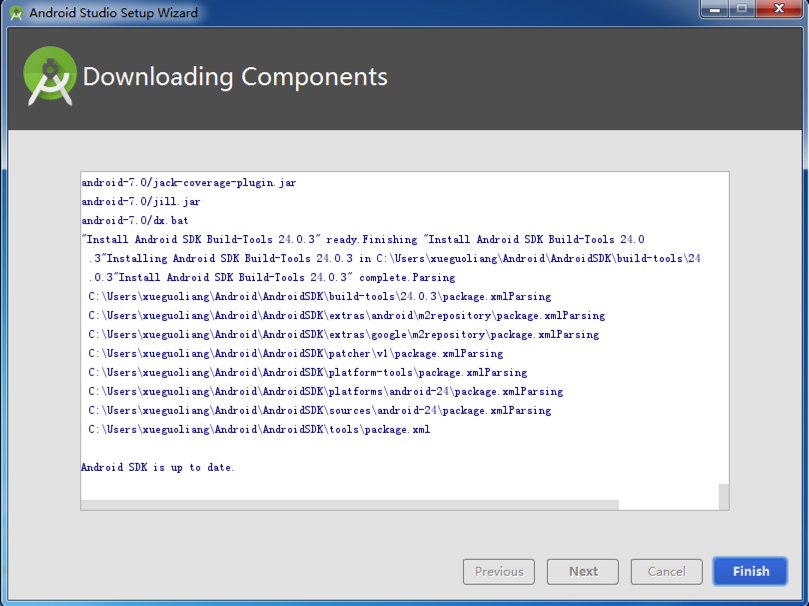

## 2.1.3 实现Android的HelloWorld

## 2.2 Android NDK环境搭建

- 下载

NDK开发包随公开课视频下发，请同学们持续关注。

- 解压缩Android NDK

将NDK解压缩到随意目录（但是目录不能包含中文和空格）。

- 配置

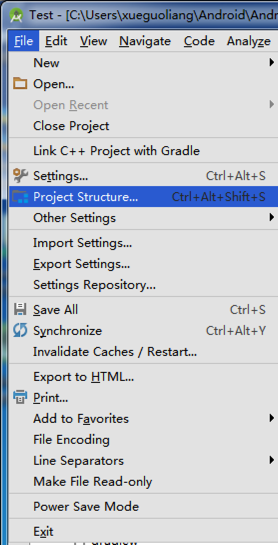

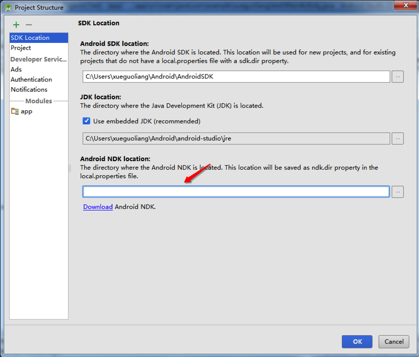
将解压缩的NDK路径填入Android NDK location目录。
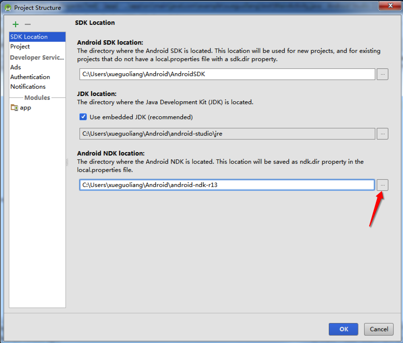

## 2.3 Android Java代码调用C++代码

Java部分代码

```java
public class Jni {
    static  {
        System.loadLibrary("bc-lib"); // libbc-lib.so
    }
 
    private static Jni obj = new Jni();
    private Jni(){}
 
    public static Jni instance(){
        return obj;
    }
 
    // native接口
    public native boolean Login(String username, String password, String type);
    public native boolean Reg(String username, String password, String mobile, String email, String id);
    public native boolean LocationChange(double lng, double lat);
    public native boolean StartOrder(double lng1, double lat1, double lng2, double lat2);
}
```

C++部分代码

```c++
JNIEXPORT jboolean JNICALL Java_cn_xueguoliang_hc_Jni_Login
        (JNIEnv *env, jobject /* Jni object */, jstring jUsername, jstring jPassword, jstring type)
{
    return (jboolean)User::instance()->Login(j2c(env, jUsername), j2c(env, jPassword),
    j2c(env, type));
}
 
JNIEXPORT jboolean JNICALL Java_cn_xueguoliang_hc_Jni_Reg
        (JNIEnv *env, jobject /* Jni object */,
         jstring jUsername, jstring jPassword, jstring mobile, jstring email, jstring id)
{
    return (jboolean)User::instance()->Reg(
            j2c(env, jUsername),
            j2c(env, jPassword),
            j2c(env, mobile),
            j2c(env, email),
            j2c(env, id));
}
 
JNIEXPORT jboolean JNICALL Java_cn_xueguoliang_hc_Jni_LocationChange
        (JNIEnv *, jobject, jdouble lng, jdouble lat)
{
    User::instance()->LocationChange(lng, lat);
    return (jboolean)true;
}
 
 
JNIEXPORT jboolean JNICALL Java_cn_xueguoliang_hc_Jni_StartOrder
        (JNIEnv *, jobject, jdouble lng1, jdouble lat1, jdouble lng2, jdouble lat2)
{
    return (jboolean)Order::instance()->start(lng1, lat1, lng2, lat2);
}
```

## 2.4 C++代码调用Java代码

Java代码

```java
public class Jni {
    static {
        System.loadLibrary("native-lib");
    }
 
    private static Jni obj = new Jni();
    public static Jni instance()
    {
        return obj;
    }
 
    public native void HelloWorld();
 
    void callByCpp()
    {
        Log.e("JniCallback", "hello java");
    }
}
```

C++代码

```c++
extern "C"
void
Java_com_example_xueguoliang_test_Jni_HelloWorld(
        JNIEnv* env,
        jobject  This ) {
    std::string hello = "Hello from C++";
 
    jclass jniClass = env->FindClass("com/example/xueguoliang/test/Jni");
    jmethodID jmethodID1 = env->GetMethodID(jniClass, "callByCpp", "()V");
    env->CallVoidMethod(This, jmethodID1);
 
    return;
}
```

## 2.5 Java和C++字符串转换

```c++
jstring c2j(JNIEnv* env, string cstr)
{
    return env->NewStringUTF(cstr.c_str());
}
 
string j2c(JNIEnv* env, jstring jstr)
{
    string ret;
    jclass stringClass = env->FindClass("java/lang/String");
    jmethodID getBytes = env->GetMethodID(stringClass, "getBytes", "(Ljava/lang/String;)[B");
 
    // 把参数用到的字符串转化成java的字符
    jstring arg = c2j(env, "utf-8");
 
    jbyteArray jbytes = (jbyteArray)env->CallObjectMethod(jstr, getBytes, arg);
 
    // 从jbytes中，提取UTF8格式的内容
    jsize byteLen = env->GetArrayLength(jbytes);
    jbyte* JBuffer = env->GetByteArrayElements(jbytes, JNI_FALSE);
 
    // 将内容拷贝到C++内存中
    if(byteLen > 0)
    {
        char* buf = (char*)JBuffer;
        std::copy(buf, buf+byteLen, back_inserter(ret));
    }
 
    // 释放
    env->ReleaseByteArrayElements(jbytes, JBuffer, 0);
    return ret;
}
```

## 2.6 javah和javap

javah用于生成native接口定义，比如

```
javah -d ../cpp/ com.example.xueguoliang.test.Jni
```

javap用于生成java函数的签名，比如

```
javap -s Jni
```