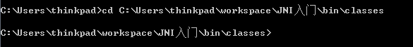
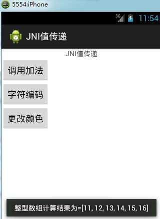
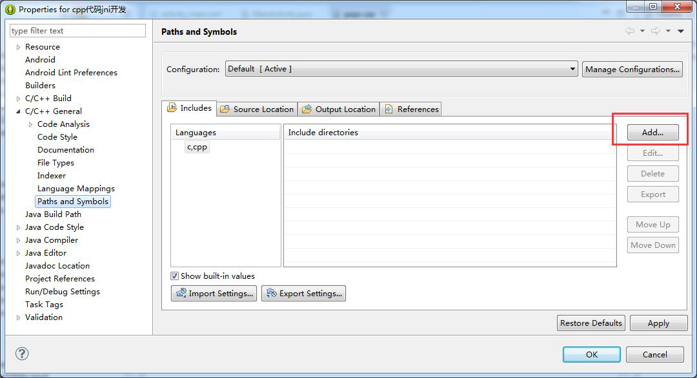
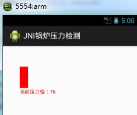

# 1. 掌握如何使用广播接收者拦截电话和短信
在日常生活中，当手机丢失后，我们可以启动一系列的措施来获取丢失手机的位置信息，或者清楚丢失手机的数据来防止隐私数据泄露，本章就针对这些防盗保护措施进行讲解。

# 2. JNI 开发中常见错误

## 2.1 动态库名称写错，或者不存在
```java
static{
	System.loadLibrary("hell0");
}
```

当我们在写上面代码的时候如果不小心将hello 写成了hell0。或者libhello.so 动态库不存在，那么系
统启动时会报如下异常。


## 2.2 Android.mk 配置文件写错
如果修改配置文件中的某个参数名称被写错，那么我们在调用ndk-build.cmd 命令的时候很可能报如下异常。出现这类异常，就需要我们检查我们的Android.mk 文件，看是否写错。


## 2.3 目标文件名画蛇添足导致的错误

手机防盗界面会展示出一系列的信息，如用户设置的安全号码、手机防盗保护是否开启等信息，手机防盗界面LostFindActivity.java 的效果图如图3-5 所示。
如果我们将Android.mk 中的目标文件名：LOCAL_MODULE := hello 写成了LOCAL_MODULE:=
hello.so，那么当我们使用ndk 进行编译的时候会出现如下错误。


上面的异常告诉我们，LOCAL_MODULE 不能有文件拓展名。

## 2.4 源文件名写错

如果我们将Android.mk 中的源文件名：LOCAL_SRC_FILES := hello.c 写成了LOCAL_SRC_FILES :=
helo.c（少些了一个单词），那么当使用ndk 进行编译的时候会出现如下错误：


## 2.5 平台使用错误
如果我们编译的时候用的是arm 平台，但是将目标文件运行在了x86 平台上，那么会产生如下错误。


如果想让我们编译的动态库既支持arm 平台又支持x86 平台，那么我们可以在工程中的jni 目录下添
加Application.mk 文件。关于Application.mk 的配置在本人的上一个文档中有说明，这里就不再介绍。
## 2.6 C 语言中被Java 调用的方法名写错
比如C 语言中的方法jstring Java_com_itheima_jnihello_MainActivity_helloC 把helloC 写成了heloC，那么将会报如下错误。


# 3. 自动生成JNI 头文件
对于一些特殊的Java 方法名，我们很难写出其对应的JNI 方法名，比如：
```
public native String a_b__c_d();
```
这时候我们可以通过我们的JDK 工具自动生成头文件。该工具位于JDK 中，如果我们给电脑配置
JAVA_HOME 则可以直接在命令行中使用，使用法则很简单。如下图所示：


下面演示如何使用javah 工具生成我们MainActivity.java 中native 方法的头文件。
将命令行控制台切换到我们MainActivity.class（注意：是.class 不是.java）所在目录。本人的目录如下：



执行javah 命令：javah com.itheima.jnihello.MainActivity，发现报了如下错误：


Tips：出现上面的错误时因为我用的是jdk7 版本，jdk7 在编译MainActivity.class 类的时候会查找其所有的父类，但是在当前命令行中是不可能有MainActivity 类的父类路径的。有两种办法可以解决上述问题：

1）改成jdk6 版本
2）将native 方法定义在另外一个独立的类中
本人在这里采用第二种方法来解决该问题，因此我创建一个类，将所有的native 方法都定义在该类中。


JNIMethod.java 代码清单如下：

```java
package com.itheima.jnihello.jni;
public class JNIMethod {
public native String a_b__c_d();
}
```
再次执行javah 命令：javah com.itheima.jnihello.jni.JNIMethod


这次发现没有报错，生成的头文件在如下位置：


打开生成的头文件，将生成的方法签名拷贝出来添加到我们的hello.c 源文件中即可。


# 4. JNI 的值传递

本章我们通过一个案例来介绍几种常见的JNI 值传递场景。
创建一个新的Android 工程《JNI 值传递》。在工程中创建com.itheima.jnipassdata.DataProvider 类。在该类中定义三个native 方法。代码清单如下：

```java
public class DataProvider {
    /**
     * 模拟用C 语言计算一些负责算法
     * @param x
     * @param y
     * @return
     */
    public native int add(int x,int y);
    /**
     * 模拟用C 语言加密字符串
     * @param str
     * @return
     */
    public native String encideString(String str);
    /**
     * 模拟用C 语言进行一些图像算法
     * @param colorArray
     * @return
     */
    public native int[] changeColor(int[] colorArray);
}
```
使用javah 工具生成头文件


生成的头文件在相对于命令行的当前目录下。
在工程中创建jni 目录，在改jni 目录中创建Hello.c 文件，将上一步生成的方法拷贝到Hello.c
文件中，并实现里面的方法。Hello.c 代码清单如下。

```c
#include <stdio.h>
#include <malloc.h>
#include "jni.h"
//把java 的string 转化成c 的字符串
char* Jstring2CStr(JNIEnv* env, jstring jstr)
{
    char* rtn = NULL;
    jclass clsstring = (*env)->FindClass(env,"java/lang/String"); //String
    jstring strencode = (*env)->NewStringUTF(env,"GB2312"); //"gb2312"
    jmethodID mid = (*env)->GetMethodID(env,clsstring, "getBytes",
        "(Ljava/lang/String;)[B"); //getBytes(Str);
    jbyteArray barr= (jbyteArray)(*env)->CallObjectMethod(env,jstr,mid,strencode);
    // String .getByte("GB2312");
    jsize alen = (*env)->GetArrayLength(env,barr);
    jbyte* ba = (*env)->GetByteArrayElements(env,barr,JNI_FALSE);
    if(alen > 0)
    {
        rtn = (char*)malloc(alen+1); //"\0"
        memcpy(rtn,ba,alen);
        rtn[alen]=0;
    }
    (*env)->ReleaseByteArrayElements(env,barr,ba,0); //释放内存空间
    return rtn;
}
jint Java_com_ithiema_jnipassdata_DataProvider_add
        (JNIEnv* env, jobject obj, jint x, jint y){
    return x+y;
};
jstring Java_com_ithiema_jnipassdata_DataProvider_encideString
        (JNIEnv * env, jobject obj, jstring jstr){
    char* str = Jstring2CStr(env,jstr);
    char* hello = "hello";
    strcat(str,hello);
    //下面的两种写法是一样的效果
    //return (*(*env)).NewStringUTF(env,str);
    return (*env)->NewStringUTF(env,str);
};
jintArray Java_com_ithiema_jnipassdata_DataProvider_changeColor
        (JNIEnv * env, jobject obj, jintArray jarray){
    int size = (*env)->GetArrayLength(env,jarray);
    int* arr = (*env)->GetIntArrayElements(env,jarray,0);
    int i;
    for(i=0;i<size;i++){
        arr[i]+=10;
    }
    return jarray;
}
```

使用NDK 工具将上面的C 代码编译成动态库文件，首先得在工程的jni 目录下添加Android.mk
和Application.mk 文件
在MainActivity 类中调用C 语言，MainActivity.java 代码清单如下。

```java
<LinearLayout xmlns:android="http://schemas.android.com/apk/res/android"
              xmlns:tools="http://schemas.android.com/tools"
              android:layout_width="match_parent"
              android:layout_height="match_parent"
              android:orientation="vertical"
              tools:context=".MainActivity" >

    <ImageView
        android:layout_width="wrap_content"
        android:layout_height="wrap_content"
        android:id="@+id/iv"
        />
    <Button
        android:layout_gravity="right"
        android:layout_width="wrap_content"
        android:layout_height="wrap_content"
        android:text="lomo"
        android:onClick="click"
        />
</LinearLayout>
```

布局文件比较简单，就不再给出。运行上面代码，效果图如下：



3.3.1 让C 语言输出Log 日志

让我们的C 语言也能在LogCat 中输出一些信息是一个很简单但也很常见的实际需求。为了方便演示
我们直接在本章节中创建的工程中演示如何让C 语言打印LogCat 日志。
在Android.mk 中添加如下属性：LOCAL_LDLIBS := -llog，在C 源码头部引入如下头文件和宏定义

```c
#include <android/log.h>
#define LOG_TAG "System.out"
#define LOGD(...) __android_log_print(ANDROID_LOG_DEBUG, LOG_TAG, __VA_ARGS__)
#define LOGI(...) __android_log_print(ANDROID_LOG_INFO, LOG_TAG, __VA_ARGS__)
```
在C 代码中可以将LOGD（）或者LOGI（）函数当做C 语言中的printf（）函数使用。
这里我将add 方法添加添加了一条日志输入

```c
 jint Java_com_ithiema_jnipassdata_DataProvider_add
 (JNIEnv* env, jobject obj, jint x, jint y){
 LOGI("x+y=%d",x+y);
 return x+y;
 }
```
重新编译hello.so 动态库，既然我们修改了Android.mk 和C 源码文件，那么一定要记得重新使
用NDK 编译C 语言为动态库，否则日志不会输入而且也不报异常。
再次部署程序到模拟器，调用add 方法，发现在LogCat 中成功输出了如下信息：


# 5. 案例-调用美图秀秀的动态库

在美图秀秀1.0 版本的时候程序员对其代码并没有加密以及反反编译等处理，因此我们可以将其apk
反编译出来。里面关于图形的核心算法都是通过so 库来实现的，我们可以拿过来直接使用。
声明：本文档中使用的美图秀秀只用于学习交流Android 技术，禁止用于其他目的！
美图秀秀1.0 版本[下载地址](http://pan.baidu.com/s/1bnAjLGN)
将下载好的mtxx.apk 进行反编译，将反编译好的资源作为原料备用。关于如何反编译美图秀秀
请见本文档最后一章。
Tips：解压好的目录打开lib 包，发现只有armeabi 一个文件夹，说明该so 文件只能在arm 架构的CPU上运行。
创建一个新的Android 工程《黑马美图秀秀》。将反编译好的libmtimage-jni.so 拷贝到工程的
libs->armeab（i 该目录需要手动创建）目录下。通过反编译的 jar 包发现美图秀秀的 jni 方法都定义在 JNI.java类中，我们用jd-gui 工具将反编译的jar 包打开，找到JNI.java，然后拷贝其中的native 方法到我们的工程中。本人的工程目录结构如下所示：


Tips：我们使用了美图秀秀的JNI 源码，那么我们的JNI.java 名字以及其所在的包名必须严格跟原美
图秀秀保持一致，不然程序从so 动态库中是找不到目标方法的。原因很简单，因为C 中方法名是根据JNI.java 中的方法全限定名生成的。
编写activity_main.xml 布局文件，布局文件清单如下：

```xml
<LinearLayout xmlns:android="http://schemas.android.com/apk/res/android"
              xmlns:tools="http://schemas.android.com/tools"
              android:layout_width="match_parent"
              android:layout_height="match_parent"
              android:orientation="vertical"
              tools:context=".MainActivity" >

    <ImageView
        android:layout_width="wrap_content"
        android:layout_height="wrap_content"
        android:id="@+id/iv"
        />
    <Button
        android:layout_gravity="right"
        android:layout_width="wrap_content"
        android:layout_height="wrap_content"
        android:text="lomo"
        android:onClick="click"
        />
</LinearLayout>
```

在工程的res->drawable-hdpi 目录下放入一张图片。


编写MainActivity.java 代码，在改类中实现核心方法

```java
public class MainActivity extends Activity {
    private ImageView iv;
    private Bitmap bitmap;
    static{
        System.loadLibrary("mtimage-jni");
    }
    @Override
    protected void onCreate(Bundle savedInstanceState) {
        super.onCreate(savedInstanceState);
        setContentView(R.layout.activity_main);
        bitmap = BitmapFactory.decodeResource(getResources(), R.drawable.beautiful);
        iv = (ImageView) findViewById(R.id.iv);
        iv.setImageBitmap(bitmap);
    }
    public void click(View view){
        JNI jni = new JNI();
        //获取Bitmap 的宽和高
        int width = bitmap.getWidth();
        int height = bitmap.getHeight();
        //创建一个整型数组，存放每个像素点
        int[] pixels = new int[width*height];
        /**
         * 获取bitmap 的像素数组
         * 第一个参数是int[]
         * 第二个参数是第获取一个像素的偏移量，这里是0，也就是从第一个像素开始获取
         * 第三个参数每行获取多少个像素，当然bitmap 的宽度就是每行的像素个数
         * 第四个参数、第五个参数分别是开始获取像素的x、y 坐标，这个坐标是相对于bitmap 本身来说的，
         因此是0,0
         * 第六、七个参数分别是每行、每列获取像素的个数
         */
        bitmap.getPixels(pixels, 0, width, 0, 0, width, height);
        //调用美图秀秀API
        jni.StyleLomoB(pixels, width, height);
        //重新根据pixels 数组创建一个Bitmap 对象
        Bitmap newBitmap = Bitmap.createBitmap(pixels, width, height,
                bitmap.getConfig());
        iv.setImageBitmap(newBitmap);
    }
}
```
运行上面打代码，效果如下：
1）处理前


2）处理后


# 6. C 语言调用Java 代码

之前我们学习的JNI 都是Java 代码调用C 代码，本章节中演示C 代码如何调用Java 代码。
创建一个新的Android 工程《C 语言调用Java》，在工程中创建jni 目录，在改目录下放置
Android.mk 和jni.h 文件（从老工程中拷贝）。工程目录结构如下：


编写DataProvider.java 文件，在该文件中编写native 方法，DataProvider.java 代码清单如下：

```java
public class DataProvider {
    //C 代码调用该方法发送短信
    public void methodInJava(){
        System.out.println("我是Java 中的方法，我被调用了");
        SmsManager manager = SmsManager.getDefault();
        manager.sendTextMessage("5556", null, "hello I'm from Java", null, null);
    }
    //C 代码调用该方法传递一个字符串，获取一个字符串
    public String methodInJava2(String str){
        return "hello:"+str;
    }
    //C 代码调用一个空参返回值为void 的实例方法
    public void methodInJava3(){
        System.out.println("我是Java 中的方法3，我被调用了");
    }
    //C 语言调用静态方法
    public static void methodInJava4(){
        System.out.println("我是静态方法。被调用了。");
    }
    //定义四个native 方法，这些方法在MainActivity 中被调用，这些方法在C 代码中回调上面的Java 代码
    public native void callCMethod();
    public native String callCMethod2(String str);
    public native void callCMethod3();
    public native void callCMethod4();
}
```
在jni 中创建calljava.c 文件，在该文件中实现调用java 的方法。代码清单如下。

```c
#include <jni.h>
#include <stdio.h>
void Java_com_itheima_callJava_DataProvider_callCMethod(JNIEnv * env, jobject obj){
    //类似java 的反射，获取java 对象
    jclass clazz = (*env)->FindClass(env,"com/itheima/callJava/DataProvider");
    //根据方法签名获取目标方法
    jmethodID methodID = (*env)->GetMethodID(env,clazz,"methodInJava","()V");
    //调用目标方法
    (*env)->CallVoidMethod(env,obj,methodID);
}
jstring Java_com_itheima_callJava_DataProvider_callCMethod2(JNIEnv * env, jobject
        obj,jstring str){
    jclass clazz = (*env)->FindClass(env,"com/itheima/callJava/DataProvider");
    jmethodID methodID =
            (*env)->GetMethodID(env,clazz,"methodInJava2","(Ljava/lang/String;)Ljava/lang/String;
            ");
            jstring jstr = (*env)->CallObjectMethod(env,obj,methodID,str);
    return jstr;
}
void Java_com_itheima_callJava_MainActivity_callCMethod3(JNIEnv * env, jobject obj){
    jclass clazz = (*env)->FindClass(env,"com/itheima/callJava/DataProvider");
    jmethodID methodID = (*env)->GetMethodID(env,clazz,"methodInJava3","()V");
    jobject o = (*env)->AllocObject(env,clazz);
    (*env)->CallVoidMethod(env,o,methodID);
}
void Java_com_itheima_callJava_DataProvider_callCMethod4(JNIEnv * env, jobject obj){
    jclass clazz = (*env)->FindClass(env,"com/itheima/callJava/DataProvider");
    jmethodID methodID = (*env)->GetStaticMethodID(env,clazz,"methodInJava4","()V");
    (*env)->CallStaticVoidMethod(env,clazz,methodID);
}
```
使用NDK 工具，将calljava.c 编译成动态库文件。（NDK 的使用在上一篇文档中有详细的介绍，
这里就不再说明）
在MainActivity.java 中调用C 语言，代码清单如下：

```java
public class MainActivity extends Activity {
    static {
        System.loadLibrary("calljava");
    }
    @Override
    protected void onCreate(Bundle savedInstanceState) {
        super.onCreate(savedInstanceState);
        setContentView(R.layout.activity_main);
    }
    public void click(View v) {
        new DataProvider().callCMethod();
    }
    public void click2(View view) {
        String result = new DataProvider().callCMethod2("ddd");
        Toast.makeText(this, result, 1).show();
    }
    public void click3(View v) {
        callCMethod3();
    }
    public void click4(View view) {
        new DataProvider().callCMethod4();
    }
    public native void callCMethod3();
}
```
布局文件比较简单这里就不再给出。

# 7. 短信接收广播之锁屏用C++实现JNI

C++语言是面向对象的编程语言，源于C 语言，部分语法通用。本章节中主要介绍如何使用C++完成
简单的JNI 开发。
创建一个新Android 工程《cpp 实现jni》，创建jni 包，在该包下创建JNI.java 文件，在该类中写naive方法。因为我们是C++项目，因此需要给当前工程添加native Support。右键点击项目，在弹出的对话框中选择Android Tools，然后选择Add native Support，弹出如下对话框：


这个名字是C++源文件名，因为没有实际的业务意义一次我们这里就随便输入一个了。
在工程中创建com.itheima.cppjni.jni 包，在该包下创建JNI.java，JNI.java 代码清单如下：

```java
public class JNI {
public native void helloFormCPP();
}
```
使用javah 工具生成头文件，并将生成的头文件拷贝到工程根目录下的jni 目录中。


为了让编译器提示C++语言，我们需要给工程添加C++库。
右键点击工程，选择Properties，在弹出的对话框中选择C/C++ General->Paths And Symbols，弹出如下对话框：



点击图中红色框中的Add 按钮，在弹出的对话框（如下图）中点击File system,然后选择ndk 安装目录，选择如下目录：D:\software\ndkr9\android-ndk-r9b\platforms\android-19\arch-arm\usr\include


然后点击OK。

Tips：上面目录中红色的是本人的ndk 所在目录，大家找到自己的ndk 所在目录即可。然后随便选择一个platform 即可，但是推荐大家选择一个高版本的平台。在gaga.cpp 中引入上面生成的头文件。同时编辑gaga.cpp，代码清单如下：

```c
#include <jni.h>
#include "com_itheima_cppjni_jni_JNI.h"
JNIEXPORT jstring JNICALL Java_com_itheima_cppjni_jni_JNI_helloFromCPP
(JNIEnv * env, jobject obj){
return env->NewStringUTF("gaga from cpp");
};
```

编写MainActivity.java,在该方法中加载动态库
```java
public class MainActivity extends Activity {
    static{
        System.loadLibrary("gaga");
    }
    @Override
    protected void onCreate(Bundle savedInstanceState) {
        super.onCreate(savedInstanceState);
        setContentView(R.layout.activity_main);
    }
    public void click(View view){
        JNI jni = new JNI();
        String helloFromCPP = jni.helloFromCPP();
        Toast.makeText(this, helloFromCPP, 1).show();
    }
}
```
将上面工程部署到一个arm 架构的模拟器上。在部署的时候观察控制台，发现控制台输出如下信息
```
**** Build of configuration Default for project cpp 代码jni 开发****
D:\software\ndkr9\android-ndk-r9b\ndk-build.cmd all
C:\Users\thinkpad\workspace\cpp 代码jni 开发>rem This is a Windows cmd.exe script used to
invoke the NDK-specific GNU Make executable
C:\Users\thinkpad\workspace\cpp 代码jni 开发>call
"D:\software\ndkr9\android-ndk-r9b\find-win-host.cmd" NDK_WIN_HOST
Android NDK: WARNING: APP_PLATFORM android-19 is larger than android:minSdkVersion 8
in ./AndroidManifest.xml
[armeabi] Compile++ thumb: gaga <= gaga.cpp
 [armeabi] StaticLibrary : libstdc++.a
 [armeabi] SharedLibrary : libgaga.so
 [armeabi] Install : libgaga.so => libs/armeabi/libgaga.so
 **** Build Finished ****
```
Tips：通过控制台，我们发现当我们的工程添加本地支持以后，当我们在部署的时候eclipse 会自动的完
成动态库的编译工作。而且我们还发现在生成动态之前先生成了libstdc++.a 静态库然后才生成了动态库。
上面代码运行效果如下图所示：


# 8. 案例-锅炉压力监测
需求：硬件设备可以监测锅炉的压力，监测代码逻辑是用C 语言编写。客户端用java 代码每一秒调用一次C 语言，以获取锅炉的压力值，然后将锅炉的压力值以动态柱形图的形式显示在手机客户端。

Tips：分析上面的需求，我们需要使用jni 技术让Java 和C 代码通信。在C 语言端我们可以调用随机函数模拟锅炉压力的动态变化。在Java 端，我们可以自定义一个View 对象显示我们的锅炉压力。
创建一个Android 工程《JNI 锅炉压力检测》，在该工程中创建jni 目录，将Android.mk、jni.h 从其他工程中拷贝到该目录下。
在jni 目录下创建一个C 源文件pressure.c，代码清单如下：
```c
#include <jni.h>
#include <stdio.h>
#include <stdlib.h>
//定义一个返回值为int 型的函数，返回一个100 以内的函数值rand()是C 语言的一个随机函数
int getPressure(){
return rand()%100;
}
jint Java_com_itheima_jniPressure_MainActivity_getPressure(){
return getPressure();
 }
```
将pressure.c 编译成动态库文件
在MainActivity 的同一个包目录下创建一个自定义控件类MyView 继承View 类。
```java
public class MyView extends View {
    int top = 100;
    public MyView(Context context, AttributeSet attrs) {
        super(context, attrs);
    }
    public MyView(Context context, AttributeSet attrs, int defStyle) {
        super(context, attrs, defStyle);
    }
    Paint paint = new Paint();
    public MyView(Context context) {
        super(context);
        paint.setColor(Color.RED);
        paint.setTextSize(18);
    }
    @Override
    protected void onDraw(Canvas canvas) {
        /**
         * 绘制一个矩形区域
         * 第一、二、三、四个参数分别代表绘图区域离画布左、上、右、下的距离。这四个参数确定了矩形的大
         小也确定了
         */
        canvas.drawRect(60, top, 90, 150, paint);
        canvas.drawText("当前压力值："+(150-top),60, 170, paint );
        super.onDraw(canvas);
    }
    //根据压力转换成绘图区域的top 值
    public void setPressure(int pressure){
        top = 150-pressure;
        if (pressure<30) {
            paint.setColor(Color.GREEN);
        }else if (pressure<60) {
            paint.setColor(Color.YELLOW);
        }else {
            paint.setColor(Color.RED);
        }
    }
}
```
编写MainActivity.java 代码，在该代码中实现Java 端的核心方法。
```java
public class MainActivity extends Activity {
    //加载动态库
    static {
        System.loadLibrary("pressure");
    }
    //声明一个Timer 和TimerTask,用于定时任务的处理
    private Timer     timer;
    private TimerTask task;
    private MyView    view;
    @Override
    protected void onCreate(Bundle savedInstanceState) {
        super.onCreate(savedInstanceState);
        //创建自定义控件对象
        view = new MyView(this);
        //将自定义控件对象作为显示对象，而没有使用布局文件
        setContentView(view);
        //创建定时任务
        timer = new Timer();
        task = new TimerTask() {
            @Override
            public void run() {
                view.setPressure(getPressure());
                //通过子线程通知控件重绘
                view.postInvalidate();
            }
        };
        //每500 毫秒执行一次，第二个参数是延时执行，这里为0 也就是第一次会立即执行
        timer.schedule(task, 0, 500);
    }
    //调用native 方法，获取压力值
    public native int getPressure();
}
```
将上面工程部署到arm 架构的模拟器上。运行结果如下图所示。



# 9. 案例-监听应用程序的卸载

需求：当我们的apk 安装在Android 手机上后，我们可以在其后台开启个C 语言编写的死循环，C 语
言编程的程序跟我们的应用不在同一个进程中，因此当我们的应用软件被卸载的时候，C 语言可以监测到。
监测原理就是访问/data/data/{包名}文件是否存在，如果不存在显然是被删除了。

Tips：考虑到我们上面的案例跟这个案例使用的知识点差不多，都是使用Java 语言调用C 语言。因此这里就不再一步一步的演示如何创建工程。这里只给出核心的C 语言代码。
本人工程目录结构如下所示：


这里只给出listen.c 源文件清单，核心方法是这个文件实现的。在MainActivity.java 中加载该动态库，并在onCreate 方法中调用我们的C 语言函数即可。listen.c 代码清单如下所示：

```c
#include <jni.h>
#include <stdlib.h>
#include <stdio.h>
#include <string.h>
#include <unistd.h>
#include <fcntl.h>
#include <sys/inotify.h>
#include <sys/stat.h>
#include <android/log.h>
#define LOG_TAG "System.out"
#define LOGD(...) __android_log_print(ANDROID_LOG_DEBUG, LOG_TAG, __VA_ARGS__)
#define LOGI(...) __android_log_print(ANDROID_LOG_INFO, LOG_TAG, __VA_ARGS__)
void Java_com_itheima_jniuninstall_MainActivity_listen(
        JNIEnv * env, jobject obj) {
    pid_t pid = fork(); //叉子
    if (pid == 0) { //当前是分叉出来的进程。
        int isStop = 1;
        while (isStop) {
            //监视当前应用程序的包名文件夹是否存在如果不存在了就是被卸载了。
            FILE* file; //文件的指针
            file = fopen("/data/data/com.itheima.jniuninstall", "r");
            if (file == NULL) {
                //被卸载了。
                LOGI("uninstalled\n");
                //开启一个网页了。
                // int execlp(char *pathname, char *arg0, arg1, .., NULL);
                execlp("am","am","start","-a","android.intent.action.VIEW","-d","http://www.baid.
                        com",NULL);
                        isStop = 0;
            } else {
                //没有被卸载
                LOGI("haha huode henhao \n");
            }
            //让线程休眠2 秒在C 语言中是秒为单位的不是毫秒
            sleep(2);
        }
    }
}
```
：上面的execlp 函数用于调用本地系统（Android 系统）命令打开一个浏览器，访问一个指定的
URL。但是经过我的测试发现在低版本模拟器（2.3）上该功能可是使用但是在高版本模拟器（4.3）上不
可以使用。

# 10. apk 的反编译
有一款叫安卓逆向助手软件反编译apk 十分方便。这里给大家介绍的反编译方法就是基于这款软件的。[安卓逆向助手下载地址](http://pan.baidu.com/s/1eQkvlvW)


将下载好的rar 包解压缩以后目录结构如下（内置的广告被我删除后的）

Tips：lib 目录存放都是用java 写的核心反编译逻辑，必须跟exe 文件放在同一个目录下。
打开Android 逆向助手.exe，如下图所示：


选择源文件，并且选择（也是默认的选择）反编译apk,我们找到mtxx.apk 的路径，然后点击操作。
在mtxx.apk 目录下生成了一个mtxx 文件夹，打开该文件，目录结构如下图所示：


在上面操作后打开lib 目录可以找到美图秀秀的动态库文件，但是我们还需要找到其java 代码。显然
美图秀秀用smali 算法反编译了。那么我们接着下一步。


在Android 逆向助手.exe 中打开源文件，选择提取dex 点击执行。


这时候在目标文件夹下生成了dex 文件


最后在Android 逆向助手.exe 中选择dex 转jar 选项。在源文件中选择上一步生成的classes.dex 文件，然后点击执行（这个过程大概需要几秒的等待时间）。这时候该软件会自动将我们生成的jar 文件用jd-gui工具打开。打开效果如下所示：

