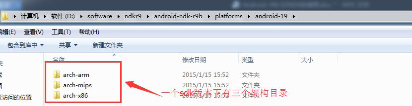
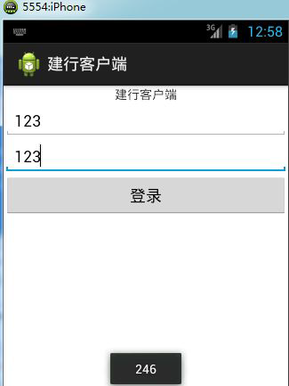

# 1. JNI 简介
## 1.1 什么是JNI
Java Native Interface(JNI)，它允许Java 代码和其他语言写的代码进行交互。JNI 一开始是为了本地已编译语言，尤其是C 和C++而设计的，但是它并不妨碍你使用其他语言，只要调用约定受支持就可以了。

Java Native Interface，java本地接口，Native本地，当前系统用什么语言开发的那么 这种语言对于这个系统而言就是本地语言，android底层是linux linux是c/c++开发的 所以对于android来说 c/c++就是本地语言。JNI 可以看做是一个翻译 实现JAVA语言和本地语言之间的相互调用

## 1.2 为什么用JNI
- JNI 扩展了Java 虚拟机的能力,因为Java 不能直接和硬件交互, 不能开发驱动
- Java 代码效率一般要低于C 代码，而Native code 效率高,因此在数学运算,实时渲染的游戏上以及
  音视频处理上都需要用Java 调用C 语言
- 复用C/C++代码，C 语言经过几十年的发展，已经形成了强大的类库(比如文件压缩，人脸识别opencv，7zip，ffmpeg 等)，这些类库我们没必要用java 语言重新实现一遍，通过JNI 直接调用这些类库即可
- 特殊的业务场景，比如电视、车载系统、微波炉等跟硬件直接相关的开发
- java代码 不可以直接操作硬件 硬件的驱动基本都是C代码写的 如果想操作硬件必须得让java代码可以调用C，这个时候JNI就发挥作用了 可以扩展JAVA代码的性能
- java代码安全性比较差 java->,class->. C安全性相对高一些 C编译之后直接生成机器码 机器码可以反汇编 汇编代码可以猜出C的源代码 伪代码 有些时候跟源代码有区别 比如登录先关 跟钱打交道的应用 可以通过JNI把加密的业务逻辑放到C里面实现
- Java特点 跨平台 一处编译到处运行 通过虚拟机来实现的 java是解释型语言 效率相对比较低在要求效率的地方 java性能会差一些 大型3d游戏 c/c++ 音视频解码 JNI可以提升java的效率 复式投注 需要效率的时候可以通过JNI来调用C/C++来实现
- c1972年 c++ java 1995年 ffmpeg音视频解码 opencv 图像处理 人脸识别 使用JNI可以让java代码调用 c/c++写的优秀开源项目，学习JNI目的是满足自己项目的需求


# 2. NDK 简介

## 2.1 NDK 产生的背景
Android 平台从诞生起，就已经支持C、C++开发。众所周知，Android 的SDK 基于Java 实现，这意味着基于Android SDK 进行开发的第三方应用都必须使用Java 语言。但这并不等同于“第三方应用只能使用Java”。在Android SDK 首次发布时，Google 就宣称其虚拟机Dalvik 支持JNI 编程方式，也就是第三方应用完全可以通过JNI 调用自己的C 动态库，即在Android 平台上，“Java+C”的编程方式是一直都可以实现的

不过，Google 也表示，使用原生SDK 编程相比Dalvik 虚拟机也有一些劣势，Android SDK 文档里，找不到任何JNI 方面的帮助。即使第三方应用开发者使用JNI 完成了自己的C 动态链接库（so）开发，但是so 如何和应用程序一起打包成apk 并发布？这里面也存在技术障碍。比如程序更加复杂，兼容性难以保障，无法访问Framework API，Debug 难度更大等。开发者需要自行斟酌使用

于是NDK 就应运而生了。NDK 全称是Native Development Kit

NDK 的发布，使“Java+C”的开发方式终于转正，成为官方支持的开发方式。NDK 将是Android 平
台支持C 开发的开端

## 2.2 为什么使用NDK

- 代码的保护。由于apk 的java 层代码很容易被反编译，而C/C++库反编译难度较大
- 可以方便地使用现存的开源库。大部分现存的开源库都是用C/C++代码编写的
- 提高程序的执行效率。将要求高性能的应用逻辑使用C 开发，从而提高应用程序的执行效率
- 便于移植。用C/C++写得库可以方便在其他的嵌入式平台上再次使用

## 2.3 NDK 简介

### 2.3.1 NDK 是一系列工具的集合
NDK 提供了一系列的工具，帮助开发者快速开发C（或C++）的动态库，并能自动将so 和java 应用
一起打包成apk。NDK 集成了交叉编译器，并提供了相应的mk 文件隔离CPU、平台、ABI 等差异，开发人员只需要简单修改mk 文件（指出“哪些文件需要编译”、“编译特性要求”等），就可以创建出so

### 2.3.2 NDK 提供了一份稳定、功能有限的API 头文件声明
Google 明确声明该API 是稳定的，在后续所有版本中都稳定支持当前发布的API。从该版本的NDK
中看出，这些API 支持的功能非常有限，包含有：C 标准库（libc）、标准数学库（libm）、压缩库（libz）、Log 库（liblog）。

# 3. NDK 的安装

## 3.1 NDK 的下载

[NDK 的官方下载地址](http://developer.android.com/tools/sdk/ndk/index.html)，由于官方网址在国外，国内访问不了，必须得翻墙。因此我提供了下载好的NDK 工具放在百度网盘上供大家[下载](http://pan.baidu.com/s/1jGpCDKi)


## 3.2 将NDK 解压到一个不包含空格和中文的目录下

本人将NDK 解压在D:\software\ndkr9\android-ndk-r9b 中。

注意：Android Studio 已经集成了NDK，无需下载

## 3.3 NDK 目录结构说明

自定好组合控件之后，之前的activity_setting.xml 中的代码就可以进行简化，具体如下所示：


- build：该目录存放的使用NDK 的mk 脚本，mk 脚本指定了编译参数
- docs：该目录存放的是NDK 的使用帮助文档
- platforms：这里面存放的是与各个Android 版本相关的平台（x86，arm，mips）相关C 语言库和头文件
- prebuilt：预编译工作目录
- samples：存放的是演示程序
- sources：存放的是NDK 工具链的C 语言源码
- tests：测试相关的文件
- toolchains：工具链，存放了三种架构的静态库等文件
- ndk-build.cmd：Window 平台使用NDK 的命令
- ndk-build：Linux 平台使用NDK 的命令

# 4. JNI 入门

下面通过一个简单的JNI 案例来演示如何使用JNI 编程。

1）创建一个新的Android 工程《JNI 入门》，工程的最终目录结构如下图所示。


2）在MainActivity.java 类中定义一个native 方法

```java
//定义一个native 方法，意思是该方法的具体实现交给C 语言实现
public native String helloC();
```

3）在工程跟目录下创建一个文件夹jni，该目录名称是约定（约定优于配置）好的，不能是其他名
字。
4）在jni 目录下创建hello.c 源文件，文件名可以按照见名知意的规则来创建。hello.c 代码清单如下。

```c
#include<stdio.h>//引入头文件
 //引入jni.h jni.h 文件里面定义了jni 的规范，jni.h 在ndk 的目录中找到，然后放到当前工程中的jni目录下即可
#include<jni.h>
//定义在MainActivity.java 类中的helloC 对应的C 语言函数
jstring Java_com_itheima_jnihello_MainActivity_helloC(JNIEnv* env, jobject obj) {
char* str = "hello from C";
//调用jni.h 中定义的创建字符串函数
jstring string = (*(*env)).NewStringUTF(env, str);
return string;
```
Tips：上面的代码虽然简单但是关于jni.h 头文件和方法名必须单独说明。

- jni.h 头文件位于NDK 安装目录下/platforms/android-*/(某平台)/usr/include 目录中，如下图


上面的某平台指CPU 的三种架构如下图。我们选择任意一架构皆可，但是对于手机来说CPU 用arm
架构的最多，x86 次之，mips 架构最少。



- JNI 中C 源文件方法名的命名规则

这里的命名规则指用于跟java 文件中native 方法对应的C 语言方法，而C 语言中的其他方法命名只
要符合C 语言规则就行。

```c
jstring Java_com_itheima_jnihello_MainActivity_helloC(JNIEnv* env, jobject obj)
```

jstring 是方法返回值类型，我们可以把jstring 看成是java 中String 跟C 语言中char*类型的一个中间转换类型，java 跟C 语言的数据类型是不一样的，他们之间要想互相调用就必须通过一种中介来实现，这个中介就是在jni.h 头文件中定义的。关于更多的转换类型，在本文档的第2 章会有更详细的说明。

方法名第一个字母必须是Java，首单词大写，然后下划线_，然后是将该方法所在的包、类、方法用“_”连接起来,比如com.itheima.jnihello.MainActivity 类中的helloC 方法，转变成C 语言中的方法名为Java_com_itheima_jnihello_MainActivity_helloC。

方法的形参有两个是必须的也就是不管java 中的方法是否有形参，但是C 语言中对应的方法必须有
JNIEnv* env,和jobject obj，如果java 方法中还用其他形参，那么在C 语言中严格按照顺序排在jobject obj参数的后面即可。

上面的env 代表指向JVM 的指针，obj 是调用该方法的java 对象。

5）使用NDK 工具将hello.c 编译成hello.so 文件
为了方便直接在控制台中使用NDK 工具的ndk-build.cmd 命令，我们首先将ndk-build.cmd 所在的目录设置成系统环境变量。环境变量配置好以后，在命令行中输入ndk-build.cmd 会有如下提示：


将当前目录切换到hello.c 所在的工程目录，这时候如果直接输入ndk-build.cmd 那么会出现如下异常：


出现这种错误时因为我们并没有告诉ndk 我们要将那个C 语言源代码编译成目标文件。为了告诉ndk

要将那个C 源文件编译成目标文件，我们需要在工程中的jni 目录中添加Android.mk 配置文件。

6）在当前工程的jni 目录下添加Android.mk 配置文件，该配置文件可以从ndk 安装目录的实例代码中拷贝，然后修改。

Android.mk 文件清单如下，我们只需要修改LOCAL_MODULE 和LOCAL_SRC_FILES 两个参数即可。LOCAL_MODULE 参数是指定编译后的目标文件的名称，其实编译好的目标文件名为libhello.so，LOCAL_SRC_FILES 指定了要编译的源文件。

```
LOCAL_PATH := $(call my-dir)
include $(CLEAR_VARS)
LOCAL_MODULE := hello
LOCAL_SRC_FILES := hello.c
include $(BUILD_SHARED_LIBRARY)
```

7）在cmd 中，将当前目录切换到hello.c 所在目录，然后重新执行ndk-build.cmd 命令，这次成功编译，cmd 显示效果如下图所示。


查看项目目录结构，发现在libs 目录中多了两个文件夹armeabi 和x86，这两个文件夹下分别包含了
一个libhello.so 动态链接库。这也代表着当前工程中的动态库支持arm 架构和x86 架构的cpu。


Tips：可能你的并没有同时生成这两个文件，是因为我的工程中引入了Application.mk 文件，因此你需要引入该文件。

Application.mk 文件清单：
```
# Build both ARMv5TE and ARMv7-A machine code.
APP_ABI := armeabi x86
```

8）该清单其实只有一行内容，第一行是注释。APP_ABI 参数指定要生成的目标文件支持的平台都有哪些，默认是armeabi 如果想支持多个平台只需要空一格然后写出其他平台名字即可。在MainActivity.java 中调用C 语言

```java
public class MainActivity extends Activity {
    //加载libhello.so 动态库，但是我们加载的时候必须去掉lib 和后缀
    static{
        System.loadLibrary("hello");
    }
    @Override
    protected void onCreate(Bundle savedInstanceState) {
        super.onCreate(savedInstanceState);
        setContentView(R.layout.activity_main);
    }
    //定义一个native 方法，意思是该方法的具体实现交给C 语言实现
    public native String helloC();
    //点击按钮调用C 语言方法
    public void click(View view){
        Toast.makeText(this, helloC(), 1).show();
    }
}
```
运行上面工程，效果如下：


Tips：如果我们编译的arm 平台的so 文件，但是却部署到了x86 平台的模拟器上，那么运行的时候会报找不到libhello.so 的异常。

# 5.  JNI 规范

## 5.1 JNI 数据类型和数据结构

1）基本数据类型
JNI 基本类型和本地等效类型的对应表格如下：


2）引用类型，JNI 还包含了很多对应于不同Java 对象的引用类型，JNI 引用类型的组织层次如下图所示：


## 5.2 JNI 接口函数命名方式

设置向导二SetUpActivity2.java 的代码逻辑如下所示，设置向导二的图形化界面如2-20 所示。

### 5.2.1 类型签名

Java 虚拟机的类型签名如下：

| 类型签名                   | Java 类型 |
| :--------------------- | :------ |
| Z                      | boolean |
| B                      | byte    |
| C                      | char    |
| S                      | short   |
| I                      | int     |
| J                      | long    |
| F                      | float   |
| D                      | double  |
| Lfully-qulitied-class; | 全限定类    |
| [type type[]           | 数组      |
| (argtypes)rettype      | 方法类型    |

例如，Java 方法int feet(int n, String s,int [] arr)的类型签名如下：

```c
（ILJava/lang/String;[I）I
```

圆括号里面为参数，I 表示第一个参数int 型，LJava/lang/String;表示第二个参数为全限定Java.lang.String类型，[I 表示第三个参数为int 型的数组，圆括号后面为返回值类型，I 表示返回值为int 型。

### 5.2.2 一般函数的JNI 接口函数命名方式

一般JNI 接口函数命名如下：Java_包名_类名_方法名。

例如：某工程下com/itheima 包下MainActivity 类的int getIntFromC()方法的C 语言实现函数命名如下：
```c
jint Java_com_itheima_MainActivity_getIntFromC(JNIEnv* env,jobject obj)
```
其中，包名所包含的“/”应全部以下划线替代，其本地实现的参数和返回值也应转换为JNI 类型。

### 5.2.3 重载函数的JNI 接口函数命名方式

重载函数的JNI 实现在一般函数的JNI 实现之外，还应添加上类型签名以作为同名函数之间的区别，
其接口函数命名如下：Java_包名_类名_方法名_参数签名。

例如：某工程下com/itheima 包下MainActivity 类的int getIntFromC(int n, String s,int [] arr)方法的C 语言实现函数命名如下：

```c
jint Java_com_itheima_MainActivity_getIntFromC_ILJava_lang_String23I
(JNIEnv* env, jobject obj, jint n, jstring s, jintarray arr)
```
JNI 在函数命名时采用名字扰乱方案，以保证所有的Unicode 字符都能转换为有效的C 函数名，所有的“/”,无论是包名中的还是全限定类名中的，均使用“_”代替，用_0,„,_9 来代替转义字符，如下：

| 转义字符序列 | 表示             |
| :----- | :------------- |
| _0XXXX | Unicode 字符XXXX |
| _1     | 字符“_”          |
| _2     | 签名中的字符“；”      |
| _3     | 签名中的字符“[”      |

## 5.3 JNI 函数与API

设置向导三SetUpActivity3.java 的代码逻辑如下所示，设置向导三的图形化界面如2-21 所示。
在本文档中我们所主要需要关心的是C/C++数据类型与JNI 本地类型之间的转化过程，这个过程某些
数据的转换需要使用JNIEnv 对象的一系列方法来完成。

### 5.3.1 jstring 转换为C 风格字符串

```c
char* test = (char)(env)->GetStringUTFChars(env,jstring,NULL);
```

使用完毕后，应调用：

```c
(*env)->ReleaseStringUTFChars(env, jstring, test);
```

释放资源。

### 5.3.2 C 风格字符串转换为jstring

```c
char charStr[50];
jstring jstr;
jstr = env -> NewStringUTF(charStr);
```

### 5.3.3 C 语言中获取的一段char*的buffer 传递给Java

在jni 中new 一个byte 数组，然后使用

```c
(*env)->SetByteArrayRegion(env, bytearray, 0, len, buffer) 
```

操作将buffer 拷贝到数组中。这种方式主要是针对buffer 中存在“\0”的情况，如果以C 风格字符串的方式读入，就会损失“\0”之后的字符。

### 5.3.4 数组操作

| JNI 函数                   | 功能                           |
| ------------------------ | ---------------------------- |
| GetArrayLength           | 返回数组中的元素数                    |
| NewObjectArray           | 创建一个指定长度的原始数据类型数组            |
| GetObjectArrayElement    | 返回Object 数组的元素               |
| SetObjectArrayElement    | 设置Object 数组的元素               |
| GetObjectArrayRegion     | 将原始数据类型数组中的内容拷贝到预先分配好的内存缓存中  |
| SetObjectArrayRegion     | 设置缓存中数组的值                    |
| ReleaseObjectArrayRegion | 释放GetObjectArrayRegion 分配的内存 |


Tips：对int，char 等基本数据类型的数组操作，将相关Object 名称替换为对应基本数据类型名称即
为相关函数。

数组操作的方法选择基于使用者的需求而定，如果使用者需要在内存中拷贝数组并对其进行操作那么一般使用GetObjectArrayRegion 和SetObjectArrayRegion 函数，否则一般使用SetObjectArrayElement 和GetObjectArrayElement 函数。

# 6. 案例-银行登录系统

需求：假设银行的登陆模块是用C 语言来编写的，但是我们的Android 应用想登陆银行系统，那么就
需要通过JNI 来实现了。

创建一个新Android 工程《建行客户端》，工程目录结构如下图。


在工程中创建jni 文件夹，然后将jni.h、Android.mk、Application.mk 从JNI 入门工程拷贝进去。
在jni 目录下创建login.c 文件，在该文件中实现登录业务逻辑。代码清单如下。

```c
#include<stdio.h>
//系统在查找投文件的时候""中的文件会去本地搜索，<>中的文件会去系统目录中搜索，因为jni.h 在当前目录中
所以用""将jni.h 引起来，可以加快搜索速度
#include"jni.h"
int login(int card,int pwd){
    //真实的业务逻辑要复杂的多，这里只简单的返回银行卡号和密码号
    return card+pwd;
}
jint Java_com_itheima_ccb_MainActivity_login(JNIEnv* env,jobject obj,jint card,jint
        pwd){
    return login(card,pwd);
}
```
是用ndk 工具，将login.c 编译成动态库文件。编译前修改Android.mk 文件的LOCAL_SRC_FILES := login.c


编写在MainActivity.java 类
```java
public class MainActivity extends Activity {
    static{
        System.loadLibrary("login-jni");
    }
    @Override
    protected void onCreate(Bundle savedInstanceState) {
        super.onCreate(savedInstanceState);
        setContentView(R.layout.activity_main);
    }
    public native int login(int card,int pwd);
    public void login(View view){
        EditText et_card = (EditText) findViewById(R.id.et_card);
        EditText et_pwd = (EditText) findViewById(R.id.et_pwd);
        int card = Integer.valueOf(et_card.getText().toString());
        int pwd = Integer.valueOf(et_pwd.getText().toString());
        int result = login(card, pwd);
        Toast.makeText(this, ""+result, 1).show();
    }
}
```
布局文件比较简单，这里就不再给出。运行上面的代码，运行结果如下：



# 7. CDT 插件的安装

## 7.1 CDT 简介

CDT 项目致力于为Eclipse 平台提供功能完全的C/C++ 集成开发环境（Integrated Development
Environment，IDE）。CDT 是完全用Java 实现的开放源码项目（根据Common Public License 特许的），它作为Eclipse SDK 平台的一组插件。这些插件将C/C++ 透视图添加到Eclipse 工作台（Workbench）中，现在后者可以用许多视图和向导以及高级编辑和调试支持来支持C/C++ 开发。

## 7.2 CDT 的下载

CDT 插件可以通过eclipse 的在线安装，但是受限于跨国家网络访问，一般不是很好用。因此这里我主要给大家说的是如何离线安装。

下载CDT 离线安装包。针对不同版本eclipse 的cdt 安装包如下，大家可以从我的百度网盘上直接下载。考虑到我们大部分都用的最新的ADT 因此建议选择8.5.0 版本的CDT。

- [cdt-8.5.0-for-Eclipse-Luna](http://pan.baidu.com/s/1c0m1k0w)
- [cdt-8.3.0-for-Eclipse-Kepler](  http://pan.baidu.com/s/1kT21QOf)
- [cdt-8.1.2-for-Eclipse-Juno](http://pan.baidu.com/s/1qWAzjBI)

选择eclipse 的Help->Install New Software...，弹出如下对话框


点击Add 按钮，在弹出的对话框中输入Name。在Location 栏如果输入一个http 地址是让eclipse
自动从网络上下载安装，这里我们点击Archive 按钮找到我们事先下载好的离线安装包。然后点击OK。


将CDT 所有的插件勾选上，同时将最下面的联网检查更新去掉勾选，然后点击Next，直到Finish。


安装好以后在File->New->Other 中会有C/C++选项，如下图。


在Open Perspective 中也多了C/C++视图可选项，如下图。


安装好以后，我们就可以在eclipse 中开发我们的C/C++工程了。不过对我们Android 开发人员来说用到的机会不是很多。就算是开发C/C++工程，大多数程序员也不会选择在eclipse 平台上进行开发。Eclipse更多的是专注于Java 语言项目的开发，比如JavaEE、Android。
