## [NDK中文官方开发技术文档地址](https://developer.android.google.cn/ndk/index.html)

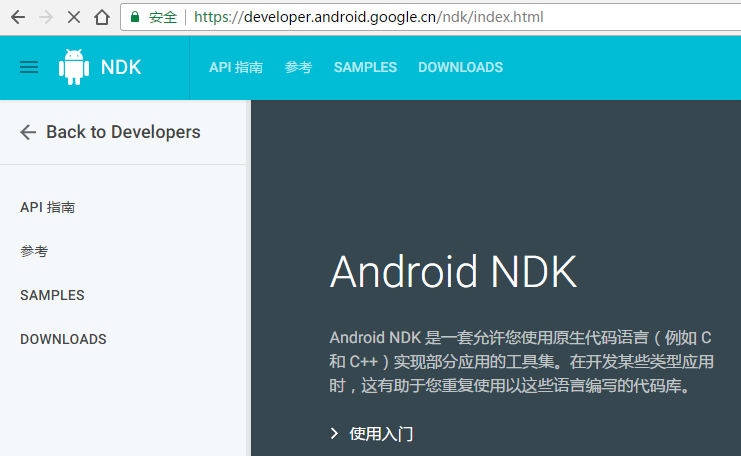

## 下载配置NDK

[NDK下载地址](https://developer.android.google.cn/ndk/downloads/index.html)

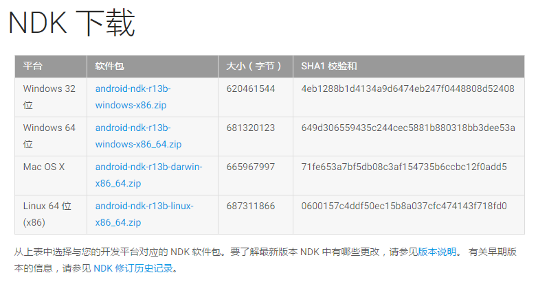

配置NDK

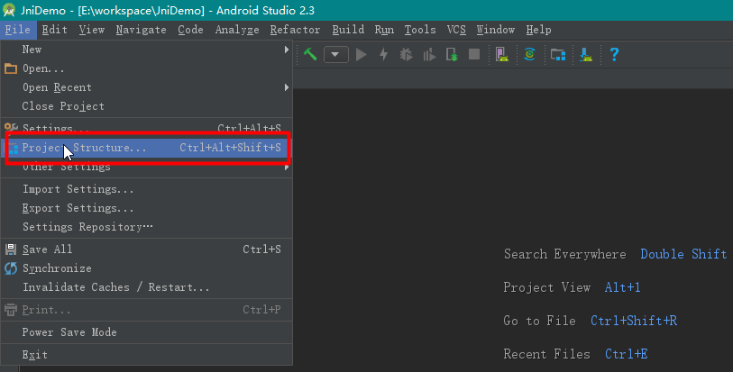

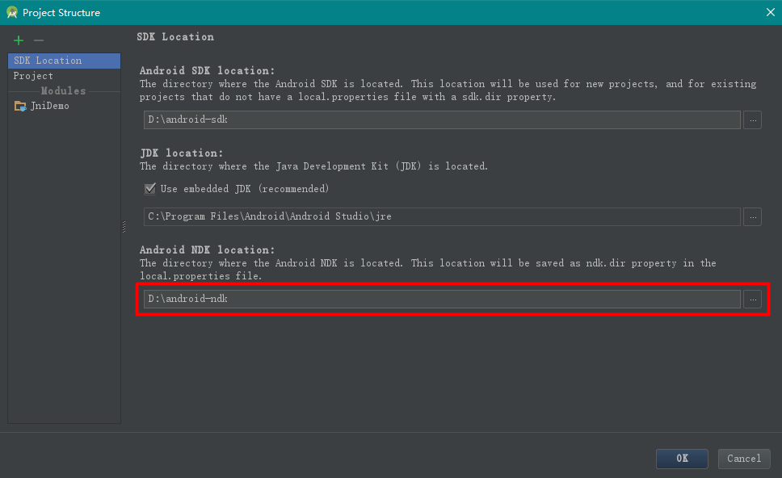

如果不配置NDK路径，会报NDK没有配置错误

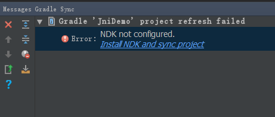

## JNI开发HelloWorld

把 Include C++ support的勾打上

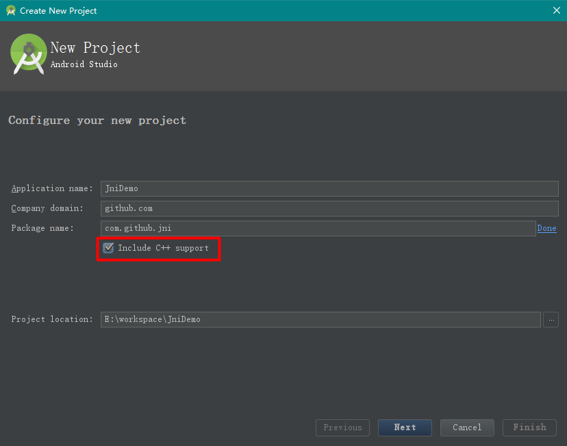

选择C++11和Toolchain Default均可，C++11有更多的新特性和功能

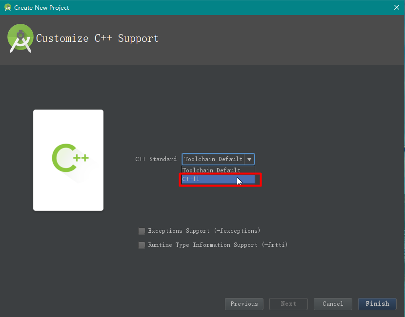

点击Finish后，进入工程目录，如图所示，除了java文件夹外多了一个cpp文件夹，cpp就是存放c和c++代码的文件夹

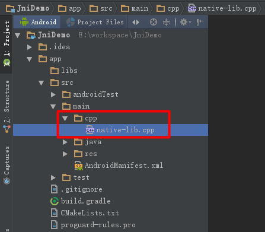

## 配置NDK开发环境中遇到的坑

Failed to find CMake

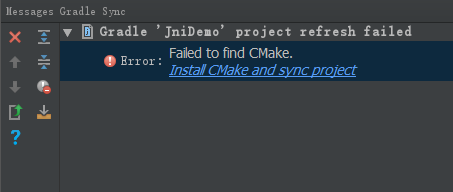

什么，CMake是什么鬼，原来，在Android Studio 2.2 后，NDK开发更加人性化了，使用了[**CMake**](https://cmake.org/)，一款外部构建工具，可与 Gradle 搭配使用来构建原生库。如果您只计划使用 ndk-build，则不需要此组件。还有[**LLDB**](http://lldb.llvm.org/)，一种调试程序，Android Studio 使用它来[调试原生代码](https://developer.android.google.cn/studio/debug/index.html)。

点击Install CMake and sync project，提示如下错误

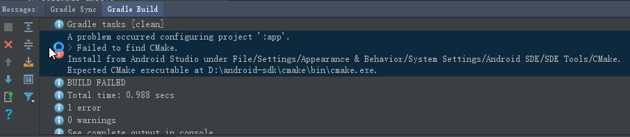

```
Gradle sync failed: Failed to find CMake.
Install from Android Studio under File/Settings/Appearance & Behavior/System Settings/Android SDK/SDK Tools/CMake.
Expected CMake executable at D:\android-sdk\cmake\bin\cmake.exe.
Consult IDE log for more details (Help | Show Log)
```

原来是我使用了代理，因为之前Google的链接需要翻墙才能够使用，所以配置了某代理，但是该代理不管用，在设置中把代理去掉即可。在Google在中国开了发布会后，Google的链接可以使用了，Android开发官网也可以上了，而且翻译了大量的技术文档，方便了英语不太好的同学

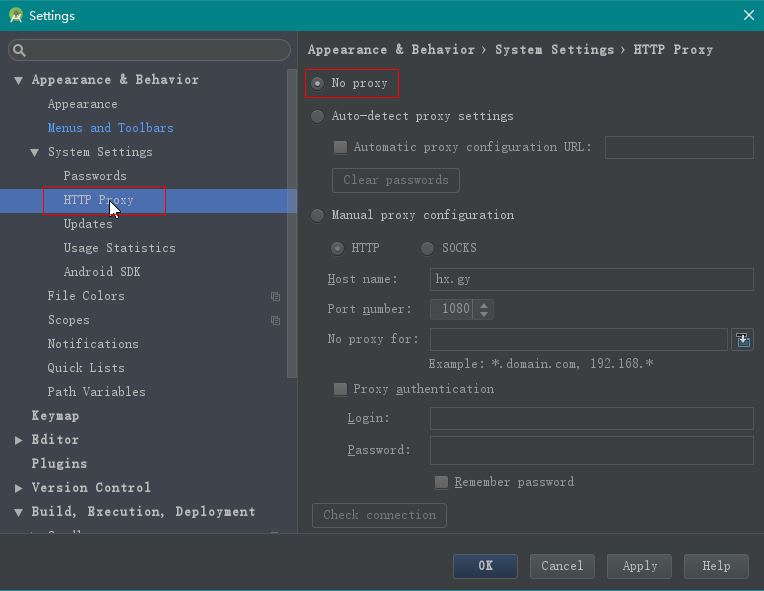

打开 SDK Manager，安装上CMake和LLDB

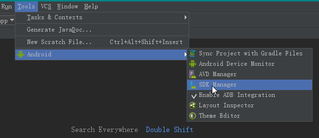

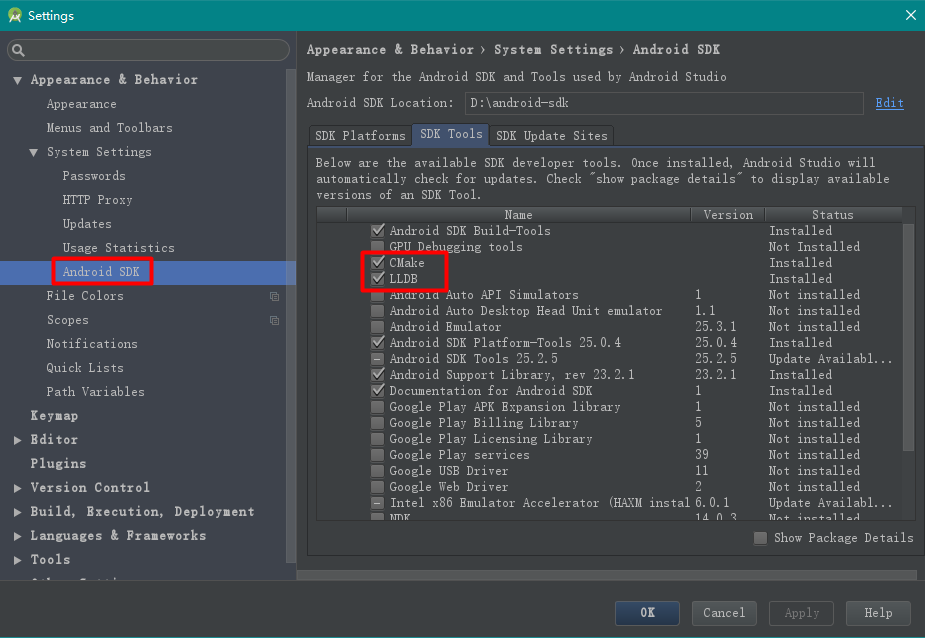

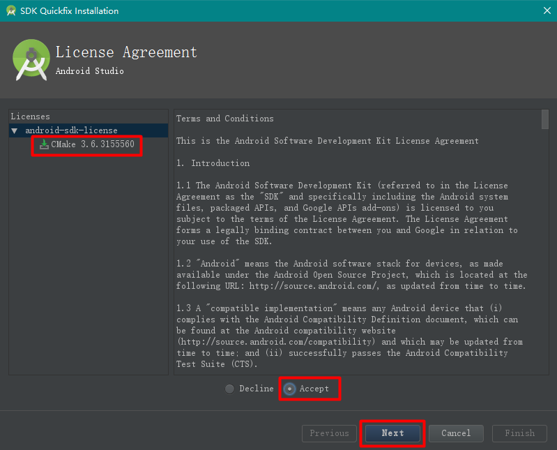

更多更详细的NDK开发文档，请看Android官方中文文档[向您的项目添加 C 和 C++ 代码](https://developer.android.google.cn/studio/projects/add-native-code.html)