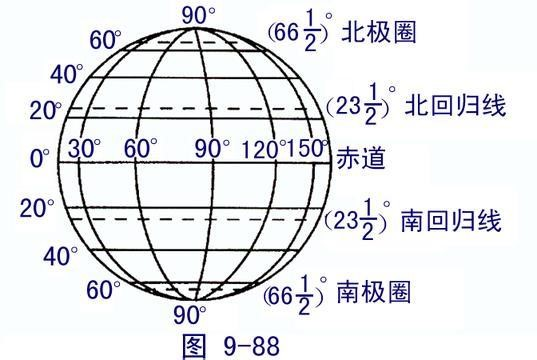
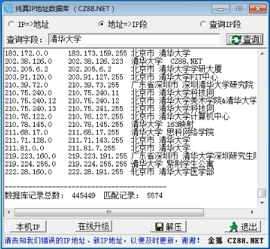
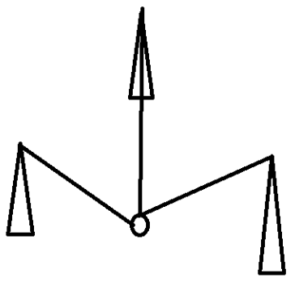
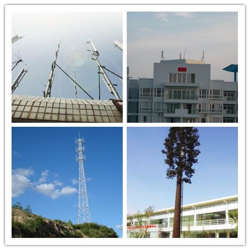
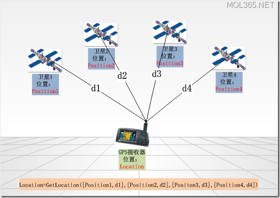
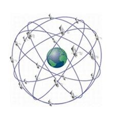
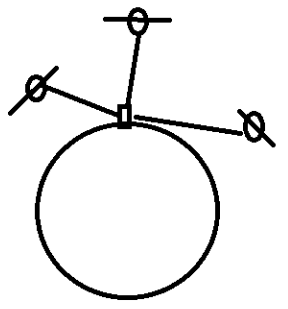
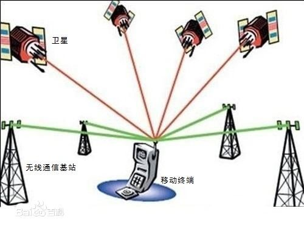

# 1. 经纬度

经度: longitude -180~180，纬度: latitude -90~90
经度的起点为本初子午线，规定以过伦敦格林威治天文台的那条经线为0度经线，即本初子午线



# 2. 网络定位 

根据IP显示具体的位置；原理是建立一个库那个IP地址对应那个地方；早期警方破案就采用此特点；
有局限性：针对固定的IP地址。如果手机网或者ip地址是动态分布IP，这个偏差就很大。这种情况是无法满足需求的

[纯真IP数据库](http://www.pc6.com/softview/SoftView_41490.html)：收集包括中国电信、中国网通、长城宽带、网通宽带、聚友宽带等 ISP 的最新准确IP地址数据，五天更新一次



# 3. 基站定位
基站定位一般应用于手机用户，手机基站定位服务又叫做移动位置服务（LBS：Location Based Service），它是通过电信移动运营商的网络（如GSM网）获取移动终端用户的位置信息（经纬度坐标），在电子地图平台的支持下，为用户提供相应服务 的一种增值业务，例如目前中国移动动感地带提供的动感位置查询服务等

工作原理：手机能打电话，是需要基站的。手机定位也是用基站的。手机附近能收到3个基站的信号，就可以定位了。
基站定位有可能很准确，比如基站多的地方；如果基站少的话就会相差很大。精确度：几十米到几公里不等





# 4. GPS定位



 

GPS（Global Positioning System）即全球定位系统，是美国研制的卫星导航定位系统，今采用wgs84坐标系统。因地球在天球空间中的位置是不稳定的，故协议用wgs84某一可的北极点指向位置

至少需要3颗卫星，GPS使用24颗卫星，基本上可以覆盖地球90%的区域，范围几米-几十米，容易受云层，建筑等干扰

A-GPS 使用了卫星定位 需要联网辅助修正位置，需要3颗卫星；
特点是：需要搜索卫星， 头顶必须是空旷的；

影响条件：云层、大厦、大树。

卫星：美国人、欧洲人的卫星。
北斗：中国的，但没有民用，只是在大巴，战机等使用。
精确度：15米左右


```java
public class MainActivity extends Activity {

    private LocationManager    lm; 
    private MyLocationListener listener;

    @Override
    protected void onCreate(Bundle savedInstanceState) {
        super.onCreate(savedInstanceState);
        setContentView(R.layout.activity_main);
        lm = (LocationManager) getSystemService(LOCATION_SERVICE);
        listener = new MyLocationListener();
        // 第二个参数：两次位置更新的时间间隔
        lm.requestLocationUpdates("gps", 0, 0, listener);

    }

    class MyLocationListener implements LocationListener {
        // 当位置发生变化 执行者方法
        @Override
        public void onLocationChanged(Location location) {
            String longitude = "经度：" + location.getLongitude() + "\n";
            String latitude = "纬度：" + location.getLatitude() + "\n";
            String accuracy = "精度：" + location.getAccuracy() + "\n";

            TextView textView = new TextView(getApplicationContext());
            textView.setText(longitude + latitude + accuracy);

            setContentView(textView);

        }

        // 当某一个位置提供者状态发生变化的时候 关闭--》开启 或者开启--》关闭
        @Override
        public void onStatusChanged(String provider, int status, Bundle extras) {

        }

        @Override
        public void onProviderEnabled(String provider) {

        }

        @Override
        public void onProviderDisabled(String provider) {

        }
    }

    @Override
    protected void onDestroy() {
        super.onDestroy();
        lm.removeUpdates(listener);
        listener = null;
    }
}
```

权限：
```xml
<uses-permission android:name="android.permission.ACCESS_FINE_LOCATION"/>
<uses-permission android:name="android.permission.ACCESS_COARSE_LOCATION"/>
<uses-permission android:name="android.permission.ACCESS_MOCK_LOCATION"/>
```

1、创建服务GPSService 并移植代码到里面面，并优化细节
2、优化代码细节

```java
Criteria criteria = new Criteria();
criteria.setAccuracy(Criteria.ACCURACY_FINE);
String provider = lm.getBestProvider(criteria, true);
lm.requestLocationUpdates(provider, 0, 0, listener);
```

设置参数细化：
```java
criteria.setAccuracy(Criteria.ACCURACY_FINE);//设置为最大精度 
criteria.setAltitudeRequired(false);//不要求海拔信息 
criteria.setBearingRequired(false);//不要求方位信息 
criteria.setCostAllowed(true);//是否允许付费 
criteria.setPowerRequirement(Criteria.POWER_LOW);//对电量的要求 
```
# 5. A-GPS



A-GPS（Assisted GPS）即辅助GPS技术，它可以提高 GPS 卫星定位系统的 性能。通过移动通信运营基站它可以快速地定位，广泛用于含有GPS功能的手机上。GPS通过卫星发出的无线电信号来进行定位。当在很差的信号条件下，例如 在一座城市，这些信号可能会被许多不规则的建筑物、墙壁或树木削弱。在这样的条件下，非A-GPS 导航设备可能无法快速定位，而A-GPS 系统可以通过运营商基站信息来进行快速定位

A-GPS 使用了卫星定位，需要联网辅助修正位置，需要3颗卫星；特点是：需要搜索卫星， 头顶必须是空旷的；

影响条件：云层、大厦、大树。

卫星：美国人、欧洲人的卫星。北斗：中国的，但没有民用，只是在大巴，战机等使用。精确度：15米左右

# 6. 火星坐标

国家保密插件，也叫做加密插件或者加偏或者SM模组，其实就是对真实坐标系统进行人为的加偏处理，按照特殊的算法，将真实的坐标加密成虚假的坐标，而这个加偏并不是线性的加偏，所以各地的偏移情况都会有所不同。而加密后的坐标也常被人称为火星坐标系统

所有的电子地图、导航设备，都需要加入国家保密插件。第一步，地图公司测绘地图，测绘完成后，送到国家测绘局，将真实坐标的电子地图，加密成“火星坐标”，这样的地图才是可以出版和发布的，然后才可以让GPS公司处理。第二步，所有的GPS公司，只要需要汽车导航的，需要用到导航电子地图的，都需要在软件中加入国家保密算法，将COM口读出来的真实的坐标信号，加密转换成国家要求的保密的坐标。这样，GPS导航仪和导航电子地图就可以完全匹配，GPS也就可以正常工作了

获取到坐标后在谷歌地图上查询，发现坐标有所偏移，不准确。这是因为中国的地图服务，为了国家安全，坐标数据都经过了政府加偏处理，加偏处理后的坐标被称为火星坐标

地图偏振(政府)，偏振算法有人破解

技术牛人通过对美国地图和中国地图的比对，生成了一个查询数据库，专门用与标准坐标和火星坐标的转换。导入数据库文件axisoffset.dat和工具类ModifyOffset.java，创建一个java工程进行演示火星坐标转换
```java
public static void main(String[] args) {
    try {
        ModifyOffset offset = ModifyOffset.getInstance(Demo.class
                .getResourceAsStream("axisoffset.dat"));//加载数据库文件
        PointDouble s2c = offset.s2c(new PointDouble(116.2821962,
                40.0408444));//标准坐标转为火星坐标
        System.out.println(s2c);
    } catch (Exception e) {
        e.printStackTrace();
    }
}
```
```java
import java.io.InputStream;
import java.io.ObjectInputStream;

/**
 * 火星地球坐标转化.地图坐标修偏
 * 
 */
public class ModifyOffset {
	private static ModifyOffset modifyOffset;
	static double[] X = new double[660 * 450];
	static double[] Y = new double[660 * 450];


	private ModifyOffset(InputStream inputStream) throws Exception {
		init(inputStream);
	}

	public synchronized static ModifyOffset getInstance(InputStream is) throws Exception {
		if (modifyOffset == null) {
			modifyOffset = new ModifyOffset(is);
		}
		return modifyOffset;
	}

	public void init(InputStream inputStream) throws Exception {
		ObjectInputStream in = new ObjectInputStream(inputStream);
		try {
			int i = 0;
			while (in.available() > 0) {
				if ((i & 1) == 1) {
					Y[(i - 1) >> 1] = in.readInt() / 100000.0d;
					;
				} else {
					X[i >> 1] = in.readInt() / 100000.0d;
					;
				}
				i++;
			}
		} finally {
			if (in != null)
				in.close();
		}
	}

	// standard -> china
	public PointDouble s2c(PointDouble pt) {
		int cnt = 10;
		double x = pt.x, y = pt.y;
		while (cnt-- > 0) {
			if (x < 71.9989d || x > 137.8998d || y < 9.9997d || y > 54.8996d)
				return pt;
			int ix = (int) (10.0d * (x - 72.0d));
			int iy = (int) (10.0d * (y - 10.0d));
			double dx = (x - 72.0d - 0.1d * ix) * 10.0d;
			double dy = (y - 10.0d - 0.1d * iy) * 10.0d;
			x = (x + pt.x + (1.0d - dx) * (1.0d - dy) * X[ix + 660 * iy] + dx
					* (1.0d - dy) * X[ix + 660 * iy + 1] + dx * dy
					* X[ix + 660 * iy + 661] + (1.0d - dx) * dy
					* X[ix + 660 * iy + 660] - x) / 2.0d;
			y = (y + pt.y + (1.0d - dx) * (1.0d - dy) * Y[ix + 660 * iy] + dx
					* (1.0d - dy) * Y[ix + 660 * iy + 1] + dx * dy
					* Y[ix + 660 * iy + 661] + (1.0d - dx) * dy
					* Y[ix + 660 * iy + 660] - y) / 2.0d;
		}
		return new PointDouble(x, y);
	}

	// china -> standard
	public PointDouble c2s(PointDouble pt) {
		int cnt = 10;
		double x = pt.x, y = pt.y;
		while (cnt-- > 0) {
			if (x < 71.9989d || x > 137.8998d || y < 9.9997d || y > 54.8996d)
				return pt;
			int ix = (int) (10.0d * (x - 72.0d));
			int iy = (int) (10.0d * (y - 10.0d));
			double dx = (x - 72.0d - 0.1d * ix) * 10.0d;
			double dy = (y - 10.0d - 0.1d * iy) * 10.0d;
			x = (x + pt.x - (1.0d - dx) * (1.0d - dy) * X[ix + 660 * iy] - dx
					* (1.0d - dy) * X[ix + 660 * iy + 1] - dx * dy
					* X[ix + 660 * iy + 661] - (1.0d - dx) * dy
					* X[ix + 660 * iy + 660] + x) / 2.0d;
			y = (y + pt.y - (1.0d - dx) * (1.0d - dy) * Y[ix + 660 * iy] - dx
					* (1.0d - dy) * Y[ix + 660 * iy + 1] - dx * dy
					* Y[ix + 660 * iy + 661] - (1.0d - dx) * dy
					* Y[ix + 660 * iy + 660] + y) / 2.0d;
		}
		return new PointDouble(x, y);
	}

}

class PointDouble {
	double x, y;

	PointDouble(double x, double y) {
		this.x = x;
		this.y = y;
	}

	public String toString() {
		return "x=" + x + ", y=" + y;
	}
}
```
# 7. LBS

基于位置的服务

## 百度地图

