## 为什么内存优化？

在一个商业项目中，很有可能因为工程师的疏忽，导致代码质量不佳，影响到程序的运行效率，从而让用户感知到应用的卡顿、崩溃。而Android开发中，每个Android应用在手机上申请的内存空间都是有限的。虽然手机发展越来越快，可申请到的内存越来越大，但是也不能大手大脚，随便浪费应用可使用的内存空间。内存一旦不够时，你这个应用就会因为OOM（out of memory）而崩溃。因此，内存优化这一块内容，在开发应用时是非常重要的。

## 1. 内存优化的关键点—避免内存泄露

内存优化中非常关键的一点，就是避免内存泄露。因为内存泄露会严重的导致内存浪费，所以避免内存泄露，是内存优化中必不可少的。

## 2. java中的四种引用类型

java引用类型不是指像int、char等这些基本的数据类型。java中的引用类型有四种：强引用、软引用、弱引用、虚引用。这四种引用类型，它们关于对象的可及性是由强到弱的。

```java
public class ReferenceDemo {

    public static void main(String[] args) {
        // 强引用：对象类型 对象的名字(实例) = 对象的构造方法;
        String str = "abc"; // 常量池
        // String str = new String("abc"); // 堆内存

        // 软引用,当内存不足的时候，才会释放掉它引用的对象
        SoftReference<String> softReference = new SoftReference<String>(str);

        // 弱引用,只要系统产生了GC(垃圾回收)，它引用的对象就会被释放掉
        WeakReference<String> weakReference = new WeakReference<String>(str);

        // 虚引用，实际用的不多，就是判断对象已被回收

        // PhantomReference<String> phantomReference = new PhantomReference<String>(referent,q);

        str = null;
        System.out.println("强引用：" + str);

        softReference.clear();
        System.out.println("软引用：" + softReference.get());

        // 通过GC，将String对象回收了，那你引用中的对象也会变成null，gc只回收堆内存
        System.gc();
        System.out.println("弱引用：" + weakReference.get());
    }
}
```

### 2.1 强引用

最常见的强引用方式如下：

```java
//强引用  对象类型 对象名 = new 对象构造方法();
//比如下列代码
String str = new String("abc");
```

在上述代码中，这个str对象就是强可及对象。**强可及对象永远不会被GC回收。**它宁愿被抛出OOM异常，也不会回收掉强可及对象。

清除强引用对象中的引用链如下：

```java
String str = new String("abc");
//置空
str = null;
```

### 2.2 软应用

软引用方式如下：

```java
//软引用SoftReference
SoftReference<String> softReference = new SoftReference<String>(str);
```

在上述代码中，这个str对象就是软可及对象。**当系统内存不足时，软可及对象会被GC回收。**

清除软引用对象中的引用链可以通过模拟系统内存不足来清除，也可以手动清除，手动清除如下：

```java
SoftReference<String> softReference = new SoftReference<String>(str);
softReference.clear();
```

### 2.3 弱引用

弱引用方式如下：

```java
//弱引用WeakReference
WeakReference<String> weakReference = new WeakReference<>(str);
```

在上述代码中，这个str对象就是弱可及对象。**当每次GC时，弱可及对象就会被回收。**

清除弱引用对象中的引用链可以通过手动调用gc代码来清除，如下：

```java
WeakReference<String> weakReference = new WeakReference<>(str);
System.gc();
```

当然，也可以通过类似软引用，调用clear()方法也可以。

### 2.4 虚引用

虚引用方式如下：

```java
//虚引用PhantomReference
PhantomReference phantomReference = new PhantomReference<>(arg0, arg1);
```

虚引用一般在代码中出现的频率极低，主要目的是为了检测对象是否已经被系统回收。它在一些用来检测内存是否泄漏的开源项目中使用到过，如LeakCanary。

### 2.5 补充

* 一个对象的可及性由最强的那个来决定。 


* System.gc()方法只会回收堆内存中存放的对象。

```java
String str = "abc";
//弱引用WeakReference
WeakReference<String> weakReference = new WeakReference<>(str);
System.gc();
```

像这样的代码，即使gc后，str对象仍然可以通过弱引用拿到。因为像"abc"这种，并没有存放在堆内	存中，它被存放在常量池里，所以gc不会去回收。

## 3. 内存泄露的原因

**对无用对象的引用一直未被释放，就会导致内存泄露。**如果对象已经用不到了，但是因为疏忽，导致代码中对该无用对象的引用一直没有被清除掉，就会造成内存泄露。

比如你按back键关掉了一个Activity，那么这个Activity页面就暂时没用了。但是某个后台任务如果一直持有着对该Activity对象的引用，这个时候就会导致内存泄露。

## 4. 检测内存泄露—LeakCanary

在全球最大的同性交友网站[github](http://www.github.com)中，有一个非常流行的开源项目[LeakCanary](https://github.com/square/leakcanary)，它能很方便的检测到当前开发的java项目中是否存在内存泄露。

## 5. LeakCanary的使用

### 5.1 官方使用文档描述

从LeakCanary的文档描述中，可以得知使用方式，简单翻译为如下步骤：

1.在你的项目中，找到moudle级别的build.gradle文件，并在dependencies标签里加上以下代码：

```xml
 dependencies {
	//... 你项目中以前声明的一些依赖
   debugCompile 'com.squareup.leakcanary:leakcanary-android:1.5'
   releaseCompile 'com.squareup.leakcanary:leakcanary-android-no-op:1.5'
   testCompile 'com.squareup.leakcanary:leakcanary-android-no-op:1.5'
 }
```
2.在你Android项目中，找到先前写的Application类（PS：如果没有，那么请自行新建并在AndroidManifest中声明），并添加如下代码：

```java
public class ExampleApplication extends Application {

  @Override public void onCreate() {
    super.onCreate();
    if (LeakCanary.isInAnalyzerProcess(this)) {
      // This process is dedicated to LeakCanary for heap analysis.
      // You should not init your app in this process.
      return;
    }
    LeakCanary.install(this);
    // Normal app init code...
  }
}
```
3.导入完毕！当你的应用出现内存泄露时，LeakCanary会在通知栏上进行通知，注意查看。下图是一个LeakCanary检测到内存泄露时的实示例。
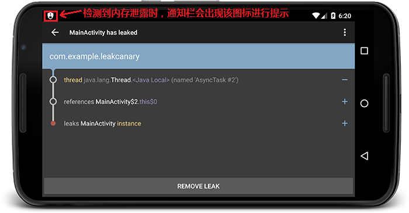

### 5.2 检测Fragment 

上述步骤默认会检测Activity，但是不会去检测Fragment，如果需要对某个Fragment检测的话，需要利用到LeakCanary的其他写法。

首先，在先前的Application类中，改写为以下代码：

```java
public class MyApplication extends Application {

    public static RefWatcher mRefWatcher;

    @Override public void onCreate() {
        super.onCreate();
        //...
        mRefWatcher = LeakCanary.install(this);
        // Normal app init code...
    }
}	
```

然后在Fragment中的onDestroy方法中，去使用这个静态的RefWatcher进行观察，如果onDestroy了当前这个Fragment还没被回收，说明该Fragment产生了内存泄露。

```java
@Override
public void onDestroy() {
    super.onDestroy();
    MyApplication.mRefWatcher.watch(this);
}
```

### 5.3 检测某个特定对象

有时候如果需要检测某个特定的可疑对象在某个时机下是否内存泄露，那么只需要执行如下代码

（假如对象名为someObjNeedGced）：

```java
//...
RefWatcher refWatcher = MyApplication.refWatcher;
refWatcher.watch(someObjNeedGced);
//...
```

当执行了refWatcher.watch方法时，如果这个对象还在内存中被其他对象引用，就会在 logcat 里看到内存泄漏的提示。

## 6 LeakCanary的原理简介

LeakCanary的代码执行流程图如下：

 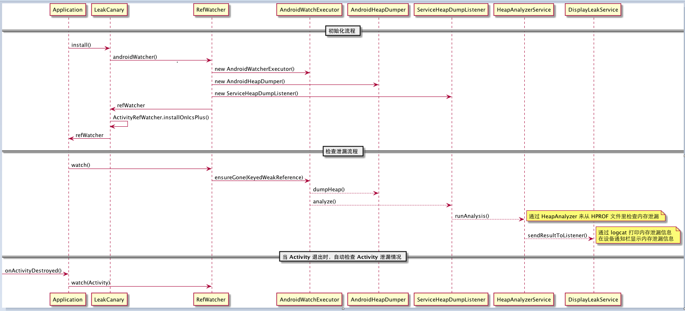

LeakCanary 的机制如下：

1. `RefWatcher.watch()` 会以监控对象来创建一个`KeyedWeakReference` 弱引用对象
2. 在`AndroidWatchExecutor`的后台线程里，来检查弱引用已经被清除了，如果没被清除，则执行一次 GC
3. 如果弱引用对象仍然没有被清除，说明内存泄漏了，系统就导出 hprof 文件，保存在 app 的文件系统目录下
4. `HeapAnalyzerService`启动一个单独的进程，使用`HeapAnalyzer`来分析 hprof 文件。它使用另外一个开源库 [HAHA](https://github.com/square/haha)。
5. `HeapAnalyzer` 通过查找`KeyedWeakReference` 弱引用对象来查找内在泄漏
6. `HeapAnalyzer`计算`KeyedWeakReference`所引用对象的最短强引用路径，来分析内存泄漏，并且构建出对象引用链出来。
7. 内存泄漏信息送回给`DisplayLeakService`，它是运行在 app 进程里的一个服务。然后在设备通知栏显示内存泄漏信息。

## 7 常见的内存泄露

### 7.1 内部类导致内存泄露

内部类实例会隐式的持有外部类的引用。

比如说在Activity中去创建一个内部类实例，然后在内部类实例中去执行一些需要耗时间的任务。任务在执行过程中，将Activity关掉，这个时候Activity对象是不会被释放的，因为那个内部类还持有着对Activity的引用。但是Activity此时已经是个没用的Activity了，所有这时，内存泄露就出现了。

隐式持有外部类的说明：内部类可以直接去调用外部类的方法，如果没有持有外部类的引用，内部类是没办法去调用外部类的属性和方法的，但是内部类又没有明显的去指定和声明引用，所以称之为隐式引用。

#### 7.1.1 Thread线程

在Activity中创建一个内部类去继承Thread，然后让该Thread执行一些后台任务，未执行完时，关闭Activity，此时会内存泄露。核心代码如下：

```java
public class MainActivity extends AppCompatActivity {

    @Override
    protected void onCreate(Bundle savedInstanceState) {
        super.onCreate(savedInstanceState);
        setContentView(R.layout.activity_main);
        findViewById(R.id.button).setOnClickListener(new View.OnClickListener() {
            @Override
            public void onClick(View v) {
                startThread();
            }
        });
    }

    private void startThread() {
        Thread thread = new Thread() {
            @Override
            public void run() {
                for (int i = 0; i < 20; i++) {
                    SystemClock.sleep(1000);
                }
            }
        };
        thread.start();
    }

}
```

当点击页面按钮执行startThread()后，再按下back键关闭Activity，几秒后LeakCanary就会提示内存泄露了。

为了避免此种Thread相关内存泄露，只需要避免这个内部类去隐式引用外部类Activity即可。

解决方案：让这个内部类声明为静态类。代码如下：

```java
public class MainActivity extends AppCompatActivity {

    @Override
    protected void onCreate(Bundle savedInstanceState) {
        ...与先前相比未做变化，不再描述
    }

    private void startThread() {
        Thread thread = new MyStaticThread();
        thread.start();
    }

    private static class MyStaticThread extends Thread {

        @Override
        public void run() {
            for (int i = 0; i < 200; i++) {
                SystemClock.sleep(1000);
            }
        }
    }
}
```

这样声明为静态类后，该内部类将不会再去隐式持有外部类的应用。

如果像这样的循环操作，为了效率和优化，建议通过申明一个boolean类型的标志位来控制后台任务。比如在外部类Activity的onDestory退出方法中，将boolean值进行修改，使后台任务退出循环。代码如下：

```java
public class MainActivity extends AppCompatActivity {

    ...
	//Activity页面是否已经destroy
    private static boolean isDestroy = false;

    private static class MyStaticThread extends Thread {

        @Override
        public void run() {
            for (int i = 0; i < 20; i++) {
                if(!isDestroy){
                    SystemClock.sleep(1000);
                }
            }
        }
    }

    @Override
    protected void onDestroy() {
        super.onDestroy();
        isDestroy = true;
    }
}
```

因为申明为了静态内部类，该内部类不再持有外部类Activity的引用，所以此时不能再去使用外部类中的方法、变量。<u>除非外部类的那些方法、变量是静态的</u>。

Q：在防止内存泄露的前提下，如果一定要去使用那些外部类中非静态的方法、变量，该怎么做？

A：通过使用弱引用或者软引用的方式，来引用外部类Activity。代码如下：

```java
public class MainActivity extends AppCompatActivity {

    @Override
    protected void onCreate(Bundle savedInstanceState) {
        ...
    }

    private void startThread() {
        Thread thread = new MyStaticThread(MainActivity.this);
        thread.start();
    }

    private  boolean isDestroy = false;//Activity页面是否已经destroy

    private static class MyStaticThread extends Thread {

        private WeakReference<MainActivity> softReference = null;

        MyStaticThread(MainActivity mainActivity){
            this.softReference = new WeakReference<MainActivity>(mainActivity);
        }

        @Override
        public void run() {
            //能够isDestroy变量是非静态的，它属于MainActivity，我们只要拿到了MainActivity对象，就能拿到isDestroy
            MainActivity mainActivity = softReference.get();
            for (int i = 0; i < 200; i++) {
                //使用前最好对MainActivity对象做非空判断，如果它已经被回收，就不再执行后台任务
                if(mainActivity!=null&&!mainActivity.isDestroy){
                    SystemClock.sleep(1000);
                }
            }
        }
    }

    @Override
    protected void onDestroy() {
        super.onDestroy();
        isDestroy = true;
    }
}
```

#### 7.1.2 Handler

在使用Handler时，经常可以看到有人在Activity、Fragment中写过内部类形式的Handler，比如说写一个内部类形式的handler来执行一个延时的任务，像这样：

```java
public class MainActivity extends AppCompatActivity {

    private static final int MESSAGE_DELAY = 0;
    private Button mButton;

    @Override
    protected void onCreate(Bundle savedInstanceState) {
        super.onCreate(savedInstanceState);
        setContentView(R.layout.activity_main);
        mButton = (Button) findViewById(R.id.button);
        mButton.setOnClickListener(new View.OnClickListener() {
            @Override
            public void onClick(View v) {
                startDelayTask();
            }
        });
    }

    private void startDelayTask() {
        //发送一条消息，该消息会被延时10秒后才处理
        Message message = Message.obtain();
        message.obj = "按钮点击15秒后再弹出";
        message.what = MESSAGE_DELAY;
        mHandler.sendMessageDelayed(message, 15000);
    }

    private Handler mHandler = new Handler() {
        @Override
        public void handleMessage(Message msg) {
            switch (msg.what) {
                case MESSAGE_DELAY:
                    Toast.makeText(MainActivity.this, (String) msg.obj, Toast.LENGTH_SHORT).show();
                    mButton.setText("延时修改了按钮的文本");
                    break;
            }
        }
    };
}
```

当点击了按钮后会发送出一条消息，该消息将会15秒后再进行处理，如果中途退出Activity，不一会LeakCanary就会检测到内存泄露。

上述代码发生内存泄露也是因为内部类持有外部类的引用。这个内部类Handler会拿着外部类Activity的引用，而那个Message又拿着Handler的引用。这个Message又要在消息队列里排队等着被handler中的死循环来取消息。从而形成了一个引用链，最后导致关于外部类Activity的引用不会被释放。

该情况的的解决方案，是与上一节的Thread线程相同的。只要将Handler设置为static的静态内部类方式，就解决了handler持有外部类引用的问题。

如果handler已申明为静态内部类，那么Handler就不再持有外部类的引用，无法使用外部类中非静态的方法、变量了。

如果想在避免内存泄露的同时，想使用非静态的方法、变量，同样可以用弱（软）引用来做。

```java
public class MainActivity extends AppCompatActivity {

    private static final int MESSAGE_DELAY = 0;
    private Button mButton;

    @Override
    protected void onCreate(Bundle savedInstanceState) {
        ...
    }

    private void startDelayTask() {
        //发送一条消息，该消息会被延时10秒后才处理
        ...
    }

    private Handler mHandler = new InsideHandler(MainActivity.this);

    private static class InsideHandler extends Handler {
        private WeakReference<MainActivity> mSoftReference;

        InsideHandler(MainActivity activity) {
            mSoftReference = new WeakReference<MainActivity>(activity);
        }

        @Override
        public void handleMessage(Message msg) {
            MainActivity mainActivity = mSoftReference.get();
            if (mainActivity != null) {
                switch (msg.what) {
                    case MESSAGE_DELAY:
                        Toast.makeText(mainActivity, (String) msg.obj, Toast.LENGTH_SHORT).show();
                        //通过软引用中的mainActivity可以拿到那个非静态的button对象
                        mainActivity.mButton.setText("延时修改了按钮的文本");
                        break;
                }
            }
        }
    }
}
```

最后，更完美的做法是在这些做法的基础上，再添加这段逻辑：当Activity页面退出时，将handler中的所有消息进行移除，做到滴水不漏。

其实就是在onDestroy中写上：

```
@Override
protected void onDestroy() {
    super.onDestroy();
    //参数为null时，handler中所有消息和回调都会被移除
    mHandler.removeCallbacksAndMessages(null);
}
```

PS：弱引用和软引用的区别：弱引用会很容易被回收掉，软引用没那么快。如果你希望能尽快清掉这块内存使用就使用弱引用；如果想在内存实在不足的情况下才清掉，使用软引用。

下图是在内部类Handler使用软引用时LeakCanary出现的提示。

 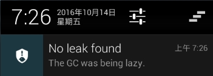

因为使用软引用，GC会有点偷懒，所以leakCanary会检测到一些异常，出现这样的提示。

#### 7.1.3 非静态内部类的静态实例

有时候会使用，代码如下：

```java
public class MainActivity extends AppCompatActivity {

    private static User sUser = null;
    @Override
    protected void onCreate(Bundle savedInstanceState) {
        super.onCreate(savedInstanceState);
        setContentView(R.layout.activity_main);
        initData();
    }

    private void initData() {
        if(sUser==null){
            sUser = new User();
        }
    }

    private class User{
        User(){
        }
    }
}
```

在代码中，非静态的内部类创建了一个静态实例。非静态内部类会持有外部类Activity的引用，后来又创建了一个这个内部类的静态实例。

这个静态实例不会在Activity被关掉时一块被回收（静态实例的生命周期跟Activity可不一样，你Activity挂了，但是写在Activity中的静态实例还是会在，静态实例的生命周期跟应用的生命周期一样长）。

非静态内部类持有外部引用，而该内部类的静态实例不会及时回收，所以才导致了内存泄露。

解决方案：将内部类申明为静态的内部类。

```java
public class MainActivity extends AppCompatActivity {

    ...

    private static class User{
        ...
    }
}
```

### 7.2 Context导致内存泄露

有时候我们会创建一个静态类，比如说AppManager、XXXManager。这些静态类可能还是以单例的形式存在。而这些静态类需要做一个关于UI的处理，所以传递了一个Context进来，代码如下：

```java
public class ToastManager {
    private Context mContext;
    ToastManager(Context context){
        mContext = context;
    }

    private static ToastManager mManager = null;

    public void showToast(String str){
        if(mContext==null){
            return;
        }
        Toast.makeText(mContext, str, Toast.LENGTH_SHORT).show();
    }

    public static ToastManager getInstance(Context context){
        if(mManager==null){
            synchronized (ToastManager.class){
                if(mManager==null){
                    mManager = new ToastManager(context);
                }
            }
        }
        return mManager;
    }
}
```

而在使用时是这样写的：

```
public class MainActivity extends AppCompatActivity {

    @Override
    protected void onCreate(Bundle savedInstanceState) {
        ...
        ToastManager instance = ToastManager.getInstance(MainActivity.this);
    }
}
```

这个时候代码也会发生内存泄露。因为静态实例比Activity生命周期长，你在使用静态类时将Activity作为context参数传了进来，即时Activity被关掉，但是静态实例中还保有对它的应用，所以会导致Activity没法被及时回收，造成内存泄露。

解决方案：在传Context上下文参数时，尽量传跟Application应用相同生命周期的Context。比如getApplicationContext()，因为静态实例的生命周期跟应用Application一致。

```
public class MainActivity extends AppCompatActivity {

    @Override
    protected void onCreate(Bundle savedInstanceState) {
        super.onCreate(savedInstanceState);
        setContentView(R.layout.activity_main);
        ToastManager instance = ToastManager.getInstance(getApplicationContext());
    }
}
```

#### 7.2.1 Context的作用域

系统中的Context的具体实现子类有：Activity、Application、Service。

虽然Context能做很多事，但并不是随便拿到一个Context实例就可以为所欲为，它的使用还是有一些规则限制的。在绝大多数场景下，Activity、Service和Application这三种类型的Context都是可以通用的。不过有几种场景比较特殊，比如启动Activity，还有弹出Dialog。

出于安全原因的考虑，Android是不允许Activity或Dialog凭空出现的，一个Activity的启动必须要建立在另一个Activity的基础之上，也就是以此形成的返回栈。而Dialog则必须在一个Activity上面弹出（**除非是System Alert类型的Dialog**），因此在这种场景下，我们只能使用Activity类型的Context，否则将会出错。

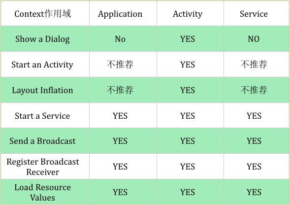

上图中Application和Service所不推荐的两种使用情况：

1.如果我们用ApplicationContext去启动一个LaunchMode为standard的Activity的时候会报错

```xml
javaandroid.util.AndroidRuntimeException: Calling startActivity from outside of an Activity context requires the FLAG_ACTIVITY_NEW_TASK flag. Is this really what you want?
```

这是因为非Activity类型的Context并没有所谓的任务栈，所以待启动的Activity就找不到栈了。解决这个问题的方法就是为待启动的Activity指定FLAG_ACTIVITY_NEW_TASK标记位，这样启动的时候就为它创建一个新的任务栈，而此时Activity是以singleTask模式启动的。所有这种用Application启动Activity的方式不推荐使用，Service的原因跟Application一致。

2.在Application和Service中去layout inflate也是合法的，但是会使用系统默认的主题样式，如果你自定义了某些样式可能不会被使用。所以这种方式也不推荐使用。一句话总结：凡是跟UI相关的，都建议使用Activity做为Context来处理；其他的一些操作，Service,Activity,Application等实例Context都可以，当然了，注意Context引用的持有，防止内存泄漏。

## 8. 内存优化—减少内存使用（Reduce）

如果减少某些不必要内存的使用，也可以达到内存优化的目的。

比如说Bitmap。它在使用时会花掉较多的内存。那我们就可以考虑在应用bitmap时减少某些不必要内存的使用。

* 边界压缩：一张拍出来的图片分辨率可能会很大，如果不做压缩去展示的话，会消耗大量内存，可能造成OOM，通过BitmapFactory.Options去设置inSampleSize，可以对图片进行边界的压缩，减少内存开销。（做法：先设置BitmapFactory.inJustDecodeBounds为true，然后decodeFile，这样将会只去解析图片大小等信息，避免了将原图加载进内存。拿到原图尺寸信息后，根据业务逻辑换算比例，设置inSampleSize，接着设置BitmapFactory.inJustDecodeBounds为false，最后再去decodeFile，从而实现对图片边界大小进行了压缩再展示。）

   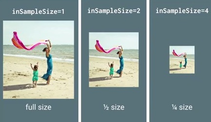

* 色彩压缩：除此之外，还可以通过设置Bitmap图片的Config配置来减少内存使用。配置有以下四种：

  > ALPHA_8（Alpha由8位组成，代表8位Alpha位图）
  >
  > ARGB_4444（由4个4位组成即16位，代表16位ARGB位图）
  >
  > ARGB_8888（由4个8位组成即32位，代表32位ARGB位图，图片质量最佳）
  >
  > RGB_565（R为5位，G为6位，B为5位，共16位，它是没有透明度的）

  如果配置不一样，需要的内存也不同。比如ARGB4444、ARGB8888、RGB565。配置的位数越高，图片质量越佳，当然需要的内存就越多。如果图片不需要透明度，就采用RGB565的配置。通过Bitmap.Config配置，也可以起到压缩图片大小作用。

  在实际中，可以通过以下代码来进行图片转bitmap解码时的Config。

  ```java
          BitmapFactory.Options options = new BitmapFactory.Options();
          options.inPreferredConfig = Bitmap.Config.RGB_565;
          Bitmap bitmap = BitmapFactory.decodeResource(getResources(), R.drawable.ic_menu_add, options);
  ```

* 如果通过在列表中展示缩略图的形式来加载图片，如果需要查看高清图片，另启动一个页面（对话框）来加载高清图片，这样可以避免在列表中加载太多高清图片，减少内存开销。

## 9. 内存优化—回收（Recycle）

一些资源时使用时记得回收，比如说**BraodcastReceiver，ContentObserver，File，Cursor，Stream，Bitmap**、**TypeArray**等资源的代码，应该在使用之后或者Activity销毁时及时关闭或者注销，否则这些资源可能将不会被回收，造成内存泄漏。

## 10. 内存优化—重用（Reuse）

### 10.1 对象池

在程序里面经常会遇到的一个问题是短时间内创建大量的对象，导致内存紧张，从而触发GC导致性能问题。对于这个问题，我们可以使用对象池技术来解决它。通常对象池中的对象可能是bitmaps，views，messages等等。

比如说Message.obtain()方法。通过handler去发消息Message时，通过Message.obtain()来获得一个消息，就比直接通过new一个Message要更好。因为Message中内部就维护了一个对象池用来存放消息，通过obtain方法来取消息的话，会先从内部的对象池中去取，如果取不到，再去新创建一个消息进行使用。

关于对象池的操作原理，请看下面的图示：

 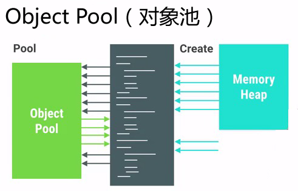

使用对象池技术有很多好处，它可以避免内存抖动，提升性能，但是在使用的时候有一些内容是需要特别注意的。通常情况下，初始化的对象池里面都是空白的，当使用某个对象的时候先去对象池查询是否存在，如果不存在则创建这个对象然后加入对象池。

但是我们也可以在程序刚启动的时候就事先为对象池填充一些即将要使用到的数据，这样可以在需要使用到这些对象的时候提供更快的首次加载速度，这种行为就叫做**预分配**。

使用对象池也有不好的一面，我们需要手动管理这些对象的分配与释放，所以我们需要慎重地使用这项技术，避免发生对象的内存泄漏。为了确保所有的对象能够正确被释放，我们需要保证加入对象池的对象和其他外部对象没有互相引用的关系。

### 10.2 缓存

无论是为了提高CPU的计算速度还是提高数据的访问速度，在绝大多数的场景下，我们都会使用到缓存。

例如缓存到内存里面的图片资源，网络请求返回数据的缓存等等。凡是可能需要反复读取的数据，都建议使用合适的缓存策略。比如图片三级缓存、ListView中的Adapter使用contentView进行复用、使用holder避免重复的findViewById。再比如以下的代码，都是缓存的体现。

```java
        //原代码
        for (int i = 0; i < 1024; i++) {
            if(i<getCount()){
                Log.d("TAG", "some log" + i);
            }
        }

        //有缓存体现的代码，避免重复调用1024次getCount方法
        int count = getCount();
        for (int i = 0; i < 1024; i++) {
            if(i<count){
                Log.d("TAG", "some log" + i);
            }
        }
```

#### 10.2.1 缓存中的lru算法

lru算法（Least Recently Use），即最近最少使用算法，在Android中比较常用。当内存超过限定大小时，凡是近时间内最少使用的那一个对象，就会从缓存容器中被移除掉。

LRU Cache的基础构建用法如下：

```java
        //往缓存中添加图片，PicUrl是图片的地址，将其作为key，bitmap位图则作为value
        bitmapLRUCache.put(picUrl,bitmap);
        //通过picUrl图片地址，从缓存中取bitmap
        bitmapLRUCache.get(picUrl);
```

为了给LRU Cache设置一个比较合理的缓存大小值，我们通常是用下面的方法来做界定的：

```java
        //当前应用最大可用内存
        long maxMemory = Runtime.getRuntime().maxMemory();
        //创建一个LRUCache，设置缓存大小界限为最大可用内存的八分之一
        BitmapLRUCache bitmapLRUCache = new BitmapLRUCache((int)maxMemory / 8);
```

使用LRU Cache时为了能够让Cache知道每个加入的Item的具体大小，我们需要Override下面的方法：

```java
public class BitmapLRUCache extends LruCache<String,Bitmap> {

    public BitmapLRUCache(int maxSize) {
        super(maxSize);
    }

    @Override
    protected int sizeOf(String key, Bitmap value) {
        int byteCount = value.getByteCount();//该bitmap位图所占用的内存字节数
        return byteCount;
    }
}
```

## 11 内存优化—检查（Review）

代码写完了只是个开始。比较规范的编码，都需要Review的。代码检查时的注意点可参考上述内容。

接下来要提到的是UI检查。

### 11.1 查看UI布局是否过度绘制（overdraw）

查看的前提是：移动设备已经开启了**开发者选项**。

在开发者选项中，点击“调试GPU过度绘制”，将弹出对话框，然后选择“显示过度绘制区域”，如下图所示：

 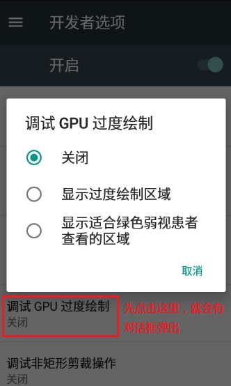

屏幕这时候会变得花花绿绿的. 这些颜色是用来帮助你诊断应用程序的显示行为的。

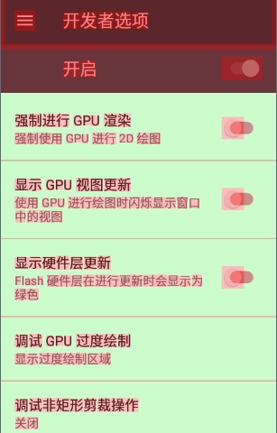

这些颜色用于表示每个像素被重绘的次数, 含义如下：

> 真实颜色: 没有被重绘
>
> 蓝色: 重绘一次
>
> 绿色: 重绘两次
>
> 粉色: 重绘三次
>
> 红色: 重绘四次或更多次 

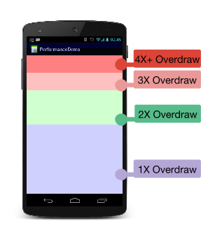

通过这个工具，可以实现这些事情：

- 展示一个APP在何处做了不必要的渲染绘制。


- 帮助你查看在哪里可以减少渲染绘制。

有些重绘是不可避免的. 尽量调整APP的用户界面, 目标是让大部分的屏幕都是真实的颜色以及重绘一次的蓝色。

### 11.2 查看UI布局的渲染速度

查看的前提是：移动设备已经开启了**开发者选项**。

在开发者选项中，点击“GPU呈现模式分析”，将弹出对话框，然后选择“在屏幕上显示为条形图”，如下图所示：

 

这时，将会在屏幕下方出现条形图，如下图所示：

 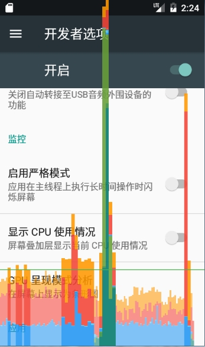

该工具会为每个可见的APP显示一个图表，水平轴即时间流逝, 垂直轴表示每帧经过的时间,单位是毫秒。

在与APP的交互中, 垂直栏会显示在屏幕上, 从左到右移动, 随着时间推移，绘制帧的性能将会迅速体现出来。

绿色的线是用于标记16毫秒的分隔线（PS：人眼的原因, 1秒24帧的动画才能感到顺畅. 所以每帧的时间大概有41ms多一点点(1000ms/24). 但是但是, 注意了, 这41ms不是全都留给你[Java](http://www.07net01.com/tags-Java-0.html)代码, 而是所有java native 屏幕等等的, **最后留给我们用java级别代码发挥的时间, 只有16~17ms**），只要有一帧超过了绿线, 你的APP就会丢失一帧。

### 11.3 查看UI布局的层级和实现方式

有的UI界面写的效率比较低，我们可以通过一些工具来进行UI方面的视图检查。Hierarchy Viewer工具可以展示当前手机界面的View层级。

使用该工具的前提是：只能在模拟器或开发版手机上才能用，普通的商业手机是无法连上的。主要是出于安全考虑，普通商业手机中view server这个服务是没有开启的. Hierarchy Viewer就无法连接到机器获取view层级信息。（PS：如果愿意花功夫捣鼓，也可以在真机上强行开启View Server，详情见[网上资料][http://blog.csdn.net/autumn_xl/article/details/40741835]）

先打开模拟器运行要查看的页面，然后打开Hierarchy Viewer工具，它位于android的sdk所在目录中，具体位置为...\sdk\tools\hierarchyviewer.bat。打开后如图所示：

 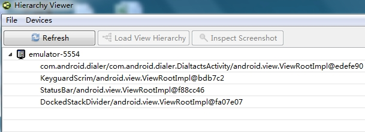

列表展示手机中已打开的页面（包括状态栏等）。这里以电话应用中的DialtactsActivity为例，双击DialtactsActivity，将会打开关于该页面的树状图。如下图所示：

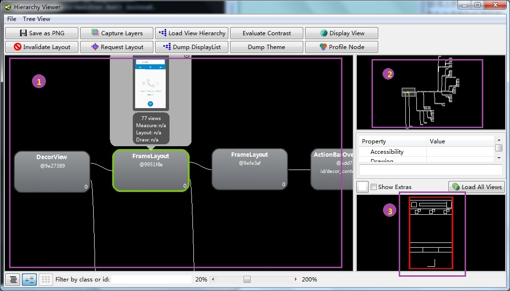

图中标出了3个部分：

- ① Tree View：

  树状图的形式展示该Activity中的View层级结构。可以放大缩小，每个节点代表一个View，点击可以弹出其属性的当前值，并且在LayoutView中会显示其在界面中相应位置。

- ② Tree Overview

  它是Tree View的概览图。有一个选择框， 可以拖动选择查看。选中的部分会在Tree View中显示

- ③ Layout View

  匹配手机屏幕的视图，如果在Tree View中点击了某个节点，呢么这个节点在手机中的真是位置将会在Layout View中以红框的形式被标出。

接下来介绍点击Tree View中某个节点时，它所展示的信息类似于下图：

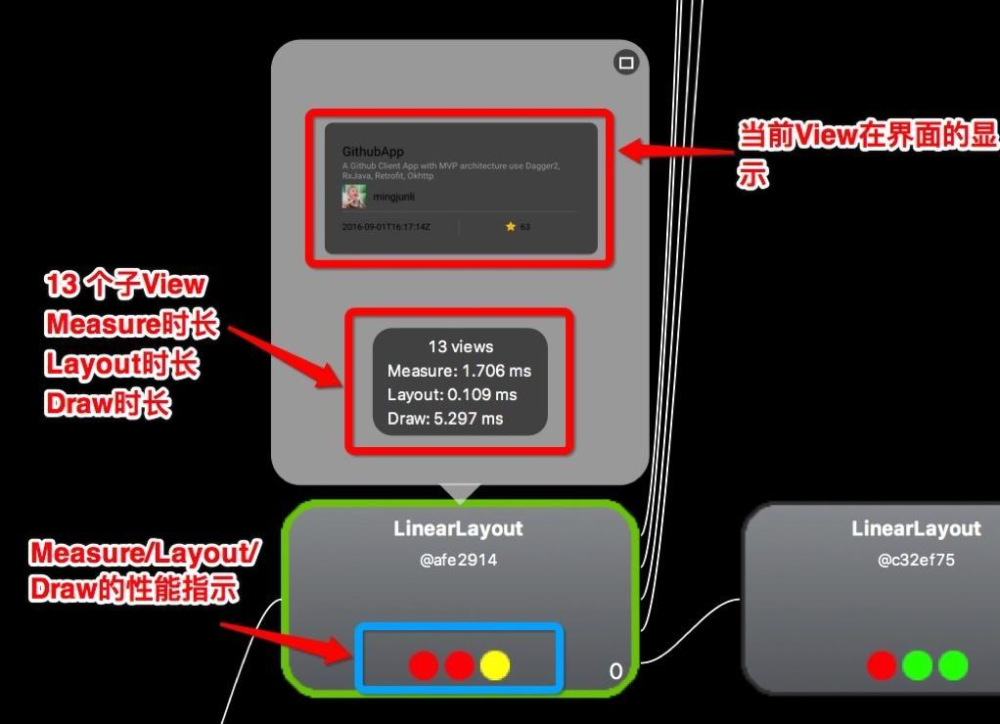

下面的三个圆点，依次表示Measure、Layout、Draw，可以理解为对应View的onMeasure，onLayout，onDraw三个方法的执行速度。

- 绿色：表示该View的此项性能比该View Tree中超过50%的View都要快。
- 黄色：表示该View的此项性能比该View Tree中超过50%的View都要慢。
- 红色：表示该View的此项性能是View Tree中最慢的。

如果界面中的Tree View中红点较多，那就需要注意了。一般的布局可能有以下几点：

1. Measure红点，可能是布局中多次嵌套RelativeLayout，或是嵌套的LinearLayout都使用了weight属性。
2. Layout红点，可能是布局层级太深。
3. Draw红点，可能是自定义View的绘制有问题，复杂计算等。

## 12. UI布局优化

### 12.1 避免过度绘制(Overdraw)

### 12.2 减少布局层级

### 12.3 复用（id、style）

### 12.4 使用include、merge、viewStub标签 

#### 12.4.1 include标签

include标签常用于将布局中的公共部分提取出来供其他layout共用，以实现布局模块化，这在布局编写上提供了大大的便利。

下面以在一个布局main.xml中用include引入另一个布局foot.xml为例。main.mxl代码如下

```xml
<?xml version="1.0" encoding="utf-8"?>
<RelativeLayout xmlns:android="http://schemas.android.com/apk/res/android"
    android:layout_width="match_parent"
    android:layout_height="match_parent" >
    <ListView
        android:id="@+id/simple_list_view"
        android:layout_width="match_parent"
        android:layout_height="match_parent"
        android:layout_marginBottom="@dimen/dp_80" />
    <include layout="@layout/foot.xml" />
</RelativeLayout>
```

 其中include引入的foot.xml为公用的页面底部，foot.xml代码如下

```xml
<?xml version="1.0" encoding="utf-8"?>
<RelativeLayout xmlns:android="http://schemas.android.com/apk/res/android"
    android:layout_width="match_parent"
    android:layout_height="match_parent" >
    <Button
        android:id="@+id/button"
        android:layout_width="match_parent"
        android:layout_height="@dimen/dp_40"
        android:layout_above="@+id/text"/>
    <TextView
        android:id="@+id/text"
        android:layout_width="match_parent"
        android:layout_height="@dimen/dp_40"
        android:layout_alignParentBottom="true"
        android:text="@string/app_name" />
</RelativeLayout>
```

`<include>`标签唯一需要的属性是layout属性，指定需要包含的布局文件。在该标签中，还可以定义android:id和android:layout_*属性来覆盖被引入布局根节点的对应属性值。注意重新定义android:id后，子布局的顶结点i就变化了。

#### 12.4.2 merge标签 

在使用了include后可能导致布局嵌套过多，多余不必要的layout节点，从而导致解析变慢，不必要的节点和嵌套可通过上文中提到的hierarchy viewer来查看。而`merge`标签可以消除那些include时不必要的layout节点。

`merge`标签可用于两种典型情况：

1. 布局顶结点是FrameLayout且不需要设置background或padding等属性，可以用merge代替，因为Activity内容试图的parent view就是个FrameLayout，所以可以用merge消除只剩一个。
2. 某布局作为子布局被其他布局include时，使用merge当作该布局的顶节点，这样在被引入时顶结点会自动被忽略，而将其子节点全部合并到主布局中

以上一节中的`<include>`标签的示例为例，用hierarchy viewer查看main.xml布局如下图：

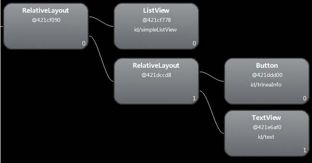

可以发现多了一层没必要的RelativeLayout，将foot.xml中RelativeLayout改为merge，如下：

```xml
<?xml version="1.0" encoding="utf-8"?>
<merge xmlns:android="http://schemas.android.com/apk/res/android"
    android:layout_width="match_parent"
    android:layout_height="match_parent" >
    <Button
        android:id="@+id/button"
        android:layout_width="match_parent"
        android:layout_height="@dimen/dp_40"
        android:layout_above="@+id/text"/>
    <TextView
        android:id="@+id/text"
        android:layout_width="match_parent"
        android:layout_height="@dimen/dp_40"
        android:layout_alignParentBottom="true"
        android:text="@string/app_name" />
</merge>
```

运行后再次用hierarchy viewer查看main.xml布局如下图：

 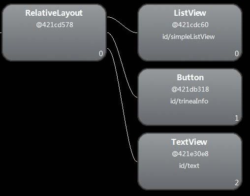

这样就不会有多余的RelativeLayout节点了。

#### 12.4.3 viewStub标签

viewstub标签同include标签一样可以用来引入一个外部布局，不同的是，viewstub引入的布局默认不会扩张，即既不会占用显示也不会占用位置，从而在解析layout时节省cpu和内存。

viewstub常用来引入那些默认不会显示，只在特殊情况下显示的布局，如进度布局、网络失败显示的刷新布局、信息出错出现的提示布局等。

下面以在一个布局main.xml中加入网络错误时的提示页面network_error.xml为例。main.mxl代码如下：

```xml
<?xml version="1.0" encoding="utf-8"?>
<RelativeLayout xmlns:android="http://schemas.android.com/apk/res/android"
    android:layout_width="match_parent"
    android:layout_height="match_parent" >
	……
    <ViewStub
        android:id="@+id/network_error_layout"
        android:layout_width="match_parent"
        android:layout_height="match_parent"
        android:layout="@layout/network_error" />
</RelativeLayout>
```

其中network_error.xml为只有在网络错误时才需要显示的布局，默认不会被解析，示例代码如下：

```xml
<?xml version="1.0" encoding="utf-8"?>
<RelativeLayout xmlns:android="http://schemas.android.com/apk/res/android"
    android:layout_width="match_parent"
    android:layout_height="match_parent" >
    <Button
        android:id="@+id/network_setting"
        android:layout_width="@dimen/dp_160"
        android:layout_height="wrap_content"
        android:layout_centerHorizontal="true"
        android:text="@string/network_setting" />
    <Button
        android:id="@+id/network_refresh"
        android:layout_width="@dimen/dp_160"
        android:layout_height="wrap_content"
        android:layout_below="@+id/network_setting"
        android:layout_centerHorizontal="true"
        android:layout_marginTop="@dimen/dp_10"
        android:text="@string/network_refresh" />
</RelativeLayout>
```

在java中通过(ViewStub)findViewById(id)找到ViewStub，通过stub.inflate()展开ViewStub，然后得到子View，如下

```java
private View networkErrorView;
private void showNetError() {
	// not repeated infalte
	if (networkErrorView != null) {
		networkErrorView.setVisibility(View.VISIBLE);
		return;
	}
	ViewStub stub = (ViewStub)findViewById(R.id.network_error_layout);
	networkErrorView = stub.inflate();
	Button networkSetting = (Button)networkErrorView.findViewById(R.id.network_setting);
	Button refresh = (Button)findViewById(R.id.network_refresh);
}
private void showNormal() {
	if (networkErrorView != null) {
		networkErrorView.setVisibility(View.GONE);
	}
}
```

 在上面showNetError()中展开了ViewStub，同时我们对networkErrorView进行了保存，这样下次不用继续inflate。

上面展开ViewStub部分代码

```java
ViewStub stub = (ViewStub)findViewById(R.id.network_error_layout);
networkErrorView = stub.inflate();
```

也可以写成下面的形式

```java
View viewStub = findViewById(R.id.network_error_layout);
viewStub.setVisibility(View.VISIBLE);   // ViewStub被展开后的布局所替换
networkErrorView =  findViewById(R.id.network_error_layout); // 获取展开后的布局
```

两者效果一致，只是不用显示的转换为ViewStub。通过viewstub的原理我们可以知道将一个view设置为GONE不会被解析，从而提高layout解析速度，而VISIBLE和INVISIBLE这两个可见性属性会被正常解析。

## 使用TCP+Protobuf

使用TCP+Protobuf代替Http+Json

TCP是长连接，Protobuf则是基于二进制的协议，可读性差但是体积小。