## 内存分析工具

### 1.1 heap工具获得hprof文件

heap工具主要是用来检测堆内存的分配情况的。它可以导出一个hprof文件，这个是手机某个时间段的内存镜像，通过分析该文件，就可以得知堆内存的分配情况。heap工具位于Android Device Monitor中（这个Android Device Monitor在Eclipse中即DDMS界面）。

Android Studio中，在你要分析的应用已执行的前提下，通过在Tools→Android→Android Device Monitor中打开。如下图：

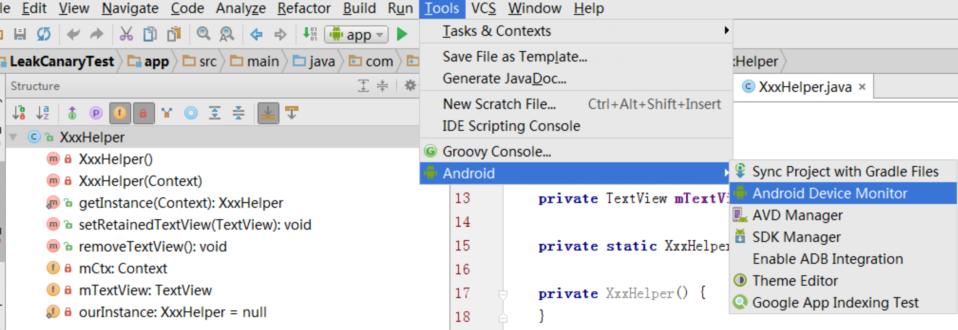

打开后，操作步骤顺序如下：

1. 在Android Device Monitor界面中选择你要分析的应用程序的包名；
2. 点击Update Heap来更新统计信息；
3. 然后点击Cause GC即可查看当前堆的使用情况；
4. 点击Dump HPROF file，准备生成hprof文件。

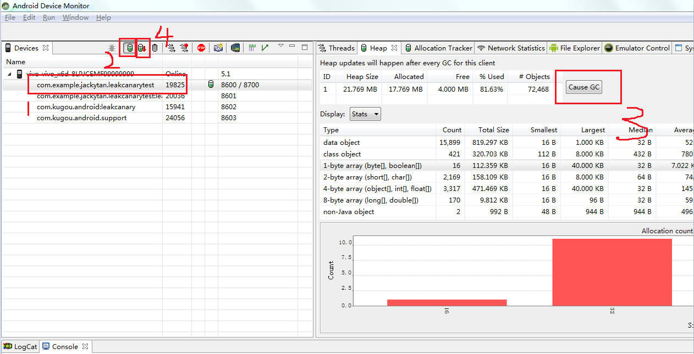

第4步点击后，几秒钟内会出现一个窗口提示你去保存文件，（这个应用当前的内存信息会被保存在这个hprof文件中），将文件保存在顺手的地方（比如说桌面）即可。

### 1.2 分析hprof文件（AS、eclipse插件MAT）

其实leakCanary内部也是通过分析hprof文件来进行内存泄露的判断。

#### 1.2.1 通过Android Studio打开hprof文件

拿到一个hprof文件后，可以直接通过Android Studio来打开。只需将该文件拖放到Android Studio中，就打开了。

打开后选择Package Tree View，内存使用情况就是以包名分类。如下图 ：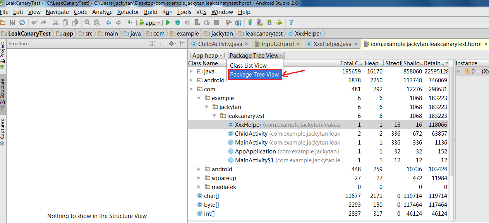

在界面中找到你的应用程序的包名，打开即可看到内存的使用情况。自己写的类一目了然，我们还可以借助右侧的Analyzer Task去做一些分析，比如说分析出存在泄漏的leakActivity，如下图所示：

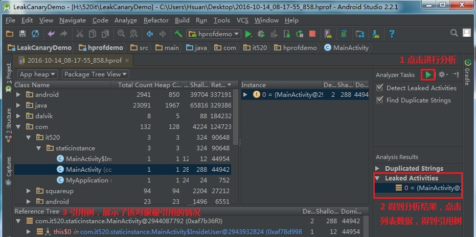

#### 1.2.2 通过MAT打开hprof文件

MAT工具（Memory Analysis Tools）其实是Eclipse时代的产物，它也是用来分析 hprof 文件的，不过LeakCanary可以帮助我们自动分析，而使用MAT需要我们自己去导出并且分析hprof 文件，使用的过程有些麻烦, 当前很多比较有经验的老程序员都知晓这个，如果面试的时候能和他们扯起这个，是一个加分项。

首先在eclipse上安装MAT插件：

1. 去官方网站[http://www.eclipse.org/mat/downloads.php](images/http://www.eclipse.org/mat/downloads.php)，查看最新版本的地址，当前最新地址如下：

   - **Update Site**: [http://download.eclipse.org/mat/1.5/update-site/](images/undefined)
   - **Archived Update Site**: [MemoryAnalyzer-1.5.0.201505271423.zip](images/undefined)

2. 打开eclipse，Help->Install New SoftWare, 输入上面的update site，如图：

   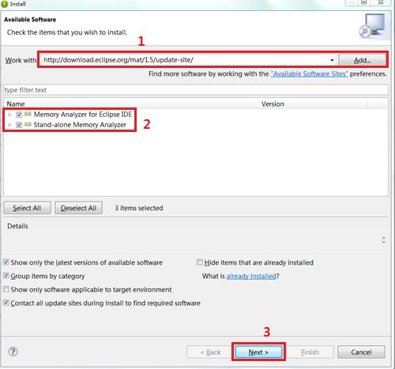


1. 安装完成后提示重启Eclipse，重启后打开window→ open perspective，看到Memory Analysis证明安装成功。

   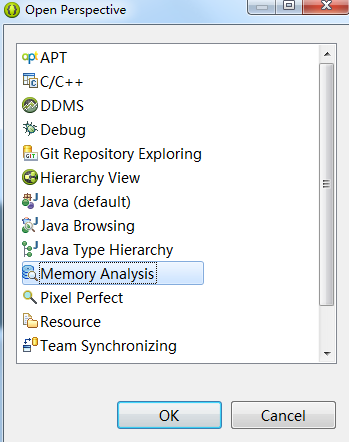


1. 为了节省大家的时间，建议直接下载它的**Stand-alone**版本，免安装。

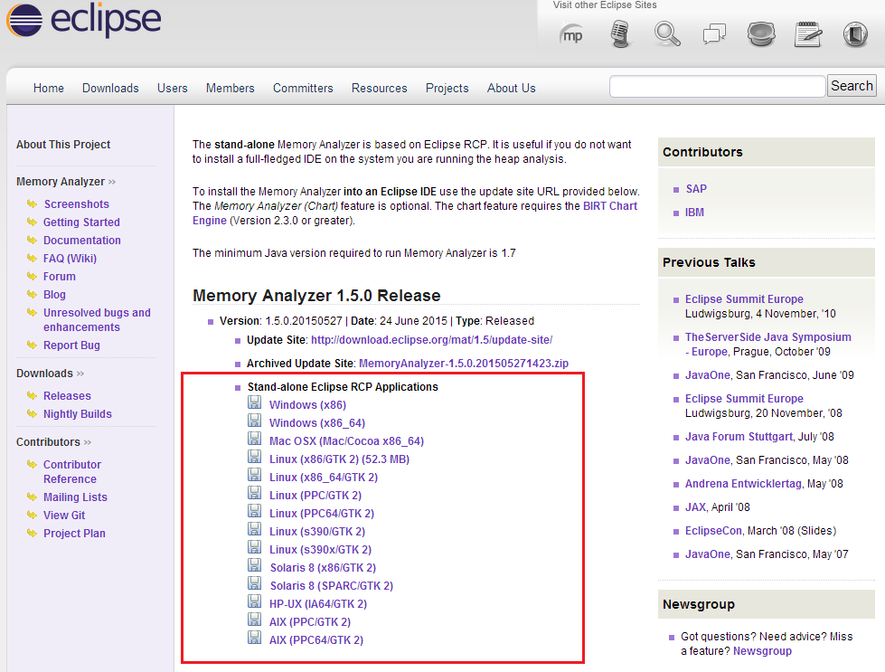

MAT的使用步骤如下：

1. 首先需要Dump出一份hprof文件，可以在android studio或者eclipse导出。方法在上一节已介绍过（heap的介绍中）
2. **直接Dump出的hprof文件要经过转换才能被 MAT识别**，Android SDK提供了这个工具 hprof-conv, 在SDK目录下（sdk/platform-tools）。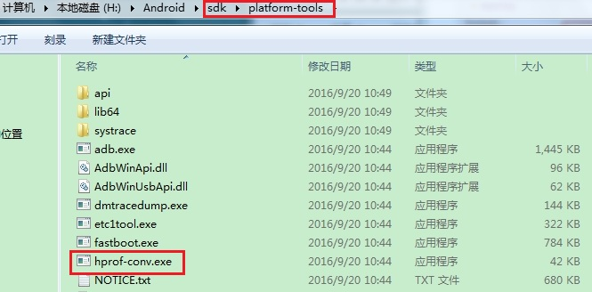该工具需要通过命令行来进行转换。以下为参考转换流程。
   1. 将导出来的hprof文件放到此目录下（sdk/platform-tools），重命令为input.hprof。
   2. 命令行cd 到此目录下，然后输入命令：hprof-conv input.hprof out.hprof（PS：注意空格，前一段的hprof-conv代表要执行hprof-conv工具；中间的input.hprof代表你想对这个叫input.hprof的文件进行转换；最后那段out.hprof代表你转换出来的结果文件名叫做out.hprof）
   3. 执行后，此目录下（sdk/platform-tools）将会出现一个新文件名为：out.hprof，它即是我们的转换后的结果文件。
3. 打开MAT，导入我们的转换后的hprof文件（最好先将out.hprof放到一个独立的文件夹中，因为导入时MAT会在当前文件夹生成很多解析文件出来），导入完成后，先弹出如下start wizard 对话框，默认选第一个“leak suspect report”我们直接点finish。成功打开后如下图所示：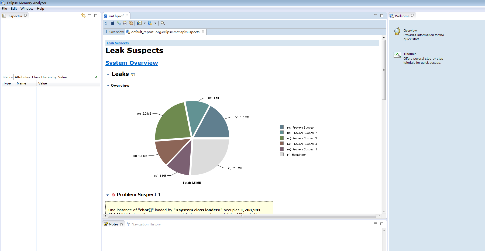
4. 在OverView页项下面，点击 Actions下的 Histogram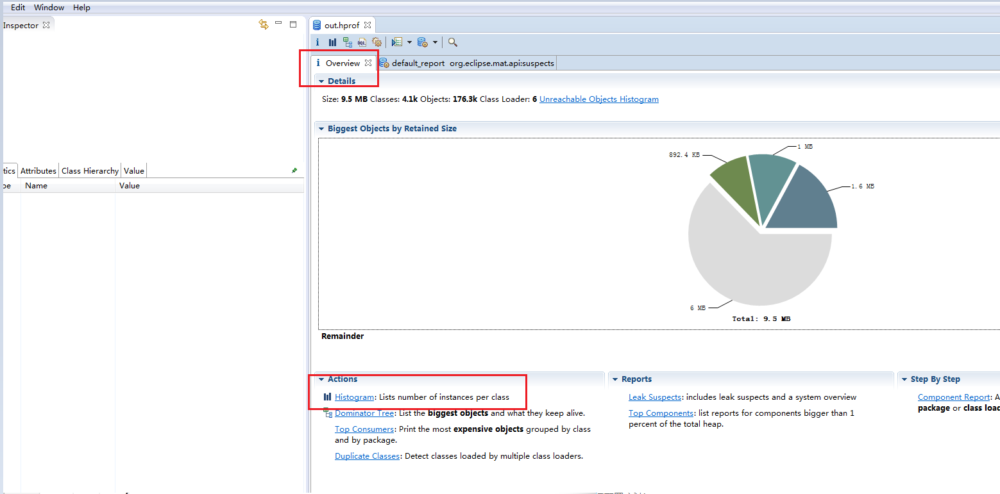
5. 将得到 Histogram结果，它按类名将所有的实例对象列出来。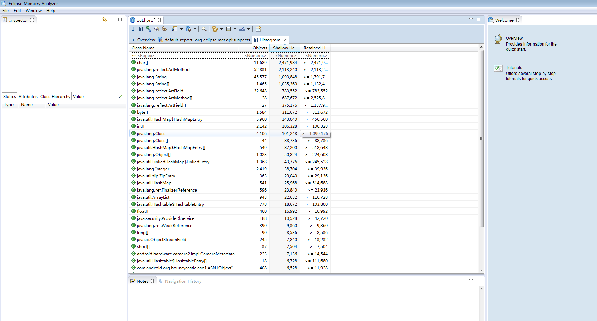
6. 在第一行的正则表达式中输入我们demo里面的类名MainActivity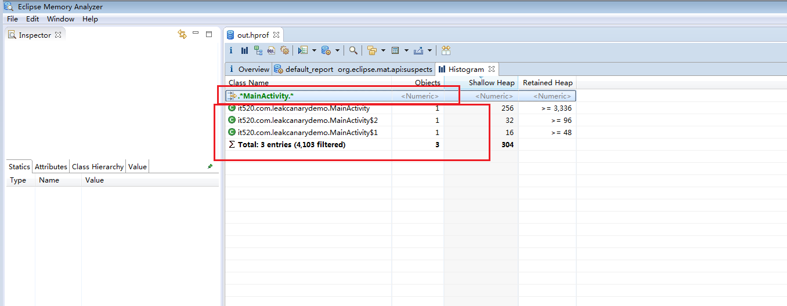
7. 选中匹配出的结果右键打开菜单选择 list objects->with incoming refs。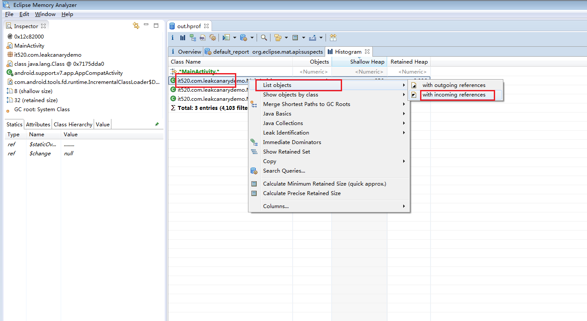
8. 得到该类的实例，以及展开后可以看到它的引用路径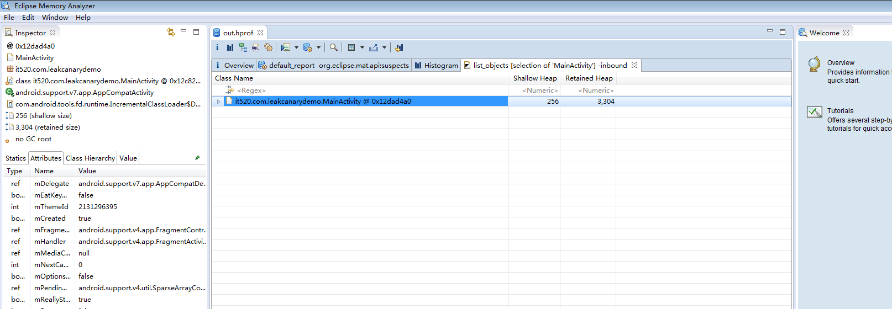 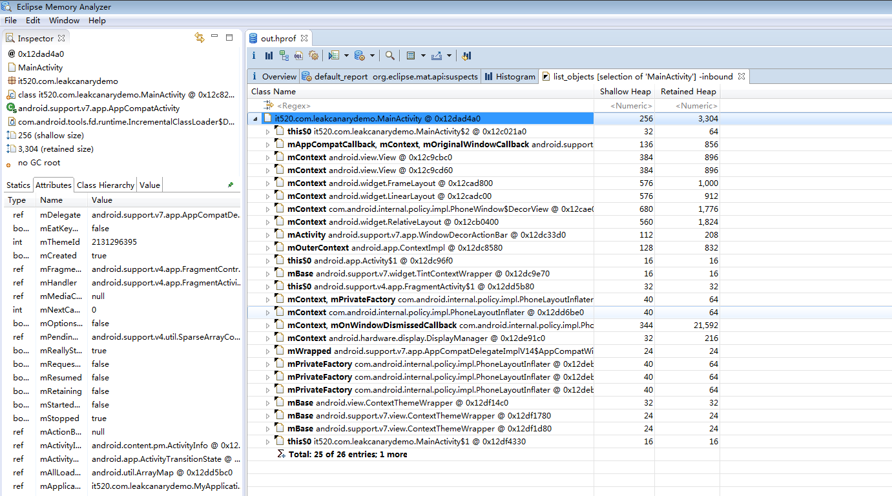
9. 快速找出MainActivity实例没被释放的原因，可以右健 Path to GCRoots-->exclue all phantom/weak/soft etc. reference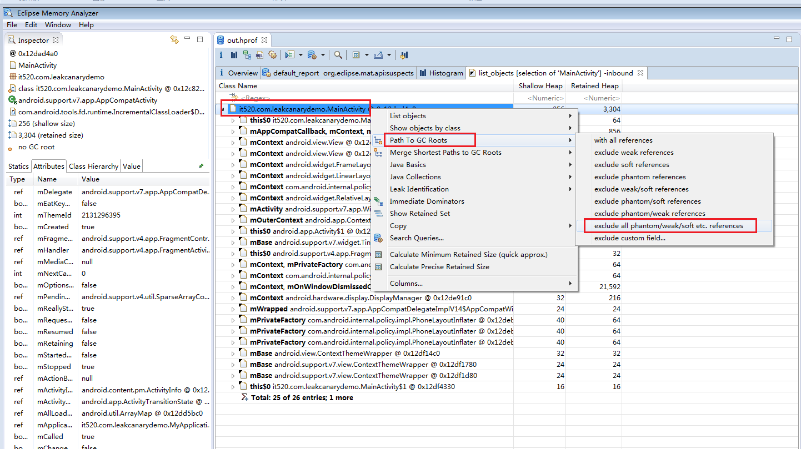
10. 可以看到，MainActivity在AsyncTask中引用，没有被释放。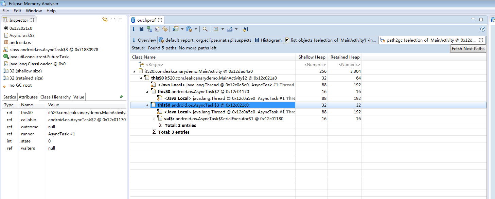

### 1.3 性能分析工具TraceView

TraceView工具可以帮助开发者找到代码的性能瓶颈。方便我们找到一些影响到我们应用性能的代码。比如说某段代码相对其他代码而言，执行时间过长，它就能检测出来，那我们就能对症下药了。

#### 1.3.1 第一种使用方式

该工具和heap工具一样，也位于Android Device Monitor中。使用步骤如下：

1. 打开Android Device Monitor，选中我们的app进程，然后按上面的“Start Method Profiling”按钮，如图。

   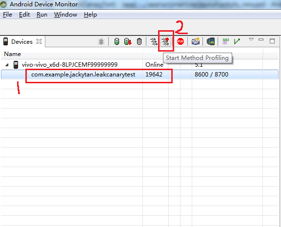

2. 点击带红点的按钮后，小红点变黑色，表示TraceView已经开始工作，然后我们就可以操作我们的APP，点击我们demo的按钮，开始阻塞任务。完成操作后点击我们已经变成黑色的“Start Method Profiling”按钮，停止TraceView，生成此操作的Trace，如图：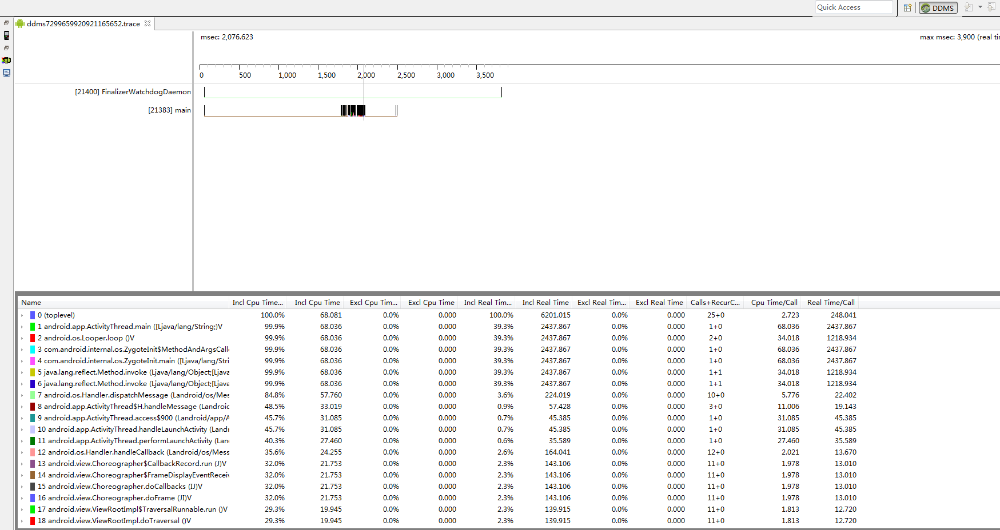（PS：在实际的项目开发中，我们想检测某一个业务功能的性能，一般是先start trace，然后直接触发某个操作，最好是最小范围的操作，接着stop trace。最后拿到这个“最小操作范围”的trace来分析，跟踪我们的代码瓶颈）

#### 1.3.2 第二种使用方式

除了上面针对某操作跟踪之外，我们还可以针对一段代码进行跟踪。

1. 比如当我们怀疑某一段代码的性能时，我们可以直接监听这一段代码。

   ```
   android.os.Debug.startMethodTracing("xmgTest");// 开始监听......（需要被监听的代码段）......（需要被监听的代码段）android.os.Debug.stopMethodTracing();//结束监听

   ```

2. 当代码执行完这一段时，会在sdcard目录下生成一个trace文件（如果按照先前的代码，那么该文件名为：xmgTest.trace）。为了顺利生成，我们需要在我们的程序中添加sd卡的访问权限。

   ```
   <!-- 往Mainfest文件中添加SD卡写入权限和添加删除文件的权限 --><uses-permission android:name="android.permission.WRITE_EXTERNAL_STORAGE"/><uses-permission android:name="android.permission.MOUNT_UNMOUNT_FILESYSTEMS"/>
   ```

3. 在SD卡生成的trace文件如下图：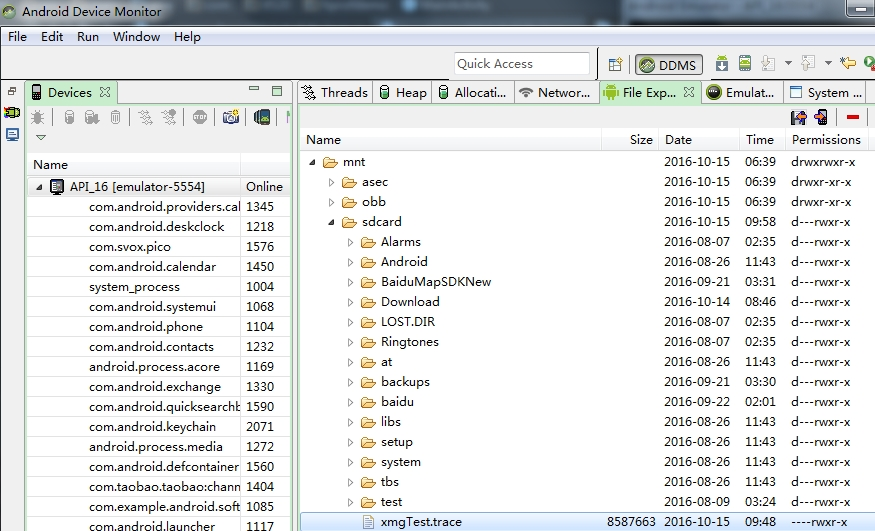

4. 将trace文件导出到电脑上，我们可以在我们的DDMS打开，File->open file , 然后选择我们导出的trace文件。（DDMS会自动使用traceview.bat工具打开，sdk\tools\traceview.bat ） 

   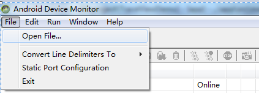

   打开后，结果界面将跟第一种使用方式相同，图略。

#### 1.3.3 分析trace结果

如先前的trace结果图片所示，traceView结果分为上下两半进行展示。

**上面是时间轴面板 (Timeline Panel)**

时间轴面板的左侧显示的是线程信息。时间轴面板的右侧黑色部分是显示执行时间段；白色是线程暂停时间段。时间轴面板的右侧鼠标放在上面会出现时间线纵轴，在顶部会显示当前时间线所执行的具体函数信息。

**下面是分析面板(Profile Panel)** 

分析面板展示的是各个方法函数执行消耗时间性能的统计，点击一个函数，会出现两部分的数据，Parents和Children，分别表示父方法（当前被哪些方法调用）和子方法（当前调用哪些方法）。

下面列出了分析面板（Profile Panel）各参数的含义：

| 列名                      | 描述                                  |
| ----------------------- | ----------------------------------- |
| Name                    | 该线程运行过程中所调用的函数名                     |
| Incl  Cpu Time          | 某函数占用的CPU时间，包含内部调用其它函数的CPU时间        |
| Excl  Cpu Time          | 某函数占用的CPU时间，但不含内部调用其它函数所占用的CPU时间    |
| Incl  Real Time         | 某函数运行的真实时间（以毫秒为单位），内含调用其它函数所占用的真实时间 |
| Excl  Real Time         | 某函数运行的真实时间（以毫秒为单位），不含调用其它函数所占用的真实时间 |
| Call+Recur  Calls/Total | 某函数被调用次数以及递归调用占总调用次数的百分比            |
| Cpu  Time/Call          | 某函数调用CPU时间与调用次数的比。相当于该函数平均执行时间      |
| Real  Time/Call         | 同CPU Time/Call类似，只不过统计单位换成了真实时间     |

通过分析我们每个函数消耗，就能分析出我们的“瓶颈”函数。

#### 1.3.4 traceView举例

例如我们的Demo，里面存在这样的代码：

```java
    @Override
    protected void onCreate(Bundle savedInstanceState) {
        super.onCreate(savedInstanceState);
        setContentView(R.layout.activity_main);
        findViewById(R.id.button).setOnClickListener(new View.OnClickListener() {
            @Override
            public void onClick(View v) {
                startTask();
            }
        });
    }

    private void startTask() {
        // 多次循环打Log
        for (int i=0;i<1000;i++){
            for (int j=0;j<1000;j++){
                String name="xmg"+i*j;
                Log.i("xmg", "my name is: "+name);
            }
        }
    }
```

startBlockTask函数内部有两重的for循环，多次循环打log。我们点击**button**触发事件后，得出这一段代码的TraceView如下图：

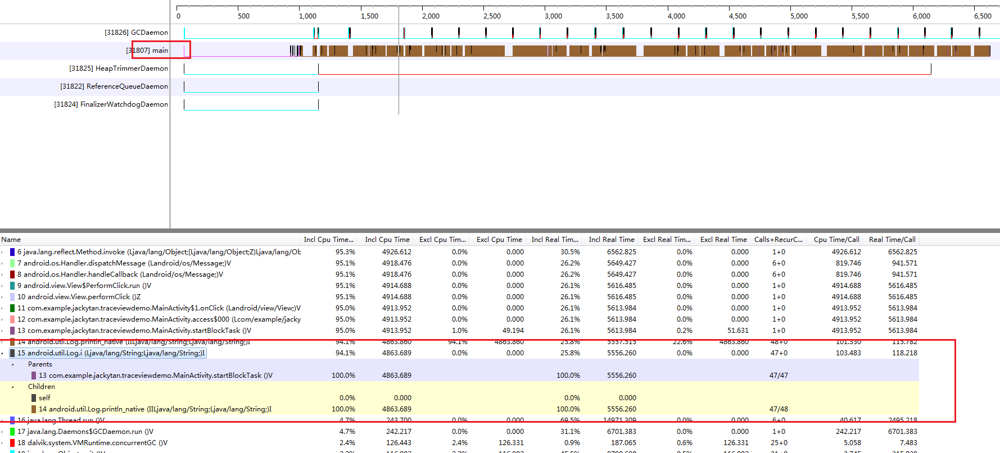

从上图的分析我们可以看出，序号为15的函数消耗了比较多的性能，它是除了UI绘制以外最大的性能消耗“钉子户”，耗时明显远高与其他函数，并且它的调用次数和递归调用次数异常。so，它就是我们的性能“瓶颈”，它的存在使我们的UI变卡，点击展开可以查看它的Parent函数： **startBlockTask**。根据这个，我们可以定位到我们需要优化的函数并做相应的优化。

### 1.4 更智能的性能分析工具leakCanary

不再介绍，详情见内存优化