# **1. TraceView 简介**
Traceview是android平台配备一个很好的性能分析的工具。它可以通过图形化的方式让我们了解我们要跟踪的程序的性能，并且能具体到每个方法的执行时间

Traceview 是Android 平台特有的数据采集和分析工具，它主要用于分析Android 中应用程序的hotspot（瓶颈）。Traceview 本身只是一个数据分析工具，而数据的采集则需要使用Android SDK 中的Debug 类或者利用DDMS 工具

## **1.1 Debug** 

开发者在一些关键代码段开始前调用Android SDK 中Debug 类的startMethodTracing()函数，并在关键代码段结束前调用stopMethodTracing()函数。这两个函数运行过程中将采集运行时间内该应用所有线程（注意，只能是Java线程）的函数执行情况，并将采集数据保存到/mnt/sdcard/下的一个文件中。开发者然后需要利用SDK 中的Traceview工具来分析这些数据

## **1.2 DDMS** 

借助Android SDK 中的DDMS 工具。DDMS 可采集系统中某个正在运行的进程的函数调用信息。对开发者而言，此方法适用于没有目标应用源代码的情况。

观察CPU的执行情况，测试的进程中每个线程运行的时间线，线程中各个方法的调用信息（CPU使用时间、调用次数等）

可以方便的查看线程的执行情况，某个方法执行时间、调用次数、在总体中的占比等，从而定位性能点

一般Traceview可以定位两类性能问题

- 方法调运一次需要耗费很长时间导致卡顿
- 方法调运一次耗时不长，但被频繁调运导致累计时长卡顿

DDMS 工具中Traceview 的使用如下图所示。

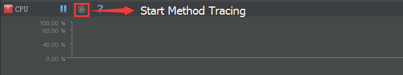


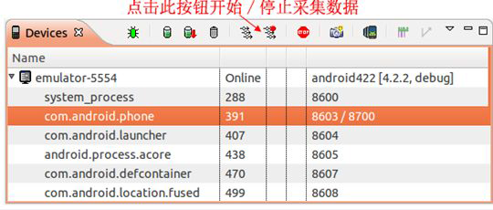

点击上图中所示按钮即可以采集目标进程的数据。当停止采集时，DDMS 会自动触发Traceview 工具来浏览采集数据

# **2. Traceview的作用**
查看跟踪代码的执行时间，分析哪些是耗时操作 ；可以用于跟踪方法的调用，尤其是Android Framework层的方法调用关系

## **2.1 如何使用TraceView**
使用TraceView主要有两种方式：

最简单的方式就是直接打开DDMS，选择一个进程，然后按上面的“Start Method Profiling”按钮，等红色小点变成黑色以后就表示TraceView已经开始工作了。然后我就可以滑动一下列表（现在手机上的操作肯定会很卡，因为Android系统在检测Dalvik虚拟机中每个Java方法的调用，这是我猜测的）。操作最好不要超过5s，因为最好是进行小范围的性能测试。然后再按一下刚才按的按钮，等一会就会出现下面的图片，然后就可以开始分析了。

第2种方式就是使用android.os.Debug.startMethodTracing()和android.os.Debug.stopMethodTracing()方法，当运行了这段代码的时候，就会有一个trace文件在/sdcard目录中生成，也可以调用startMethodTracing(String traceName) 设置trace文件的文件名，最后你可以使用adb pull /sdcard/test.trace /tmp 命令将trace文件复制到你的电脑中，然后用DDMS工具打开就会出现下面那副图片了

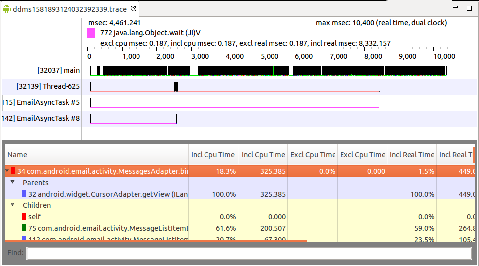

## **2.2 Debug**
### **2.2.1 选择追踪范围加入记录代码**

首先，必须在程序当中加入代码，以便生成trace文件，有了这个trace文件才可以将其转化为图形。 

要添加的代码如下：

```java
Debug.startMethodTracing("wirelessqa")；//开始
Debug.stopMethodTracing()；//结束
```

其中参数wirelessqa是要创建的trace文件的名称，wirelessqa.trace。默认路径是/sdcard/wirelessqa.trace，也可以自己制定/data/log/wirelessqa，表示文件在/data/log/wirelessqa.trace。

### **2.2.2 实例代码参考**

```java
publicclass MainActivity extends Activity {
    @Override
    protectedvoid onCreate(Bundle savedInstanceState) {
        super.onCreate(savedInstanceState);
        setContentView(R.layout.activity_main);
        setTitle(this.getClass().getName());
        View toLoginView = findViewById(R.id.to_login);
        // 开始记录 sdcard/wirelessqa.trace文件
        Debug.startMethodTracing("wirelessqa");
        toLoginView.setOnClickListener(new View.OnClickListener() {
            publicvoid onClick(View view) {
                Intent intent = new Intent(getApplicationContext(), LoginActivity.class);
                startActivity(intent);
            }
        });
    }
    @Override
    protectedvoid onStop() {
        super.onStop();
        Debug.stopMethodTracing();// 结束记录wirelessqa.trace
    }
}
```

**说明：** 

开发文档中说可以在activity的onCreate()中添加Debug.startMethodTracing(), 而在onDestroy()中添加Debug.stopMethodTracing()，但是在实际的测试时发现这种方式其实并不好用，因为通常情况下我们的activity的onDestroy()是由系统决定何时调用的，因此可能等了很长时间都不会得到这个trace文件。

因此决定在onStop()中来调用Debug.stopMethodTracing()。这样当我们切换到其它activity或者点击home键的时候onStop()就会被调用，我们也就可以得到完整的trace file

## **2.3 别忘了加入访问SD卡的权限**

```xml
<uses-permissionandroid:name="android.permission.MOUNT_UNMOUNT_FILESYSTEMS"/>   
<uses-permissionandroid:name="android.permission.WRITE_EXTERNAL_STORAGE"/>  
```
## **2.4 利用tools下的工具trace view打开.trace文件**
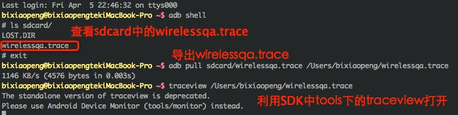

第一种方式相对来说是一种简单，但是测试的范围很宽泛，第二中方式相对来说精确一点，不过我个人喜欢使用第一种，因为简单，而且它是检测你的某一个操作。因为第二中更适合检测某一个方法的性能，其实也没有那种好，看使用的场景和个人的喜好

效果图： 


## **2.5 看懂TraceView中的指标**


下面我们具体分析一下这张图(与上图数据上有点区别)：

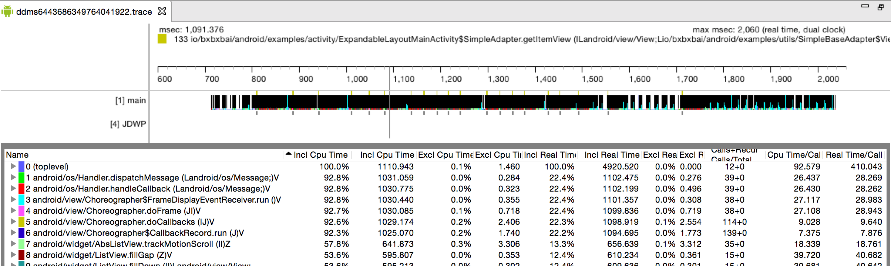

## **2.6 纵轴**
TraceView界面下方表格中纵轴就是每个方法，包括了JDK的，Android SDK的，也有native方法的，当然最重要的就是app中你自己写的方法，有些Android系统的方法执行时间很长，那么有很大的可能就是你app中调用这些方法过多导致的

每个方法前面都有一个数字，可能是全部方法按照Incl CPU Time 时间的排序序号（后面会讲到）

点一个方法后可以看到有两部分，一个是Parents，另一个是Children。
Parent表示调用这个方法的方法，可以叫做父方法，Children表示这个方法中调用的其他方法，可以叫做子方法

## **2.7 横轴**
### **Incl Cpu Time**
某函数占用的CPU 时间，包含内部调用其它函数的CPU 时间

define inclusive ： 全包括的 
上图中可以看到（toplevel） 的Incl Cpu Time 占了100%的时间，这个不是说100%的时间都是它在执行，请看下面代码： 

```java
public void top() { 
	a(); 
	b(); 
	c(); 
	d(); 
} 
```

Incl Cpu Time表示方法top执行的总时间，假如说方法top的执行时间为10ms，方法a执行了1ms，方法b执行了2ms，方法c执行了3ms，方法d执行了4ms（这里是为了举个例子，实际情况中方法a、b、c、d的执行总时间肯定比方法top的执行总时间要小一点）

而且调用方法top的方法的执行时间是100ms，那么：

```
//Incl Cpu Time
top 10% 
a 10% 
b 20% 
c 30% 
d 40% 
```
从上面图中可以看到： 
toplevel的 Incl Cpu Time 是1110.943，而io.bxbxbai.android.examples.activity.ExpandableLayoutMainActivity$SimpleAdapter.getItemView方法的Incl Cpu Time为12.859，说明后者的Incl Cpu Time % 约为1.2%，这个指标表示 这个方法以及这个方法的子方法（比如top方法中的a、b、c、d方法）一共执行的时间

### **Excl Cpu Time**
某函数占用的CPU 时间，但不含内部调用其它函数所占用的CPU 时间

理解了Incl Cpu Time以后就可以很好理解Excl Cpu Time了，还是上面top方法的例子：

方法top 的 Incl Cpu Time 减去 方法a、b、c、d的Incl Cpu Time 的时间就是方法top的Excl Cpu Time 了
### **Incl Real Time**
某函数运行的真实时间（以毫秒为单位），包含调用其它函数所占用的真实时间
### **Excl Real Time**
某函数运行的真实时间（以毫秒为单位），不含调用其它函数所占用的真实时间
### **Calls + Recur Calls / Total**
这个指标非常重要！它表示这个方法执行的次数，这个指标中有两个值，一个Call表示这个方法调用的次数，Recur Call表示递归调用次数，看下图： 


我选中了一个方法，可以看到这个方法的Calls + Recur Calls 值是14 + 0，表示这个方法调用了14次，但是没有递归调用
从Children这一块来看，很多方法调用都是13的倍数，说明父方法中有一个判断，但是这不是重点，有些Child方法调用Calls为26，这说明了这些方法被调用了两遍，是不是可能存在重复调用的情况？这些都是可能可以优化性能的地方。
### **Cpu Time / Call**
cpu time，这个指标应该说是最重要的，从上图可以看到，133这个方法的调用次数为20次，而它的Incl Cpu Time为12.859ms，那么133方法每一次执行的时间是0.643ms（133这个方法是SimpleAdapter的getItemView方法）

对于一个adapter的getView方法来说0.643ms是非常快的（因为这个adapter中只有一个TextView，我为了测试用的）

如果getView方法执行时间很长，那么必然导致列表滑动的时候产生卡顿现象，可以在getView方法的Children方法列表中找到耗时最长的方法，分析出现问题的原因：

- 是因为有过多的计算？
- 还是因为有读取SD卡的操作？
- 还是因为adapter中View太复杂了？
- 还是因为需要有很多判断，设置View的显示还是隐藏
- 还是因为其他原因…

### **Real Time / Call**
同CPU Time/Call 类似，只不过统计单位换成了真实时间

Real Time 和 Cpu Time 我现在还不太明白它们的区别，我的理解应该是:

- Cpu Time 应该是某个方法占用CPU的时间
- Real Time 应该是这个方法的实际运行时间

为什么它们会有区别呢？可能是因为CPU的上下文切换、阻塞、GC等原因方法的实际执行时间要比Cpu Time 要稍微长一点

# **3. 总结**
TraceView是一个非常强大的性能分析工具，因为Android 官网对这个工具的使用介绍文档很少，而且一些中文博客中写的也都是抄来抄去，没有讲到底怎么使用

最近我在做这方面的性能分析，就慢慢琢磨了这么工具的使用，发现非常强大，写下来总结一下

Android的性能分析工具还有很多，比如：

- Eclipse Memory Analyzer Tool 来分析Android app的内存使用
- Dump UI Hierarchy for UI Atomator，分析UI层级
- Systrace：跟TraceView相似，只不过它是对整个系统进行分析
- Lint工具：使用Lint进行资源及冗余UI布局等优化，Lint 有自动修复、提示建议和直接跳转到问题处的功能
- DDMS：Heap，Allocation Tracker

# **4. 其他**

下图这一条工具栏中有很多性能分析工具
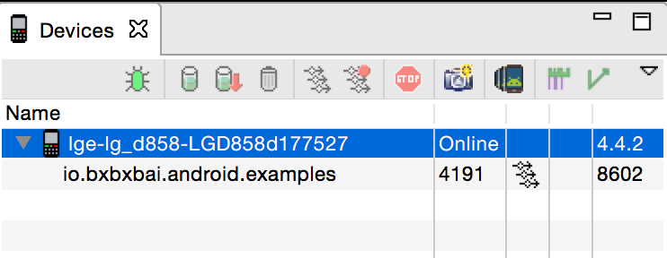

# **5. Traceview 的使用**
下面，我们通过一个示例程序介绍Traceview 的使用。

实例程序如下图所示：界面有4 个按钮，对应四个方法。

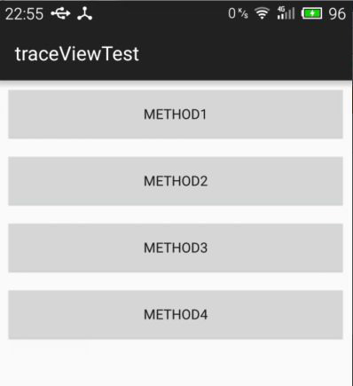

点击不同的方法会进行不同的耗时操作。

```java
public class MainActivity extends ActionBarActivity {
        @Override
        protected void onCreate(Bundle savedInstanceState) {
            super.onCreate(savedInstanceState);
            setContentView(R.layout.activity_main);
        }

        public void method1(View view) {
            int result = jisuan();
            System.out.println(result);
        }

        private int jisuan() {
            for (int i = 0; i < 10000; i++) {
                System.out.println(i);
            }
            return 1;
        }

        public void method2(View view) {
            SystemClock.sleep(2000);
        }

        public void method3(View view) {
            int sum = 0;
            for (int i = 0; i < 1000; i++) {
                sum += i;
            }
            System.out.println("sum=" + sum);
        }

        public void method4(View view) {
            Toast.makeText(this, "" + new Date(), 0).show();
        }
    }
```
我们分别点击按钮一次，要求找出最耗时的方法。点击前通过DDMS 启动Start Method Profiling 按钮

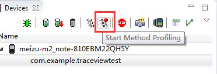

然后依次点击4 个按钮，都执行后再次点击上图中红框中按钮，停止收集数据。

接下来我们开始对数据进行分析。

当我们停止收集数据的时候会出现如下分析图表。该图表分为2 大部分，上面分不同的行，每一行代表一个线程的执行耗时情况。main 线程对应行的的内容非常丰富，而其他线程在这段时间内干得工作则要少得多。图表的下半部分是具体的每个方法执行的时间情况。显示方法执行情况的前提是先选中某个线程。

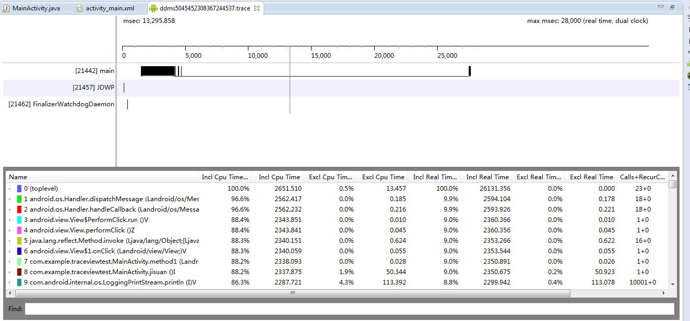

我们主要是分析main 线程。上面方法指标参数所代表的意思如下：

| 列名                     | 描述                                  |
| :--------------------- | :---------------------------------- |
| Name                   | 该线程运行过程中所调用的函数名                     |
| Incl Cpu Time          | 某函数占用的CPU 时间，包含内部调用其它函数的CPU 时间      |
| Excl Cpu Time          | 某函数占用的CPU 时间，但不含内部调用其它函数所占用的CPU 时间  |
| Incl Real Time         | 某函数运行的真实时间（以毫秒为单位），包含调用其它函数所占用的真实时间 |
| Excl Real Time         | 某函数运行的真实时间（以毫秒为单位），不含调用其它函数所占用的真实时间 |
| Call+Recur Calls/Total | 某函数被调用次数以及递归调用占总调用次数的百分比            |
| Cpu Time/Call          | 某函数调用CPU 时间与调用次数的比。相当于该函数平均执行时间     |
| Real Time/Call         | 同CPU Time/Call 类似，只不过统计单位换成了真实时间    |

我们为了找到最耗时的操作，那么可以通过点击Incl Cpu Time，让其按照时间的倒序排列。我点击后效果如下图：

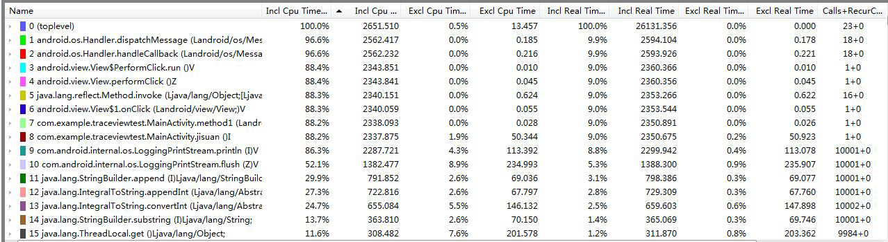

通过分析发现：method1 最耗时，耗时2338 毫秒。

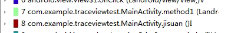

那么有了上面的信息我们可以进入我们的method1 方法查看分析我们的代码了

## **5.1 生成.trace文件**
android.os.Debug类，其中重要的两个方法

```java
Debug.startMethodTracing();
Debug.stopMethodTracing();
```
这两个方法用来创建.trace文件，将从Debug.startMethodTracing()开始，到Debug.stopMethodTracing()结束，期间所有的调用过程保存在.trace文件中，包括调用的函数名称和执行的时间等信息。


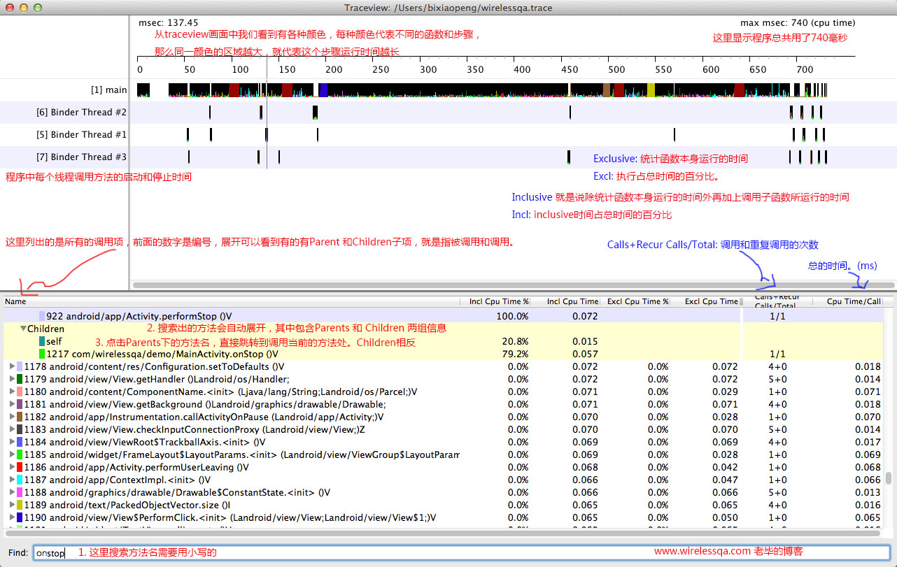

# **6. dmtracedump** 

```
dmtracedump -g result.png target.trace  //结果png文件  目标trace文件
```
参考：

- https://bxbxbai.github.io/2014/10/25/use-trace-view/ 
- http://blog.csdn.net/wirelessqa/article/details/8764622
