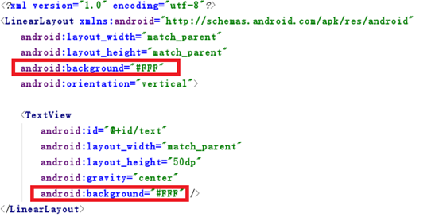
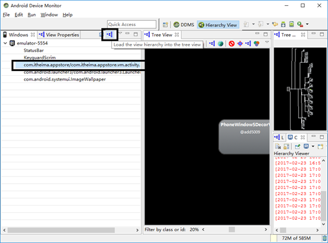
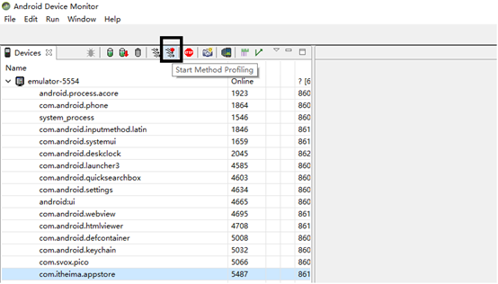

# 消除卡顿

- 什么是卡顿及卡顿的衡量标准
- 产生卡顿的原因
- 通用优化流程
- 定位卡顿原因

## 什么是卡顿

卡顿是人的一种视觉感受，比如我们滑动界面时，如果滑动不流程我们就会有卡顿的感觉，这种感觉我们需要有一个量化指标，在编程时如果开发的程序超过了这个指标我们认为其是卡顿的。

 FPS（帧率）：每秒显示帧数（Frames per Second）。表示图形处理器每秒钟能够更新的次数。高的帧率可以得到更流畅、更逼真的动画。一般来说12fps大概类似手动快速翻动书籍的帧率，这明显是可以感知到不够顺滑的。30fps就是可以接受的，但是无法顺畅表现绚丽的画面内容。提升至60fps则可以明显提升交互感和逼真感，但是一般来说超过75fps就不容易察觉到有明显的流畅度提升了，如果是VR设备需要高于75fps，才可能消除眩晕的感觉。

开发app的性能目标就是保持60fps，这意味着每一帧你只有16ms≈1000/60的时间来处理所有的任务。Android系统每隔16ms发出VSYNC信号，触发对UI进行渲染，如果每次渲染都成功，这样就能够达到流畅的画面所需要的60fps。

                      

如果你的某个操作花费时间是24ms，系统在得到VSYNC信号的时候就无法进行正常渲染，这样就发生了丢帧现象。那么用户在32ms内看到的会是同一帧画面。


如果此时用户在看动画的执行或者滚动屏幕（如RecyclerView），就会感觉到界面不流畅了（卡了一下）。丢帧导致卡顿产生。

流畅的情况下：


出现了丢帧现象（卡顿）


严重丢帧（卡死了）


给我们一种感觉，如果帧率越低，卡顿就越严重，那么是不是就可以使用帧率来衡量卡顿那？

## 如何衡量卡顿

FPS的高低不能准确的反映应用的流程度。如下图所示，只有有更新的时候才刷新界面。


当界面没有变动的时候，手机不需要对界面进行更新，所以此时的FPS会很低，如果1秒钟内都没有变动那么FPS=0。所以我们需要利用其他方式来衡量应用的流程度，比如可以利用丢帧数来衡量。

单位时间内丢帧数可以反映出应用是否流程。不丢帧是终极目标，但每秒丢帧在6-7帧左右可以接受，如果丢10帧以上就需要优化了。

| 丢帧情况（单位时间内均匀分布） | 卡顿情况 |
| :-------------- | :--- |
| 0-10帧           | 流畅   |
| 10-20帧          | 较卡   |
| 20-40帧          | 很卡   |
| 40-60帧          | 卡死了  |

对于我们开发人员来说，会使用一些工具找出卡顿比较集中的地方，找出原因，消除或减弱卡顿。（测试团队会有专门的工具去测试丢帧的情况）

## 卡顿产生的原因

核心：分析在16ms中我们的应用做了什么工作，那些工作阻止我们在16ms时更新界面。

通常情况下，在16ms中我们有那些工作需要处理。

单以XML布局被绘制出来为例进行说明。

处理过程：

1. CPU负责把UI组件计算成多边形和纹理

2. OpenGL负责绘制图像（Display List）

3. GPU栅格化需要显示内容并渲染到屏幕上

而实际开发中我们还加入交互、业务处理等工作，这些工作都需要在16ms中处理完成。对于开发人员来说，需要有一个工具，很直观的帮助我们判断出那些工作占用了多少时间。

### Profile GPU Rendering

通过手机开发者选项中提供的Profile GPU Rendering（GPU呈现模式分析）功能，我们可以清楚的看到处理流程中各部分的耗时。手机端工具（开发助手àGPU渲染图）。建议大家在Android6.0及以上手机测试。

打开Profile GPU Rendering操作截图如下：

		  

大家可以拿着真机配置一下。看看有什么变化。

	

条形图说明

1. 水平方向的一根绿线代表16ms。

2. 每条都代表一帧画面所有工作内容

3. 每条中不同的颜色代表不同的工作内容


Android6.0及以上的手机颜色对应关系如下：


[原因分析](https://developer.android.google.cn/topic/performance/rendering/profile-gpu.html##visrep)

## 通用优化流程

### 第一步：UI层优化

1. UI问题比较容易查找

2. 一旦出现问题影响范围广（xml、mesure、layout、draw、Display List 、栅格化……）

工具：设备过渡绘制查看功能、HierarchyViewer等

常见问题：过渡绘制、布局复杂、层级过深……

#### 过渡绘制

在屏幕一个像素上绘制多次（超过两次）。如：文本框，如果设置了背景颜色（黑色），那么显示的文字（白色）就需要在背景之上再次绘制。

打开手机开发者中的过渡绘制区域即可查看。蓝色标识这个区域绘制了两次。


说明：

1. 如果大面积都是蓝色，属于正常情况。

2. 重点关注大面积绿色及以后的，表示存在过渡绘制。


设备中的该选项只能直观的让我们感受到应用的界面是否存在过渡绘制，如果存在，我们需要利用Hierarchy Viewer查找布局中不合理的地方。

#### 过渡绘制小案例

效果图如下


大面积存在过渡绘制，文字区域最严重。查询Item布局文件找出过渡绘制的原因



#### 自定义控件绘制优化

Clip Rect 与 Quick Reject

Clip Rect：识别可见区域

Quick Reject：控件所在的矩形区域是否有交集

在Canvas中有上述两个方法，帮助我们进行判断，避免出现过渡绘制。

我们可以通过[canvas.clipRect()](http://developer.android.com/reference/android/graphics/Canvas.html)来帮助系统识别那些可见的区域，在这个区域之外的我们不在进行绘制。如侧拉菜单，当菜单显示的时候被菜单遮挡的部分是不用进行绘制的，一旦绘制就会出现过渡绘制现象。系统的控件会控制过渡绘制，但我们自己的控件就需要自行管理了。所以在使用侧拉菜单时就需要优先考虑系统提供的了。

 

如果系统没有提供的，我们自己编写时也需要注意，避免出现过渡绘制。

#### 自定义控件过渡绘制

案例效果


需要资源：img

编写自定义控件MyVIew，在布局中引入该控件

```xml
<com.itheima.overdrawdemo.MyView
    android:layout_width="match_parent"
    android:layout_height="match_parent"
    android:background="@android:color/transparent">
</com.itheima.overdrawdemo.MyView>
```

图片资源数组

```java
private int[] ids = new int[]{R.drawable.img1, R.drawable.img2, R.drawable.img3, R.drawable.img4, R.drawable.img5, R.drawable.img6};
```

初始化时加载图片资源，同时对一会需要使用到的画笔做初始化

```java
private void init() {
    for (int i = 0; i < 6; i++) {
        imgs[i] = BitmapFactory.decodeResource(getResources(), ids[i]);
    }

    paint=new Paint();
    paint.setAntiAlias(true);
}
```

先将图片摆放好

```java
for (int i = 0; i < imgs.length; i++) {
    canvas.drawBitmap(imgs[i],i*20,0,paint);
}
```

通过过渡绘制的开启，观察结果


原因比较简单，对于“大王”这张牌来说，我们不需要绘制完整的图片，如果都绘制了就会出现上面的情况

处理思路：找出牌需要绘制的区域，让canvas在绘制这张牌时仅仅按区域绘制一部分即可。对于“大王”这张牌来说我们仅仅绘制如下内容


重点来了，我们该如何划定这个区域？
在Canvas中clipRect方法可以帮助我们划定一个区域，进行绘制。

方法参数说明：

clipRect(int left, int top, int right, int bottom)
canvas.clipRect(0, 0, 20, imgs[i].getHeight());
设置完成后，我们来绘制大王这张牌。
canvas.drawBitmap(imgs[0],0,0,paint);

再增加循环，快速绘制所有的牌。

```java
for (int i = 0; i < imgs.length; i++) {
    canvas.clipRect(i * 20, 0, (i + 1) * 20, imgs[i].getHeight());
    canvas.drawBitmap(imgs[i],i*20,0,paint);
}
```

大家会发现绘制完成的结果不是我们想要的。

我们需要借助save和restore来完成裁剪的操作。
save：用来保存Canvas的状态。save之后，可以调用Canvas的平移、放缩、旋转、错切、裁剪等操作。
restore：用来恢复Canvas之前保存的状态。防止save后对Canvas执行的操作对后续的绘制有影响。
save和restore要配对使用(restore可以比save少，但不能多)，如果restore调用次数比save多，会引发Error。save和restore之间，往往夹杂的是对Canvas的特殊操作

代码修改如下

```java
for (int i = 0; i < imgs.length; i++) {
    canvas.save();
    canvas.clipRect(i * 20, 0, (i + 1) * 20, imgs[i].getHeight());
    canvas.drawBitmap(imgs[i],i*20,0,paint);
    canvas.restore();
}
```

效果如下


剩下最后一个工作，把最上面的牌绘制完整

```java
for (int i = 0; i < imgs.length; i++) {
    canvas.save();
    if(i<imgs.length-1) {
        canvas.clipRect(i * 20, 0, (i + 1) * 20, imgs[i].getHeight());
    }else if(i==imgs.length-1){
        canvas.clipRect(i * 20, 0, i * 20+imgs[i].getWidth(), imgs[i].getHeight());
    }
    canvas.drawBitmap(imgs[i],i*20,0,paint);
    canvas.restore();
}
```

#### Hierarchy Viewer(层级查看器)工具使用

Hierarchy Viewer可以很直接的呈现布局的层次关系，视图组件的各种属性。我们可以通过红，黄，绿三种不同的颜色来区分布局的Measure，Layout，Executive的相对性能表现如何。

打开工具


选择需要查看的内容



查看各个节点Measure，Layout，Executive


三个小圆点, 依次表示Measure, Layout,Draw, 可以理解为对应View的onMeasure, onLayout, onDraw三个方法.

绿色, 表示该View的此项性能比该View Tree中超过50%的View都要快.

黄色, 表示该View的此项性能比该View Tree中超过50%的View都要慢.

红色, 表示该View的此项性能是View Tree中最慢的.

一般来说:

1．  Measure红点, 可能是布局中嵌套RelativeLayout, 或是嵌套LinearLayout都使用了weight属性.

2．  Layout红点, 可能是布局层级太深.

3．  Draw红点, 可能是自定义View的绘制有问题, 复杂计算等.

我们之前的小案例，可以进行层级优化。

#### 常规做法

1. 没有用的父布局——没有背景绘制或没有大小限制的父布局，不会对界面效果产生任何影响。特别是<include/>进来的布局，很容易产生问题。可以通过<merge/>标签替代。

2. 在布局层次一样的情况下，建议使用LinearLayout代替RelativeLayout。

3. 使用LinearLayout导致的层次变深，可以使用RelativeLayout进行替换。同样的界面我们可以使用不同的方式去实现，选择一个层级最少的方案。

4. 不常用的UI被设置成了GONE，尝试使用<ViewStub/>代替。

5. 去掉多余的背景颜色，减少过渡绘制，对于有多层背景色的布局来说，留最上面的一层即可。谨慎使用alpha，如果后渲染的元素有设置alpha值，那么这个元素就会和屏幕上已经渲染好的元素做blend处理，这样会导致不少性能问题，特别是出现在列表的Item中。

6. 对于使用Selector当背景的布局，可以将normal状态的color设置为透明。

7. 我们不能因为提高性能而忽略了界面需要达到的效果（平衡Design与Performance）。


### 第二步：代码问题查找

工具：Lint

常见问题：我们重点关注Performance和Xml中的一些建议

- 在绘制时实例化对象（onDraw）

- 手机不能进入休眠状态（Wake lock）

- 资源忘记回收

- Handler使用不当倒置内存泄漏

- 没有使用SparseArray代替HashMap

- 未被使用的资源

- 布局中无用的参数

- 可优化布局（如：ImageView与TextView的组合是否可以使用TextView独立完成）

- 效率低下的 无用的命名空间等


#### Lint工具使用

Android Studio中开启Lint工具

选中需要分析的Module，点击工具栏中Analyze中的Inspect Code选项。


选择需要分析的Module或整个项目


我们可以逐一阅读一下，但是重点关注性能问题，xml中的一些问题也尽可能进行修复。


#### 问题处理

##### 1. 案例中性能问题处理


其他的一些性能问题


建议使用concate方法进行连接字符串，会比append的方式性能好。

##### 2. 案例中xml提到的内容如下


其他问题：

无效的命名空间


无效的布局参数

比如在线性布局中的控件使用到了相对布局中的属性，运行时需要处理，影响代码的执行效率。

##### 3. 案例中关于定义声明变量的警告


#### 意见或建议

1. 不断关注Lint中提到的问题，将公司中命名规范中没有提到的内容逐一补全。

2. Lint不是万能的。

### 第三步：优化App的逻辑层

工具：Traceview

常见问题：主线程耗时大的函数、滑动过程中的CPU工作问题，工具可以提供每个函数的耗时和调用次数，我们重点关注两种类型的函数：

1. 主线程里占用CUP时间很长的函数，特别关注IO操作（文件IO、网络IO、数据库操作等）

2. 主线程调用次数多的函数


#### 使用Traceview找出卡住主线程的地方

Traceview工具使用

通过Android Studio打开里面的Android Device Monitor，切换到DDMS窗口，点击左边栏上面想要跟踪的进程，再点击上面的Start Method Profiling的按钮，如下图所示：



启动跟踪之后，再操控app，做一些你想要跟踪的事件，例如滑动RecyclerView，点击某些视图进入另外一个页面等等。操作完之后，回到Android Device Monitor，再次点击相同的按钮停止跟踪。此时工具会为刚才的操作生成TraceView的详细视图。


重点关注Incl Cpu Time、Call+Recur Calls/Total、Real Time/Call

通过降序排序，我们可以分别找到这两列中数值比较大的内容。

指标说明:

| 指标                           | 说明                                 |
| :--------------------------- | :--------------------------------- |
| Incl(Inclusive) Cpu Time     | 方法本身和其调用的所有子方法占用CPU时间              |
| Excl(Exclusive) Cpu Time     | 方法本身占用CPU时间                        |
| Incl Real Time               | 方法(包含子方法)开始到结束用时                   |
| Excl Real Time               | 方法本身开始到结束用时                        |
| Call + Recursion Calls/Total | 方法被调用次数 + 方法被递归调用次数                |
| Cpu Time/Call                | 方法调用一次占用CPU时间. 方法实际执行时间(不包括io等待时间) |
| Real Time/Call               | 方法调用一次实际执行时间. 方法开始结束时间差(包括等待时间)    |

小案例：

我们可以在ViewHolder的设置数据中做点手脚，比如睡几毫秒（8ms），通过监控滚动，我们是否可以定位到问题代码。

#### 好的做法

1. 不要阻塞UI线程，占用CUP较多的工作尽可能放在子线程中执行。

2. 需要结合使用场景选择不同的线程处理方案

AsyncTask:为UI线程与工作线程之间进行快速的切换提供一种简单便捷的机制。适用于当下立即需要启动，但是异步执行的生命周期短暂的使用场景。

HandlerThread: 为某些回调方法或者等待某些任务的执行设置一个专属的线程，并提供线程任务的调度机制。

ThreadPool: 把任务分解成不同的单元，分发到各个不同的线程上，进行同时并发处理。

IntentService: 适合于执行由UI触发的后台Service任务，并可以把后台任务执行的情况通过一定的机制反馈给UI。

3. 如果大量操作数据库数据时建议使用批处理操作。如：批量添加数据。

## 综合案例

应用启动性能优化。

使用NoHttp获取应用列表

问题表现：通常从用户点击到应用完全展示完首页，需要用户等待一段时间。我们如何缩短时间并提高用户体验。

分析：应用在启动的过程中我们的代码能够影响启动速度的地方如下

- Application的onCreate
- 首屏Activity的渲染

步骤：

1. 利用Traceview工具观察启动过程方法耗时情况，重点关注onCreate方法（自定义Application和首页Activity）。问题：Traceview工具如何在应用启动时监控数据？

2. 分析自定义Application耗时操作，判断onCreate方法中的内容（如：第三方的工具是否可以不占用主线程进行初始化）。

3. 查看界面是否存在过渡绘制。

4. 利用Hierarchy Viewer工具查看界面需要优化的点。

5. 启动过程中的白屏优化。


### 第一步：观察耗时情况

1.      在onCreate开始和结尾打上trace

```java
Debug.startMethodTracing("POApp");
Debug.stopMethodTracing();
```

运行程序, 会在sdcard上生成一个"POApp.trace"的文件.

注意: 

需要给程序加上写存储的权限:

```xml
<uses-permission android:name="android.permission.WRITE_EXTERNAL_STORAGE"/>
```
Android6.0以后的模拟器需要为应用打开读写权限


2. 通过adb pull将其导出到本地

```
adb pull /sdcard/ POApp.trace 存放文件路径
```

### 第二步：分析数据

通过DDMS的FileàOpen File


查询结果如下


说明：我们使用Real Time/Call进行排序可以得到上图内容

大家可以发现在Application中阻塞主线程干的工作都是NoHttp的初始化工作。为了提高应用的启动速度，我们可以将这个工作放到子线程中完成，通常我们会使用IntentService来处理这个工作。

代码如下：

```java
/**
 * Created by itheima.
 */

public class MyApplication extends Application {
    @Override
    public void onCreate() {

        // 如果没有办法手动操作监控，可以使用如下代码重点关注我们感兴趣的方法
        // 监控的结果会生成文件存储SDCard上
//        Debug.startMethodTracing("AppStartupDemo");// 文件的名称
        super.onCreate();

        InitService.start(this);

        SystemClock.sleep(1000);

//        Debug.stopMethodTracing();
    }
}
```

```java
/**
 * 将MyApplication中onCreate方法内容耗时的初始化工作移动到该类中
 */

public class InitService extends IntentService {

    // 问题：由于将NoHttp的初始化工作移动到了子线程，当主线程使用NoHttp发现没有初始化完成，报异常了。

    // 方案一：使用boolean值进行初始化工作的标记，如果完成boolean为true，可以在使用该工具的地方每隔一个时间段判断一下。
    // 方案二：当初始化工作完成后，发出一个通知，如果有观察者，则进行后续工作的处理

    public static boolean isInit=false;// 标记是否初始化完成

    public InitService() {
        super("init");
    }

    @Override
    protected void onHandleIntent(@Nullable Intent intent) {
        // 耗时操作

        Logger.setTag("NoHttp");
        Logger.setDebug(true);

        NoHttp.initialize(this, new NoHttp.Config()
                .setConnectTimeout(30 * 1000)
                .setReadTimeout(30 * 1000)
        );

        isInit=true;
    }

    /**
     * 启动service
     * @param myApplication
     */
    public static void start(MyApplication myApplication) {
        Intent intent = new Intent(myApplication, InitService.class);
        myApplication.startService(intent);
    }
}
```

修改完成后，会引发一个问题，及在首页访问网络时，由于NoHttp的初始化还没有完成会报出如下异常：


如果我们在首页就需要立即访问网络，就需要对初始化进行监控，可以简单的使用一个boolean值，进行判断，当初始化完成后boolean值修改为true。我们在MainActivity中可以使用Handler间隔一段时间就检查一下boolean即可。

### 第三步：过渡绘制

进入首页后，应用的启动速度限制就集中在首页的界面渲染上了。因此我们开始对界面进行优化处理。

过渡绘制查看结果。

 

表现还好，我们可以检查一下Item，看看是否可以优化掉一次绘制。


### 第四步：优化界面布局

Hierarchy Viewer工具派上用场了，我们可以检查一下布局是否合理。


重点观察其中一个条目


优化完成后的结构图

我们先优化掉两个用处不大的LinearLayout,然后在考虑是否可以继续优化掉条目中的LinearLayout。


### 第五步：Launch screens设置

两种处理方案：

方案一：设置一个背景图

```xml
<item name="android:windowBackground">@drawable/splash</item>
<item name="android:windowNoTitle">true</item>
```

注意：当界面加载完成后需要将背景改成白色。


方案二：设置成透明的界面，制造延时启动效果

```xml
<item name="android:windowIsTranslucent">true</item>
<item name="android:windowNoTitle">true</item>
```