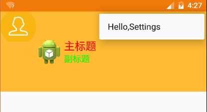

# CardView

实现卡片式布局的控件

CardView和Linearlayout、Framelayout一样都是ViewGroup，即其他控件的容器。

CardView继承于Framelayout，所以Framelayout的属性他都有，同时CardView还有几个特殊的属性：

- 在API21（Android L）等级以上拥有属性elevation，意为CardView的Z轴阴影，只有在Android 5.0有效。只能通过xml中的elevation属性指定
- cardBackgroundColor：意为CardView的卡片颜色，只能通过xml的cardBackgroundColor属性进行指定，也可以通过代码设置setBackgroundColor()
- cardConerRadius：意为CardView卡片的四角圆角矩形程度，单位dimen（dp px sp），可以通过xml指定，也可以通过代码中的setRadius()指定

阴影效果：cardElevation，代码设置：setCardElevation()

### 使用步骤

添加依赖库

```java
compile 'com.android.support:cardview-v7:25.3.1'
```

在xml中使用CardView（直接作为一个容器使用，包裹要展示的内容）
```xml
<android.support.v7.widget.CardView

    xmlns:card_view="http://schemas.android.com/apk/res-auto"
    android:layout_width="match_parent"
    android:layout_height="wrap_content"
    android:layout_margin="5dp"
    card_view:cardBackgroundColor="#FFFFFFFF"
    card_view:cardCornerRadius="1dp">
    
    <RelativeLayout
        android:layout_width="match_parent"
        android:layout_height="wrap_content"
        android:padding="5dp">
    
        <ImageView
            android:id="@+id/pic"
            android:layout_width="match_parent"
            android:layout_height="wrap_content"
            android:scaleType="centerCrop" />
    
        <TextView
            android:id="@+id/name"
            android:layout_width="wrap_content"
            android:layout_height="wrap_content"
            android:layout_below="@id/pic"
            android:layout_centerHorizontal="true"
            android:gravity="center"
            android:textColor="#212121"
            android:textSize="16sp" />
    </RelativeLayout>
</android.support.v7.widget.CardView>
```
运行效果


# SwipeRefreshLayout

SwipeRefreshLayout是Google提供的下拉刷新控件，位于support-v4包下，其实很早以前就提供了这个控件，但是之前这个控件的样式一直是彩色横线，5.0之后变为了转圈的圆形进度条。

旧版样式


新版样式


主要方法

- setOnRefreshListener(OnRefreshListener): 为布局添加一个Listener
- setRefreshing(boolean): 显示或隐藏刷新进度条
- isRefreshing(): 检查是否处于刷新状态
- setColorScheme(): 设置进度条的颜色主题，最多能设置四种

使用步骤：

在布局文件中使用SwipeRefreshLayout，作为容器套到外层即可

```xml
<android.support.v4.widget.SwipeRefreshLayout xmlns:android="http://schemas.android.com/apk/res/android"
    android:id="@+id/swipe"
    android:layout_width="match_parent"
    android:layout_height="match_parent">

    <ScrollView
        android:layout_width="match_parent"
        android:layout_height="match_parent">

        <RelativeLayout
            android:layout_width="match_parent"
            android:layout_height="wrap_content">

            <TextView
                android:id="@+id/tv_content"
                android:layout_width="match_parent"
                android:layout_height="500dp"
                android:gravity="center"
                android:text="请下拉页面进行刷新"
                android:textSize="20dp" />
        </RelativeLayout>
    </ScrollView>
</android.support.v4.widget.SwipeRefreshLayout>
```

在代码中设置SwipeRefreshLayout

```java
/**
 *  初始化SwipeRefreshLayout
 */
private void initRefresh() {
    // 设置下拉刷新的颜色切换
    mSwipe.setColorSchemeResources(android.R.color.holo_blue_bright, android.R.color.holo_green_light,android.R.color.holo_orange_light, android.R.color.holo_red_light);

    // 设置下拉刷新的回调
    mSwipe.setOnRefreshListener(new SwipeRefreshLayout.OnRefreshListener() {
        @Override
        public void onRefresh() {
            mTvContent.setText("下拉刷新中,3秒后刷新结束...");
            mHandler.postDelayed(new Runnable() {
                @Override
                public void run() {
                    mTvContent.setText("请下拉页面进行刷新");
                    // 停止刷新
                    mSwipe.setRefreshing(false);
                }
            }, 3000);
        }
    });
}
```
# DrawerLayout

抽屉布局，实现类似于SlidingMenu的功能

Android在support-v4包中提供了一个抽屉布局的控件：DrawerLayout，在做侧边栏的时候，我们可以选用SlidingMenu，也可以选用这个DrawerLayout来实现侧拉栏。

## 使用步骤：

添加support-v4包的依赖（这里版本号是25+，是因为我当前的compileSdkVersion为25）

```gradle
compile 'com.android.support:support-v4:21+'
```
修改xml，将根布局修改为`<android.support.v4.widget.DrawerLayout>`

将主布局作为第一个孩子节点，优先定义

定义完主布局后，定义菜单布局，注意菜单布局必须指明” android:layout_gravity”属性，告知DrawerLayout这个菜单的划出方向是left还是right。当然，你也可以写2个菜单布局，一个在left，一个在right。
```xml
<?xml version="1.0" encoding="utf-8"?>
<!-- 以V4包下的DrawerLayout作为顶层布局 -->
<android.support.v4.widget.DrawerLayout xmlns:android="http://schemas.android.com/apk/res/android"
    android:layout_width="match_parent"
    android:layout_height="match_parent">
    
    <!-- 将主布局放到第一个来定义 -->
    <FrameLayout
        android:id="@+id/ll_main"
        android:layout_width="match_parent"
        android:layout_height="match_parent"
        android:background="#f00"/>
    
    <!-- 将Menu布局放下面，注意：必须设置"android:layout_gravity"属性 -->
    <FrameLayout
        android:id="@+id/ll_menu_left"
        android:layout_width="200dp"
        android:layout_height="match_parent"
        android:layout_gravity="left"
        android:background="#0f0"/>
    
    <!-- 当然，你也可以声明多个Menu布局，比如下面这个从右边划出的Menu -->
    <FrameLayout
        android:id="@+id/ll_menu_right"
        android:layout_width="200dp"
        android:layout_height="match_parent"
        android:layout_gravity="right"
        android:background="#00f"/>
</android.support.v4.widget.DrawerLayout>
```
## DrawerLayout和Actionbar相互作用

抽屉布局的开关实际上是一个叫做ActionBarDrawerToggle的类。

这个类，在V4包中有，V7包中也有。V4包中的ActionBarDrawerToggle已经被标记为过时了，因此我们在用的时候，直接取用V7包下的ActionBarDrawerToggle类。

### 使用步骤：

创建一个ActionBarDrawerToggle，注意选用V7包下的
```java
/**
*  参数1 ： Activity
*  参数2 ： 要绑定的DrawerLayout控件
*  参数3 ： 开关打开时的内容描述(用于残障人士的友好提醒，可以传0)
*  参数4 ： 开关关闭时的内容描述(用于残障人士的友好提醒，可以传0)
*/
ActionBarDrawerToggle mDrawerToggle = new ActionBarDrawerToggle(this, mDrawer, 
	R.string.openDrawerContentDes, 
	R.string.closeDrawerContentDes );
```
2.将ActionBarDrawerToggle设置为ActionBar的DrawerListener
```java
// ActionBarDrawerToggle实现了DrawerListener接口
mDrawer.setDrawerListener(mDrawerToggle);
```
在onConfigurationChanged、onOptionsItemSelected、onPostCreate这几个生命周期的方法中回调ActionBarDrawerToggle对应的方法
```java
@Override
public void onConfigurationChanged(Configuration newConfig) {
    super.onConfigurationChanged(newConfig);
    mDrawerToggle.onConfigurationChanged(newConfig);
}
@Override
public boolean onOptionsItemSelected(MenuItem item) {
    mDrawerToggle.onOptionsItemSelected(item);
    return super.onOptionsItemSelected(item);
}
@Override
protected void onPostCreate(Bundle savedInstanceState) {
    super.onPostCreate(savedInstanceState);
    mDrawerToggle.syncState();
}
```
注意，除此之外，还需启用ActionBar，并设置其Home按钮展示出来。
```java
// 启用ActionBar上的Home按钮
getActionBar().setDisplayHomeAsUpEnabled(true);
// 设置按钮可点击
getActionBar().setHomeButtonEnabled(true); 
```
此外，主题我们需要使用有ActionBar的主题，这里我们可以选择Android 5.0的Metrarial Design相关主题：
```xml
<style name="AppTheme" parent="android:Theme.Material">
```

## DrawerLayout和ToolBar联动

实现DrawerLayout和ToolBar的联动依旧需要的是ActionBarDrawerToggle，但是这里需要注意一点：ToolBar和ActionBarDrawerToggle必须都使用V7包下的。

在布局中使用ToolBar和DrawerLayout：
```xml
<?xml version="1.0" encoding="utf-8"?>
<LinearLayout xmlns:android="http://schemas.android.com/apk/res/android"
    android:id="@+id/activity_drawer_layout2"
    android:layout_width="match_parent"
    android:layout_height="match_parent"
    android:orientation="vertical">
    
    <android.support.v7.widget.Toolbar
        android:id="@+id/toolBar"
        android:layout_width="match_parent"
        android:layout_height="wrap_content"
        android:background="@android:color/holo_orange_light"/>
    
    <android.support.v4.widget.DrawerLayout
        android:id="@+id/drawerLayout"
        android:layout_width="match_parent"
        android:layout_height="match_parent">
    
        <FrameLayout
            android:layout_width="match_parent"
            android:layout_height="match_parent"
            android:background="#F00">
    
            <TextView
                android:layout_width="wrap_content"
                android:layout_height="wrap_content"
                android:layout_gravity="center"
                android:text="我是主页面" />
        </FrameLayout>
    
        <FrameLayout
            android:layout_width="match_parent"
            android:layout_height="match_parent"
            android:layout_gravity="left"
            android:background="#0F0"/>
    </android.support.v4.widget.DrawerLayout>
</LinearLayout>
```
在代码中设置DrawerLayout和ToolBar的联动：
```java
	/**
	 *  DrawerLayout + Toolbar
     */
   public class DrawerLayoutActivity2 extends AppCompatActivity {

    @InjectView(R.id.drawerLayout)
    DrawerLayout mDrawerLayout;

    @InjectView(R.id.toolBar)
    Toolbar mToolbar;

    @Override
    protected void onCreate(Bundle savedInstanceState) {
        // 使用support包的主题（使用NoActionBar的主题）
        setTheme(R.style.ToolbarTheme);
        super.onCreate(savedInstanceState);
        setContentView(R.layout.activity_drawer_layout2);
        ButterKnife.inject(this);
       
        // 使用ToolBar替代ActionBar
        setSupportActionBar(mToolbar);
       
        // 创建Toggle(注意：用V7包下的)
        ActionBarDrawerToggle toggle = new ActionBarDrawerToggle(this, mDrawerLayout, mToolbar,
                R.string.app_name, R.string.app_name);
       
        // 将toggle设置为DrawerLayout的Listener
        mDrawerLayout.addDrawerListener(toggle);
       
        // 同步状态
        toggle.syncState();
    }
}
```
# Coordinatorlayout

协调者布局，实现炫酷UI效果的关键类

## 行为原理

Android6.0更加注重界面上用户的体验，当用户对界面进行操作，操作系统就会对该行为进行分析，目的就是给用户展示更加合理的界面。那么行为是什么？行为就是Behavior滑动。一般要让整个流程完整走执行下来就需要这些对象。行为产生者、协调者、目标对象、控制对象


可以产生行为的对象：ViewPager   RecyclerView  NestedScrollView
app:layout_behavior="@string/appbar_scrolling_view_behavior"
这个是系统定义好的。

CoordinatorLayout协调者布局

AppBarLayout 应用bar

Toolbar操作对象

## 操作对象的显示控制

```
app:layout_scrollFlags="scroll"
```


AppBarLayout的子布局有5种滚动标识(就是上面代码CollapsingToolbarLayout中配置的app:layout_scrollFlags属性)：

| 滚动标识                 | 功能说明                                     |
| :------------------- | :--------------------------------------- |
| scroll               | 将此布局和滚动时间关联。这个标识要设置在其他标识之前，没有这个标识则布局不会滚动且其他标识设置无效 |
| enterAlways          | 任何向下滚动操作都会使此布局可见。这个标识通常被称为“快速返回”模式       |
| enterAlwaysCollapsed | 假设你定义了一个最小高度（minHeight）同时enterAlways也定义了，那么view将在到达这个最小高度的时候开始显示，并且从这个时候开始慢慢展开，当滚动到顶部的时候展开完 |
| exitUntilCollapsed   | 当你定义了一个minHeight，此布局将在滚动到达这个最小高度的时候折叠。是控制Toolbar在最后固定在顶部 |
| snap                 | 当一个滚动事件结束，如果视图是部分可见的，那么它将被滚动到收缩或展开。例如，如果视图只有底部25%显示，它将折叠。相反，如果它的底部75%可见，那么它将完全展开 |

直接修改Style来完成Toolbar背景的颜色

```xml
<resources>

    <!-- Base application theme. -->
    <style name="AppTheme" parent="Theme.AppCompat.Light.NoActionBar">
        <!-- Customize your theme here. -->
        <item name="colorPrimary">#a127de</item>
        <item name="colorPrimaryDark">@color/colorPrimaryDark</item>
        <item name="colorAccent">@color/colorAccent</item>
    </style>

</resources>
```

```xml
<android.support.design.widget.AppBarLayout
    android:layout_width="match_parent"
    android:layout_height="wrap_content"
    android:background="#bd8dd7">
    <android.support.v7.widget.Toolbar
        android:id="@+id/toolbar"
        android:layout_width="match_parent"
        android:layout_height="wrap_content"
        android:background="#bd8dd7"
        app:layout_scrollFlags="scroll|enterAlways"
        ></android.support.v7.widget.Toolbar>

    <!--tab标签-->
    <android.support.design.widget.TabLayout
        android:id="@+id/tabLayout"
        android:layout_width="match_parent"
        android:layout_height="wrap_content"
        app:tabIndicatorColor="#d722e9"
        app:tabIndicatorHeight="2dp"
        app:tabTextColor="#f00"
        app:tabSelectedTextColor="#000"
        ></android.support.design.widget.TabLayout>
</android.support.design.widget.AppBarLayout>
```

```xml
<android.support.design.widget.AppBarLayout
    android:id="@+id/appBarLayout"
    android:layout_width="match_parent"
    android:layout_height="wrap_content"
    android:orientation="vertical"
    >
    <android.support.v7.widget.Toolbar
        android:id="@+id/toolbar"
        android:layout_width="match_parent"
        android:layout_height="wrap_content"
        app:layout_scrollFlags="scroll"
        ></android.support.v7.widget.Toolbar>
    <ImageView
        android:layout_width="match_parent"
        android:layout_height="100dp"
        android:scaleType="centerCrop"
        android:src="@drawable/cheese_1"
        app:layout_scrollFlags="scroll|enterAlways|snap"
        />
        <!--tab标签-->
        <android.support.design.widget.TabLayout
            android:id="@+id/tabLayout"
            android:layout_width="match_parent"
            android:layout_height="wrap_content"
            android:background="#0f00"
            android:layout_gravity="bottom"
            ></android.support.design.widget.TabLayout>

</android.support.design.widget.AppBarLayout>
```

## RecyclerView产生行为

```xml
<android.support.v7.widget.RecyclerView
    android:id="@+id/rv"
    android:layout_width="match_parent"
    android:layout_height="match_parent"
    android:background="#c55"
    app:layout_behavior="@string/appbar_scrolling_view_behavior"
    >
</android.support.v7.widget.RecyclerView>
```

## NestedScrollView产生行为

Nested嵌套

```xml
<android.support.v4.widget.NestedScrollView
    android:layout_width="match_parent"
    android:layout_height="match_parent"
    android:visibility="gone"
    app:layout_behavior="@string/appbar_scrolling_view_behavior">
    <TextView
        android:layout_width="match_parent"
        android:layout_height="match_parent"
        android:text="@string/content"
        />
</android.support.v4.widget.NestedScrollView>
```

app:layout_scrollFlags :最小高度有关
exitUntilCollapsed：互动折叠到最小高度后，不再有折叠效果
enterAlwaysCollapsed：需要配置enterAlways，当展开到最小高度后，不再展开，而是底部的Child到达顶部滑动才会完全展开

# AbbBarLayout

# CollapsingToolbarLayout

CollapsingToolBarLayout是对Toolbar的一个包装，只能作为AppBarLayout的直接孩子。
折叠的目标对象是AppBarLayout,所以CollapsingToolBarLayout就是在AppBarLayout内面，
CollapsingToolbarLayout可以通过app:contentScrim设置折叠时工具栏布局的颜色，通过app:statusBarScrim设置折叠时状态栏的颜色。默认contentScrim是colorPrimary的色值，statusBarScrim是colorPrimaryDark的色值。

CollapsingToolbarLayout的子布局有3种折叠模式（Toolbar中设置的app:layout_collapseMode）

| 折叠模式     | 说明                                       |
| -------- | ---------------------------------------- |
| off      | 这个是默认属性，布局将正常显示，没有折叠的行为。                 |
| pin      | CollapsingToolbarLayout折叠后，此布局将固定在顶部。    |
| parallax | CollapsingToolbarLayout折叠时，此布局也会有视差折叠效果。 |

当CollapsingToolbarLayout的子布局设置了parallax模式时，我们还可以通过app:layout_collapseParallaxMultiplier设置视差滚动因子，值为：0~1。
```xml
<android.support.design.widget.AppBarLayout
    android:id="@+id/appbar"
    android:layout_width="match_parent"
    android:layout_height="@dimen/detail_backdrop_height"
    android:theme="@style/ThemeOverlay.AppCompat.Dark.ActionBar"
    android:fitsSystemWindows="true">

    <android.support.design.widget.CollapsingToolbarLayout
        android:id="@+id/collapsing_toolbar"
        android:layout_width="match_parent"
        android:layout_height="match_parent"
        app:layout_scrollFlags="scroll|exitUntilCollapsed"
        android:fitsSystemWindows="true"
        app:contentScrim="?attr/colorPrimary"
        app:expandedTitleMarginStart="48dp"
        app:expandedTitleMarginEnd="64dp">

        <ImageView
            android:id="@+id/backdrop"
            android:layout_width="match_parent"
            android:layout_height="match_parent"
            android:scaleType="centerCrop"
            android:fitsSystemWindows="true"
            app:layout_collapseMode="parallax" />

        <android.support.v7.widget.Toolbar
            android:id="@+id/toolbar"
            android:layout_width="match_parent"
            android:layout_height="?attr/actionBarSize"
            app:popupTheme="@style/ThemeOverlay.AppCompat.Light"
            app:layout_collapseMode="pin" />

    </android.support.design.widget.CollapsingToolbarLayout>

</android.support.design.widget.AppBarLayout>
```
Toolbar指定高度，CollaspsingToolbarLayout就会给ToolBar动态的文字动态效果。
app:contentScrim="?attr/colorPrimary"  是指定折叠后Toolbar的背景颜色

app:expandedTitleMarginStart="50dp" 没有收缩前文字与左边的距离

# Toolbar

---


typora-copy-images-to: img
---

Toolbar是应用的内容的标准工具栏，可以说是Actionbar的升级版，用来替代ActionBar。

相比Actionbar Toolbar最明显的一点就是变得很自由，可随处放置，因为它是作为一个ViewGroup来定义使用的。
一般把ToolBar放到页面最上面，有需要你可以把它放到中间、底部或其它位置的，可见ToolBar的自由度是很高的。

使用前提：若想使用ToolBar替代ActionBar，需要设置主题为NoActionBar相关，或者通过代码设置去掉ActionBar，否则会报错。
### ToolBar使用步骤

使用步骤

设置主题为NoActionBar的主题，或者在代码中配置

```
getWindow().requestFeature(Window.FEATURE_NO_TITLE);
```

设置Toolbar的样式

```
// 设置LOGO
mToolBar.setLogo(R.drawable.ic_launcher);
// 设置导航按钮图片
mToolBar.setNavigationIcon(R.drawable.head_1);
// 设置主标题（不设置就显示APP的名称）
mToolBar.setTitle("主标题");
// 设置次级标题
mToolBar.setSubtitle("副标题");
// 设置主标题的颜色
mToolBar.setTitleTextColor(Color.RED);
// 设置次级标题的颜色
mToolBar.setSubtitleTextColor(Color.GREEN);
```

使用ToolBar替换ActionBar

```
// 替代ActionBar（若需要向下兼容，ToolBar应使用V7包下的，此处应调用setSupportActionBar）
setActionBar(mToolBar);
```

### ToolBar显示Menu

ActionBar上的Menu菜单，在ToolBar上是兼容的，比如在Activity里添加Menu

```
@Override
public boolean onCreateOptionsMenu(Menu menu) {
    /**
     * 此方法用于初始化菜单，其中menu参数就是即将要显示的Menu实例。
     * 返回true则显示该menu,false 则不显示;
     * 此方法只会在第一次初始化菜单时调用
     * Inflate the menu; this adds items to the action bar if it is present.
     */
    getMenuInflater().inflate(R.menu.main, menu);
    return true;
}
```

Menu中只放一个Item

```xml
<menu xmlns:android="http://schemas.android.com/apk/res/android"
    xmlns:app="http://schemas.android.com/apk/res-auto"
    xmlns:tools="http://schemas.android.com/tools"
    tools:context=".MainActivity">
    <item
        android:id="@+id/action_example"
        android:title="Hello,Settings"
        app:showAsAction="always" />
</menu>
```

UI效果展示



### ToolBar的向下兼容

1. 为了向下兼容，要使用 V7包下的 Toolbar；
2. 使用setSupportActionBar()方法而不是setActionBar()方法来替代ActionBar

# TabLayout

TabLayout和ViewPager + Fragment + FragmentPagerAdapter联合使用

```xml
<!--tab标签-->
<android.support.design.widget.TabLayout
    android:id="@+id/tabLayout"
    android:layout_width="match_parent"
    android:layout_height="wrap_content"
    app:tabIndicatorColor="#d722e9"
    app:tabIndicatorHeight="2dp"
    app:tabTextColor="#f00"
    app:tabSelectedTextColor="#999"
    ></android.support.design.widget.TabLayout>

 <android.support.v4.view.ViewPager
     android:id="@+id/vp"
     android:layout_width="match_parent"
     android:layout_height="match_parent"></android.support.v4.view.ViewPager>
```
MainActivity
```java
public class MainActivity extends AppCompatActivity {

    private List<Fragment> fragments;

    @Override
    protected void onCreate(Bundle savedInstanceState) {
        super.onCreate(savedInstanceState);
        setContentView(R.layout.activity_main);

        //初始化控件
        TabLayout tabLayout = (TabLayout) findViewById(R.id.tabLayout);
        ViewPager vp = (ViewPager) findViewById(R.id.vp);

        fragments = new ArrayList<>();
        fragments.add(setTitile(new Tab1Fragment(),"tab1"));
        fragments.add(setTitile(new Tab2Fragment(),"tab2"));
        fragments.add(setTitile(new Tab3Fragment(),"tab3"));

        vp.setAdapter(new MyPagerAdapter(getSupportFragmentManager()));

        tabLayout.setupWithViewPager(vp);
    }

    private Fragment setTitile(Fragment fragment,String title){
        Bundle args = new Bundle();
        args.putString("title",title);
        fragment.setArguments(args);
        return fragment;
    }

    private class MyPagerAdapter extends FragmentPagerAdapter{

        public MyPagerAdapter(FragmentManager fm) {
            super(fm);
        }

        @Override
        public Fragment getItem(int position) {
            return fragments.get(position);
        }

        @Override
        public int getCount() {
            return fragments.size();
        }

        @Override
        public CharSequence getPageTitle(int position) {
            return fragments.get(position).getArguments().getString("title");
        }
    }
}
```
# NavigationView

NavigationView是对于侧滑菜单里面的一个封装。
Navigation有两部分来组成：头(布局)+条目内容(Menu Item)
Item的点击事件处理

```xml
<RelativeLayout xmlns:android="http://schemas.android.com/apk/res/android"
    xmlns:tools="http://schemas.android.com/tools"
    xmlns:app="http://schemas.android.com/apk/res-auto"
    android:id="@+id/activity_main"
    android:layout_width="match_parent"
    android:layout_height="match_parent"
    tools:context="com.example.test_design_navigationview.MainActivity">

    <android.support.v4.widget.DrawerLayout
        android:id="@+id/drawerLayout"
        android:layout_width="match_parent"
        android:layout_height="match_parent">
        <!--内容-->
        <LinearLayout
            android:layout_width="match_parent"
            android:layout_height="match_parent"
            android:background="#000">

        </LinearLayout>
        <!--菜单
        android:layout_gravity="left" 设置菜单方向
            app:headerLayout="@layout/header" 设置头布局
            app:menu="@menu/menu" 设置菜单
        -->
        <android.support.design.widget.NavigationView
            android:id="@+id/navigationView"
            android:layout_width="match_parent"
            android:layout_height="match_parent"
            android:layout_gravity="left"
            app:headerLayout="@layout/header"
            app:menu="@menu/menu"/>
    </android.support.v4.widget.DrawerLayout>
</RelativeLayout>

<LinearLayout xmlns:android="http://schemas.android.com/apk/res/android"
    android:orientation="vertical" android:layout_width="match_parent"
    android:layout_height="180dp"
    android:background="#00f">

    <TextView
        android:layout_width="match_parent"
        android:layout_height="match_parent"
        android:text="黑马程序员"
        android:textColor="#fff"
        android:textSize="30sp"/>

</LinearLayout>
```
menu

```xml
<menu xmlns:app="http://schemas.android.com/apk/res-auto"
    xmlns:android="http://schemas.android.com/apk/res/android">

    <group android:checkableBehavior="single" >
        <item android:title="首页"
            android:id="@+id/menu_home"
            android:icon="@drawable/ic_dashboard"
            android:checked="true"/>
        <item android:title="国内"
            android:id="@+id/menu_in"
            android:icon="@drawable/ic_event" />
        <item android:title="国外"
            android:id="@+id/menu_out"
            android:icon="@drawable/ic_headset" />
        <item android:title="综合"
            android:id="@+id/menu_all"
            android:icon="@drawable/ic_forum" />
    </group>
    <item android:title="Sub Item" >
        <menu >
            <item android:title="Sub Item1"
                android:icon="@drawable/ic_dashboard" />
            <item android:title="Sub Item2"
                android:icon="@drawable/ic_forum" />
        </menu>
    </item>
</menu>
```

```java
final DrawerLayout drawerLayout = (DrawerLayout) findViewById(R.id.drawerLayout);
final NavigationView navigationView = (NavigationView) findViewById(R.id.navigationView);

//设置导航条目监听
navigationView.setNavigationItemSelectedListener(new NavigationView.OnNavigationItemSelectedListener() {
    @Override
    public boolean onNavigationItemSelected(@NonNull MenuItem item) {
        //设置选中条目
        navigationView.setCheckedItem(item.getItemId());
        //关闭侧滑菜单
        drawerLayout.closeDrawers();
        return true;
    }
});
```

## NavigatonView和Toolbar

```xml
<!--内容-->
<LinearLayout
    android:layout_width="match_parent"
    android:layout_height="match_parent"
    android:background="#000">

    <android.support.v7.widget.Toolbar
        android:id="@+id/toolbar"
        android:layout_width="match_parent"
        android:layout_height="wrap_content"
        android:background="#b19017"></android.support.v7.widget.Toolbar>

</LinearLayout>
```
```java
Toolbar toolbar = (Toolbar) findViewById(R.id.toolbar);
ActionBarDrawerToggle toggle = new ActionBarDrawerToggle(this,drawerLayout,toolbar,R.string.app_name,R.string.app_name);
toggle.syncState();
drawerLayout.addDrawerListener(toggle);
```
# FloatingActionButton

FloatingActionButton是继承至ImageView，所以FloatingActionButton拥有ImageView的所有属性。

| 属性                       | 说明                                       |
| ------------------------ | ---------------------------------------- |
| src                      | 设置FAB的图标，Google建议符合Design设计的该图标大小为24dp。  |
| app:fabSize              | 设置FAB的大小，该属性有两个值，分别为normal和mini，对应的FAB大小分别为56dp和40dp。 |
| app:backgroundTint       | 设置FAB的背景颜色。                              |
| android:clickable="true" | 可以点击                                     |
| app:rippleColor          | 设置FAB点击时的背景颜色。                           |
| app:elevation            | 默认状态下FAB的阴影大小。                           |
| app:pressedTranslationZ  | 点击时候FAB的阴影大小。                            |

点击事件
```java
public void show(View view){
    Snackbar.make(view,"点击弹出",Snackbar.LENGTH_SHORT)
            .setAction("点击", new View.OnClickListener() {
                @Override
                public void onClick(View v) {
                    Toast.makeText(MainActivity.this, "Snackbar点击效果", Toast.LENGTH_SHORT).show();
                }
            })
            .show();
}
```

CoordinatorLayout可以用来配合FloatingActionButton浮动按钮，设置app：layout_anchor和app:layout_anchorGravity构建出特定的位置与效果的FloatingActionButton。
```xml
<android.support.design.widget.FloatingActionButton
    android:layout_width="wrap_content"
    android:layout_height="wrap_content"
    android:src="@android:drawable/ic_menu_call"
    android:layout_gravity="bottom|end"
    android:onClick="show"
    android:layout_margin="16dp"/>
```
app:layout_anchor - 设置FAB的锚点，即以哪个控件为参照点设置位置。
app:layout_anchorGravity - 设置FAB相对锚点的位置，值有 bottom、center、right、left、top等。
不消失，没有折叠效果
```xml
<android.support.design.widget.FloatingActionButton
    android:layout_width="wrap_content"
    android:layout_height="wrap_content"
    android:src="@android:drawable/ic_menu_call"
    app:layout_anchor="@id/collapsingToolbarLayout"
    app:layout_anchorGravity="bottom|center_horizontal"
    android:onClick="show"
    />
```
消失，带有折叠效果
```xml
<android.support.design.widget.FloatingActionButton
    android:layout_width="wrap_content"
    android:layout_height="wrap_content"
    android:src="@android:drawable/ic_menu_call"
    app:layout_anchor="@id/appBarLayout"
    app:layout_anchorGravity="bottom|center_horizontal"
    android:onClick="show"
    />
```

操作行为
```java
public void show(View view){
    if(toolBar1.getVisibility() == View.VISIBLE){
        appBarLayout.setExpanded(false);
    }else{
        appBarLayout.setExpanded(true);
    }
}
```
SnackBar

NestScrollView

BottomNavigation

TextInputLayout