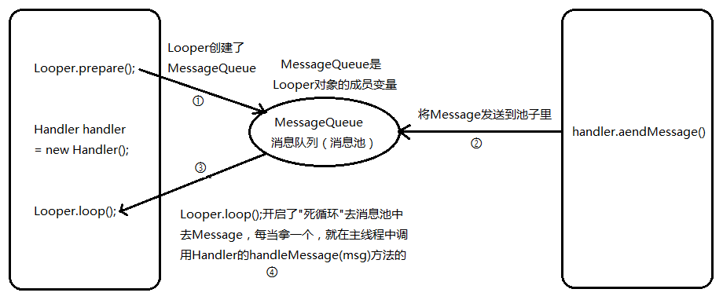
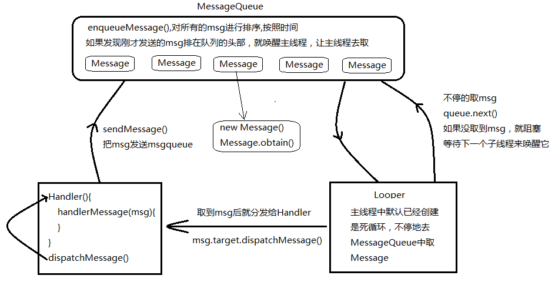

# **1. ANR异常**

Application No Response：应用程序无响应。在主线程中，是不允许执行耗时的操作的，如果主线程阻塞的时间大于6秒，就很有可能出现anr异常。主线程，要完成界面的更新，事件的处理，窗体显示的回调，所以如果主线程阻塞时间较长，就不能很好的处理以上比较重要的事情，那么Android有一个机制，就是如果他发现消息队列中有很多消息，主线程没办法响应的话，他就会抛出anr异常。所以，比较耗时的操作都必须要交给子线程。

解决办法：可以通过Handler来解决这个问题，将比较耗时的操作交给子线程，然后子线程通过Handler，发送消息给主线程，让主线程去更新界面。什么样的操作时比较耗时的？

1、访问网络，2、大文件的拷贝，3、阻塞式的请求，socket

# **2. Handler、Looper、Message、MessageQueue**


Android 的Handler 机制（也有人叫消息机制）目的是为了跨线程通信，也就是多线程通信。之所以需要跨线程通信是因为在Android 中主线程通常只负责UI 的创建和修改，子线程负责网络访问和耗时操作，因此，主线程和子线程需要经常配合使用才能完成整个Android 功能。

在Android中，线程内部或者线程之间进行信息交互时经常会使用消息，这些基础的东西如果我们熟悉其内部的原理，将会使我们容易、更好地架构系统，避免一些低级的错误。在学习Android中消息机制之前，我们先了解与消息有关的几个类：

- Handler：消息处理器，发送消息和处理消息。你可以构造Handler对象来与Looper沟通，以便push新消息到Message Queue里，或者接收Looper(从Message Queue取出)所送来的消息。
- Looper：轮询器，从messagequeue取消息，分发给handler处理。一个线程可以产生一个Looper对象，由它来管理此线程里的Message Queue(消息队列)
- Message 消息，数据的载体
- MessageQueue 消息队列，存储消息

当我们的Android应用程序的进程一创建的时候，系统就给这个进程提供了一个Looper，Looper是一个死循环，它内部维护这个一个消息队列。Looper不停地从消息队列中取消息（Message），取到消息就发送给了Handler，最后Handler根据接收到的消息去修改UI。Handler的sendMessage方法就是将消息添加到消息队列中。

# **3. UI线程**
线程：UI thread 通常就是main thread，而Android启动程序时会替它建立一个Message Queue。

每一个线程里可含有一个Looper对象以及一个MessageQueue数据结构。在你的应用程序里，可以定义Handler的子类别来接收Looper所送出的消息。在你的Android程序里，新诞生一个线程，或执行 (Thread)时并不会自动建立其Message Looper。

Android里并没有Global的Message Queue数据结构，例如，不同APK里的对象不能透过Massage Queue来交换讯息(Message)。

例如：线程A的Handler对象可以传递消息给别的线程，让别的线程B或C等能送消息来给线程A(存于A的Message Queue里)。线程A的Message Queue里的消息，只有线程A所属的对象可以处理。使用Looper.myLooper()可以取得当前线程的Looper对象。可以自定义Handler类，只要继承Handler即可。使用new EventHandler(Looper.myLooper()); 可用来构造当前线程的Handler对象（其中EventHandler是自定义的Handler类）。

# **4. Activity.runOnUiThread()**

Activity中提供了一个runOnUiThread方法，用于进行消息处理。此方法是通过线程合并join来实现消息处理的。
线程合并：主线程将子线程的任务拿到自己这里来执行并终止子线程。实例代码如下：

```java 
/**
 * Runs the specified action on the UI thread. If thecurrent thread is
 * the UI thread, then the action is executedimmediately. If the
 * current thread is not the UI thread, the action is posted to the
 * event queue of the UI thread.
 *
 * 上面的意思为：在UI线程中运行我们的任务，如果当前线程是UI线程，则立即执行，如果
 * 不是则该任务发送到UI线程的事件队列。 
 */
runOnUiThread(new Runnable() {
    @Override
    public void run() {
        //自定义我们的业务代码
    }
});
```
# **5. View.post()、View.postDelayed()**

# **6. Message消息**

消息对象，顾名思义就是记录消息信息的类。这个类有几个比较重要的字段：

- arg1和arg2：我们可以使用两个字段用来存放我们需要传递的整型值，在Service中，我们可以用来存放Service的ID。
- obj：该字段是Object类型，我们可以让该字段传递某个多项到消息的接受者中。
- what：这个字段可以说是消息的标志，在消息处理中，我们可以根据这个字段的不同的值进行不同的处理，类似于我们在处理Button事件时，通过switch(v.getId())判断是点击了哪个按钮。

在使用Message时，我们可以通过new Message()创建一个Message实例，但是Android更推荐我们通过Message.obtain()或者Handler.obtainMessage()获取Message对象。这并不一定是直接创建一个新的实例，而是先从消息池中看有没有可用的Message实例，存在则直接取出并返回这个实例。反之如果消息池中没有可用的Message实例，则根据给定的参数new一个新Message对象。通过分析源码可得知，Android系统默认情况下在消息池中实例化10个Message对象。

```java
//创建或获取消息的几种方式
Message msg = new Message();// 创建一个新的消息对象
Message msg = handler.obtainMessage();// 获取一个消息，如果消息池存在消息，则复用消息池中的消息，否则新创建一个消息对象
Message msg = Message.obtain();
Message.obtain(handler, what, obj).sendToTarget();
```

# **7. MessageQueue消息队列**

消息队列，用来存放Message对象的数据结构，按照“先进先出”的原则存放消息。内部采用单链表的数据结构来存储消息列表，存放并非实际意义的保存，而是将Message对象以链表的方式串联起来的。MessageQueue对象不需要我们自己创建，而是有Looper对象对其进行管理，一个线程最多只可以拥有一个MessageQueue。我们可以通过Looper.myQueue()获取当前线程中的MessageQueue。

MessageQueue的管理者，在一个线程中，如果存在Looper对象，则必定存在MessageQueue对象，并且只存在一个Looper对象和一个MessageQueue对象。

```java
public class Looper {
	MessageQueue mQueue;//Looper身上维持着一个消息队列
	...
}
```

在Android系统中，除了主线程有默认的Looper对象，其它线程默认是没有Looper对象。如果想让我们新创建的线程拥有Looper对象时，我们首先应调用Looper.prepare()方法，然后再调用Looper.loop()方法。典型的用法如下：

```java
class LooperThread extends Thread
{
    public Handler mHandler;
    public void run()
    {
        Looper.prepare();
        //其它需要处理的操作
        Looper.loop();
    }
}
```

倘若我们的线程中存在Looper对象，则我们可以通过Looper.myLooper()获取，此外我们还可以通过Looper.getMainLooper()获取当前应用系统中主线程的Looper对象。在这个地方有一点需要注意，假如Looper对象位于应用程序主线程中，则Looper.myLooper()和Looper.getMainLooper()获取的是同一个对象。

# **8. Handler消息处理器**

消息的处理者。通过Handler对象我们可以封装Message对象，然后通过sendMessage(msg)把Message对象添加到MessageQueue中；当MessageQueue循环到该Message时，就会调用该Message对象对应的handler对象的handleMessage()方法对其进行处理。由于是在handleMessage()方法中处理消息，因此我们应该编写一个类继承自Handler，然后在handleMessage()处理我们需要的操作。

下面我们通过跟踪代码分析在Android中是如何处理消息。首先贴上测试代码：

```java
public class MessageService extends Service
{
    private static final String TAG = "MessageService";
    private static final int KUKA = 0;
    private Looper looper;
    private ServiceHandler handler;
    /**
     * 由于处理消息是在Handler的handleMessage()方法中，因此我们需要自己编写类
     * 继承自Handler类，然后在handleMessage()中编写我们所需要的功能代码
     * @author coolszy
     */
    private final class ServiceHandler extends Handler
    {
        public ServiceHandler(Looper looper)
        {
            super(looper);
        }
        @Override
        public void handleMessage(Message msg)
        {
            // 根据what字段判断是哪个消息
            switch (msg.what)
            {
            case KUKA:
                //获取msg的obj字段。我们可在此编写我们所需要的功能代码
                Log.i(TAG, "The obj field of msg:" + msg.obj);
                break;
            // other cases
            default:
                break;
            }
            // 如果我们Service已完成任务，则停止Service
            stopSelf(msg.arg1);
        }
    }
    @Override
    public void onCreate()
    {
        Log.i(TAG, "MessageService-->onCreate()");
        // 默认情况下Service是运行在主线程中，而服务一般又十分耗费时间，如果
        // 放在主线程中，将会影响程序与用户的交互，因此把Service
        // 放在一个单独的线程中执行
        HandlerThread thread = new HandlerThread("MessageDemoThread", Process.THREAD_PRIORITY_BACKGROUND);
        thread.start();
        // 获取当前线程中的looper对象
        looper = thread.getLooper();
        //创建Handler对象，把looper传递过来使得handler、
        //looper和messageQueue三者建立联系
        handler = new ServiceHandler(looper);
    }
    @Override
    public int onStartCommand(Intent intent, int flags, int startId)
    {
        Log.i(TAG, "MessageService-->onStartCommand()");
        //从消息池中获取一个Message实例
        Message msg = handler.obtainMessage();
        // arg1保存线程的ID，在handleMessage()方法中
        // 我们可以通过stopSelf(startId)方法，停止服务
        msg.arg1 = startId;
        // msg的标志
        msg.what = KUKA;
        // 在这里我创建一个date对象，赋值给obj字段
        // 在实际中我们可以通过obj传递我们需要处理的对象
        Date date = new Date();
        msg.obj = date;
        // 把msg添加到MessageQueue中
        handler.sendMessage(msg);
        return START_STICKY;
    }
    @Override
    public void onDestroy()
    {
        Log.i(TAG, "MessageService-->onDestroy()");
    }
    @Override
    public IBinder onBind(Intent intent)
    {
        return null;
    }
}
```

运行结果：


注：在测试代码中我们使用了HandlerThread类，该类是Thread的子类，该类运行时将会创建looper对象，使用该类省去了我们自己编写Thread子类并且创建Looper的麻烦。下面我们分析下程序的运行过程：

## **8.1 onCreate()**
首先启动服务时将会调用onCreate()方法，在该方法中我们new了一个HandlerThread对象，提供了线程的名字和优先级。紧接着我们调用了start()方法，执行该方法将会调用HandlerThread对象的run()方法：

```java
public void run() {
    mTid = Process.myTid();
    Looper.prepare();
    synchronized (this) {
        mLooper = Looper.myLooper();
        notifyAll();
    }
    Process.setThreadPriority(mPriority);
    onLooperPrepared();
    Looper.loop();
    mTid = -1;
}
```

在run()方法中，系统给线程添加的Looper，同时调用了Looper的loop()方法：

```java
public static final void loop() {
    Looper me = myLooper();
    MessageQueue queue = me.mQueue;
    while (true) {
        Message msg = queue.next(); // might block
        //if (!me.mRun) {
        //    break;
        //}
        if (msg != null) {
            if (msg.target == null) {
                // No target is a magic identifier for the quit message.
                return;
            }
            if (me.mLogging!= null) me.mLogging.println(
                    ">>>>> Dispatching to " + msg.target + " "
                    + msg.callback + ": " + msg.what
                    );
            msg.target.dispatchMessage(msg);
            if (me.mLogging!= null) me.mLogging.println(
                    "<<<<< Finished to    " + msg.target + " "
                    + msg.callback);
            msg.recycle();
        }
    }
}
```

通过源码我们可以看到loop()方法是个死循环，将会不停的从MessageQueue对象中获取Message对象，如果MessageQueue 对象中不存在Message对象，则结束本次循环，然后继续循环；如果存在Message对象，则执行 msg.target.dispatchMessage(msg)，但是这个msg的.target字段的值是什么呢？我们先暂时停止跟踪源码，返回到onCreate()方法中。线程执行完start()方法后，我们可以获取线程的Looper对象，然后new一个ServiceHandler对象，我们把Looper对象传到ServiceHandler构造函数中将使handler、looper和messageQueue三者建立联系。

## **8.2 onStartCommand()**
执行完onStart()方法后，将执行onStartCommand()方法。首先我们从消息池中获取一个Message实例，然后给Message对象的arg1、what、obj三个字段赋值。紧接着调用sendMessage(msg)方法，我们跟踪源代码，该方法将会调用sendMessageDelayed(msg, 0)方法，而sendMessageDelayed()方法又会调用sendMessageAtTime(msg, SystemClock.uptimeMillis() + delayMillis)方法，在该方法中我们要注意该句代码msg.target = this，msg的target指向了this，而this就是ServiceHandler对象，因此msg的target字段指向了ServiceHandler对象，同时该方法又调用MessageQueue 的enqueueMessage(msg, uptimeMillis)方法：

```java
final boolean enqueueMessage(Message msg, long when) {
    if (msg.when != 0) {
        throw new AndroidRuntimeException(msg
                + " This message is already in use.");
    }
    if (msg.target == null && !mQuitAllowed) {
        throw new RuntimeException("Main thread not allowed to quit");
    }
    synchronized (this) {
        if (mQuiting) {
            RuntimeException e = new RuntimeException(
                msg.target + " sending message to a Handler on a dead thread");
            Log.w("MessageQueue", e.getMessage(), e);
            return false;
        } else if (msg.target == null) {
            mQuiting = true;
        }
        msg.when = when;
        //Log.d("MessageQueue", "Enqueing: " + msg);
        Message p = mMessages;
        if (p == null || when == 0 || when < p.when) {
            msg.next = p;
            mMessages = msg;
            this.notify();
        } else {
            Message prev = null;
            while (p != null && p.when <= when) {
                prev = p;
                p = p.next;
            }
            msg.next = prev.next;
            prev.next = msg;
            this.notify();
        }
    }
    return true;
}
```

该方法主要的任务就是把Message对象的添加到MessageQueue中（数据结构最基础的东西，自己画图理解下）。

handler.sendMessage()-->handler.sendMessageDelayed()-->handler.sendMessageAtTime()-->msg.target = this;queue.enqueueMessage==>把msg添加到消息队列中



## **8.3 handleMessage(msg)**

onStartCommand()执行完毕后我们的Service中的方法就执行完毕了，那么handleMessage()是怎么调用的呢？在前面分析的loop()方法中，我们当时不知道msg的target字段代码什么，通过上面分析现在我们知道它代表ServiceHandler对象，msg.target.dispatchMessage(msg);则表示执行ServiceHandler对象中的dispatchMessage()方法：

```java
public void dispatchMessage(Message msg) {
    if (msg.callback != null) {
        handleCallback(msg);
    } else {
        if (mCallback != null) {
            if (mCallback.handleMessage(msg)) {
                return;
            }
        }
        handleMessage(msg);
    }
}
```

该方法首先判断callback是否为空，我们跟踪的过程中未见给其赋值，因此callback字段为空，所以最终将会执行handleMessage()方法，也就是我们ServiceHandler类中复写的方法。在该方法将根据what字段的值判断执行哪段代码。

至此，我们看到，一个Message经由Handler的发送，MessageQueue的入队，Looper的抽取，又再一次地回到Handler的怀抱中。而绕的这一圈，也正好帮助我们将同步操作变成了异步操作。

# **9. Handler的源码分析**

先看构造方法

```java
public class Handler {
    private Looper       mLooper;
    private MessageQueue mQueue;

    public Handler() {
        mLooper = Looper.myLooper();
        if (mLooper == null) {
            throw new RuntimeException("Can't create handler inside thread that has not called Looper.prepare()");
        }
        mQueue = mLooper.mQueue;
    }
}
```
在Handler的构造方法中，调用Looper.myLooper()方法获取一个Looper对象，如果Looper对象为空，则会抛异常，没有Looper对象不能创建Handler对象。但是我们在主线程new Handler的时候，并没有调用Looper.prepare()和Looper.loop()方法初始化Looper，也不会出现异常，这是因为Android系统在主线程创建的时候帮我们把Looper初始化了

## **9.1 主线程设置Looper，在ActivityThread类里面**

```java
public static final void main(String[] args) {
    ....
    // 1.主线程创建Looper 
    Looper.prepareMainLooper();
    if (sMainThreadHandler == null) {
        sMainThreadHandler = new Handler();
    }
    ActivityThread thread = new ActivityThread();
    thread.attach(false);
    if (false) {
        Looper.myLooper().setMessageLogging(new LogPrinter(Log.DEBUG, "ActivityThread"));
    }
    Looper.loop();
}
```
MainThread 是Android 系统创建并维护的，创建的时候系统执行了Looper.prepare();方法，该方法内部创建了MessageQueue 消息队列（也叫消息池），该消息队列是Message 消息的容器，用于存储通过handler发送过来的Message。MessageQueue 是Looper 对象的成员变量，Looper 对象通过ThreadLocal 绑定在MainThread 中。因此我们可以简单的这么认为：MainThread 拥有唯一的一个Looper 对象，该Looper 对象有用唯一的MessageQueue 对象，MessageQueue 对象可以存储多个Message。

MainThread 中需要程序员手动创建Handler 对象，并覆写Handler 中的handleMessage(Message msg)方法，该方法将来会在主线程中被调用，在该方法里一般会写与UI 修改相关的代码。

MainThread 创建好之后，系统自动执行了Looper.loop();方法，该方法内部开启了一个“死循环”不断的去之前创建好的MessageQueue 中取Message。如果一有消息进入MessageQueue，那么马上会被Looper.loop();取出来，取出来之后就会调用之前创建好的handler 对象的handleMessage（Message）方法。

newThread 线程是我们程序员自定new 出来的子线程。在该子线程中处理完我们的“耗时”或者网络访问任务后，调用主线程中的handler 对象的sendMessage（msg）方法，该方法一被执行，内部将就msg添加到了主线程中的MessageQueue 队列中，这样就成为了Looper.loop()的盘中餐了，等待着被消费。

上面的过程有点类似生产者和消费者的过程。newThread 属于生产者，负责生产Message，MainThread 属于消费者。这是一个很复杂的过程，但是Android 显然已经将这种模式给封装起来了，就叫Handler 机制。我们使用时只需要在主线程中创建Handler，并覆写handler 中的handleMessage 方法，然后在子线程中调用handler 的sendMessage（msg）方法即可。

获取Looper对象后，接着获取Looper身上的MessageQueue对象，Handler就是把消息发送到该消息队列

Handler对象创建后，就可以通过handler.sendXxx()发送消息，可以发送一个普通的消息，也可以发送一个空消息，可以发送一个延时消息，也可以发送一个定时消息

```java
public class Handler {
	...
	// 发送一个普通消息
    public boolean sendMessage(Message msg) {
        return sendMessageDelayed(msg, 0)
    }
	// 发送一个空消息
    public boolean sendEmptyMessage(int what) {
        return sendEmptyMessageDelayed(what, 0);
    }
	// 发送一个空的延时消息
    public boolean sendEmptyMessageDelayed(int what, long delayMillis) {
        Message msg = Message.obtain();
        msg.what = what;
        return sendMessageDelayed(msg, 0);
    }
	// 发送一个延时消息
    public boolean sendMessageDelayed(Message msg, long delayTime) {
        if (delayTime < 0)
            delayTime = 0;
        return sendMessageAtTime(msg, SystemClock.uptimeMillis() + delayTime);
    }
	// 发送一个定时消息
    public boolean sendMessageAtTime(Message msg, long uptimeMillis) {
        MessageQueue queue = mQueue;
        return enqueueMessage(queue, msg, uptimeMillis);
    }
	//发送消息几个方法sendXxx()，最终都是调用enqueueMessage()方法，消息入队
    public boolean enqueueMessage(MessageQueue queue, Message msg, long uptimeMillis) {
	    // 把Message的target置为当前发送的Handler，以便Looper取到message后根据target把message分发给正确的Handler
        msg.target = this;
        // 往队列里面添加消息Message
        return queue.enqueueMessage(msg, uptimeMillis);
    }
    ...
}
```
发送消息几个方法sendXxx()，最终都是调用enqueueMessage()方法，在该方法内部调用的是消息队列MessageQueue的enqueueMessage()方法，把消息发送到消息队列

把this，也就是当前handler对象赋值给Message 的target属性，当多个Handler发送消息到消息队列的时候，可以通过该属性判断消息是哪个Handler发送的

## **9.2 MessageQueue.enqueueMessage**

```java
boolean enqueueMessage(Message msg, long when) {
        ...
        synchronized (this) {
            ...
            msg.markInUse();
            msg.when = when;
            Message p = mMessages;
            boolean needWake;
            if (p == null || when == 0 || when < p.when) {
                // 当前发送的message需要马上被处理调，needWake唤醒状态置true
                msg.next = p;
                mMessages = msg;
                needWake = mBlocked;
            } else {
                // 当前发送的message被排队到其他message的后面，needWake唤醒状态置false
                needWake = mBlocked && p.target == null && msg.isAsynchronous();
                Message prev;
                for (; ; ) {
                    prev = p;
                    p = p.next;
                    if (p == null || when < p.when) {
                        break;
                    }
                    if (needWake && p.isAsynchronous()) {
                        needWake = false;
                    }
                }
                msg.next = p; // invariant: p == prev.next
                prev.next = msg;
            }
            
            if (needWake) { // 是否唤醒主线程
                nativeWake(mPtr);
            }
        }
        return true;
    }
```

## **9.3 Handler的post()、postAtTime()、postDelayed()**

```java
public final boolean post(Runnable r)
{
   return  sendMessageDelayed(getPostMessage(r), 0);
}

public final boolean postAtTime(Runnable r, long uptimeMillis)
{
    return sendMessageAtTime(getPostMessage(r), uptimeMillis);
}

public final boolean postDelayed(Runnable r, long delayMillis)
{
    return sendMessageDelayed(getPostMessage(r), delayMillis);
}

// 把Runnable包装成一个消息Message
private static Message getPostMessage(Runnable r) {
    Message m = Message.obtain();// 获取消息对象
    m.callback = r;// 把消息赋值给Message的callback属性
    return m;
}
```
可以调用Handler的post()、postAtTime()、postDelayed()分别发送一个普通的、定时、延时的Runnable任务，Runnable会赋值给Message的callback属性，最终封装成一个消息发送出去

## **9.4 删除Callback和Message**

- Handler.removeCallbacks() 从消息队列中删除所有回调
- Handler.removeMessages() 从消息队列删除所有消息
- Handler.removeCallbacksAndMessages() 从消息队列中删除所有Message和Callback

一般在Activity销毁的时候调用

```java
public void onDestroy(){
	handler.removeCallbacks();
	handler.removeMessages();
	handler.removeCallbacksAndMessages();
}
```

# **10. Looper **

轮询器，从messagequeue取消息，分发给handler处理。创建Handler对象，必须有Looper对象，而Looper对象的初始化需要调用Looper.prepare()和Looper.loop()方法

## **10.1 Looper.prepare()**

```java
ThreadLocal<Looper> sThreadLocal;

public static final void prepare() {
    if (sThreadLocal.get() != null) {
        throw new RuntimeException("Only one Looper may be created per thread");
    }
    // 3、在主线程中设置Looper， new Looper()里面创建了一个MessageQueue
    sThreadLocal.set(new Looper());
}

public static final void prepareMainLooper() {
    // 2、调用prepare
    prepare();
    setMainLooper(myLooper());
    if (Process.supportsProcesses()) {
        myLooper().mQueue.mQuitAllowed = false;
    }
}
```
先从ThreadLocal中获取一个Looper对象，如果该Looper对象不为空，则抛异常，这是因为一个线程仅能够绑定一个Looper对象。ThreadLocal是一个用于线程范围内共享数据的底层是一个map结构的类，key是当前线程，value是Looper。如果当前线程没有绑定Looper对象，则new Looper()创建一个Looper对象，并把该Looper对象设置sThreadLocal

## **10.2 Looper.loop()**

```java
public static void loop() {
    Looper me = myLooper(); // 获取当前线程的Looper对象，为空则抛异常
    if (me == null) {
        throw new RuntimeException("No Looper; Looper.prepare() wasn't called on this thread.");
    }
    MessageQueue queue = me.mQueue; // 获取Looper对象维持的消息队列
    for (; ; ) { // 开启死循环从消息队列获取消息
        // 调用MessageQueue的next()取消息，如果没有消息，就阻塞
        Message msg = queue.next();
        // msg.target即Handler，获取消息后调用Handler的dispatchMessage()处理消息
        msg.target.dispatchMessage(msg);
    }
}
```
主线程调用Looper.loop()方法,主线程就会阻塞，是一个死循环，使用管道（Pipe），是Linux中的一种进程间通信方式，使用了特殊的文件，有两个文件描述符（一个是读取，一个是写入）

应用场景；主进程拿着读取描述符等待读取，没有内容时就阻塞，另一个进程拿写入描述符去写内容，唤醒主进程，主进程拿着读取描述符读取到内容，继续执行。

Handler应用场景：Handler在主线程中创建，Looper会在死循环里等待取消息，1、没取到，就阻塞，2、一旦被子线程唤醒，取到消息，就把Message交给Handler处理。子线程用Handler去发送消息，拿写入描述符去写消息，唤醒主线程。

```java
Looper.getMainLooper() == Looper.myLooper(); // 判断是否在主线程
Handler mHandler = new Handler(Looper.getMainLooper());
```

# **11. Handler.dispatchMessage**

```java
public void dispatchMessage(Message msg) {
    if (msg.callback != null) {
        handleCallback(msg);
    } else {
        if (mCallback != null) {
            if (mCallback.handleMessage(msg)) {
                return;
            }
        }
        // 把Message交给Handler处理
        handleMessage(msg);
    }
}
```
调用Looper.loop()会开启一个死循环，从消息队列MessageQueue取消息，取到消息后调用msg.target.dispatchMessage(msg);即调用Handler的dispatchMessage()方法，在该方法内部调用的是handleMessage()，对，就是我们new Handler的时候实现的handleMessage()方法

所以Android的消息机制大概流程是：Handler把消息Message发送到消息队列MessageQueue，Looper从消息队列取消息，取到消息后回调Handler的handleMessage()方法



## **11.1 消息处理的优先级**

在dispatchMessage()方法中，如果msg.callback（一个Runnable）不为空，则先处理Message的Runnable；然后判断mCallback（通过Handler的构造方法传进来的Callback）是否为空，不为空，则执行Callback的handleMessage()方法，最后才是执行Handler的handleMessage()

所有消息处理的优先级是Message的callback --> Handler的mCallback --> Handler的handleMessage()
# **12. Handler机制的应用**

## 12.1 在主线程中给子线程发送消息

```java
public class MainActivity extends Activity {

	private Handler subHandler;//是在子线程中创建的Handler对象
	private Looper  myLooper;//子线程中的Looper对象
	
	private Handler handler = new Handler(){
		@Override
		public void handleMessage(android.os.Message msg) {
			switch (msg.what) {
			case 1:
				Toast.makeText(MainActivity.this, msg.obj.toString(), Toast.LENGTH_SHORT).show();
				break;
			}
		}
	};
	
	@Override
	protected void onCreate(Bundle savedInstanceState) {
		super.onCreate(savedInstanceState);
		setContentView(R.layout.activity_main);
		/*
		 * 匿名内部类对象对外部类有一个隐式的强引用
		 */
		new Thread(new Runnable() {
			@Override
			public void run() {
				// 1. 创建了Looper对象，然后Looper对象中创建了MessageQueue
				// 2. 并将当前的Looper对象跟当前的线程（子线程）绑定ThreadLocal
				Looper.prepare();

				// 1. 创建了handler对象，然后从当前线程中获取Looper对象，然后获取到MessageQueue对象
				subHandler = new Handler(){
					@Override
					public void handleMessage(Message msg) {
						Toast.makeText(MainActivity.this, msg.obj.toString(), Toast.LENGTH_SHORT).show();
					}
				};
				
				myLooper = Looper.myLooper();//获取当前线程中的Looper对象
				
				/*
				 * 1. 从当前线程中找到之前创建的Looper对象，然后找到 MessageQueue
				 * 2. 开启死循环，遍历消息池中的消息
				 * 3. 当获取到msg的时候，调用这个msg的handler的disPatchMsg方法，让msg执行起来
				 */
				Looper.loop();
				Log.d("tag", "loop()方法执行完了");
			}
		}).start();
		
	}
	
	@Override
	protected void onDestroy() {
		super.onDestroy();
		if (myLooper!=null) {
			myLooper.quit();
			myLooper = null;
		}
	}
	
	public void sendMsg(View view){
		new Thread(new Runnable() {
			@Override
			public void run() {
				SystemClock.sleep(2000);//模拟一个耗时操作
				Message msg = new Message();
				msg.what = 1;//区分发送的消息
				msg.obj = "来自子线程的问候";
				handler.sendMessage(msg);
			}
		}).start();
	}
	
	public void sendMsg2(View view) {
		//从消息池中获取一个旧的msg，如果没有重新创建消息
		subHandler.obtainMessage(2, "我是主线程发送来的祝福").sendToTarget();
	}
}
```
## 12.2 同线程内不同组件间的消息传递
Looper类用来管理特定线程内对象之间的消息交换(MessageExchange)。你的应用程序可以产生许多个线程。而一个线程可以有许多个组件，这些组件之间常常需要互相交换讯息。如果有这种需要，您可以替线程构造一个Looper对象，来担任讯息交换的管理工作。Looper对象会建立一个MessageQueue数据结构来存放各对象传来的消息(包括UI事件或System事件等)。每一个线程里可含有一个Looper对象以及一个MessageQueue数据结构。在你的应用程序里，可以定义Handler的子类别来接收Looper所送出的消息。

同线程不同组件之间的消息传递代码如下：

```java
/**
 * ============================================================
 * Copyright：${TODO}有限公司版权所有 (c) 2017
 * Author：   AllenIverson
 * Email：    815712739@qq.com
 * GitHub：   https://github.com/JackChen1999
 * 博客：     http://blog.csdn.net/axi295309066
 * 微博：     AndroidDeveloper
 * GitBook： https://www.gitbook.com/@alleniverson
 * <p>
 * Project_Name：HandlerDemo
 * Package_Name：com.github.handlerdemo.activity
 * Version：1.0
 * time：2017/3/1 16:23
 * des ：
 * gitVersion：2.12.0.windows.1
 * updateAuthor：$Author$
 * updateDate：$Date$
 * updateDes：${TODO}
 * ============================================================
 */
public classHandlerActivity extends Activity
{
    private Button sendBtn;
    private TextView tv;
    @Override
    protected void onCreate(Bundle savedInstanceState){
        super.onCreate(savedInstanceState);
        setContentView(R.layout.main);
        sendBtn=(Button)findViewById(R.id.send);
        tv=(TextView)findViewById(R.id.textview);
        sendBtn.setOnClickListener(newMyOnClickListener());
    }
    class MyOnClickListener implements OnClickListener {
        @Override
        public void onClick(View v) {
            switch (v.getId()) {
                case R.id.send:
                    // 取得当前线程的Looper，此时的线程为主线程（UI线程）
                    Looper looper = Looper.myLooper();
                    // 构造一个Handler对象使之与Looper通信
                    MyHandler mHandler = newMyHandler(looper);
                    // 产生一个消息通过Handler传递给Looper
                    String msgStr = "main";
                    // 构造一个消息，这里what参数设为1，obj参数设为msgStr变量。
                    Message msg = mHandler.obtainMessage(1, 1, 1, msgStr);
                    // 发送消息，调用Handler对象的handleMessage方法
                    mHandler.sendMessage(msg);
                    break;
            }
        }
    }
    // 自定义Handler类
    class MyHandler extends Handler {
        // 指定Looper对象来构造Handler对象，而我们平时直接使用的Handler无参构造方法实际上默认是本线程的looper，可通过查看SDk源代码了解。
        public MyHandler(Looper looper) {
            super(looper);
        }
        @Override
        public void handleMessage(Message msg) {
            switch (msg.what) {
                case 1:
                    tv.setText(String.valueOf(msg.obj));
                    break;
            }
        }
    }
}
```
说明：此程序启动时，当前线程(即主线程, mainthread)已诞生了一个Looper对象，并且有了一个MessageQueue数据结构。

- 调用Looper类别的静态myLooper()函数，以取得目前线程里的Looper对象。looper = Looper.myLooper (); 

- 构造一个MyHandler对象来与Looper沟通。Activity等对象可以藉由MyHandler对象来将消息传给Looper，然后放入MessageQueue里；MyHandler对象也扮演Listener的角色，可接收Looper对象所送来的消息。mHandler = new MyHandler (looper);

- 先构造一个Message对象，并将数据存入对象里。
  Message msg = mHandler.obtainMessage(1, 1, 1, msgStr);
  这里也可以这样写：
```java
Message msg = new Message();
msg.what = 1;
msg.obj = msgStr;
```
- 通过mHandler对象将消息m传给Looper，然后放入MessageQueue里。mHandler.sendMessage(msg);

此时，Looper对象看到MessageQueue里有消息m，就将它广播出去，mHandler对象接到此讯息时，会调用其handleMessage()函数来处理，于是让msgStr显示于TextView上（更新UI）。

## 12.3 子线程传递消息给主线程

```java
/**
 * ============================================================
 * Copyright：${TODO}有限公司版权所有 (c) 2017
 * Author：   AllenIverson
 * Email：    815712739@qq.com
 * GitHub：   https://github.com/JackChen1999
 * 博客：     http://blog.csdn.net/axi295309066
 * 微博：     AndroidDeveloper
 * GitBook： https://www.gitbook.com/@alleniverson
 * <p>
 * Project_Name：HandlerDemo
 * Package_Name：com.github.handlerdemo.activity
 * Version：1.0
 * time：2017/3/1 16:23
 * des ：
 * gitVersion：2.12.0.windows.1
 * updateAuthor：$Author$
 * updateDate：$Date$
 * updateDes：${TODO}
 * ============================================================
 */
public classHandlerActivity extends Activity
{
    private Button sendBtn;
    private TextView tv;
    private MyHandler mHandler = null;
    Thread thread;
    @Override
    protected void onCreate(Bundle savedInstanceState) {
        super.onCreate(savedInstanceState);
        setContentView(R.layout.main);
        sendBtn = (Button)findViewById(R.id.send);
        tv = (TextView)findViewById(R.id.textview);
        sendBtn.setOnClickListener(newMyOnClickListener());
    }
    class MyOnClickListener implements OnClickListener {
        @Override
        public void onClick(View v) {
            switch (v.getId()) {
                case R.id.send:
                    thread = new MyThread();
                    thread.start();
                    break;
            }
        }
    }
    // 自定义Handler类
    class MyHandler extends Handler {
        // 指定Looper对象来构造Handler对象，而我们平时直接使用的Handler无参构造方法实际上默认是本线程的looper，可通过查看SDk源代码了解。  
        public MyHandler(Looper looper) {
            super(looper);
        }
        @Override
        public void handleMessage(Message msg){
            switch (msg.what) {
                case 1:
                    tv.setText(String.valueOf(msg.obj));
                    break;
            }
        }
    }
    private class MyThread extends Thread {
        @Override
        public void run() {
            // 获得当前线程的Looper对象  
            Looper curLooper =Looper.myLooper();
            // 获得主线程（UI线程）的Looper对象  
            Looper mainLooper =Looper.getMainLooper();
            String msgStr;
            if (curLooper == null) {
                mHandler = newMyHandler(mainLooper);
                msgStr = "curLooper isnull";
            } else {
                mHandler = newMyHandler(curLooper);
                msgStr = "This iscurLooper";
            }
            Message msg =mHandler.obtainMessage(1, 1, 1, msgStr);
            mHandler.sendMessage(msg);
        }
    }
}
```
Android会自动替主线程建立MessageQueue。在这个子线程里并没有建立Message Queue。所以curLooper值为null，而mainLooper则指向主线程里的Looper。于是执行mHandler= new MyHandler (mainLooper);此mHandler属于主线程

mHandler.sendMessage(msg);就将msg消息存入到主线程的MessageQueue里

mainLooper看到Message Queue里有讯息，就会作出处理，于是由主线程执行到mHandler的handleMessage()来处理消息。

## 12.4 在子线程中直接更新View不抛异常的问题

下面代码，我们在子线程中直接操作View，但是并不会抛出异常

```java
public void onCreate(Bundle savedInstanceState) {
    super.onCreate(savedInstanceState);
    setContentView(R.layout.main);
    tv = (TextView) findViewById(R.id.tv);
    iv = (ImageView) findViewById(R.id.iv);
    //搞不懂为什么在子线程里可以修改ui
    new Thread(){
        public void run() {
        tv.setText("wwwwwwwww");
        iv.setImageResource(R.drawable.ic_launcher);
        }
    }.start();
}
```

原因：

在更新ui界面时View会把要界面传给ViewRoot 

自定义Handler它是Activity和WindowMangerImpl之间的桥梁，要修改界面上的数据的经过它，它把数据传递给WindowManagerImple或DecorView之前，会调用checkThread方法，判断当前线程是否是主线程，不是的话跑异常。

而上面的代码是在onCreate里面修改的view，那时候view还没有被真正的被放在ContentView里面，ViewRoot还没有被创建，mParent为null。mparent（放ContentView的容器类型ViewParent）为null时不调用checkThread方法，当执行到ActivityThread的handlerResumeActivity方法时ViewRoot方法才会被创建，该方法在Activity的onResume方法执行完以后的200到300毫秒以后得到执行，并且把界面传递给WidowManagerImpl进行显示，由于在viewRoot被创建前已经修改了控件的值，所以显示的是已经修改的值。

所以在onResume方法被执行完的200毫秒之前那是还没有ViewRoot和mparent是可以修改主线程UI界面的   只有当viewRoot被创建了以后

在子线程view被添加到了contentView上时，或已添加到ContentView上在修改显示内容时会调用View的requestLayout方法，requestLayout会调用ViewRoot的checkThread方法，才会抛异常。

如果修改一个view的内容不调用requestLayout方法时是可以子线程中修改的并且不抛异常。如给一个view设置监听事件，虽然设置监听是在子线程里设置的但是调用执行监听事件的代码是在主线程里调用的从而执行也将在主线程执行。又如post方法，它只是给主线程所在的handler发送消息，handler分发消息时执行具体任务，并没有执行checkThread。又如创建一个VIew，为VIEW设置内容，添加view到该view等等，因为还没被添加到ContentView上所以不会执行checkThread。

# 13. Handler的核心代码
```java
public class Handler {
    private Looper mLooper;
    private MessageQueue mQueue;
    public Handler(){
        mLooper = Looper.myLooper();
        if (mLooper == null){
            throw new RuntimeException("Can't create handler inside thread that has not called Looper.prepare()");
        }
        mQueue = mLooper.mQueue;
    }
    public void handleMessage(){
        
    }
    
    public void dispatchMessage(Message msg){
        handleMessage();
    }
    
    public boolean sendMessage(Message msg){
        return sendMessageDelayed(msg,0)
    }
    
    public boolean sendEmptyMessage(int what){
        return sendEmptyMessageDelayed(what,0);   
    }
    
    public boolean sendEmptyMessageDelayed(int what, long delayMillis){
        Message msg = Message.obtain();
        msg.what = what;
        return sendMessageDelayed(msg,0);
    }

    public boolean sendMessageDelayed(Message msg, long delayTime){
        if (delayTime < 0) delayTime = 0;
        return sendMessageAtTime(msg,SystemClock.uptimeMillis()+delayTime);
    }
    
    public boolean sendMessageAtTime(Message msg, long uptimeMillis){
        MessageQueue queue = mQueue;
        return enqueueMessage(queue,msg,uptimeMillis);
    }
    
    public boolean enqueueMessage(MessageQueue queue, Message msg, long uptimeMillis){
        msg.target = this;
        return queue.enqueueMessage(msg, uptimeMillis);
    }
    
    public void post(Runnable r){
        sendMessageDelayed(getPostMessage(r),0);
    }
    
    public static Message getPostMessage(Runnable r){
        Message m = Message.obtain();
        m.callback = r;
        return m;
    } 
}
```

# 14. Looper的核心代码

```java
public class Looper {
    static final ThreadLocal<Looper> mThreadLocal = new InheritableThreadLocal<>();
    MessageQueue mQueue;
    Thread mCurrentThread;
    private static Looper sMainLooper;

    private Looper() {
        mQueue = new MessageQueue();
        mCurrentThread = Thread.currentThread();
    }

    public static void prepare() {
        if (mThreadLocal.get() != null) {
            throw new RuntimeException("Only one Looper may be created per thread");
        }
        mThreadLocal.set(new Looper());
    }
    
    public void prepareMainLooper(){
        prepare();
        sMainLooper = myLooper();
    }

    public static void loop() {
        Looper me = myLooper();
        if (me == null) {
    	throw new RuntimeException("No Looper; Looper.prepare() wasn't called on this thread.");}
		MessageQueue queue = me.mQueue;
        for(;;){
            Message msg = queue.next();//block
            msg.target.dispatchMessage(msg);
        }
    }

    public static Looper myLooper() {
        return mThreadLocal.get();
    }
}
```