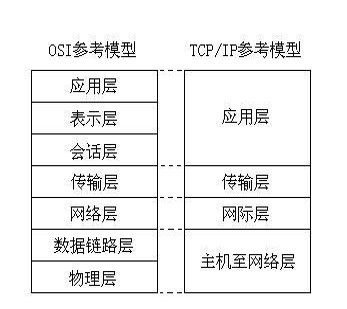

# 网络编程

- [Java基础：网络编程](http://blog.csdn.net/axi295309066/article/details/52854772)
- [Uri、URL、UriMatcher、ContentUris详解](http://blog.csdn.net/axi295309066/article/details/60129690)
- [Android应用开发：网络编程1](http://blog.csdn.net/axi295309066/article/details/50315017)
- [Android应用开发：网络编程2](http://blog.csdn.net/axi295309066/article/details/50330375)


# **1. 什么是HTTP协议**

客户端连上web服务器后，若想获得web服务器中的某个web资源，需遵守一定的通讯格式，HTTP协议用于定义客户端与web服务器通迅的格式。

HTTP是hypertext transfer protocol（超文本传输协议）的简写，它是TCP/IP协议的一个应用层协议，用于定义WEB浏览器与WEB服务器之间交换数据的过程。这个协议详细规定了浏览器和万维网服务器之间互相通信的规则。

HTTP就是一个通信规则，通信规则规定了客户端发送给服务器的内容格式，也规定了服务器发送给客户端的内容格式。其实我们要学习的就是这个两个格式！客户端发送给服务器的格式叫“请求协议”；服务器发送给客户端的格式叫“响应协议”。

HTTP协议是学习JavaWEB开发的基石，不深入了解HTTP协议，就不能说掌握了WEB开发，更无法管理和维护一些复杂的WEB站点。

## OSI网络七层协议

- 应用层（HTTP、FTP、SMTP、POP3、TELNET）
- 表示层
- 会话层
- 传输层（TCP、UDP）
- 网络层（IP）
- 数据链路层
- 物理层




# **2. HTTP协议简介**

HTTP使用请求-响应的方式进行传输，一个请求对应一个响应，并且请求只能是由客户端发起的。

利用Telnet演示请求与响应的过程

安装IE浏览器插件HttpWatch，查看IE浏览器通过HTTP协议获取某个页面。

HTTP协议的版本：HTTP/1.0、HTTP/1.1

# **3. HTTP1.0和HTTP1.1的区别**

在HTTP1.0协议中，客户端与web服务器建立连接后，只能获得一个web资源。

HTTP1.1协议，允许客户端与web服务器建立连接后，在一个连接上获取多个web资源。

利用telnet演示HTTP1.0和HTTP1.1的区别

一个好多同学搞不清楚的问题：

一个web页面中，使用img标签引用了三幅图片，当客户端访问服务器中的这个web页面时，客户端总共会访问几次服务器，即向服务器发送了几次HTTP请求。

# **4. 协议**

协议：协议的甲乙双方，就是客户端（浏览器）和服务器！

理解成双方通信的格式！

- 请求协议
- 响应协议

# **5. HttpWatch和FireBug**

HttpWatch是专门为IE浏览器提供的，用来查看HTTP请求和响应内容的工具。而FireFox上需要安装FireBug软件。如果你使用的是Chrome，那么就不用自行安装什么工具了，因为它自身就有查看请求和响应内容的功能！

HttpWatch和FireBug这些工具对浏览器而言不是必须的，但对我们开发者是很有帮助的，通过查看HTTP请求响应内容，可以使我们更好的学习HTTP协议。

# **6. 请求协议**

请求协议的格式如下：

```
请求首行；
请求头信息；
空行；
请求体。
```

浏览器发送给服务器的内容就这个格式的，如果不是这个格式服务器将无法解读！在HTTP协议中，请求有很多请求方法，其中最为常用的就是GET和POST。不同的请求方法之间的区别，后面会一点一点的介绍。

## **6.1 GET请求**

打开IE，在访问hello项目的index.jsp之间打开HttpWatch，并点击“Record”按钮。然后访问index.jsp页面。查看请求内容如下：

```
GET /hello/index.jsp HTTP/1.1
Host: localhost
User-Agent: Mozilla/5.0 (Windows NT 5.1; rv:5.0) Gecko/20100101 Firefox/5.0
Accept: text/html,application/xhtml+xml,application/xml;q=0.9,*/*;q=0.8
Accept-Language: zh-cn,zh;q=0.5
Accept-Encoding: gzip, deflate
Accept-Charset: GB2312,utf-8;q=0.7,*;q=0.7
Connection: keep-alive
Cookie: JSESSIONID=369766FDF6220F7803433C0B2DE36D98
```

- GET /hello/index.jsp HTTP/1.1：GET请求，请求服务器路径为/hello/index.jsp，协议为1.1

- Host:localhost：请求的主机名为localhost

- User-Agent: Mozilla/5.0 (Windows NT 5.1; rv:5.0) Gecko/20100101 Firefox/5.0：
  与浏览器和OS相关的信息。有些网站会显示用户的系统版本和浏览器版本信息，这都是通过获取User-Agent头信息而来的

- Accept: text/html,application/xhtml+xml,application/xml;q=0.9,*/*;q=0.8：
  告诉服务器，当前客户端可以接收的文档类型，其实这里包含了*/*，就表示什么都可以接收

- Accept-Language: zh-cn,zh;q=0.5
  当前客户端支持的语言，可以在浏览器的工具选项中找到语言相关信息
- Accept-Encoding: gzip, deflate：支持的压缩格式。数据在网络上传递时，可能服务器会把数据压缩后再发送

- Accept-Charset: GB2312,utf-8;q=0.7,*;q=0.7：客户端支持的编码

- Connection: keep-alive：客户端支持的链接方式，保持一段时间链接，默认为3000ms

- Cookie: JSESSIONID=369766FDF6220F7803433C0B2DE36D98
  因为不是第一次访问这个地址，所以会在请求中把上一次服务器响应中发送过来的Cookie在请求中一并发送去过；这个Cookie的名字为JSESSIONID，然后在讲会话是讲究它！

## **6.2 POST请求**

为了演示POST请求，我们需要修改index.jsp页面，即添加一个表单：

```html
<form action="" method="post">
  关键字：<input type="text" name="keyword"/>
  <input type="submit" value="提交"/>
</form>
```


打开HttpWatch，输入hello后点击提交，查看请求内容如下：

```
POST /hello/index.jsp HTTP/1.1
Accept: image/gif, image/jpeg, image/pjpeg, image/pjpeg, application/msword, application/vnd.ms-excel, application/vnd.ms-powerpoint, application/x-ms-application, application/x-ms-xbap, application/vnd.ms-xpsdocument, application/xaml+xml, */*
Referer: http://localhost:8080/hello/index.jsp
Accept-Language: zh-cn,en-US;q=0.5
User-Agent: Mozilla/4.0 (compatible; MSIE 7.0; Windows NT 5.1; Trident/4.0; InfoPath.2; .NET CLR 2.0.50727; .NET CLR 3.0.4506.2152; .NET CLR 3.5.30729)
Content-Type: application/x-www-form-urlencoded
Accept-Encoding: gzip, deflate
Host: localhost:8080
Content-Length: 13
Connection: Keep-Alive
Cache-Control: no-cache
Cookie: JSESSIONID=E365D980343B9307023A1D271CC48E7D

keyword=hello
```
POST请求是可以有体的，而GET请求不能有请求体。

- Referer: http://localhost:8080/hello/index.jsp
  请求来自哪个页面，例如你在百度上点击链接到了这里，那么Referer:http://www.baidu.com；如果你是在浏览器的地址栏中直接输入的地址，那么就没有Referer这个请求头了

- Content-Type: application/x-www-form-urlencoded
  表单的数据类型，说明会使用url格式编码数据；url编码的数据都是以“%”为前缀，后面跟随两位的16进制，例如“传智”这两个字使用UTF-8的url编码用为“%E4%BC%A0%E6%99%BA”

- Content-Length:13：请求体的长度，这里表示13个字节
- keyword=hello：请求体内容！hello是在表单中输入的数据，keyword是表单字段的名字。

Referer请求头是比较有用的一个请求头，它可以用来做统计工作，也可以用来做防盗链。

## **6.3 统计工作**

我公司网站在百度上做了广告，但不知道在百度上做广告对我们网站的访问量是否有影响，那么可以对每个请求中的Referer进行分析，如果Referer为百度的很多，那么说明用户都是通过百度找到我们公司网站的。

## **6.4 防盗链**

我公司网站上有一个下载链接，而其他网站盗链了这个地址，例如在我网站上的index.html页面中有一个链接，点击即可下载JDK7.0，但有某个人的微博中盗链了这个资源，它也有一个链接指向我们网站的JDK7.0，也就是说登录它的微博，点击链接就可以从我网站上下载JDK7.0，这导致我们网站的广告没有看，但下载的却是我网站的资源。这时可以使用Referer进行防盗链，在资源被下载之前，我们对Referer进行判断，如果请求来自本网站，那么允许下载，如果非本网站，先跳转到本网站看广告，然后再允许下载

# **7. 响应协议**

## **7.1 响应内容**

响应协议的格式如下：
```
响应首行；
响应头信息；
空行；
响应体。
```
响应内容是由服务器发送给浏览器的内容，浏览器会根据响应内容来显示。
```
HTTP/1.1 200 OK
Server: Apache-Coyote/1.1
Content-Type: text/html;charset=UTF-8
Content-Length: 724
Set-Cookie: JSESSIONID=C97E2B4C55553EAB46079A4F263435A4; Path=/hello
Date: Wed, 25 Sep 2012 04:15:03 GMT
```

```html
<!DOCTYPE HTML PUBLIC "-//W3C//DTD HTML 4.01 Transitional//EN">
<html>
  <head>
    <base href="http://localhost:8080/hello/">

    <title>My JSP 'index.jsp' starting page</title>
	<meta http-equiv="pragma" content="no-cache">
	<meta http-equiv="cache-control" content="no-cache">
	<meta http-equiv="expires" content="0">    
	<meta http-equiv="keywords" content="keyword1,keyword2,keyword3">
	<meta http-equiv="description" content="This is my page">
	<!--
	<link rel="stylesheet" type="text/css" href="styles.css">
	-->
  </head>

  <body>
<form action="" method="post">
  关键字：<input type="text" name="keyword"/>
  <input type="submit" value="提交"/>
</form>
  </body>
</html>
```

- HTTP/1.1 200 OK：响应协议为HTTP1.1，状态码为200，表示请求成功，OK是对状态码的解释
- Server: Apache-Coyote/1.1：服务器的版本信息
- Content-Type: text/html;charset=UTF-8：响应体使用的编码为UTF-8
- Content-Length: 724：响应体为724字节
- Set-Cookie: JSESSIONID=C97E2B4C55553EAB46079A4F263435A4; Path=/hello：响应给客户端的Cookie；
- Date: Wed, 25 Sep 2012 04:15:03 GMT：响应的时间，这可能会有8小时的时区差

## **7.2 若干响应头**

| 响应头                                      | 功能描述                        |
| :--------------------------------------- | :-------------------------- |
| Content-Encoding: gzip                   | 服务器发送数据时使用的压缩格式             |
| Server:apache tomcat                     | 服务器的基本信息                    |
| Content-Length: 80                       | 发送数据的大小                     |
| Content-Language: zh-cn                  | 发送的数据使用的语言环境                |
| Content-Disposition: attachment;filename=aaa.zip | 与下载相关的头                     |
| Expires: -1                              | 指定资源缓存的时间，如果取值为0或-1浏览就不缓存资源 |
| Cache-Control: no-cache                  | 缓存相关的头，如果为no-cache则通知浏览器不缓存 |
| Pragma: no-cache                         | 缓存相关的头，如果为no-cache则不缓存      |
| Connection: close/Keep-Alive             | 是否保持连接                      |
| Location                                 | 配合302实现请求重定向                |
| Content-Type                             | 发送数据的类型和编码                  |
| Last-Modified                            | 最后修改时间                      |
| Refresh                                  | 自动刷新，n秒后跳转到另一个页面            |
| Set-Cookie                               | 发送Cookie信息                  |
Location: http://www.it315.org/index.jsp  配合302实现请求重定向


Content-Type: text/html; charset=GB2312 当前所发送的数据的基本信息，（数据的类型，所使用的编码）

Last-Modified: Tue, 11 Jul 2000 18:23:51 GMT 缓存相关的头

Refresh: 1;url=http://www.it315.org 通知浏览器进行定时刷新，此值可以是一个数字指定多长时间以后刷新当前页面，这个数字之后也可以接一个分号后跟一个URL地址指定多长时间后刷新到哪个URL

Transfer-Encoding: chunked 传输类型，如果是此值是一个chunked说明当前的数据是一块一块传输的

Set-Cookie:SS=Q0=5Lb_nQ; path=/search 和cookie相关的头，后面课程单讲

ETag: W/"83794-1208174400000" 和缓存机制相关的头
​     
Date: Tue, 11 Jul 2000 18:23:51 GMT 当前时间

## **7.3 响应码**

响应头对浏览器来说很重要，它说明了响应的真正含义。例如200表示响应成功了，302表示重定向，这说明浏览器需要再发一个新的请求。

| 响应码  | 描述                                       |
| :--- | :--------------------------------------- |
| 200  | 请求成功，浏览器会把响应体内容（通常是html）显示在浏览器中          |
| 206  | 请求部分资源，和请求头Range使用                       |
| 302  | 重定向，当响应码为302时，表示服务器要求浏览器重新再发一个请求，<br/>服务器会发送一个响应头Location，它指定了新请求的URL地址 |
| 304  | 服务器通知浏览器使用缓存                             |
| 307  | 服务器通知浏览器使用缓存                             |
| 404  | 请求的资源没有找到，说明客户端错误的请求了不存在的资源              |
| 500  | 请求资源找到了，但服务器内部出现了错误                      |
304：当用户第一次请求index.html时，服务器会添加一个名为Last-Modified响应头，这个头说明了index.html的最后修改时间，浏览器会把index.html内容，以及最后响应时间缓存下来。当用户第二次请求index.html时，在请求中包含一个名为If-Modified-Since请求头，它的值就是第一次请求时服务器通过Last-Modified响应头发送给浏览器的值，即index.html最后的修改时间，If-Modified-Since请求头就是在告诉服务器，我这里浏览器缓存的index.html最后修改时间是这个，您看看现在的index.html最后修改时间是不是这个，如果还是，那么您就不用再响应这个index.html内容了，我会把缓存的内容直接显示出来。而服务器端会获取If-Modified-Since值，与index.html的当前最后修改时间比对，如果相同，服务器会发响应码304，表示index.html与浏览器上次缓存的相同，无需再次发送，浏览器可以显示自己的缓存页面，如果比对不同，那么说明index.html已经做了修改，服务器会响应200


响应头：

- Last-Modified：最后的修改时间

请求头

- If-Modified-Since：把上次请求的index.html的最后修改时间还给服务器；状态码：304，比较If-Modified-Since的时间与文件真实的时间一样时，服务器会响应304，而且不会有响正文，表示浏览器缓存的就是最新版本

## **7.4 其他响应头**

1、告诉浏览器不要缓存的响应头

- Expires: -1
- Cache-Control: no-cache
- Pragma: no-cache

以上三个头都是用来控制缓存的，是因为历史原因造成的，不同的浏览器认识不同的头，我们通常三个一起使用保证通用性

2、自动刷新响应头，浏览器会在3秒之后请求http://www.itcast.cn：

- Refresh: 3;url=http://www.itcast.cn

## **7.5 HTML中指定响应头**

在HTMl页面中可以使用<meta http-equiv="Content-Type" content="text/html; charset=UTF-8">来指定响应头，例如在index.html页面中给出<meta http-equiv="Refresh" content="3;url=http://www.itcast.cn">，表示浏览器只会显示index.html页面3秒，然后自动跳转到http://www.itcast.cn。

# 8. 模拟网络请求

restClient，这个是firefox上的一个插件，对应chrome浏览器叫做postman，这个插件主要用作和服务器开发人员联调协议

## postman


## restClient


# 9. 测试请求的地址

http://httpbin.org


# 10. gzip压缩
一种压缩格式，一种压缩方式，可以对网络传输的数据进行压缩。减少网络传输的大小

为什么需要压缩?因为经过压缩，可以减少体积，提高传输速度,提高用户体验

## 10.1 浏览器发送器请求的过程

- 1.发送请求头:Accept-Encoding:gzip
- 2.服务器压缩数据,返回数据,在响应头里面添加Content-Encoding:gzip
- 3.客户端,根据Content-Encoding这个响应头,对应解压
  - 有Content-Encoding:gzip-->gzip解压
  - 没有Content-Encoding:gzip-->标准解压

app使用gzip压缩：返回的json/xml(文本信息)其实就是个特殊的网页,其实也是可以进行gzip压缩

## 10.2 gzip压缩效果


通过数据，我们得知，文本的压缩率，大概可以达到70%左右。压缩率很高

## 10.3 gzip压缩的实现

```java
try {
	boolean isGzip = false;
	//1.创建httpclient
	DefaultHttpClient httpClient = new DefaultHttpClient();
	//2.创建get请求
	HttpGet get = new HttpGet("http://httpbin.org/gzip");
	//① 添加请求头 Accept-Encoding:"gzip, deflate"
	get.addHeader("Accept-Encoding", "gzip");
	//3.执行请求
	HttpResponse response = httpClient.execute(get);
	if (response.getStatusLine().getStatusCode() == 200) {
		//② 得到响应头,Content-Encoding:"gzip"
		Header[] headers = response.getHeaders("Content-Encoding");
		for (Header header : headers) {
			if (header.getValue().equals("gzip")) {//后台server把数据进行了gzip压缩
				isGzip = true;
			}
		}
		String result = "";
		HttpEntity entity = response.getEntity();
		//③根据是否使用gzip压缩.采取不同的解压方式
		if (isGzip) {
			//④进行gzip的解压
			GZIPInputStream in = new GZIPInputStream(response.getEntity().getContent());
			//in-->string
			result = convertStreamToString(in);
		} else {
			//4.打印结果
			result = EntityUtils.toString(entity);
		}
		System.out.println("result:" + result);
	}
} catch (Exception e) {
	e.printStackTrace();
}
```
# 11. 抓包

## [11.1 Fiddler](http://www.telerik.com/fiddler)
只能抓浏览器返回的包，即只可以抓PC上的包，无法抓手机上的包


## [11.2 Wireshark](https://www.wireshark.org/)
世界上最流行的网络协议分析器，[抓包工具Wireshark基本介绍和学习TCP三次握手](http://blog.csdn.net/axi295309066/article/details/62141352)


通过ping命令拿到网址的IP
