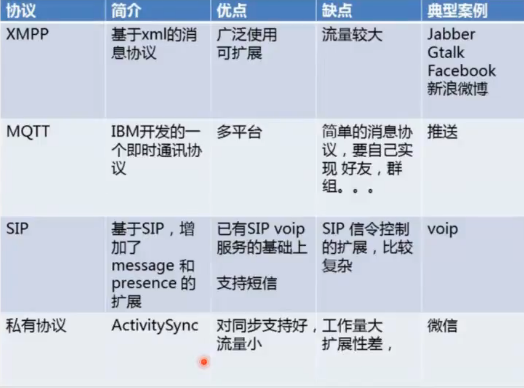

# 即时通讯系列阅读

1. [即时通讯基础](http://blog.csdn.net/axi295309066/article/details/62427091)
2. [即时通讯：XMPP基础](http://blog.csdn.net/axi295309066/article/details/62427206)
3. [即时通讯：XMPP项目实践-微聊](http://blog.csdn.net/axi295309066/article/details/62427366)
4. [Smack类库最好的学习资料](http://blog.csdn.net/axi295309066/article/details/62435856)

# 1. 即时通讯简介

即时通讯（Instant Messaging）是目前Internet 上最为流行的通讯方式，各种各样的即时通讯软件也层出不穷；服务提供商也提供了越来越丰富的通讯服务功能。不容置疑，Internet 已经成为真正的信息高速公路。从实际工程应用角度出发,以计算机网络原理为指导,结合当前网络中的一些常用技术,编程实现基于C/S 架构的网络聊天工具是切实可行的。

目前，中国市场上的企业级即时通信工具主要包括：信鸽、视高科技的视高可视协同办公平台、263EM、群英CC2010、通软联合的GoCom、腾讯公司的RTX、IBM 的Lotus Sametime、点击科技的GKE、中国互联网办公室的imo、中国移动的企业飞信、华夏易联的e-Link、擎旗的UcStar 等。相对于个人即时通信工具而言，企业级即时通信工具更加强调安全性、实用性、稳定性和扩展性

## 1.1 即时聊天的解决方案

- socket：套接字，连接需要`ip`和`端口`，分为tcp和udp两种形式
- xmpp：xmpp + openfire + asmack

## 1.2 常见协议



## 1.3 常见的术语

- xmpp:基于xml的可拓展协议.
- jabber:xmpp的前身.
- openfire:支持xmpp的开源服务器
- smack.jar:对xmpp协议封装.方便开发的jar包.
- spark.exe:基于xmpp的pc客户端;
- asmack.jar:smack.jar的精简版.**专门针对android端开发**

# 2. 基本概念和原理

## 2.1 常用的网络通信协议

TCP/IP：Transmission Control Protocol/Internet Protocol 的简写，中译名为传输控制协议/因特网互联协议，又名网络通讯协议，是Internet 最基本的协议、Internet 国际互联网络的基础，由网络层的IP 协议和传输层的TCP协议组成。TCP/IP 定义了电子设备如何连入因特网，以及数据如何在它们之间传输的标准。协议采用了4 层的层级结构，每一层都呼叫它的下一层所提供的协议来完成自己的需求。通俗而言：TCP 负责发现传输的问题，一有问题就发出信号，要求重新传输，直到所有数据安全正确地传输到目的地。而IP 是给因特网的每一台联网设备规定一个地址。

UDP：UDP 协议全称是用户数据报协议，在网络中它与TCP 协议一样用于处理数据包，是一种无连接的协议。在OSI 模型中，在第四层——传输层，处于IP 协议的上一层。UDP 有不提供数据包分组、组装和不能对数据包进行排序的缺点，也就是说，当报文发送之后，是无法得知其是否安全完整到达的。UDP 用来支持那些需要在计算机之间传输数据的网络应用。包括网络视频会议系统在内的众多的客户/服务器模式的网络应用都需要使用UDP协议。UDP 协议从问世至今已经被使用了很多年，虽然其最初的光彩已经被一些类似协议所掩盖，但是即使是在今天UDP 仍然不失为一项非常实用和可行的网络传输层协议。

TCP/IP 协议栈主要分为四层:应用层、传输层、网络层、数据链路层,每层都有相应的协议，如下图：


所谓的协议就是双方进行数据传输的一种格式。

## 2.2 TCP、UDP 特点对比

TCP 协议是面向连接、保证高可靠性(数据无丢失、数据无失序、数据无错误、数据无重复到达)传输层协议。UDP 协议也是传输层协议，它是无连接，不保证可靠的传输层协议。

## 2.3 TCP 三次握手过程

1、请求端(通常称为客户)发送一个SYN 段指明客户打算连接的服务器的端口，以及初始序号(ISN)
2、服务器发回包含服务器的初始序号的SYN 报文段(报文段2)作为应答。同时，将确认序号设置为客户的ISN加1 以对客户的SYN 报文段进行确认。

| TCP        | UDP       |
| :--------- | :-------- |
| 面向连接       | 面向非连接     |
| 可靠的连接      | 不可靠的连接    |
| 速度慢        | 速度快       |
| 大文件、重要的数据等 | 适合小数据、不重要 |

3、客户必须将确认序号设置为服务器的ISN 加1 以对服务器的SYN 报文段进行确认(报文段3)这三个报文段完成连接的建立。这个过程也称为三次握手(three-way handshake)。

上面的过程如下图所示：


## 2.4 即时通讯形式

### 直接通讯
两个不同客户端之间不经过服务器，直接通过网络进行数据的交互。常用的p2p 技术就是直接通讯的形式。

### 在线代理通讯
一个客户端发送的消息先发送到服务器，服务器接收到消息后再发送给指定的另外一个客户端。QQ 的消息
尤其是离线消息就是同在线代理的方式实现的。

### 离线代理通讯
一个客户端发送消息给服务器，服务器存储在数据库中个，当另外一个客户端上线后在发送过去。

### 离线扩展通讯
一个客户端发送消息给服务器，服务器通过邮件、短信等其他形式将消息发送给接收者。

# 3. ServerSocket 和Socket

## 3.1 使用Java 完成简单的Socket 通信

在Java 中Socket 可以理解为客户端或者服务器端的一个特殊的对象，这个对象有两个关键的方法，一个是getInputStream 方法，另一个是getOutputStream 方法。getInputStream 方法可以得到一个输入流，客户端的Socket对象上的getInputStream 方法得到的输入流其实就是从服务器端发回的数据流。GetOutputStream 方法得到一个输出流，客户端Socket 对象上的getOutputStream 方法返回的输出流就是将要发送到服务器端的数据流，（其实是一个缓冲区，暂时存储将要发送过去的数据）。

下面就让我们写一个简单的Demo 来演示Socket 是如何使用的。

### 建立服务器类

服务类使用到的核心类的是ServerSocket。这里我们只需要建立一个Java Project 即可。

```Java
public class IMServer {
     private static ServerSocket   serverSocket;
     private static BufferedReader reader;

     public static void main(String[] args) {
         try {
             serverSocket = new ServerSocket(7788);
             /**
              * 等待接收客户端连接进来，该方法是线程阻塞的
              */
             Socket accept = serverSocket.accept();
             /**

              * 获取输入流，用于接收客户端发来的数据
              */
             InputStream inputStream = accept.getInputStream();
             /**

              * 将字节输入流转化为字符输出流
              */
             reader = new BufferedReader(new InputStreamReader(inputStream));
             /**

              * 打印数据
              */
             String tmp = null;
             while ((tmp = reader.readLine()) != null) {
                 System.out.println(tmp);
             }
         } catch (Exception e) {
             e.printStackTrace();
         } finally {
             try {
                 if (serverSocket != null) {
                     serverSocket.close();
                 }
             } catch (IOException e) {
                 e.printStackTrace();
             }
             if (reader != null) {
                 try {
                     reader.close();
                 } catch (IOException e) {
                     e.printStackTrace();
                 }
             }
         }
     }
 }
```

### 建立客户端类

```java
public class IMClient {
     private static Socket socket;

     private static BufferedWriter writer;

     /**
      * @param args
      */
     public static void main(String[] args) {
         try {
             socket = new Socket("127.0.0.1", 7788);
             /**
              * 获取输出流
              */
             OutputStream outputStream = socket.getOutputStream();
             writer = new BufferedWriter(new OutputStreamWriter(outputStream));
             writer.write("hello wo shi wzy!" + new Date().getTime());
             writer.close();
         } catch (IOException e) {
             e.printStackTrace();
         } finally {
             if (socket != null) {
                 try {
                     socket.close();
                 } catch (IOException e) {
                     e.printStackTrace();
                 }
             }
             if (writer != null) {
                 try {
                     writer.close();
                 } catch (IOException e) {
                     e.printStackTrace();
                 }
             }
         }
     }
 }
```
在上面的代码中我们仅仅实现了一个最简单的服务器和客户端，服务器启动起来后只能接受到一次消息，然后就关闭了。如果想让服务器一直运行，应该通过死循环来处理不同的发送进来的消息。

# 4. Socket调试工具

TCP/UDP Socket调试工具提供了TCP Server,TCP Client,UDP Server,UDP Client,UDP Group 五种Socket调试方案


## 4.1 TCP

### 4.1.1 手机作为Client，PC作为Server


```java
public class MyClientActivity extends Activity {
	private EditText mEditText = null;
	private Button connectButton = null;
	private Button sendButton = null;
	private TextView mTextView = null;

	private Socket clientSocket = null;
	private OutputStream outStream = null;

	private Handler mHandler = null;

	private ReceiveThread mReceiveThread = null;
	private boolean stop = true;

	/** Called when the activity is first created. */
	@Override
	public void onCreate(Bundle savedInstanceState) {
		super.onCreate(savedInstanceState);
		setContentView(R.layout.main);

		mEditText = (EditText) this.findViewById(R.id.edittext);
		mTextView = (TextView) this.findViewById(R.id.retextview);
		connectButton = (Button) this.findViewById(R.id.connectbutton);
		sendButton = (Button) this.findViewById(R.id.sendbutton);
		sendButton.setEnabled(false);

		// 连接按钮监听
		connectButton.setOnClickListener(new View.OnClickListener() {

			@Override
			public void onClick(View v) {
				// TODO Auto-generated method stub
				try {
					// 实例化对象并连接到服务器
					clientSocket = new Socket("172.27.35.1", 60000);
				} catch (UnknownHostException e) {
					// TODO Auto-generated catch block
					e.printStackTrace();
				} catch (IOException e) {
					// TODO Auto-generated catch block
					e.printStackTrace();
				}

				displayToast("连接成功！");
				// 连接按钮使能
				connectButton.setEnabled(false);
				// 发送按钮使能
				sendButton.setEnabled(true);

				mReceiveThread = new ReceiveThread(clientSocket);
				stop = false;
				// 开启线程
				mReceiveThread.start();
			}
		});

		// 发送数据按钮监听
		sendButton.setOnClickListener(new View.OnClickListener() {

			@Override
			public void onClick(View v) {
				// TODO Auto-generated method stub
				byte[] msgBuffer = null;
				// 获得EditTex的内容
				String text = mEditText.getText().toString();
				try {
					// 字符编码转换
					msgBuffer = text.getBytes("GB2312");
				} catch (UnsupportedEncodingException e1) {
					// TODO Auto-generated catch block
					e1.printStackTrace();
				}

				try {
					// 获得Socket的输出流
					outStream = clientSocket.getOutputStream();
				} catch (IOException e) {
					// TODO Auto-generated catch block
					e.printStackTrace();
				}

				try {
					// 发送数据
					outStream.write(msgBuffer);
				} catch (IOException e) {
					// TODO Auto-generated catch block
					e.printStackTrace();
				}
				// 清空内容
				mEditText.setText("");
				displayToast("发送成功！");
			}
		});

		// 消息处理
		mHandler = new Handler() {
			@Override
			public void handleMessage(Message msg) {
				// 显示接收到的内容
				mTextView.setText((msg.obj).toString());
			}
		};

	}

	// 显示Toast函数
	private void displayToast(String s) {
		Toast.makeText(this, s, Toast.LENGTH_SHORT).show();
	}

	private class ReceiveThread extends Thread {
		private InputStream inStream = null;

		private byte[] buf;
		private String str = null;

		ReceiveThread(Socket s) {
			try {
				// 获得输入流
				this.inStream = s.getInputStream();
			} catch (IOException e) {
				// TODO Auto-generated catch block
				e.printStackTrace();
			}
		}

		@Override
		public void run() {
			while (!stop) {
				this.buf = new byte[512];

				try {
					// 读取输入数据（阻塞）
					this.inStream.read(this.buf);
				} catch (IOException e) {
					// TODO Auto-generated catch block
					e.printStackTrace();
				}

				// 字符编码转换
				try {
					this.str = new String(this.buf, "GB2312").trim();
				} catch (UnsupportedEncodingException e) {
					// TODO Auto-generated catch block
					e.printStackTrace();
				}

				Message msg = new Message();
				msg.obj = this.str;
				// 发送消息
				mHandler.sendMessage(msg);

			}
		}

	}

	@Override
	public void onDestroy() {
		super.onDestroy();

		if (mReceiveThread != null) {
			stop = true;
			mReceiveThread.interrupt();
		}
	}

}
```
### 4.1.2 手机作为Server，PC作为Client


```java
public class MyServerActivity extends Activity {
	private TextView ipTextView = null;
	private EditText mEditText = null;
	private Button sendButton = null;
	private TextView mTextView = null;

	private OutputStream outStream = null;
	private Socket clientSocket = null;
	private ServerSocket mServerSocket = null;

	private Handler mHandler = null;

	private AcceptThread mAcceptThread = null;
	private ReceiveThread mReceiveThread = null;
	private boolean stop = true;

	/** Called when the activity is first created. */
	@Override
	public void onCreate(Bundle savedInstanceState) {
		super.onCreate(savedInstanceState);
		setContentView(R.layout.main);

		ipTextView = (TextView) this.findViewById(R.id.iptextview);
		mEditText = (EditText) this.findViewById(R.id.sedittext);
		sendButton = (Button) this.findViewById(R.id.sendbutton);
		sendButton.setEnabled(false);
		mTextView = (TextView) this.findViewById(R.id.textview);

		// 发送数据按钮监听
		sendButton.setOnClickListener(new View.OnClickListener() {

			@Override
			public void onClick(View v) {
				// TODO Auto-generated method stub
				byte[] msgBuffer = null;
				// 获得EditTex的内容
				String text = mEditText.getText().toString();
				try {
					// 字符编码转换
					msgBuffer = text.getBytes("GB2312");
				} catch (UnsupportedEncodingException e1) {
					// TODO Auto-generated catch block
					e1.printStackTrace();
				}

				try {
					// 获得Socket的输出流
					outStream = clientSocket.getOutputStream();
				} catch (IOException e) {
					// TODO Auto-generated catch block
					e.printStackTrace();
				}

				try {
					// 发送数据
					outStream.write(msgBuffer);
				} catch (IOException e) {
					// TODO Auto-generated catch block
					e.printStackTrace();
				}
				// 清空内容
				mEditText.setText("");
				displayToast("发送成功！");

			}
		});
		// 消息处理
		mHandler = new Handler() {
			@Override
			public void handleMessage(Message msg) {
				switch (msg.what) {
				case 0: {
					// 显示客户端IP
					ipTextView.setText((msg.obj).toString());
					// 使能发送按钮
					sendButton.setEnabled(true);
					break;
				}
				case 1: {
					// 显示接收到的数据
					mTextView.setText((msg.obj).toString());
					break;
				}
				}

			}
		};

		mAcceptThread = new AcceptThread();
		// 开启监听线程
		mAcceptThread.start();

	}

	// 显示Toast函数
	private void displayToast(String s) {
		Toast.makeText(this, s, Toast.LENGTH_SHORT).show();
	}

	private class AcceptThread extends Thread {
		@Override
		public void run() {
			try {
				// 实例化ServerSocket对象并设置端口号为7100
				mServerSocket = new ServerSocket(60000);
			} catch (IOException e) {
				// TODO Auto-generated catch block
				e.printStackTrace();
			}

			try {
				// 等待客户端的连接（阻塞）
				clientSocket = mServerSocket.accept();
			} catch (IOException e) {
				// TODO Auto-generated catch block
				e.printStackTrace();
			}

			mReceiveThread = new ReceiveThread(clientSocket);
			stop = false;
			// 开启接收线程
			mReceiveThread.start();

			Message msg = new Message();
			msg.what = 0;
			// 获取客户端IP
			msg.obj = clientSocket.getInetAddress().getHostAddress();
			// 发送消息
			mHandler.sendMessage(msg);

		}

	}

	private class ReceiveThread extends Thread {
		private InputStream mInputStream = null;
		private byte[] buf;
		private String str = null;

		ReceiveThread(Socket s) {
			try {
				// 获得输入流
				this.mInputStream = s.getInputStream();
			} catch (IOException e) {
				// TODO Auto-generated catch block
				e.printStackTrace();
			}
		}

		@Override
		public void run() {
			while (!stop) {
				this.buf = new byte[512];

				// 读取输入的数据(阻塞读)
				try {
					this.mInputStream.read(buf);
				} catch (IOException e1) {
					// TODO Auto-generated catch block
					e1.printStackTrace();
				}

				// 字符编码转换
				try {
					this.str = new String(this.buf, "GB2312").trim();
				} catch (UnsupportedEncodingException e) {
					// TODO Auto-generated catch block
					e.printStackTrace();
				}

				Message msg = new Message();
				msg.what = 1;
				msg.obj = this.str;
				// 发送消息
				mHandler.sendMessage(msg);

			}
		}
	}

	@Override
	public void onDestroy() {
		super.onDestroy();

		if (mReceiveThread != null) {
			stop = true;
			mReceiveThread.interrupt();
		}
	}

}
```
## 4.2 UDP


```java
public class MainActivity extends Activity {
	private static String TAG = "CallActivity";
	private Handler handler = new Handler() {
		public void handleMessage(android.os.Message msg) {
			// 播放声音
			initBeepSound();
			playBeepSoundAndVibrate();
			Log.i(TAG, "reciever_msg");
			String result = (String) msg.obj;
			System.out.println(result);
			tv_result.setText(result);
		};
	};
	private String ip;

	@Override
	protected void onCreate(Bundle savedInstanceState) {
		// TODO
		super.onCreate(savedInstanceState);
		setContentView(R.layout.activity_main);
		ip = IpUtil.getIp(this);
		Toast.makeText(this, ip, Toast.LENGTH_LONG).show();
		System.out.println("ip:" + ip);
		tv_result = (TextView) findViewById(R.id.tv_result);
	}

	/**
	 * 发送者
	 */
	public void send(View v) {
		new Thread() {
			@Override
			public void run() {
				try {
					//1.  创建一个DatagramSocket对象
					DatagramSocket socket = new DatagramSocket(5678);
					//2.  创建一个 InetAddress ， 相当于是地址,就是想要发送的ip地址
					InetAddress serverAddress = InetAddress.getByName("172.27.35.1");
					//3.  这是随意发送一个数据
					String str = "来自android手机的问候";
					//4.  转为byte类型
					byte data[] = str.getBytes("GBK");
					//5.  创建一个DatagramPacket 对象，并指定要讲这个数据包发送到网络当中的哪个地址，以及端口号
					DatagramPacket pack = new DatagramPacket(data, data.length, serverAddress, 5678);
					//6.  调用DatagramSocket对象的send方法 发送数据
					socket.send(pack);
				} catch (SocketException e) {
					Log.i(TAG, "error");
					e.printStackTrace();
				} catch (UnknownHostException e) {
					Log.i(TAG, "error");
					e.printStackTrace();
				} catch (IOException e) {
					Log.i(TAG, "error");
					e.printStackTrace();
				}
			}
		}.start();

	}

	/**
	 * 接收者
	 * @param v
	 */
	public void receive(View v) {
		new Thread() {
			@Override
			public void run() {
				// 执行完毕后给handler发送一个空消息
				try {
					// 1. 创建一个DatagramSocket对象，并指定监听的端口号/\
					DatagramSocket socket = new DatagramSocket(5678);
					// 2. 创建一个byte数组用于接收
					byte data[] = new byte[1024];
					// 3. 创建一个空的DatagramPackage对象
					DatagramPacket pack = new DatagramPacket(data, data.length);
					// 4. 使用receive方法接收发送方所发送的数据,同时这也是一个阻塞的方法
					while (true) {
						Log.i(TAG, "reciever_1");
						socket.receive(pack);
						Log.i(TAG, "reciever_2");
						// 5. 得到发送过来的数据
						//						String result = new String(pack.getData(), pack.getOffset(), pack.getLength(),"GBK");
						String result = new String(pack.getData(), pack.getOffset(), pack.getLength());
						Message msg = new Message();
						msg.obj = result;
						handler.sendMessage(msg);
						Log.i(TAG, "sendmsg_1");
					}
				} catch (UnknownHostException e) {
					// TODO Auto-generated catch block
					e.printStackTrace();
					Log.i(TAG, "error");
				} catch (IOException e) {
					// TODO Auto-generated catch block
					e.printStackTrace();
					Log.i(TAG, "error");
				}
			}
		}.start();
	}

	@Override
	protected void onDestroy() {
		super.onDestroy();
	}

	// 播放声音
	private static final float BEEP_VOLUME = 0.10f;
	private MediaPlayer mediaPlayer;

	private void initBeepSound() {
		if (mediaPlayer == null) {
			setVolumeControlStream(AudioManager.STREAM_MUSIC);
			mediaPlayer = new MediaPlayer();
			mediaPlayer.setAudioStreamType(AudioManager.STREAM_MUSIC);
			mediaPlayer.setOnCompletionListener(beepListener);
			AssetFileDescriptor file = getResources().openRawResourceFd(R.raw.beep);
			try {
				mediaPlayer.setDataSource(file.getFileDescriptor(), file.getStartOffset(), file.getLength());
				file.close();
				mediaPlayer.setVolume(BEEP_VOLUME, BEEP_VOLUME);
				mediaPlayer.prepare();
			} catch (IOException e) {
				mediaPlayer = null;
			}
		}
	}

	private void playBeepSoundAndVibrate() {
		if (mediaPlayer != null) {
			mediaPlayer.start();
		}
		// 震动
		Vibrator mVibrator = (Vibrator) getApplication().getSystemService(Service.VIBRATOR_SERVICE);
		mVibrator.vibrate(2000);
		long[] pattern = { 0, 100, 200, 100, 200 };
		mVibrator.vibrate(pattern, -1);
	}

	private final OnCompletionListener beepListener = new OnCompletionListener() {
		public void onCompletion(MediaPlayer mediaPlayer) {
			mediaPlayer.seekTo(0);
		}
	};
	// 退出提醒
	private long exitTime;
	private TextView tv_result;

	@Override
	public boolean onKeyDown(int keyCode, KeyEvent event) {
		if (event.getAction() == KeyEvent.ACTION_DOWN && event.getKeyCode() == KeyEvent.KEYCODE_BACK) {
			if ((System.currentTimeMillis() - exitTime) > 2000) {
				Toast.makeText(getApplicationContext(), "再按一次退出" + getResources().getString(R.string.app_name),
						Toast.LENGTH_SHORT).show();
				exitTime = System.currentTimeMillis();
			} else {
				finish();
			}
			return true;
		}
		return super.onKeyDown(keyCode, event);
	}
}
```
IpUtil.java
```java
public class IpUtil {
	/**
	 * 获取手机ip
	 * 
	 * @return
	 */
	public static String getLocalIpAddress() {
		try {
			for (Enumeration<NetworkInterface> en = NetworkInterface.getNetworkInterfaces(); en.hasMoreElements();) {
				NetworkInterface intf = en.nextElement();
				for (Enumeration<InetAddress> enumIpAddr = intf.getInetAddresses(); enumIpAddr.hasMoreElements();) {
					InetAddress inetAddress = enumIpAddr.nextElement();
					if (!inetAddress.isLoopbackAddress()) {
						String ip = inetAddress.getHostAddress().toString();
						System.out.println("getLocalIpAddressIP:"+ip);
						return ip;
					}
				}
			}
		} catch (SocketException ex) {
			Log.e("ifo", ex.toString());
		}
		return "";
	}

	public static String getIp(Activity activity) {
		WifiManager wifiManager = (WifiManager) activity.getSystemService(Context.WIFI_SERVICE);
		WifiInfo wifiInfo = wifiManager.getConnectionInfo();
		int ipAddress = wifiInfo.getIpAddress();

		// 格式化IP address，例如：格式化前：1828825280，格式化后：192.168.1.109
		String ip = String.format("%d.%d.%d.%d", (ipAddress & 0xff), (ipAddress >> 8 & 0xff), (ipAddress >> 16 & 0xff), (ipAddress >> 24 & 0xff));
		System.out.println("getIpIP:"+ip);
		return ip;

	}

}
```