随着互联网+时代的来临，越来越多的互联网企业层出不穷，涉及游戏、视频、新闻、社交、电商、房产、旅游等众多行业。如今互联网成为大量信息的载体，如何有效地从中提取有价值的信息并利用这些信息成为一个巨大的挑战

爬虫，一个可怕的怪物，从百度、Google等搜索引擎公司诞生开始便有了它的身影，如今移动互联网时代爬虫更是猖狂，每个网站似乎都被它光顾过，只是你看不到，不过你放心它不干坏事，你能在网上迅速搜索到你到的信息应该都是它的功劳，它每天会默默无闻的采集互联网上的丰富信息供大家查询共享。Java作为互联网开发的主流语言，广泛应用于互联网领域，本课程使用java技术为大家讲解如何编写爬虫程序爬取网络上有价值的数据信息。

# 知识点

- 爬虫的架构解析
- 爬虫基本原理分析
- 编写爬虫程序
- 爬虫在电商中的应用

# 1. 爬虫简介

我们访问某一个网页的时候，在地址栏输入网址，按回车，该网站的服务器就会返回一个HTML文件给我们，浏览器解析返回的数据，展示在UI上。同样爬虫程序也是模仿人的操作，给网站发送一个请求，网站会给爬虫程序返回一个HTML文件，爬虫程序再根据返回的数据进行抓取分析

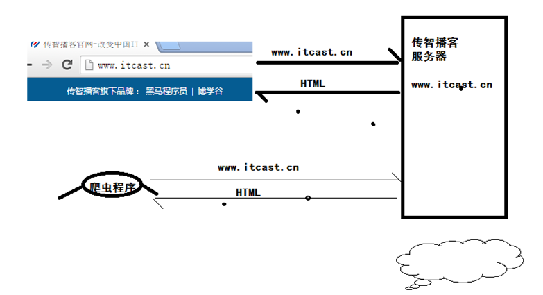

## 1.1 爬虫概论

网络爬虫（Web crawler）也叫网络蜘蛛（Web spide）自动检索工具（automatic indexer），是一种”自动化浏览网络“的程序，或者说是一种网络机器人。

爬虫被广泛用于互联网搜索引擎或其他类似网站，以获取或更新这些网站的内容和检索方式。它们可以自动采集所有其能够访问到的页面内容，以供搜索引擎做进一步处理（分检整理下载的页面），而使得用户能更快的检索到他们需要的信息。

通俗的讲，就是把你手动打开窗口，输入数据等等操作用程序代替。用程序替你获取你想要的信息，这就是网络爬虫

## 1.2 爬虫应用
### 1.2.1 搜索引擎
爬虫程序可以为搜索引擎系统爬取网络资源，用户可以通过搜索引擎搜索网络上一切所需要的资源。搜索引擎是一套非常庞大且精密的算法系统，搜索的准确性，高效性等都对搜索系统有很高的要求。

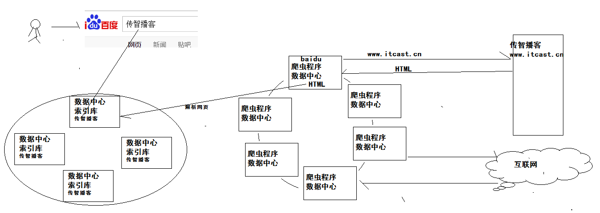

### 1.2.2 数据挖掘
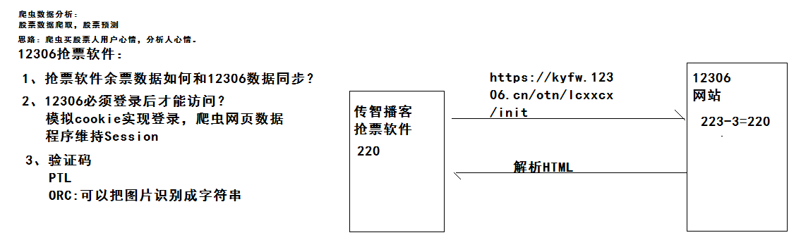

爬虫除了用来做搜索外，还可以做非常多的工作，可以说爬虫现在在互联网项目中应用的非常广泛。
互联网项目通过爬取相关数据主要进行数据分析，获取价值数据。那么爬虫具体可以做那么分析，下面可以简单做一个简单了解：

- 股票分析---预测股市
- 社会学方面统计预测
  - 情绪地图
  - 饮食分布图
  - 票房分析预测
  - 机场实时流量
  - 公交系统实时线路
  - 火车票实时销售统计
- App下载量分析

## 1.3 爬虫原理
###	1.3.1 爬虫目的
一般来讲对我们而言需要抓取的是某个网站或者某个应用的内容，提取有用的价值，进行数据分析。

###	1.3.2 爬虫框架设计
为了开发的方便，也可以使用爬虫框架来开发项目中的爬虫；一个通用的网络爬虫的框架如图所示：

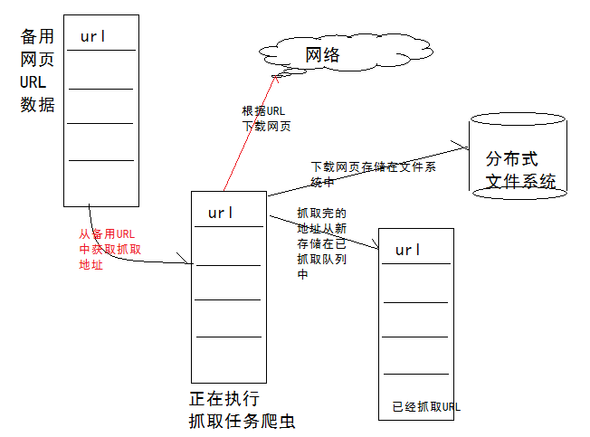

网络爬虫的基本工作流程如下：

1. 首先选取一部分精心挑选的种子URL
2. 将这些URL放入待抓取URL队列
3. 从待抓取URL队列中取出待抓取在URL，解析DNS，并且得到主机的ip，并将URL对应的网页下载下来，存储进已下载网页库中。此外，将这些URL放进已抓取URL队列
4. 分析已抓取URL队列中的URL，分析其中的其他URL，并且将URL放入待抓取URL队列，从而进入下一个循环


# 2. Java爬虫框架

## 2.1 Nutch

Nutch属于分布式爬虫，爬虫使用分布式，主要是解决两个问题：1)海量URL管理；2)网速。如果要做搜索引擎，Nutch1.x是一个非常好的选择。Nutch1.x和solr或者es配合，就可以构成一套非常强大的搜索引擎，否则尽量不要选择Nutch作为爬虫。用Nutch进行爬虫的二次开发，爬虫的编写和调试所需的时间，往往是单机爬虫所需的十倍时间不止。

## 2.2 Heritrix

Heritrix 是个“Archival Crawler”——来获取完整的、精确的、站点内容的深度复制。包括获取图像以及其他非文本内容。抓取并存储相关的内容。对内容来者不拒，不对页面进行内容上的修改。重新爬行对相同的URL不针对先前的进行替换。爬虫主要通过Web用户界面启动、监控和调整，允许弹性的定义要获取的url。

## 2.3 crawler4j

crawler4j是Java实现的开源网络爬虫。提供了简单易用的接口，可以在几分钟内创建一个多线程网络爬虫。

## 2.4 WebCollector

WebCollector使用了Nutch的爬取逻辑（分层广度遍历），Crawler4j的的用户接口（覆盖visit方法，定义用户操作）,以及一套自己的插件机制，设计了一套爬虫内核。

## 2.5 WebMagic

WebMagic项目代码分为核心和扩展两部分。核心部分(webmagic-core)是一个精简的、模块化的爬虫实现，而扩展部分则包括一些便利的、实用性的功能。WebMagic的架构设计参照了Scrapy，目标是尽量的模块化，并体现爬虫的功能特点。

# 3. HttpClient&Jsoup
爬虫实现的技术有很多，对于java语言来说，有很多的选择，可以是很多开源的爬虫框架，也可以使用基本httpClient,Jsoup来爬取网页

##	3.1 HttpClient简介
HttpClient 是 apache 组织下面的一个用于处理 HTTP 请求和响应的开源工具。它不是一个浏览器，也不处理客户端缓存等浏览器的功能。它只是一个类库！它在 JDK 的基本类库基础上做了更好的封装。

HttpClient 项目依赖于 HttpCore（处理核心的 HTTP 协议）、commons-codec（处理与编码有关的问题的项目）和 commons-logging（处理与日志记录有关问题的项目）。如果你希望能够通过 HttpClient 向服务器上传文件等与 multipart 编码类型有关的请求，以及其它复杂的MIME 类型，那么，你需要另外一个依赖包：HttpMime（它是专门处理与 MIME 类型有关问题的项目），在下载的 HttpClient 包中（[下载地址](http://hc.apache.org/downloads.cgi)）已经包含了 HttpMime

项目中使用的 HttpClient 版本为：4.0.1GA，httpClient需要有以下依赖包：

- httpclient-4.0.1.jar
- httpcore-4.0.1.jar
- httpmime-4.0.1.jar

又依赖于 mime4j（apache-mime4j-0.6.jar）

- commons-codec-1.4.jar
- commons-logging-1.1.1.jar
- commons-io-1.4.jar – 为了更方便处理与 IO 有关的需求

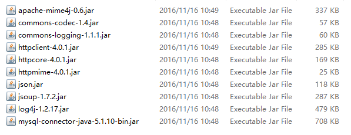

##3.2 HttpClient抓取网页流程

使用HttpClient发送请求、接收响应很简单，一般需要如下几步：

1. 创建HttpClient对象。
2. 创建请求方法的实例，并指定请求URL。如果需要发送GET请求，创建HttpGet对象；如果需要发送POST请求，创建HttpPost对象。
3. 如果需要发送请求参数，可调用HttpGet、HttpPost共同的setParams(HetpParams params)方法来添加请求参数；对于HttpPost对象而言，也可调用setEntity(HttpEntity entity)方法来设置请求参数。
4. 调用HttpClient对象的execute(HttpUriRequest request)发送请求，该方法返回一个HttpResponse。
5. 调用HttpResponse的getAllHeaders()、getHeaders(String name)等方法可获取服务器的响应头；调用HttpResponse的getEntity()方法可获取HttpEntity对象，该对象包装了服务器的响应内容。程序可通过该对象获取服务器的响应内容。
6. 释放连接。无论执行方法是否成功，都必须释放连接。

## 3.3 简单抓取代码

用HttpClient发送请求，请求头不带cookie，用EntityUtils解析响应结果

```java
public class MyHttpClient {
	/***
	 * 需求：使用httpClient爬取传智播客官方网站数据
	 * 
	 * @param args
	 * @throws Exception
	 * @throws ClientProtocolException
	 */
	public static void main(String[] args) throws Exception {

		// 创建HttpClient对象
		HttpClient hClient = new DefaultHttpClient();

		// 设置响应时间，设置传智源码时间，设置代理服务器(不使用本机的IP爬取，以防止被服务器识别从而IP加入黑名单)
		hClient.getParams().setParameter(CoreConnectionPNames.CONNECTION_TIMEOUT, 10000)
				.setParameter(CoreConnectionPNames.SO_TIMEOUT, 10000)
				.setParameter(ConnRouteParams.DEFAULT_PROXY, new HttpHost("111.155.124.67", 8123));

		// 爬虫URL大部分都是get请求，创建get请求对象
		HttpGet hget = new HttpGet("http://www.itcast.cn/");
		// 向传智播客官方网站发送请求，获取网页源码
		HttpResponse response = hClient.execute(hget);
		// EntityUtils工具类把网页实体转换成字符串
		String content = EntityUtils.toString(response.getEntity(), "utf-8");
		System.out.println(content);

	}

}
```

解析结果

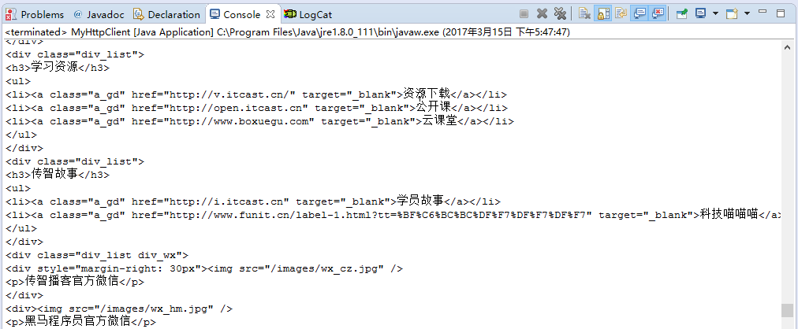

用HttpClient发送请求，请求头带cookie，用EntityUtils解析响应结果

```java
//使用httpClient发送请求，使用Jsoup分析网页
public static void main(String[] args) throws Exception {
    //创建httpClient客户端
    HttpClient hClient = new DefaultHttpClient();
    //创建http发送请求对象，Httpget
    HttpGet hget = new HttpGet("http://www.itcast.cn");
    //设置请求头
    hget.setHeader("Cookie", "login_sid_t=f39c57f474a4fbffeeac8b0d727c7310; " +
            "YF-Ugrow-G0=169004153682ef91866609488943c77f; " +
            "YF-V5-G0=cd5d86283b86b0d506628aedd6f8896e; WBStorage=7754ff192036c629|undefined;" +
            " _s_tentry=-; YF-Page-G0=074bd03ae4e08433ef66c71c2777fd84; " +
            "Apache=1025338456965.9829.1478277156276; " +
            "SINAGLOBAL=1025338456965.9829.1478277156276; " +
            "ULV=1478277156293:1:1:1:1025338456965.9829.1478277156276:; " +
            "SUB=_2AkMvQDcef8NhqwJRmP4Uzm7mbYxwzA_EieLBAH7sJRMxHRl" +
            "-yj9jqmwNtRBn0SIxPIgzk6P4Umq_twX_A70bVg..; " +
            "SUBP=0033WrSXqPxfM72-Ws9jqgMF55529P9D9W5J2ZDKK_Q-h8ni.aX3E1Ci");
    hget.setHeader("User-Agent", "Mozilla/5.0 (Windows NT 6.1; WOW64) AppleWebKit/537.36 " +
            "(KHTML, like Gecko) Chrome/44.0.2403.157 Safari/537.36");
    //设置连接超时，传递响应超时
    hClient.getParams()
            .setParameter(CoreConnectionPNames.CONNECTION_TIMEOUT, 10000)
            .setParameter(CoreConnectionPNames.SO_TIMEOUT, 10000)
            .setParameter(ConnRouteParams.DEFAULT_PROXY, new HttpHost("121.31.71.63", 80));
    //发送请求
    HttpResponse response = hClient.execute(hget);
    //获取网页内容
    String content = EntityUtils.toString(response.getEntity(), "utf-8");
    System.out.println(content);
}
```

# 4. Jsoup简介
jsoup 是一款Java 的HTML解析器，可直接解析某个URL地址、HTML文本内容。它提供了一套非常省力的API，可通过DOM，CSS以及类似于jQuery的操作方法来取出和操作数据

通常在写爬虫程序时，httpClient结合Jsoup共同使用即可实现完美的爬虫系统。httpClient负责模拟浏览器发送请求，Jsoup负责解析httpClient请求返回的HTML页面，解析获取需要的数据
## 4.1 Jsoup获取网页流程

1. 从一个 URL，文件或字符串中解析 HTML
2. 使用 DOM 或 CSS 选择器来查找、取出数据
3. 可操作 HTML 元素、属性、文本

## 4.2 Jsoup获取网页代码

用Jsoup抓取传智播客官网左侧的数据，如图所示

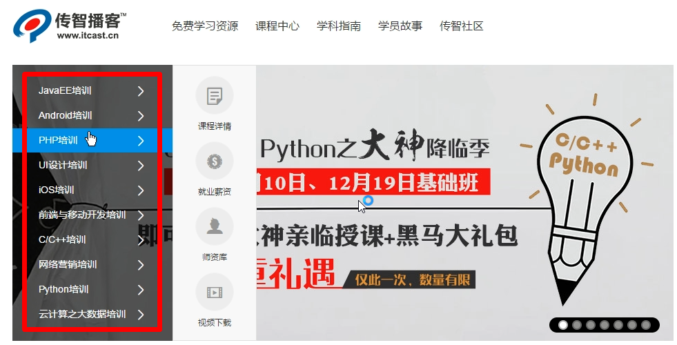

用谷歌浏览器开发者工具（F12）打开查看源码如下图，从中可以看到ul标签的class选择器为nav_txt

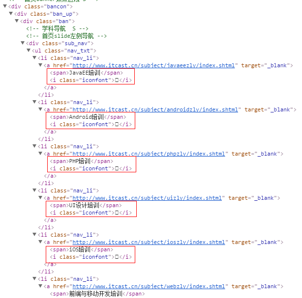


```java
public class HttpClientJsoup {
	/***
	 * 需求：使用httpClient爬取传智播客官方网站数据
	 * 
	 * @param args
	 * @throws Exception
	 * @throws ClientProtocolException
	 */
	public static void main(String[] args) throws Exception {

		// 创建HttpClient对象
		HttpClient hClient = new DefaultHttpClient();

		// 设置响应时间，设置传智源码时间，设置代理服务器
		/*hClient.getParams().setParameter(CoreConnectionPNames.CONNECTION_TIMEOUT, 10000)
				.setParameter(CoreConnectionPNames.SO_TIMEOUT, 10000)
				.setParameter(ConnRouteParams.DEFAULT_PROXY, new HttpHost("111.155.124.67", 8123));*/

		// 爬虫URL大部分都是get请求，创建get请求对象
		HttpGet hget = new HttpGet("http://www.itcast.cn/");
		hget.setHeader("User-Agent", "Mozilla/5.0 (Windows NT 6.1; WOW64) AppleWebKit/537.36 " +
	            "(KHTML, like Gecko) Chrome/44.0.2403.157 Safari/537.36");
		// 向传智播客官方网站发送请求，获取网页源码
		HttpResponse response = hClient.execute(hget);
		// EntityUtils工具类把网页实体转换成字符串
		String content = EntityUtils.toString(response.getEntity(), "utf-8");
		// 使用Jsoup解析网页内容
		Document document = Jsoup.parse(content);
		// 获取文档标题
		String title = document.title();
		System.out.println(title);
		
		Elements elements = document.select("ul.nav_txt a");
		System.out.println(elements);
		for(Element element : elements){
			System.out.println(element.text() + ":" + element.attr("href"));
		}
	}

}
```

解析结果

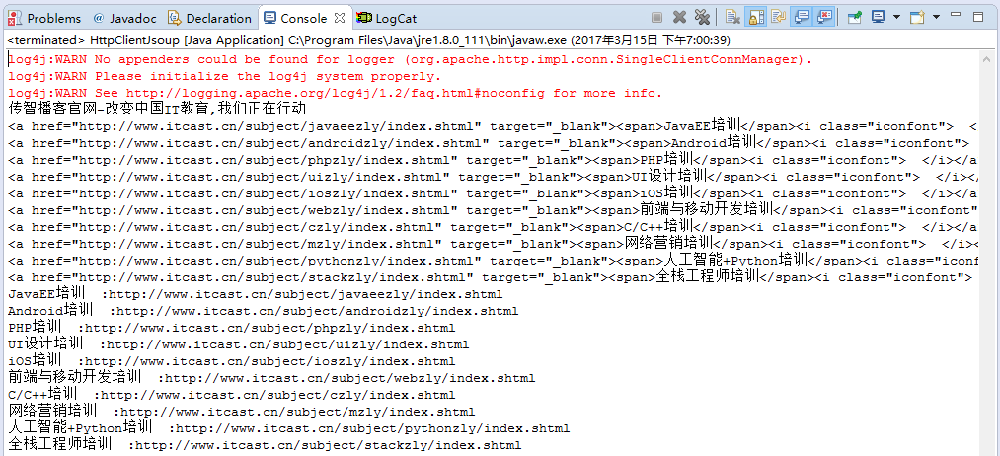

使用jsoup向服务器发送请求

```java
public class MyJsoup {
	/*
	 * 需求：使用Jsoup解析网页源码
	 */
	public static void main(String[] args) throws Exception {
		// 使用jsoup向服务器发送请求
		Document doc = Jsoup.connect("http://www.itcast.cn").get();
		// Jsoup使用类型css,Jquery选择器方式获取元素节点
		// Elements elements = doc.getElementsByTag("a");
		// System.out.println(elements.text());
		Elements elements = doc.select("ul.nav_txt a");
		// 循环元素
		for (Element element : elements) {
			System.out.println(element.text() + ":" + element.attr("href"));
		}

	}

}
```

解析结果

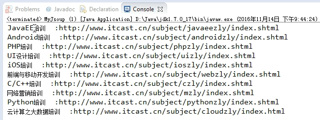

# 5. 综合应用
解析下图中红色框的内容，HttpClient发送请求，Jsoup解析结果

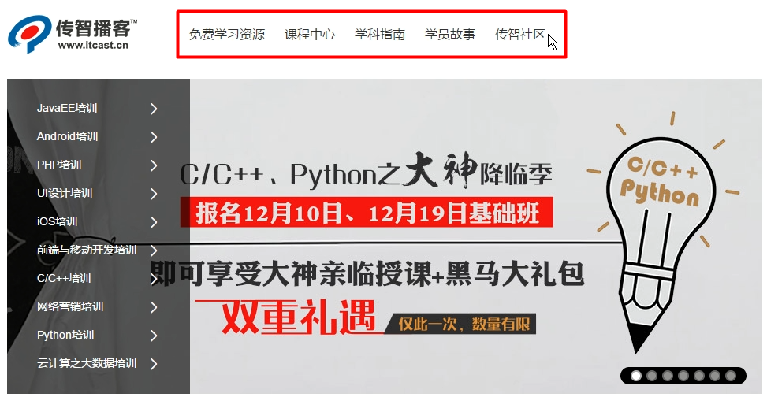

点击开发者工具的第一个图标，移动鼠标到网页的目标位置，即可定位到该目标的网页源码位置

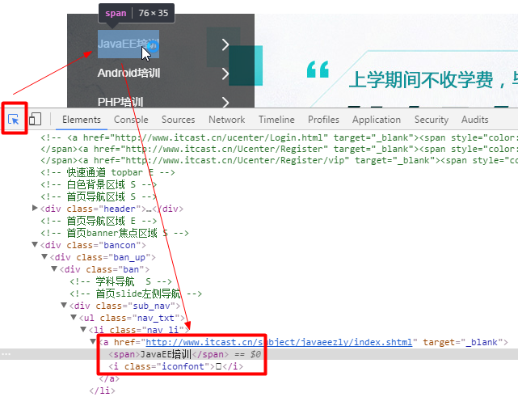

```java
package com.github.webcrawder;

import java.io.IOException;

import org.apache.http.HttpResponse;
import org.apache.http.client.ClientProtocolException;
import org.apache.http.client.HttpClient;
import org.apache.http.client.methods.HttpGet;
import org.apache.http.impl.client.DefaultHttpClient;
import org.apache.http.util.EntityUtils;
import org.jsoup.Jsoup;
import org.jsoup.nodes.Document;
import org.jsoup.select.Elements;

public class CrawderDemo {
	public static void main(String[] args) throws ClientProtocolException, IOException {
		// 创建httpClient客户端
		HttpClient hClient = new DefaultHttpClient();
		// 创建http发送请求对象，Httpget
		HttpGet hget = new HttpGet("http://www.itcast.cn");
		// 发送请求
		HttpResponse response = hClient.execute(hget);
		// 获取网页内容
		String content = EntityUtils.toString(response.getEntity(), "utf-8");
		// 使用Jsoup解析网页内容
		Document document = Jsoup.parse(content);
		// 使用元素选择器选择网页的内容
		Elements elements = document.select("ul.nav_li a");
		System.out.println(elements.text());
		System.out.println(elements);

	}

}
```

解析结果

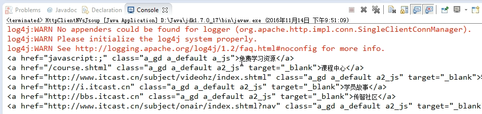

```java
//使用jsoup加载远程连接数据
@Test
public void myJsouptest() throws Exception {
    String userAgent = "Mozilla/5.0 (Windows NT 6.1; WOW64) AppleWebKit/537.36 (KHTML, like " +
            "Gecko) Chrome/44.0.2403.157 Safari/537.36";
    //准备cookie信息
    Map<String, String> maps = new HashMap<String, String>();
    maps.put("TC-Ugrow-G0", "968b70b7bcdc28ac97c8130dd353b55e");
    maps.put("SUB", "2AkMvfeeDf8NhqwJRmP0dzGvhZY5yywvEieLBAH7sJRMxHRl-yT9jqmAHtRAgR4BQZgBIE" +
            "-Xz-jsqjVftcUdtrA..");
    maps.put("SUBP", "0033WrSXqPxfM72-Ws9jqgMF55529P9D9WhBu3bohh6dYkXbY_GUs5d8");
    //获取网页dom对象
    Document doc = Jsoup.connect("http://www.itcast.cn/")
            .userAgent(userAgent)
            .cookies(maps).get();
    //获取文档标签
    String title = doc.title();
    System.out.println(title);
    //获取网页元素
    Elements elements = doc.select("div.qrcode-text");
    System.out.println(elements.text());
}
```
# 6.爬虫在电商网站应用
