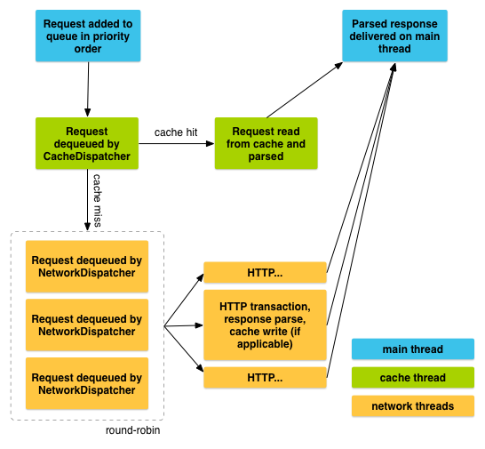

# OkHttp

## 1. 摘要
| 类                                    | 方法                                       |
| :----------------------------------- | :--------------------------------------- |
| OkHttpClient                         | newCall(Request)                         |
| OkHttpClient.Builder                 | connectTimeout()连接超时  readTimeout()读取超时  writeTimeout()写入超时  addInterceptor()请求拦截  sslSocketFactory()  cache() |
| Request                              | tag()                                    |
| Request.Builder                      | url()  post(RequestBody)  header() 覆盖旧值  addHeader() 可以添加多值  tag(Object) |
| RequestBody                          | create(MediaType，String)  create(MediaType，File) |
| FormBody  FormBody.Builder           | add(name，value)                          |
| MultipartBody  MultipartBody.Builder | multipart/form-data的抽象封装  create()     setType(MultipartBody.FORM)  addPart(Headers，RequestBody)  addFormDataPart(name，value) |
| MultipartBody.Part                   | multipart/form-data里的一项数据  createFormData() |
| Response                             | body()  isSuccessful()  header()  headers()  cacheResponse()  networkResponse() |
| ResponseBody                         | string()  byteStream()  bytes()  charStream() |
| Call                                 | enqueue(CallBack)  execute()             |
| Callback                             | onFailure()  onResponse()                |
| MediaType                            | parse()                                  |
| Headers                              | of(String name，String value)  name(int index)  value(int index) |

## 2. OkHttpClient

```
OkHttpClient client = new OkHttpClient.Builder()
        .connectTimeout(5, TimeUnit.SECONDS)
        .readTimeout(10, TimeUnit.SECONDS)
		.addInterceptor()
        .build();
```

## 3. Http Get

```
OkHttpClient httpClient = new OkHttpClient();
Request request = new Request.Builder()
        .url("http://www.baidu.com")
        .method()
        .addHeader()
        .build();
Call call = httpClient.newCall(request);
call.enqueue(new Callback() {
    @Override
    public void onFailure(Call call, IOException e) {
        
    }

    @Override
    public void onResponse(Call call, Response response) throws IOException {
        String result = response.body().string();
    }
});
Response response = call.execute();
```

## 4. Http Post

### 4.1. POST提交Json数据

```
public static final MediaType contentType = MediaType.parse("application/json; charset=utf-8");
OkHttpClient client = new OkHttpClient();
String post(String url, String json) throws IOException {
    RequestBody body = RequestBody.create(contentType, json);
    Request request = new Request.Builder()
            .url(url)
            .post(body)
            .build();
    Response response = client.newCall(request).execute();
    if (response.isSuccessful()) {
        return response.body().string();
    } else {
        throw new IOException("Unexpected code " + response);
    }
}
```

### 4.2. POST提交键值对

```
OkHttpClient client = new OkHttpClient();
String post(String url, String json) throws IOException {

    RequestBody formBody = new FormBody.Builder()
            .add("platform", "android")
            .add("name", "bug")
            .add("subject", "XXXXXXXXXXXXXXX")
            .build();

    Request request = new Request.Builder()
            .url(url)
            .post(body)
            .build();

    Response response = client.newCall(request).execute();
    if (response.isSuccessful()) {
        return response.body().string();
    } else {
        throw new IOException("Unexpected code " + response);
    }
}
```

### 4.3. Post方式提交String

```
public static final MediaType MEDIA_TYPE_MARKDOWN
        = MediaType.parse("text/x-markdown; charset=utf-8");

private final OkHttpClient client = new OkHttpClient();

public void run() throws Exception {
    String postBody = ""
            + "Releases\n"
            + "--------\n"
            + "\n"
            + " * _1.0_ May 6, 2013\n"
            + " * _1.1_ June 15, 2013\n"
            + " * _1.2_ August 11, 2013\n";

    Request request = new Request.Builder()
            .url("https://api.github.com/markdown/raw")
            .post(RequestBody.create(MEDIA_TYPE_MARKDOWN, postBody))
            .build();

    Response response = client.newCall(request).execute();
    if (!response.isSuccessful()) throw new IOException("Unexpected code " + response);

    System.out.println(response.body().string());
}
```

### 4.4. Post方式提交文件

```
public static final MediaType MEDIA_TYPE_MARKDOWN
        = MediaType.parse("text/x-markdown; charset=utf-8");

private final OkHttpClient client = new OkHttpClient();

public void run() throws Exception {
    File file = new File("README.md");

    Request request = new Request.Builder()
            .url("https://api.github.com/markdown/raw")
            .post(RequestBody.create(MEDIA_TYPE_MARKDOWN, file))
            .build();

    Response response = client.newCall(request).execute();
    if (!response.isSuccessful()) throw new IOException("Unexpected code " + response);

    System.out.println(response.body().string());
}
```

### 4.5. Post方式提交表单

```
private final OkHttpClient client = new OkHttpClient();

public void run() throws Exception {
    RequestBody formBody = new FormBody.Builder()
            .add("search", "Jurassic Park")
            .build();
    Request request = new Request.Builder()
            .url("https://en.wikipedia.org/w/index.php")
            .post(formBody)
            .build();

    Response response = client.newCall(request).execute();
    if (!response.isSuccessful()) throw new IOException("Unexpected code " + response);

    System.out.println(response.body().string());
}
```

### 4.6. Post方式提交分块请求

MultipartBody.Builder可以构建复杂的请求体，与HTML文件上传形式兼容。多块请求体中每块请求都是一个请求体，可以定义自己的请求头。这些请求头可以用来描述这块请求，例如他的Content-Disposition。如果Content-Length和Content-Type可用的话，他们会被自动添加到请求头中。

```
private static final String IMGUR_CLIENT_ID = "...";
private static final MediaType MEDIA_TYPE_PNG = MediaType.parse("image/png");

private final OkHttpClient client = new OkHttpClient();

public void run() throws Exception {
    RequestBody requestBody = new MultipartBody.Builder()
            .setType(MultipartBody.FORM)
            .addPart(
                    Headers.of("Content-Disposition", "form-data; name=\"title\""),
                    RequestBody.create(null, "Square Logo"))
            .addPart(
                    Headers.of("Content-Disposition", "form-data; name=\"image\""),
                    RequestBody.create(MEDIA_TYPE_PNG, new File("website/static/logo-square.png")))
            .build();

    Request request = new Request.Builder()
            .header("Authorization", "Client-ID " + IMGUR_CLIENT_ID)
            .url("https://api.imgur.com/3/image")
            .post(requestBody)
            .build();

    Response response = client.newCall(request).execute();
    if (!response.isSuccessful()) throw new IOException("Unexpected code " + response);

    System.out.println(response.body().string());
}
```

## 5. Request
| 方法          | 功能描述                                     |
| :---------- | :--------------------------------------- |
| header()    | 使用`header(name,  value)`可以设置唯一的name、value。如果已经有值，旧的将被移除，然后添加新的 |
| addHeader() | 使用addHeader(name, value)可以添加多值（添加，不移除已有的） |

### 5.1. 提取响应头

```
OkHttpClient client = new OkHttpClient.Builder()
        .connectTimeout(5, TimeUnit.SECONDS)
        .readTimeout(10, TimeUnit.SECONDS)
        .build();
Request request = new Request.Builder()
        .url("http://www.baidu.com")
        .header("User-Agent", "OkHttp Headers.java")
        .addHeader("Accept", "application/json; q=0.5")
        .addHeader("Accept", "application/vnd.github.v3+json")
        .build();
Response response = client.newCall(request).execute();
String server = response.header("Server");
String date = response.header("Date");
List<String> vary = response.headers("Vary");
```

### 5.2. Post  JsonString

## 6. RequestBody
| 类                                 | 方法                   |
| --------------------------------- | -------------------- |
| RequestBody                       | RequestBody.create() |
| MultipartBody  MultipartBody.Part |                      |
| FormBody                          |                      |

### 6.1. MediaType

MediaType.parse("application/json; charset=utf-8")

### 6.2. 添加多个参数


## 7. Response
| 方法声明                  | 功能描述                                     |
| :-------------------- | :--------------------------------------- |
| body()                |                                          |
| isSuccessful()        |                                          |
| header（name,value）    | 当读取响应头时，使用header(name)返回最后出现的name、value。通常情况这也是唯一的name、value。如果没有值，那么header(name)将返回null |
| addHeader(name,value) | 如果想读取字段对应的所有值，使用headers(name)会返回一个list   |

### 7.1. ResponseBody

string()
byteStream()

## 8. Headers

请求头
| 方法声明                | 功能描述 |
| :------------------ | :--- |
| Map<String, String> |      |
| name()              |      |
| value()             |      |
|                     |      |

## 9. Call

## 10. 取消网络请求

```
call.cancel();
new Request.Builder().tag("tag");
client.dispatcher().cancelAll();

call.request().tag();

List<Call> queuedCalls = client.dispatcher().queuedCalls();
List<Call> runningCalls = client.dispatcher().runningCalls();
```

## 11. https

```
sslSocketFactory(sslContext.getSocketFactory());
```

## 12. 请求拦截

```
//请求拦截
OkHttpClient client = new OkHttpClient();
client.interceptors().add(new Interceptor() {
    @Override
    public okhttp3.Response intercept(Chain chain) throws IOException {
        okhttp3.Response response = chain.proceed(chain.request());
        return response;
    }
});
```

# Retrofit


## 1. 常用注解

### 1.1.HTTP请求方法

### 1.2.标记类

### 1.3.参数类

- 用builder创建一个Retrofit对象

baseUrl（），addConvertFactory（）：添加base url和转换器

- 创建一个java接口，用java注解来描述api

包括请求方式：@Get，@Post等

@path：和base url组成完整的url

查询参数：@query

- 用retrofit对象创建接口的实例（动态代理）
- 调用实例对象的方法，获得Call对象

调用call对象的enqueue（CallBack）或者Response  execute（）方法异步或同步执行网络请求
| 注解                                 | 作用                                       |
| :--------------------------------- | :--------------------------------------- |
| @Get                               | get请求                                    |
| @Post                              | post请求                                   |
| @FormUrlEncoded  @Field  @FieldMap | 表单的方式传递键值对                               |
| @Multipart  @Part  @PartMap        | 文件上传  @Multipart标记一个请求是multipart/form-data类型  @Part代表Multipart里的一项数据 |
| @Header  @Headers                  | 请求头                                      |
| @Path                              | url相对路径，{占位符}                            |
| @Query                             | 查询参数                                     |
| @Body                              |                                          |

```java
public interface IUserBiz {

    /**
     * 一般的get请求
     * 通过@GET注解标识为get请求，@GET中所填写的value和baseUrl组成完整的路径，
     * baseUrl在构造retrofit对象时给出
     */
    @GET("users")
    Call<List<User>> getUsers();

    /**
     * 动态的url访问@PATH,用于访问zhy的信息
     * http://192.168.1.102:8080/springmvc_users/user/zhy
     * {username}可以理解为占位符，取值为方法实参username的值
     */
    @GET("{username}")
    Call<User> getUser(@Path("username") String username);

    /**
     * 查询参数的设置@Query
     * http://baseurl/users?sortby=username
     */
    @GET("users")
    Call<List<User>> getUsersBySort(@Query("sortby") String sort);

    /**
     * POST请求体的方式向服务器传入json字符串@Body
     */
    @POST("add")
    Call<List<User>> addUser(@Body User user);

    /**
     *比如要更新某个账户信息,其接口地址为/info,需要带的Header有设备信息device,
     *系统版本version,还要带请求参数要更新账户的id
     */
    @POST("info")
    Call<Object> updateInfo(
        @Header("device") String device, 
        @Header("version") int version, 
        @Field("id") String id);

    @Headers("Cache-Control: max-age=640000")
    @GET("widget/list")
    Call<List<User>> widgetList();

    @Headers({
            "Accept: application/vnd.github.v3.full+json",
            "User-Agent: Retrofit-Sample-App"
    })
    @GET("users/{username}")
    Call<User> getUser(@Path("username") String username);

    /**
     * post请求进行提交数据（比如用户注册、登陆等表单类请求）
     */
    @FormUrlEncoded
    @POST("/some/endpoint")
    Call<Response> register(@Field("username") String username);

    @FormUrlEncoded
    @POST("/some/endpoint")
    Call<User> somePointEnd(@FieldMap Map<String,String> names);

    /**
     * 表单的方式传递键值对@FormUrlEncoded
     */
    @POST("login")
    @FormUrlEncoded
    Call<User> login(@Field("username") String username, 
                       @Field("password") String password);

    /**
     * 单文件上传@Multipart
     */
    @POST("register")
    @Multipart
    Call<User> registerUser(
        @Part MultipartBody.Part photo, 
        @Part("username")RequestBody username, 
        @Part("password") RequestBody password);

	//单文件上传
	@Multipart
@POST("/api/Accounts/editaccount")
Call<User> editUser(@Part("file_key\";filename=\"pp.png") RequestBody file,
                      @Part("username") String username);

    /**
     * 多文件上传@PartMap
     */
    @Multipart
    @POST("register")
    Call<User> registerUser(
        @PartMap Map<String, RequestBody> params,
        @Part("password") RequestBody password);

    /**
     * 下载文件
     */
    @GET("download")
    Call<RequestBody> download();
}
```

## 2. 常用方法

| 方法声明             | 功能描述                                     |
| :--------------- | :--------------------------------------- |
| Call             | Call是一次HTTP请求的Task，它会执行网络请求以获得响应。  enqueue()，execute()，cancel() |
| Callback         | onResponse()，onFailure()                 |
| RequestBody      | RequestBody.create(MediaType.parse("image/png"),  file) |
| ResponseBody     |                                          |
| MultipartBody    | MultipartBody.Part.createFormData()      |
| ConverterFactory |                                          |

## 3. 动态代理

拿到参数，注解 -> 构造Requestbody-> 构造Request --> 构造Call

## 4. Retrofit

### 4.1 创建retrofit实例和接口的实例

```java
Retrofit retrofit = new Retrofit.Builder()
.client(client)
        .baseUrl("http://www.baidu.com/")
        .addConverterFactory(GsonConverterFactory.create(gson))
        .callFactory(new OkHttpClient())
        .build(); 

//通过注解，反射，动态代理的方式创建接口的实例
IUserBiz userBiz = retrofit.create(IUserBiz.class);

Call<List<User>> call = userBiz.getUsers();

call.enqueue(new Callback<List<User>>() {
    @Override
    public void onResponse(Call<List<User>> call, Response<List<User>> response) {
        List<User> list = response.body();
    }

    @Override
    public void onFailure(Call<List<User>> call, Throwable t) {

    }
});

Response<List<User>> response = call.execute();//同步请求
call.cancel();//取消请求
```

### 4.2 单文件上传

```java
interface GitHubService {
    
    @Multipart
    @POST("register")
    Call<User> upload(@Part MultipartBody.Part photo,
                        @Part("username") RequestBody username,
                        @Part("password") RequestBody password);
}

File file = new File(Environment.getExternalStorageDirectory(),"icon.png");
RequestBody requestBody = MultipartBody.create(MediaType.parse("image/png"), file);
MultipartBody.Part part = MultipartBody.Part
        .createFormData("photos","icon.png",requestBody);

Call<User> call = userBiz.registerUser(part, 
        RequestBody.create(null, "zhangsan"), 
        RequestBody.create(null, "123"));
```

### 4.3. 多文件上传

```java
interface GitHubService {

    @Multipart
    @POST("register")
    Call<User> registerUser(@PartMap Map<String, RequestBody> params, 
                               @Part("password") RequestBody password);
}
```

```java
File file = new File(Environment.getExternalStorageDirectory(),"messager.png");
RequestBody requestBody = RequestBody.create(MediaType.parse("image/png"),"photo");
Map<String,RequestBody> bodyMap = new HashMap<>();
bodyMap.put("photos\";filename=\"icon.png",requestBody);
bodyMap.put("username",RequestBody.create(null,"zhnagsan"));
Call<User> call = userBiz.registerUser(bodyMap, requestBody);
```

```java
public interface FileuploadService {
    /**
     * 通过 List<MultipartBody.Part> 传入多个part实现多文件上传
     * @param parts 每个part代表一个
     * @return 状态信息
     */
    @Multipart
    @POST("users/image")
    Call<BaseResponse<String>> uploadFilesWithParts(
        @Part() List<MultipartBody.Part> parts);

    /**
     * 通过 MultipartBody和@body作为参数来上传
     * @param multipartBody MultipartBody包含多个Part
     * @return 状态信息
     */
    @POST("users/image")
    Call<BaseResponse<String>> uploadFileWithRequestBody(
        @Body MultipartBody multipartBody);
}
```

```java
public static MultipartBody filesToMultipartBody(List<File> files) {
    MultipartBody.Builder builder = new MultipartBody.Builder();

    for (File file : files) {
        RequestBody requestBody = RequestBody.create(
		MediaType.parse("image/png"), file);
        builder.addFormDataPart("file", file.getName(), requestBody);
    }

    builder.setType(MultipartBody.FORM);
    MultipartBody multipartBody = builder.build();
    return multipartBody;
}

public static List<MultipartBody.Part> filesToMultipartBodyParts(List<File> files) {
    List<MultipartBody.Part> parts = new ArrayList<>(files.size());
    for (File file : files) {
        RequestBody requestBody = RequestBody.create(
        	MediaType.parse("image/png"), file);
        MultipartBody.Part part = MultipartBody.Part.createFormData(
        	"file", file.getName(), requestBody);
        parts.add(part);
    }
    return parts;
}
```

```java
public class RetrofitBuilder {
    private static Retrofit retrofit;

    public synchronized static Retrofit buildRetrofit() {
        if (retrofit == null) {
            HttpLoggingInterceptor logging = new HttpLoggingInterceptor();
            Gson gson = new GsonBuilder().setDateFormat(
			"yyyy-MM-dd HH:mm:ss").create();
            GsonConverterFactory gsonConverterFactory = 
        		GsonConverterFactory.create(gson);
            logging.setLevel(HttpLoggingInterceptor.Level.BODY);
            OkHttpClient client = new OkHttpClient.Builder()
                    .addInterceptor(logging).retryOnConnectionFailure(true)
                    .build();
            retrofit = new Retrofit.Builder().client(client)
                    .baseUrl(Config.NetURL.BASE_URL)
                    .addConverterFactory(gsonConverterFactory)
                    .addCallAdapterFactory(RxJavaCallAdapterFactory.create())
                    .build();
        }
        return retrofit;
    }
}
```

```java
private void uploadFile() {
    MultipartBody body = MultipartBuilder.filesToMultipartBody(mFileList);
    RetrofitBuilder.buildRetrofit().create(FileUploadService.class)
            .uploadFileWithRequestBody(body)
            .enqueue(new Callback<BaseResponse<String>>() {
                @Override
                public void onResponse(Call<BaseResponse<String>> call, 
                                       Response<BaseResponse<String>> response) {

                    if (response.isSuccessful()) {
                        BaseResponse<String> body = response.body();
                        Toast.makeText(LoginActivity.this, "上传成功:"+
                                response.body().getMsg(), Toast.LENGTH_SHORT).show();
                    } else {
                        Log.d(TAG,"上传失败");
                        Toast.makeText(RegisterActivity.this, "上传失败", 
                                Toast.LENGTH_SHORT).show();
                    }
                }

                @Override
                public void onFailure(Call<BaseResponse<String>> call,Throwable t) {
                    Toast.makeText(RegisterActivity.this, "网络连接失败", 
                            Toast.LENGTH_SHORT).show();
                }
            });
}
```

## 5. Converter.Factory

addConverterFactory(GsonConverterFactory.create())

- Gson: com.squareup.retrofit2:converter-gson
- Jackson: com.squareup.retrofit2:converter-jackson
- Moshi: com.squareup.retrofit2:converter-moshi
- Protobuf: com.squareup.retrofit2:converter-protobuf
- Wire: com.squareup.retrofit2:converter-wire
- Simple XML: com.squareup.retrofit2:converter-simplexml
- Scalars (primitives, boxed, and String): com.squareup.retrofit2:converter-scalars

## 6. 新特性

- 取消正在执行的任务：call.cancel()，unsubscribe
- 没有同步异步之分
- Converter现在从Retrofit中删除
- 自定义Gson对象
- 新的URL定义方式
- 现在需要OkHttp的支持
- 即使response存在问题onResponse依然被调用
- Use an Interceptor from OkHttp
- RxJava Integration with CallAdapter

# Retrofit和RxJava结合使用

## 1. RxJava与CallAdapter

CallAdapter则可以对Call转换，用Observable代替Call

引入RxJava支持

```
compile 'com.squareup.retrofit2:adapter-rxjava:2.0.2'
```

通过RxJavaCallAdapterFactory为Retrofit添加RxJava支持

```
Retrofit retrofit = new Retrofit.Builder()
        .baseUrl("http://localhost:4567/")
        .addConverterFactory(GsonConverterFactory.create())
        .addCallAdapterFactory(RxJavaCallAdapterFactory.create())
        .build();
```

接口设计

```
public interface BlogService {
    @POST("/blog")
    Observable<Result<List<Blog>>> getBlogs();
}
```

使用

```
BlogService service = retrofit.create(BlogService.class);
service.getBlogs(1)
        .subscribeOn(Schedulers.io())
        .subscribe(new Subscriber<Result<List<Blog>>>() {
            @Override
            public void onCompleted() {
                System.out.println("onCompleted");
            }

            @Override
            public void onError(Throwable e) {
                System.err.println("onError");
            }

            @Override
            public void onNext(Result<List<Blog>> blogsResult) {
                System.out.println(blogsResult);
            }
        });
```

## 2. 将请求过程进行封装

```
public class HttpMethods {

    public static final String BASE_URL = "https://api.douban.com/v2/movie/";

    private static final int DEFAULT_TIMEOUT = 5;

    private Retrofit retrofit;
    private MovieService movieService;

    //构造方法私有
    private HttpMethods() {
        //手动创建一个OkHttpClient并设置超时时间
        OkHttpClient.Builder httpClientBuilder = new OkHttpClient.Builder();
        httpClientBuilder.connectTimeout(DEFAULT_TIMEOUT, TimeUnit.SECONDS);

        retrofit = new Retrofit.Builder()
                .client(httpClientBuilder.build())
                .addConverterFactory(GsonConverterFactory.create())
                .addCallAdapterFactory(RxJavaCallAdapterFactory.create())
                .baseUrl(BASE_URL)
                .build();

        movieService = retrofit.create(MovieService.class);
    }

    //在访问HttpMethods时创建单例
    private static class SingletonHolder{
        private static final HttpMethods INSTANCE = new HttpMethods();
    }

    //获取单例
    public static HttpMethods getInstance(){
        return SingletonHolder.INSTANCE;
    }

    /**
     * 用于获取豆瓣电影Top250的数据
     * @param subscriber 由调用者传过来的观察者对象
     * @param start 起始位置
     * @param count 获取长度
     */
    public void getTopMovie(Subscriber<MovieEntity> subscriber, int start, int count){
        movieService.getTopMovie(start, count)
                .subscribeOn(Schedulers.io())
                .unsubscribeOn(Schedulers.io())
                .observeOn(AndroidSchedulers.mainThread())
                .subscribe(subscriber);
    }
}
```

# Volley


| 类                         | 方法                                       |
| :------------------------ | :--------------------------------------- |
| Request                   | cancel()  setTag()  getTag()  parseNetworkResponse()  deliverResponse()  setShouldCache() |
| StringRequest             |                                          |
| JsonObjectRequest         |                                          |
| JsonArrayRequest          |                                          |
| ImageRequest              |                                          |
| RequestQueue              | Volley.newRequestQueue(context)  start()  add()  cancelAll(null)取消所有网络请求  cancelAll(＂tag＂)根据tag取消网络请求  RequestQueue(Cache cache, Network network) |
| Response.Listener         | onResponse()                             |
| Response.ErrorListener    | onErrorResponse()                        |
| ImageLoader               | get(String url，ImageListener listener)  getImageListener(ImageView iv，int  id，int id) |
| ImageLoader.ImageCache    | getBitmap()  putBitmap()                 |
| ImageLoader.ImageListener |                                          |
| Cache                     |                                          |
| DiskBasedCache            |                                          |
| HttpStack                 |                                          |
| BasicNetwork              |                                          |

## 1. Request

### 1.1. StringRequest

Post请求

```
StringRequest stringRequest = new StringRequest(Method.POST, url,  listener, errorListener) {
    @Override
    protected Map<String, String> getParams() throws AuthFailureError {
        Map<String, String> map = new HashMap<String, String>();
        map.put("params1", "value1");
        map.put("params2", "value2");
        return map;
    }
};
```

### 1.2. JsonObjectRequest

### 1.3. JsonArrayRequest

### 1.4. ImageRequest

## 2. RequestQueue

RequestQueue 必须使用 Application context 来实例化，而不是 Activity context。这确保了 RequestQueue 在我们 app 的生命周期中一直存活，而不会因为 activity 的重新创建而被重新创建

```
RequestQueue mRequestQueue;
Cache cache = new DiskBasedCache(getCacheDir(), 1024 * 1024); // 1MB cap
// Set up the network to use HttpURLConnection as the HTTP client.
Network network = new BasicNetwork(new HurlStack());
// Instantiate the RequestQueue with the cache and network.
mRequestQueue = new RequestQueue(cache, network);
// Start the queue
mRequestQueue.start();
String url ="http://www.myurl.com";
// Formulate the request and handle the response.
StringRequest stringRequest = new StringRequest(Request.Method.GET, url,
        new Response.Listener<String>() {
            @Override
            public void onResponse(String response) {
                // Do something with the response
            }
        },
        new Response.ErrorListener() {
            @Override
            public void onErrorResponse(VolleyError error) {
                // Handle error
            }
        });
// Add the request to the RequestQueue.
mRequestQueue.add(stringRequest);
...
```

## 3. Response

### 3.1. Response.Listener

### 3.2. Response.ErrorListener

## 4. ImageLoader

```
ImageLoader imageLoader = VolleyUtils.instance.init(this).getImageLoader();
imageLoader.get(
        requestUrl,
        new ImageLoader.ImageListener() {
            @Override
            public void onResponse(ImageLoader.ImageContainer imageContainer, boolean b) {
                Bitmap bitmap = imageContainer.getBitmap();
            }

            @Override
            public void onErrorResponse(VolleyError volleyError) {

            }
        }, width, height
);
```

## 5. ImageCache

```
import android.graphics.Bitmap;
import android.support.v4.util.LruCache;
import android.util.DisplayMetrics;
import com.android.volley.toolbox.ImageLoader.ImageCache;
public class LruBitmapCache extends LruCache<String, Bitmap>
        implements ImageCache {
    public LruBitmapCache(int maxSize) {
        super(maxSize);
    }
    public LruBitmapCache(Context ctx) {
        this(getCacheSize(ctx));
    }
    @Override
    protected int sizeOf(String key, Bitmap value) {
        return value.getRowBytes() * value.getHeight();
    }
    @Override
    public Bitmap getBitmap(String url) {
        return get(url);
    }
    @Override
    public void putBitmap(String url, Bitmap bitmap) {
        put(url, bitmap);
    }
    // Returns a cache size equal to approximately three screens worth of images.
    public static int getCacheSize(Context ctx) {
        final DisplayMetrics displayMetrics = ctx.getResources().
                getDisplayMetrics();
        final int screenWidth = displayMetrics.widthPixels;
        final int screenHeight = displayMetrics.heightPixels;
        // 4 bytes per pixel
        final int screenBytes = screenWidth * screenHeight * 4;
        return screenBytes * 3;
    }
}
```

```
public class ImageCacheImpl implements ImageLoader.ImageCache {
    private LruCache<String,Bitmap> mLruCache;

    public ImageCacheImpl() {
        int maxmemory = (int) (Runtime.getRuntime().maxMemory()/8);
        mLruCache = new LruCache<String, Bitmap>(maxmemory){
            @Override
            protected int sizeOf(String key, Bitmap value) {
                return value.getByteCount();
            }
        };
    }

    @Override
    public Bitmap getBitmap(String s) {
        return mLruCache.get(s);
    }

    @Override
    public void putBitmap(String s, Bitmap bitmap) {
        mLruCache.put(s,bitmap);
    }
}
```

## 6. VolleyUtil

```
public enum VolleyUtils {

    instance;

    private static RequestQueue    mQueue;
    private static ImageLoader mImageLoader;
    private static ImageLoader.ImageCache mImageCache;

    public void init(Context context){
        mQueue = Volley.newRequestQueue(context);
        mImageCache = new ImageCacheImpl();
        mImageLoader = new ImageLoader(mQueue,mImageCache);
    }

    public static void requestString(String url,CallBack callBack) {
        StringRequest request = new StringRequest(url, new ResponseListener(callBack),
                new ResponseErrorListener(callBack));
        mQueue.add(request);
    }

    public static void requestJsonObj(String url, final CallBack callBack) {
        //post请求参数可以JSONObject发送
        JsonObjectRequest request = new JsonObjectRequest(url, null, new ResponseListener(callBack),
                new ResponseErrorListener(callBack));
        mQueue.add(request);
    }

    public static void requestJsonArray(String url, final CallBack callBack) {
        JsonArrayRequest request = new JsonArrayRequest(url, new ResponseListener(callBack),
                new ResponseErrorListener(callBack));

        mQueue.add(request);
    }

    public static void requestImage(String url, final CallBack callBack) {
        ImageRequest request = new ImageRequest(url, new ResponseListener(callBack), 0, 0,
                Bitmap.Config.ARGB_8888, new ResponseErrorListener(callBack));
        mQueue.add(request);
    }

    public RequestQueue getQueue() {
        return mQueue;
    }
    
    public ImageLoader getImageLoader() {
        return mImageLoader;
    }
    
    public ImageLoader.ImageCache getImageCache() {
        return mImageCache;
    }

    private static class ResponseListener implements Response.Listener {

        private CallBack mCallBack;

        public ResponseListener(CallBack callBack) {
            mCallBack = callBack;
        }

        @Override
        public void onResponse(Object obj) {
            if (mCallBack != null) {
                mCallBack.onResponse(obj);
            }
        }
    }

    private static class ResponseErrorListener implements Response.ErrorListener {

        private CallBack mCallBack;

        public ResponseErrorListener(CallBack callBack) {
            mCallBack = callBack;
        }

        @Override
        public void onErrorResponse(VolleyError volleyError) {
            if (mCallBack != null) {
                mCallBack.onResponse(volleyError);
            }
        }
    }
}
```

## 7. NetWorkImageView

```
RequestQueue queue = Volley.newRequestQueue(context);
ImageLoader imageLoader = new ImageLoader(queue,new ImageCacheImpl());

imageView.setDefaultImageResId(R.id.icon);
imageView.setErrorImageResId(R.id.error);
imageView.setImageUrl(url,imageLoader);
```

```
ImageLoader mImageLoader;
ImageView mImageView;
// The URL for the image that is being loaded.
private static final String IMAGE_URL =
        "http://developer.android.com/images/training/system-ui.png";
...
mImageView = (ImageView) findViewById(R.id.regularImageView);
// Get the ImageLoader through your singleton class.
mImageLoader = MySingleton.getInstance(this).getImageLoader();
mImageLoader.get(IMAGE_URL, ImageLoader.getImageListener(mImageView,
        R.drawable.def_image, R.drawable.err_image));
```

## 8. 网络请求的取消

```
//2. 创建RequestQueue
RequestQueue queue = Volley.newRequestQueue(MainActivity.this);
//3. 发起请求
queue.add(stringRequest);
//取消单个请求
stringRequest.cancel();//取消一个请求
//取消所有请求
queue.cancelAll(null);//取消请求队列里面所有的方法
//取消置顶tag的请求
queue.cancelAll("tag1");//取消tag为tag1的一个请求
//请求添加tag-->tag的目的就是为了反查
stringRequest.setTag("tag1");
//两个不同的请求可以设置同一个tag
stringRequest.setTag("tag1");
//  stringRequest1.setTag("tag1");
```

### 8.1. 生命周期的联动

```
StringRequest req1 = null;
StringRequest req2 = null;
StringRequest req3 = null;
StringRequest req4 = null;
StringRequest req5 = null;

req1.setTag(this.getClass().getSimpleName());
req2.setTag(this.getClass().getSimpleName());
req3.setTag(this.getClass().getSimpleName());
req4.setTag(this.getClass().getSimpleName());
req5.setTag(this.getClass().getSimpleName());

// 取消对应activity里面所有的请求
RequestQueue queue = VolleyTools.getInstance(MainActivity.this).getQueue();
queue.cancelAll(this.getClass().getSimpleName());// MainActivity
```

## 9. 自定义网络请求

```
public class GsonRequest<T> extends Request<T> {
    Class<T>  clazz;
    private Listener<T>  mListener;

    public GsonRequest(int method, String url, ErrorListener listener, 
                       Listener<T> mListener, Class<T> clazz) {
        super(method, url, listener);
        this.clazz = clazz;
        this.mListener = mListener;
    }
    
    @Override
    protected Response<T> parseNetworkResponse(NetworkResponse response) {
        String jsonString;
        try {
            jsonString = new String(response.data, HttpHeaderParser.parseCharset(response.headers));
        } catch (UnsupportedEncodingException e) {
            jsonString = new String(response.data);
        }
        
        T obj;
        try {
            Gson gson = new Gson();
            obj = gson.fromJson(jsonString, clazz);
            return Response.success(obj, HttpHeaderParser.parseCacheHeaders(response));
        } catch (JsonSyntaxException e) {
            e.printStackTrace();
            return Response.error(new ParseError());
        }
    }
    
    @Override
    protected void deliverResponse(T response) {
        mListener.onResponse(response);
    }
}
```

## 10. 源码分析



其中蓝色部分代表主线程，绿色部分代表缓存线程CacheDispatcher，橙色部分代表网络线程NetworkDispatcher。我们在主线程中调用RequestQueue的add()方法来添加一条网络请求，这条请求会先被加入到缓存队列当中，如果发现可以找到相应的缓存结果就直接读取缓存并解析，然后回调给主线程。如果在缓存中没有找到结果，则将这条请求加入到网络请求队列中，然后处理发送HTTP请求，解析响应结果，写入缓存，并回调主线程。

Volley.newRequestQueue(context)

```
public static RequestQueue newRequestQueue(Context context, HttpStack stack) {
    ...
    if (stack == null) {
        if (Build.VERSION.SDK_INT >= 9) {
            stack = new HurlStack();
        } else {
            stack = new HttpClientStack(AndroidHttpClient.newInstance(userAgent));
        }
    }
    Network network = new BasicNetwork(stack);
    RequestQueue queue = new RequestQueue(new DiskBasedCache(cacheDir), network);
    queue.start();
    return queue;
}
```

RequestQueue的start()方法

```
public void start() {
    stop();  // Make sure any currently running dispatchers are stopped.  
    // Create the cache dispatcher and start it.  
    mCacheDispatcher = new CacheDispatcher(mCacheQueue, mNetworkQueue, mCache, mDelivery);
    mCacheDispatcher.start();
    // Create network dispatchers (and corresponding threads) up to the pool size.  
    for (int i = 0; i < mDispatchers.length; i++) {
        NetworkDispatcher networkDispatcher = new NetworkDispatcher(mNetworkQueue, mNetwork,
                mCache, mDelivery);
        mDispatchers[i] = networkDispatcher;
        networkDispatcher.start();
    }
}
```

add()方法

```
public <T> Request<T> add(Request<T> request) {
    ... 
    if (!request.shouldCache()) {
        mNetworkQueue.add(request);
        return request;
    }
      
    synchronized (mWaitingRequests) {
        String cacheKey = request.getCacheKey();
        if (mWaitingRequests.containsKey(cacheKey)) {
            // There is already a request in flight. Queue up.  
            Queue<Request<?>> stagedRequests = mWaitingRequests.get(cacheKey);
            if (stagedRequests == null) {
                stagedRequests = new LinkedList<Request<?>>();
            }
            stagedRequests.add(request);
            mWaitingRequests.put(cacheKey, stagedRequests);
            if (VolleyLog.DEBUG) {
                ...
            }
        } else {
            mWaitingRequests.put(cacheKey, null);
            mCacheQueue.add(request);
        }
        return request;
    }
}
```

CacheDispatcher

```
public class CacheDispatcher extends Thread {
    ……
    @Override
    public void run() {
       ...
        while (true) {
            try {
                final Request<?> request = mCacheQueue.take();
                request.addMarker("cache-queue-take");
               
                if (request.isCanceled()) {
                    request.finish("cache-discard-canceled");
                    continue;
                }
                Cache.Entry entry = mCache.get(request.getCacheKey());
                //判断缓存是否为空
                if (entry == null) {
                    request.addMarker("cache-miss");
                    mNetworkQueue.put(request);
                    continue;
                }
                //判断缓存是否过期
                if (entry.isExpired()) {
                    request.addMarker("cache-hit-expired");
                    request.setCacheEntry(entry);
                    mNetworkQueue.put(request);
                    continue;
                }
                
                request.addMarker("cache-hit");
                //解析数据
                Response<?> response = request.parseNetworkResponse(
                        new NetworkResponse(entry.data, entry.responseHeaders));
                request.addMarker("cache-hit-parsed");
                if (!entry.refreshNeeded()) {
                    mDelivery.postResponse(request, response);
                } else {
                    request.addMarker("cache-hit-refresh-needed");
                    request.setCacheEntry(entry);
                    response.intermediate = true;
                    mDelivery.postResponse(request, response, new Runnable() {
                        @Override
                        public void run() {
                                mNetworkQueue.put(request);
                            } 
                        }
                    });
                }
            } 
        }
    }
}
```
## Cookie、Session和Token

Cookie：用户身份的唯一标识，跟踪用户行为，存在客户端，Session存在服务器，第一次请求服务器的时候生成。


