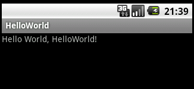
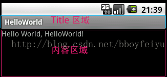
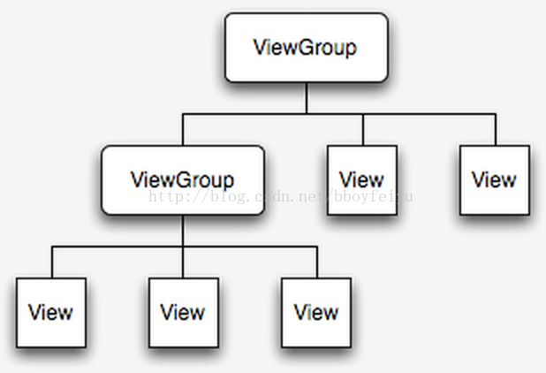
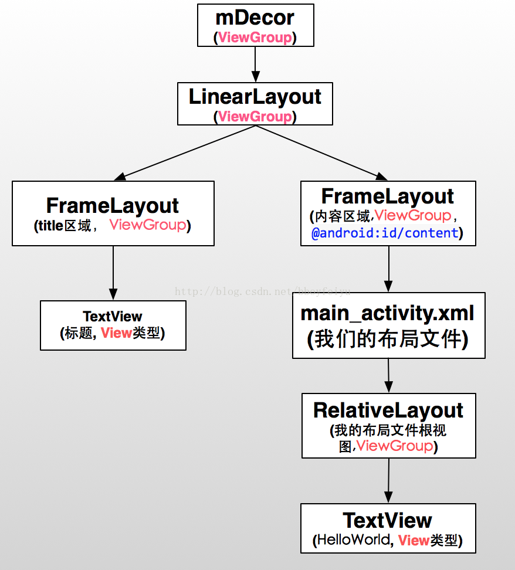
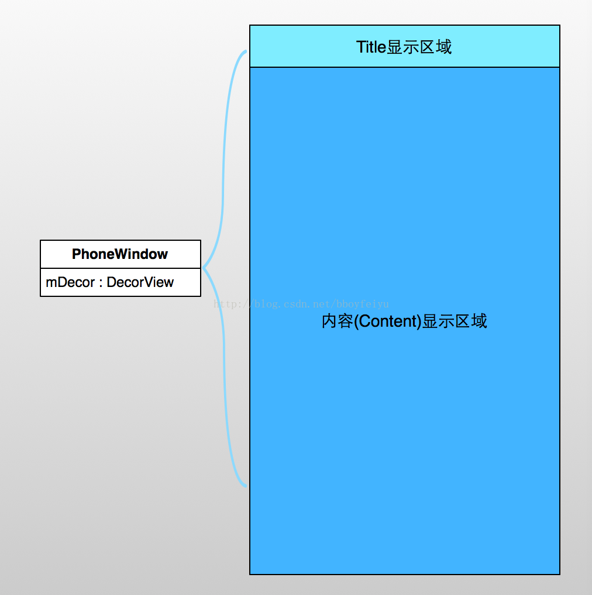

今天是中秋节，先祝各位中秋快乐吧。作为北漂的人，对于过节最大的感触就是没气氛~ 中秋是一个特别重要的节日，小的时候过中秋都是特别快乐的，有月饼吃，和家人上月，过完中秋要去亲戚家拜访等等。现在对于我们来说也就是一个节日罢了，窝在家里看点电视、看点书、吃顿好的，虽说生活好了，但日子过得没啥滋味。废话不多说，开始今天的学习吧。

## 1. Hello World

对于学习编程的人而言，大多数人第一个项目都是著名的"Hello World"，自从K&R开了这个先例，后面的人就很少有打破的。学习Android开发也是这样，我们第一次创建应用，估计也就是运行程序，然后在模拟器上输出一个Hello World，我们看到最简单的Activity中的内容大致是这样的:

```java
public class MainActivity extends Activity {  

    @Override  
    public void onCreate(Bundle savedInstanceState) {  
        super.onCreate(savedInstanceState);  
        setContentView(R.layout.main_activity);  
    }  

}  
```
main_activity.xml大致是这样的 :

```xml
<RelativeLayout xmlns:android="http://schemas.android.com/apk/res/android"  
    xmlns:tools="http://schemas.android.com/tools"  
    android:layout_width="match_parent"  
    android:layout_height="match_parent"  
    android:gravity="center" >  

    <TextView  
        android:layout_width="match_parent"  
        android:layout_height="wrap_content"  
        android:text="@string/hello_world" />  

</RelativeLayout>
```
然后执行程序，我们就可以看到模拟器中的Hello World了。



我们在整个过程中做的事情很少，在我们的main_activity.xml我们只有一个显示文本的TextView，但是在上图中却还多了一个title。我们好奇的是整个过程是怎么工作的？对于大型系统来说细节总是复杂的，在下水平有限，所以我们今天只来理一下它的基本脉络。

## 2. setContentView
一般来说我们设置页面的内容视图是都是通过setContentView方法，那么我们就以2.3源码为例就来看看Activity中的setContentView到底做了什么吧。

```java
/**
 * Set the activity content from a layout resource.  The resource will be
 * inflated, adding all top-level views to the activity.
 *  
 * @param layoutResID Resource ID to be inflated.
 */  
public void setContentView(int layoutResID) {  
    getWindow().setContentView(layoutResID);  
}  

public Window getWindow() {  
    return mWindow;  
}  

private Window mWindow;  
```

我们可以看到，实际上调用的mWindow的setContentView方法，在Android Touch事件分发过程这篇文章中我们已经指出Window的实现类为PhoneWindow类，我们就移步到PhoneWindow的setConentView吧，核心源码如下 :

```java
@Override  
public void setContentView(int layoutResID) {  
    if (mContentParent == null) {  
        installDecor();         // 1、生成DecorView  
    } else {  
        mContentParent.removeAllViews();  
    }  
    mLayoutInflater.inflate(layoutResID, mContentParent);// 2、将layoutResId的布局添加到mContentParent中  
    final Callback cb = getCallback();  
    if (cb != null) {  
        cb.onContentChanged();  
    }  
}  
    // 构建mDecor对象,并且初始化标题栏和Content Parent(我们要显示的内容区域)  
    private void installDecor() {  
    if (mDecor == null) {  
        mDecor = generateDecor(); // 3、构建DecorView  
        mDecor.setDescendantFocusability(ViewGroup.FOCUS_AFTER_DESCENDANTS);  
        mDecor.setIsRootNamespace(true);  
    }  
    if (mContentParent == null) {  
        mContentParent = generateLayout(mDecor); // 4、获取ContentView容器，即显示内容的区域  

        mTitleView = (TextView)findViewById(com.android.internal.R.id.title); 5、设置Title等  
        if (mTitleView != null) {  
            if ((getLocalFeatures() & (1 << FEATURE_NO_TITLE)) != 0) {  
                View titleContainer = findViewById(com.android.internal.R.id.title_container);  
                if (titleContainer != null) {  
                    titleContainer.setVisibility(View.GONE);  
                } else {  
                    mTitleView.setVisibility(View.GONE);  
                }  
                if (mContentParent instanceof FrameLayout) {  
                    ((FrameLayout)mContentParent).setForeground(null);  
                }  
            } else {  
                mTitleView.setText(mTitle);  
            }  
        }  
    }  
}  

    protected DecorView generateDecor() {  
    return new DecorView(getContext(), -1); // 构建mDecor对象  
}
```

我们可以看到，setContentView的基本流程简单概括就是如下几步：

1. 构建mDecor对象。mDecor就是整个窗口的顶层视图，它主要包含了Title和Content View两个区域 （参考图1中的两个区域 ），Title区域就是我们的标题栏，Content View区域就是显示我们xml布局内容中的区域。关于mDecor对象更多说明也请参考Android Touch事件分发过程这篇文章
2. 设置一些关于窗口的属性，初始化标题栏区域和内容显示区域

这里比较复杂的就是generateLayout(mDecor)这个函数，我们一起来分析一下吧。


```java
// 返回用于显示我们设置的页面内容的ViewGroup容器  
protected ViewGroup generateLayout(DecorView decor) {  
   // Apply data from current theme.  
   // 1、获取窗口的Style属性  
   TypedArray a = getWindowStyle();  

   if (false) {  
       System.out.println("From style:");  
       String s = "Attrs:";  
       for (int i = 0; i < com.android.internal.R.styleable.Window.length; i++) {  
           s = s + " " + Integer.toHexString(com.android.internal.R.styleable.Window[i]) + "="  
                   + a.getString(i);  
       }  
       System.out.println(s);  
   }  
   // 窗口是否是浮动的  
   mIsFloating = a.getBoolean(com.android.internal.R.styleable.Window_windowIsFloating, false);  
   int flagsToUpdate = (FLAG_LAYOUT_IN_SCREEN|FLAG_LAYOUT_INSET_DECOR)  
           & (~getForcedWindowFlags());  
   if (mIsFloating) {  
       setLayout(WRAP_CONTENT, WRAP_CONTENT);  
       setFlags(0, flagsToUpdate);  
   } else {  
       setFlags(FLAG_LAYOUT_IN_SCREEN|FLAG_LAYOUT_INSET_DECOR, flagsToUpdate);  
   }  
   // 设置是否不显示title区域  
   if (a.getBoolean(com.android.internal.R.styleable.Window_windowNoTitle, false)) {  
       requestFeature(FEATURE_NO_TITLE);  
   }  
   // 设置全屏的flag  
   if (a.getBoolean(com.android.internal.R.styleable.Window_windowFullscreen, false)) {  
       setFlags(FLAG_FULLSCREEN, FLAG_FULLSCREEN&(~getForcedWindowFlags()));  
   }  

   if (a.getBoolean(com.android.internal.R.styleable.Window_windowShowWallpaper, false)) {  
       setFlags(FLAG_SHOW_WALLPAPER, FLAG_SHOW_WALLPAPER&(~getForcedWindowFlags()));  
   }  

   WindowManager.LayoutParams params = getAttributes();  
   // 设置输入法模式  
   if (!hasSoftInputMode()) {  
       params.softInputMode = a.getInt(  
               com.android.internal.R.styleable.Window_windowSoftInputMode,  
               params.softInputMode);  
   }  

   if (a.getBoolean(com.android.internal.R.styleable.Window_backgroundDimEnabled,  
           mIsFloating)) {  
       /* All dialogs should have the window dimmed */  
       if ((getForcedWindowFlags()&WindowManager.LayoutParams.FLAG_DIM_BEHIND) == 0) {  
           params.flags |= WindowManager.LayoutParams.FLAG_DIM_BEHIND;  
       }  
       params.dimAmount = a.getFloat(  
               android.R.styleable.Window_backgroundDimAmount, 0.5f);  
   }  
   // 窗口动画  
   if (params.windowAnimations == 0) {  
       params.windowAnimations = a.getResourceId(  
               com.android.internal.R.styleable.Window_windowAnimationStyle, 0);  
   }  

   // The rest are only done if this window is not embedded; otherwise,  
   // the values are inherited from our container.  
   if (getContainer() == null) {  
       if (mBackgroundDrawable == null) {  
           if (mBackgroundResource == 0) {  
               mBackgroundResource = a.getResourceId(  
                       com.android.internal.R.styleable.Window_windowBackground, 0);  
           }  
           if (mFrameResource == 0) {  
               mFrameResource = a.getResourceId(com.android.internal.R.styleable.Window_windowFrame, 0);  
           }  
           if (false) {  
               System.out.println("Background: "  
                       + Integer.toHexString(mBackgroundResource) + " Frame: "  
                       + Integer.toHexString(mFrameResource));  
           }  
       }  
       mTextColor = a.getColor(com.android.internal.R.styleable.Window_textColor, 0xFF000000);  
   }  

   // Inflate the window decor.   
   // 2、根据一些属性来选择不同的顶层视图布局,例如设置了FEATURE_NO_TITLE的属性，那么就选择没有Title区域的那么布局；  
   // layoutResource布局就是整个Activity的布局，其中含有title区域和content区域，content区域就是用来显示视图 
   // setContentView设置进来的内容区域，也就是我们要显示的视图。  

   int layoutResource;  
   int features = getLocalFeatures();  
   // System.out.println("Features: 0x" + Integer.toHexString(features));  
   if ((features & ((1 << FEATURE_LEFT_ICON) | (1 << FEATURE_RIGHT_ICON))) != 0) {  
       if (mIsFloating) {  
           layoutResource = com.android.internal.R.layout.dialog_title_icons;  
       } else {  
           layoutResource = com.android.internal.R.layout.screen_title_icons;  
       }  
       // System.out.println("Title Icons!");  
   } else if ((features & ((1 << FEATURE_PROGRESS) | (1 << FEATURE_INDETERMINATE_PROGRESS))) != 0) {  
       // Special case for a window with only a progress bar (and title).  
       // XXX Need to have a no-title version of embedded windows.  
       layoutResource = com.android.internal.R.layout.screen_progress;  
       // System.out.println("Progress!");  
   } else if ((features & (1 << FEATURE_CUSTOM_TITLE)) != 0) {  
       // Special case for a window with a custom title.  
       // If the window is floating, we need a dialog layout  
       if (mIsFloating) {  
           layoutResource = com.android.internal.R.layout.dialog_custom_title;  
       } else {  
           layoutResource = com.android.internal.R.layout.screen_custom_title;  
       }  
   } else if ((features & (1 << FEATURE_NO_TITLE)) == 0) {  
       // If no other features and not embedded, only need a title.  
       // If the window is floating, we need a dialog layout  
       if (mIsFloating) {  
           layoutResource = com.android.internal.R.layout.dialog_title;  
       } else {  
           layoutResource = com.android.internal.R.layout.screen_title;  
       }  
       // System.out.println("Title!");  
   } else {  
       // Embedded, so no decoration is needed.  
       layoutResource = com.android.internal.R.layout.screen_simple;  
       // System.out.println("Simple!");  
   }  

   mDecor.startChanging();  
   // 3、加载视图  
   View in = mLayoutInflater.inflate(layoutResource, null);  
   // 4、将layoutResource的内容添加到mDecor中  
   decor.addView(in, new ViewGroup.LayoutParams(MATCH_PARENT, MATCH_PARENT));  
   // 5、获取到我们的内容显示区域，这是一个ViewGroup类型的，其实是FrameLayout  
   ViewGroup contentParent = (ViewGroup)findViewById(ID_ANDROID_CONTENT);  
   if (contentParent == null) {  
       throw new RuntimeException("Window couldn't find content container view");  
   }  

   if ((features & (1 << FEATURE_INDETERMINATE_PROGRESS)) != 0) {  
       ProgressBar progress = getCircularProgressBar(false);  
       if (progress != null) {  
           progress.setIndeterminate(true);  
       }  
   }  

   // 6、设置一些背景、title等属性  
   // Remaining setup -- of background and title -- that only applies  
   // to top-level windows.  
   if (getContainer() == null) {  
       Drawable drawable = mBackgroundDrawable;  
       if (mBackgroundResource != 0) {  
           drawable = getContext().getResources().getDrawable(mBackgroundResource);  
       }  
       mDecor.setWindowBackground(drawable);  
       drawable = null;  
       if (mFrameResource != 0) {  
           drawable = getContext().getResources().getDrawable(mFrameResource);  
       }  
       mDecor.setWindowFrame(drawable);  

       // System.out.println("Text=" + Integer.toHexString(mTextColor) +  
       // " Sel=" + Integer.toHexString(mTextSelectedColor) +  
       // " Title=" + Integer.toHexString(mTitleColor));  

       if (mTitleColor == 0) {  
           mTitleColor = mTextColor;  
       }  

       if (mTitle != null) {  
           setTitle(mTitle);  
       }  
       setTitleColor(mTitleColor);  
   }  

   mDecor.finishChanging();  

   return contentParent;  
```

其实也就是这么几个步骤：

1. 获取用户设置的一些属性与Flag
2. 根据一些属性选择不同的顶层视图布局，例如FEATURE_NO_TITLE则选择没有title的布局文件等；这里我们看一个与图1中符合的顶层布局吧，即layoutResource = com.android.internal.R.layout.screen_title的情形

```xml
<?xml version="1.0" encoding="utf-8"?>  

<LinearLayout xmlns:android="http://schemas.android.com/apk/res/android"  
    android:orientation="vertical"  
    android:fitsSystemWindows="true">  
    <!-- Popout bar for action modes -->  
    <ViewStub android:id="@+id/action_mode_bar_stub"  
              android:inflatedId="@+id/action_mode_bar"  
              android:layout="@layout/action_mode_bar"  
              android:layout_width="match_parent"  
              android:layout_height="wrap_content" />  
    <!--  title区域-->  
    <FrameLayout  
        android:layout_width="match_parent"   
        android:layout_height="?android:attr/windowTitleSize"  
        style="?android:attr/windowTitleBackgroundStyle">  
        <TextView android:id="@android:id/title"   
            style="?android:attr/windowTitleStyle"  
            android:background="@null"  
            android:fadingEdge="horizontal"  
            android:gravity="center_vertical"  
            android:layout_width="match_parent"  
            android:layout_height="match_parent" />  
    </FrameLayout>  
    <!--内容显示区域, 例如main_activity.xml布局就会被放到这个ViewGroup下面 -->  
    <FrameLayout android:id="@android:id/content"  
        android:layout_width="match_parent"   
        android:layout_height="0dip"  
        android:layout_weight="1"  
        android:foregroundGravity="fill_horizontal|top"  
        android:foreground="?android:attr/windowContentOverlay" />  
</LinearLayout>  
```

我们可以看到有两个区域，即title区域和content区域，generateLayout函数中的

```java
// 5、获取到我们的内容显示区域，这是一个ViewGroup类型的，其实是FrameLayout  
ViewGroup contentParent = (ViewGroup)findViewById(ID_ANDROID_CONTENT);
```

获取的就是xml中id为content的FrameLayout，这个content就是我们的内容显示区域。整个布局对应的效果如下 :



这两个区域就组成了mDecor视图，我们的main_activity.xml就是放在内容视图这个区域的。 

3、加载顶层布局文件，转换为View，将其添加到mDecor中； 

4、获取内容容器Content Parent，即用于显示我们的内容的区域； 

5、设置一些背景图和title等。

在经过这几步，我们就得到了mContentParent，这就是用来装载我们的视图的ViewGroup。再回过头来看setContentView函数：

```java
public void setContentView(int layoutResID) {  
    if (mContentParent == null) {  
        installDecor();// 1、生成DecorView，并且根据窗口属性加载顶级视图布局、获取mContentParent、设置一些基本属性等  
    } else {  
        mContentParent.removeAllViews();  
    }  
    mLayoutInflater.inflate(layoutResID, mContentParent);// 2、将layoutResId加载到mContentParent中，这里的layoutResId就是我们的main_activity.xml  
    final Callback cb = getCallback();  
    if (cb != null) {  
        cb.onContentChanged();  
    }  
}
```
我们看看LayoutInflater的inflate函数吧 :

```java
/**
* Inflate a new view hierarchy from the specified xml resource. Throws
* {@link InflateException} if there is an error.
* 
* @param resource ID for an XML layout resource to load (e.g.,
* <code>R.layout.main_page</code>)
* @param root Optional view to be the parent of the generated hierarchy.
* @return The root View of the inflated hierarchy. If root was supplied,
* this is the root View; otherwise it is the root of the inflated
* XML file.
   */  
   public View inflate(int resource, ViewGroup root) {  
    return inflate(resource, root, root != null);  
   }  

/**
*  Inflate a new view hierarchy from the specified xml resource. Throws
*  {@link InflateException} if there is an error.
*  
*  @param resource ID for an XML layout resource to load (e.g.,
*  <code>R.layout.main_page</code>)
*  @param root Optional view to be the parent of the generated hierarchy (if
*  <em>attachToRoot</em> is true), or else simply an object that
*  provides a set of LayoutParams values for root of the returned
*  hierarchy (if <em>attachToRoot</em> is false.)
*  @param attachToRoot Whether the inflated hierarchy should be attached to
*  the root parameter? If false, root is only used to create the
*  correct subclass of LayoutParams for the root view in the XML.
*  @return The root View of the inflated hierarchy. If root was supplied and
*  attachToRoot is true, this is root; otherwise it is the root of
*  the inflated XML file.
   */  
   public View inflate(int resource, ViewGroup root, boolean attachToRoot) {  
    if (DEBUG) System.out.println("INFLATING from resource: " + resource);  
    XmlResourceParser parser = getContext().getResources().getLayout(resource);  
    try {  
        return inflate(parser, root, attachToRoot);  
    } finally {  
        parser.close();  
    }  
   }
```
实际上就是将layoutResId这个布局的视图附加到mContentParent中。

## 3. DecorView

移步 : [DecorView](http://blog.csdn.net/bboyfeiyu/article/details/38958829#t2)

## 4. ViewGroup

ViewGroup从语义上来说就是视图组，它也继承自View类，它其实就是视图的容器。我们看官方的定义 :

```java
* A ViewGroup is a special view that can contain other views  
* (called children.) The view group is the base class for layouts and views  
* containers. This class also defines the  
* {@link android.view.ViewGroup.LayoutParams} class which serves as the base  
* class for layouts parameters.  
```
我们通过ViewGroup来组织、管理子视图，例如我们常见的FrameLayout、LinearLayout、RelativeLayout、ListView等都是ViewGroup类型，总之只要能包含其他View或者ViewGroup的都是ViewGroup类型。使用ViewGroup来构建视图树。



## 5. View

View就是UI界面上的一个可见的组件，任何在UI上可见的都为View的子类。我们看官方定义 :

```java
* This class represents the basic building block for user interface components. A View  
* occupies a rectangular area on the screen and is responsible for drawing and  
* event handling. View is the base class for <em>widgets</em>, which are  
* used to create interactive UI components (buttons, text fields, etc.). The  
* {@link android.view.ViewGroup} subclass is the base class for <em>layouts</em>, which  
* are invisible containers that hold other Views (or other ViewGroups) and define  
* their layout properties.
```
TextView、Button、ImageView、FrameLayout、LinearLayout、ListView等都是View的子类。

这样，ViewGroup类型的视图管理嵌套在里面的ViewGroup以及View控件组成了丰富多彩的用户界面。例如我们开篇的Hello World的视图结构是这样的 :



## 6. 总结



整个窗口由Title区域和Content区域组成，Content区域就是我们要显示内容的区域，在这个区域中mContentParent是根ViewGroup，由mContentParent组织、管理其子视图，从而构建整个视图树。当Activity启动时，就将这些内容就会显示在手机上。
