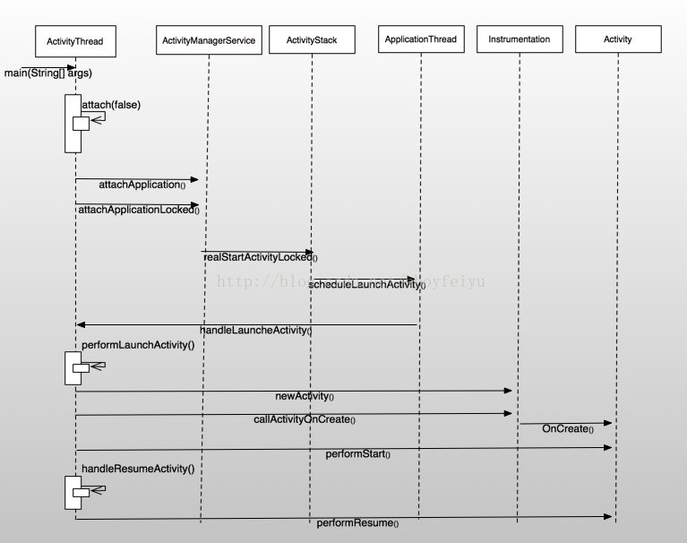

## 前言

在[Android View系统分析之从setContentView说开来(一)](自定义控件/View系统分析之一从setContentView说开来.md)与[Android View系统分析之二View与ViewGroup](自定义控件/View系统分析之二View与ViewGroup.md)中我们已经简单介绍了一个Activity的UI内容与视图树的组成关系，即View与ViewGroup组成了Activity的可视化视图树，然后将该视图树添加到Activity中的DecorView的content区域，这样整个Activity的UI就填充完成了。那么一个进程和Activity又是如何启动？Activity的UI内容又是如何显示在屏幕上的呢？今天我们就来简单的梳理一下这个过程，大牛就不要往下看了！

## Activity的启动过程

我们知道，在Android系统启动时，第一个启动起来的进程就是zygote进程，然后由zygote启动SystemServer，再然后就是启动例如ActivityManagerService、WindowManagerService等系统核心服务，这些服务承载着整个Android系统与客户端程序交互的重担。zygote除了启动系统服务与进程之外，普通的用户进程也由zygote进程fork而来，当一个应用进程启动起来后，就会加载用户在AndroidManifest.xml中配置的默认加载的Activity。此时加载的入口是ActivityThread.main(String[] args)方法，这个方法就是类似于C语言中的main方法一样，是整个应用程序的入口。

在ActivityThread.main(String[] args)这个方法中，主要的功能就是创建Application和创建Activity，并且调用Activity的一些生命周期函数，例如onCreate、onResume等。下面我们就从ActivityThread.main(String[] args)这个入口开始学习吧。

```java
public static final void main(String[] args) {  
    SamplingProfilerIntegration.start();  

    Process.setArgV0("<pre-initialized>");  

    // 1、创建UI线程的Looper  
    Looper.prepareMainLooper();  
    if (sMainThreadHandler == null) {  
        sMainThreadHandler = new Handler();  
    }  
    // 2、创建ActivityThread对象,但它并不是线程感觉是封装了UI线程消息循环与操作Activity生命周期的工具类  
    ActivityThread thread = new ActivityThread();  
    // 3、调用ActivityThread的attach方法，这是核心方法，Application、Activity的创建入口就在这里  
    thread.attach(false);  

    if (false) {  
        Looper.myLooper().setMessageLogging(new  
                LogPrinter(Log.DEBUG, "ActivityThread"));  
    }  
    // 4、启动UI线程消息循环  
    Looper.loop();  

    if (Process.supportsProcesses()) {  
        throw new RuntimeException("Main thread loop unexpectedly exited");  
    }  

    thread.detach();  
    String name = (thread.mInitialApplication != null)  
        ? thread.mInitialApplication.getPackageName()  
        : "<unknown>";  
    Slog.i(TAG, "Main thread of " + name + " is now exiting");  
}  


// UI线程与Application关联  
private final void attach(boolean system) {  
    sThreadLocal.set(this);  
    mSystemThread = system;  
    // 不是系统进程  
    if (!system) {  
        ViewRoot.addFirstDrawHandler(new Runnable() {  
            public void run() {  
                ensureJitEnabled();  
            }  
        });  
        android.ddm.DdmHandleAppName.setAppName("<pre-initialized>");  
        RuntimeInit.setApplicationObject(mAppActivityManagerNativeThread.asBinder());  
        // 5、获取ActivityManagerService实例  
        IActivityManager mgr = ActivityManagerNative.getDefault();  
        try {  
            // 6、注意这里，将mAppThread与Application进行管理  
            mgr.attachApplication(mAppThread);  
        } catch (RemoteException ex) {  
        }  
    } else {  
        // 代码省略  
    }  
    // 代码省略  
}
```

可以看到，在ActivityThread.main中主要的功能就是创建了UI线程消息循环，并且启动了消息循环。最重要的是创建了ActivityThread，并调用了attach方法。在attach方法中又调用了ActivityManagerService中的attachApplication(mAppThread)方法，这个才是我们的重点。mAppThread是ApplicationThread类型，它也不是一个Thread，而是一个Binder，负责与远程的ActivityManagerService进行交互。在了解attachApplication之前，我们先来了解一下ApplicationThread与ActivityThread的关联。代码如下 :

```java
public final class ActivityThread {  

// 定义mAppThread与mH  
final ApplicationThread mAppThread = new ApplicationThread();  
    final Looper mLooper = Looper.myLooper();  
    final H mH = new H();  


    // if the thread hasn't started yet, we don't have the handler, so just  
    // save the messages until we're ready.  
    private final void queueOrSendMessage(int what, Object obj) {  
        queueOrSendMessage(what, obj, 0, 0);  
    }  

    private final void queueOrSendMessage(int what, Object obj, int arg1) {  
        queueOrSendMessage(what, obj, arg1, 0);  
    }  

    private final void queueOrSendMessage(int what, Object obj, int arg1, int arg2) {  
        synchronized (this) {  
            if (DEBUG_MESSAGES) Slog.v(  
                TAG, "SCHEDULE " + what + " " + mH.codeToString(what)  
                + ": " + arg1 + " / " + obj);  
            Message msg = Message.obtain();  
            msg.what = what;  
            msg.obj = obj;  
            msg.arg1 = arg1;  
            msg.arg2 = arg2;  
            // 通过mH来发消息, 处理也在H类中的handleMessage函数中  
            mH.sendMessage(msg);  
        }  
    }  


    /// AppcationThread 内部类，负责与ActivityManagerService交互  
    private final class ApplicationThread extends ApplicationThreadNative {  
        private static final String HEAP_COLUMN = "%17s %8s %8s %8s %8s";  
        private static final String ONE_COUNT_COLUMN = "%17s %8d";  
        private static final String TWO_COUNT_COLUMNS = "%17s %8d %17s %8d";  
        private static final String TWO_COUNT_COLUMNS_DB = "%20s %8d %20s %8d";  
        private static final String DB_INFO_FORMAT = "  %8d %8d %14d  %s";  

        // Formatting for checkin service - update version if row format changes  
        private static final int ACTIVITY_THREAD_CHECKIN_VERSION = 1;  

        // 向UI线程发一个resume activity的消息  
        public final void scheduleResumeActivity(IBinder token, boolean isForward) {  
            queueOrSendMessage(H.RESUME_ACTIVITY, token, isForward ? 1 : 0);  
        }  

        // we use token to identify this activity without having to send the  
        // activity itself back to the activity manager. (matters more with ipc)  
        public final void scheduleLaunchActivity(Intent intent, IBinder token, int ident,  
                ActivityInfo info, Bundle state, List<ResultInfo> pendingResults,  
                List<Intent> pendingNewIntents, boolean notResumed, boolean isForward) {  
            ActivityClientRecord r = new ActivityClientRecord();  

            r.token = token;  
            r.ident = ident;  
            r.intent = intent;  
            r.activityInfo = info;  
            r.state = state;  

            r.pendingResults = pendingResults;  
            r.pendingIntents = pendingNewIntents;  

            r.startsNotResumed = notResumed;  
            r.isForward = isForward;  

            // 向UI线程发一个H.LAUNCH_ACTIVITY的消息  
            queueOrSendMessage(H.LAUNCH_ACTIVITY, r);  
        }  

        // 省略代码  

    } // end ApplicationThread  


    // H内部类, ApplicationThread通过H类型的对象向UI线程投递消息  
    private final class H extends Handler {  
        public static final int LAUNCH_ACTIVITY         = 100;  
        public static final int PAUSE_ACTIVITY          = 101;  
        public static final int PAUSE_ACTIVITY_FINISHING= 102;  
        // 其他code省略  
        String codeToString(int code) {  
            if (DEBUG_MESSAGES) {  
                switch (code) {  
                    case LAUNCH_ACTIVITY: return "LAUNCH_ACTIVITY";  
                    case PAUSE_ACTIVITY: return "PAUSE_ACTIVITY";  
                    case PAUSE_ACTIVITY_FINISHING: return "PAUSE_ACTIVITY_FINISHING";  
                    // 代码省略  
                }  
            }  
            return "(unknown)";  
        }  
        public void handleMessage(Message msg) {  
            if (DEBUG_MESSAGES) Slog.v(TAG, ">>> handling: " + msg.what);  
            switch (msg.what) {  
                case LAUNCH_ACTIVITY: {  
                    ActivityClientRecord r = (ActivityClientRecord)msg.obj;  

                    r.packageInfo = getPackageInfoNoCheck(  
                            r.activityInfo.applicationInfo);  
                    // 加载Activity  
                    handleLaunchActivity(r, null);  
                } break;  
                // activity pause  
                case PAUSE_ACTIVITY:  
                    handlePauseActivity((IBinder)msg.obj, false, msg.arg1 != 0, msg.arg2);  
                    maybeSnapshot();  
                    break;  
                // 代码省略                
            }  
            if (DEBUG_MESSAGES) Slog.v(TAG, "<<< done: " + msg.what);  
        }  

    } // end H  

} // end ActivityThread  
```

ApplicationThread与ActivityManagerService进行交互，然后通过H类的对象mH来发送消息，并且在H类的handleMessage函数中进行处理，然后handleMessage根据消息的类型调用ActivityThread中对应的方法,比如handleResumeActivity来使Activity变得可见等。因为H的消息队列就是主线程的消息队列，因此这些过程都在UI线程中处理。

好的，我们现在继续关注ActivityManagerService中的attachApplication( mAppThread )。

```java
public final void attachApplication(IApplicationThread thread) {  
    synchronized (this) {  
        int callingPid = Binder.getCallingPid();  
        final long origId = Binder.clearCallingIdentity();  
        // 1、转到了attachApplicationLocked  
        attachApplicationLocked(thread, callingPid);  
        Binder.restoreCallingIdentity(origId);  
    }  
}  


private final boolean attachApplicationLocked(IApplicationThread thread,  
        int pid) {  

    // 代码省略  
    if (localLOGV) Slog.v(  
        TAG, "New app record " + app  
        + " thread=" + thread.asBinder() + " pid=" + pid);  
    try {  
        // 2、ApplicationThread绑定Application  
        thread.bindApplication(processName, app.instrumentationInfo != null  
                ? app.instrumentationInfo : app.info, providers,  
                app.instrumentationClass, app.instrumentationProfileFile,  
                app.instrumentationArguments, app.instrumentationWatcher, testMode,   
                isRestrictedBackupMode || !normalMode,  
                mConfiguration, getCommonServicesLocked());  
        updateLruProcessLocked(app, false, true);  
        app.lastRequestedGc = app.lastLowMemory = SystemClock.uptimeMillis();  
    } catch (Exception e) {  
         return false;  
    }  

    // 代码省略  

    // See if the top visible activity is waiting to run in this process...  
    ActivityRecord hr = mMainStack.topRunningActivityLocked(null);  
    if (hr != null && normalMode) {  
        if (hr.app == null && app.info.uid == hr.info.applicationInfo.uid  
                && processName.equals(hr.processName)) {  
            try {  
                // 3、正确启动Activity  
                if (mMainStack.realStartActivityLocked(hr, app, true, true)) {  
                    didSomething = true;  
                }  
            } catch (Exception e) {  
                Slog.w(TAG, "Exception in new application when starting activity "  
                      + hr.intent.getComponent().flattenToShortString(), e);  
                badApp = true;  
            }  
        } else {  
            mMainStack.ensureActivitiesVisibleLocked(hr, null, processName, 0);  
        }  
    }  

    return true;  
}
```
在省略了一大波代码之后，我们抓住了我们需要关心的点，即注释3处，这里才是真正启动activity的地方，这名字真是起得实诚。mMainStack的类型为ActivityStack，我们看看realStartActivityLocked吧。

```java
// 3中的ActivityStack中的realStartActivityLocked方法  
 final boolean realStartActivityLocked(ActivityRecord r,  
        ProcessRecord app, boolean andResume, boolean checkConfig)  
        throws RemoteException {  

    // 代码省略  
    try {  
        // 代码省略  
        // 设置app的dex文件的所在位置,指定包名  
        mService.ensurePackageDexOpt(r.intent.getComponent().getPackageName());  
        // 1、注意这里调用了ApplicationThread中的scheduleLaunchActivity方法, 这个方法中会给UI线程发一个  
        // LAUNCH_ACTIVITY消息，然后会调用ActivityThread的handleLaunchActivity(ActivityClientRecord r, Intent customIntent)函数  
        // 在这个函数中会创建Activity，并且调用Activity的onCreate、onResume函数  
        app.thread.scheduleLaunchActivity(new Intent(r.intent), r,  
                System.identityHashCode(r),  
                r.info, r.icicle, results, newIntents, !andResume,  
                mService.isNextTransitionForward());  

        // 代码省略              
    } catch (RemoteException e) {  

    }  
    // 代码省略  

    return true;  
}
```

好嘛，绕来绕去，最终调用了ActiivityThread中的内部类的ApplicationThread中的scheduleLaunchActivity函数。该函数会发一个这个方法中会给UI线程发一个H.LAUNCH_ACTIVITY消息，然后会调用ActivityThread的handleLaunchActivity(ActivityClientRecord r, Intent customIntent)函数，在这个函数中会创建将要启动的Activity，并且调用其生命周期函数onCreate、onResume。ApplicationThread中的scheduleLaunchActivity函数的代码在上文已经给出，下面我们看看ActivityThread的handleLaunchActivity(ActivityClientRecord r, Intent customIntent)函数。

```java
// ActivityThread中的handleLaunchActivity  
private final void handleLaunchActivity(ActivityClientRecord r, Intent customIntent) {  
        // If we are getting ready to gc after going to the background, well  
        // we are back active so skip it.  
        unscheduleGcIdler();  

        if (localLOGV) Slog.v(  
            TAG, "Handling launch of " + r);  
        // 1、创建并且加载Activity，调用其onCreate函数  
        Activity a = performLaunchActivity(r, customIntent);  

        if (a != null) {  
            r.createdConfig = new Configuration(mConfiguration);  
            Bundle oldState = r.state;  
            // 2、调用Activity的onResume方法，使Activity变得可见  
            handleResumeActivity(r.token, false, r.isForward);  

        }  
    }  


     private final Activity performLaunchActivity(ActivityClientRecord r, Intent customIntent) {  
        // System.out.println("##### [" + System.currentTimeMillis() + "] ActivityThread.performLaunchActivity(" + r + ")");  

        ActivityInfo aInfo = r.activityInfo;  
        if (r.packageInfo == null) {  
            r.packageInfo = getPackageInfo(aInfo.applicationInfo,  
                    Context.CONTEXT_INCLUDE_CODE);  
        }  

        ComponentName component = r.intent.getComponent();  
        if (component == null) {  
            component = r.intent.resolveActivity(  
                mInitialApplication.getPackageManager());  
            r.intent.setComponent(component);  
        }  

        if (r.activityInfo.targetActivity != null) {  
            component = new ComponentName(r.activityInfo.packageName,  
                    r.activityInfo.targetActivity);  
        }  

        Activity activity = null;  
        try {  
            java.lang.ClassLoader cl = r.packageInfo.getClassLoader();  
            // 1、创建Activity  
            activity = mInstrumentation.newActivity(  
                    cl, component.getClassName(), r.intent);  
            r.intent.setExtrasClassLoader(cl);  
            if (r.state != null) {  
                r.state.setClassLoader(cl);  
            }  
        } catch (Exception e) {  
            if (!mInstrumentation.onException(activity, e)) {  
                throw new RuntimeException(  
                    "Unable to instantiate activity " + component  
                    + ": " + e.toString(), e);  
            }  
        }  

        try {  
            // 2、创建Application  
            Application app = r.packageInfo.makeApplication(false, mInstrumentation);  

            if (localLOGV) Slog.v(TAG, "Performing launch of " + r);  
            if (localLOGV) Slog.v(  
                    TAG, r + ": app=" + app  
                    + ", appName=" + app.getPackageName()  
                    + ", pkg=" + r.packageInfo.getPackageName()  
                    + ", comp=" + r.intent.getComponent().toShortString()  
                    + ", dir=" + r.packageInfo.getAppDir());  

            if (activity != null) {  
                // 构建Context  
                ContextImpl appContext = new ContextImpl();  
                appContext.init(r.packageInfo, r.token, this);  
                appContext.setOuterContext(activity);  
                // 获取Activity的title  
                CharSequence title = r.activityInfo.loadLabel(appContext.getPackageManager());  
                Configuration config = new Configuration(mConfiguration);  

                    // 3、Activity与context, Application关联起来  
                activity.attach(appContext, this, getInstrumentation(), r.token,  
                        r.ident, app, r.intent, r.activityInfo, title, r.parent,  
                        r.embeddedID, r.lastNonConfigurationInstance,  
                        r.lastNonConfigurationChildInstances, config);  

                if (customIntent != null) {  
                    activity.mIntent = customIntent;  
                }  
                r.lastNonConfigurationInstance = null;  
                r.lastNonConfigurationChildInstances = null;  
                activity.mStartedActivity = false;  
                int theme = r.activityInfo.getThemeResource();  
                if (theme != 0) {  
                    activity.setTheme(theme);  
                }  

                activity.mCalled = false;  
                // 4、回调Activity的onCreate方法  
                mInstrumentation.callActivityOnCreate(activity, r.state);  
                if (!activity.mCalled) {  
                    throw new SuperNotCalledException(  
                        "Activity " + r.intent.getComponent().toShortString() +  
                        " did not call through to super.onCreate()");  
                }  
                r.activity = activity;  
                r.stopped = true;  
                // 5、执行Activity的onStart方法  
                if (!r.activity.mFinished) {  
                    activity.performStart();  
                    r.stopped = false;  
                }  
                // 代码省略  
            }  
            r.paused = true;  

            mActivities.put(r.token, r);  

        } catch (SuperNotCalledException e) {  
            throw e;  

        } catch (Exception e) {  

        }  

        return activity;  
    }  


    final void handleResumeActivity(IBinder token, boolean clearHide, boolean isForward) {  
        // If we are getting ready to gc after going to the background, well  
        // we are back active so skip it.  
        unscheduleGcIdler();  

        // 1、最终调用Activity的onResume方法  
        ActivityClientRecord r = performResumeActivity(token, clearHide);  

        if (r != null) {  
            final Activity a = r.activity;  

            final int forwardBit = isForward ?  
                    WindowManager.LayoutParams.SOFT_INPUT_IS_FORWARD_NAVIGATION : 0;  

            // If the window hasn't yet been added to the window manager,  
            // and this guy didn't finish itself or start another activity,  
            // then go ahead and add the window.  
            boolean willBeVisible = !a.mStartedActivity;  
            if (!willBeVisible) {  
                try {  
                    willBeVisible = ActivityManagerNative.getDefault().willActivityBeVisible(  
                            a.getActivityToken());  
                } catch (RemoteException e) {  
                }  
            }  

            // 2、这里是重点，在这里使DecorView变得可见  
            if (r.window == null && !a.mFinished && willBeVisible) {  
                // 获取Window，即PhoneWindow类型  
                r.window = r.activity.getWindow();  
                // 3、获取Window的顶级视图，并且使它可见  
                View decor = r.window.getDecorView();  
                decor.setVisibility(View.INVISIBLE);  
                // 4、获取WindowManager  
                ViewManager wm = a.getWindowManager();  
                // 5、构建LayoutParams参数  
                WindowManager.LayoutParams l = r.window.getAttributes();  
                a.mDecor = decor;  
                l.type = WindowManager.LayoutParams.TYPE_BASE_APPLICATION;  
                l.softInputMode |= forwardBit;  
                if (a.mVisibleFromClient) {  
                    a.mWindowAdded = true;  
                    // 6、将DecorView添加到WindowManager中，最终的操作是通过WindowManagerService的addView来操作  
                    wm.addView(decor, l);  
                }  

            // If the window has already been added, but during resume  
            // we started another activity, then don't yet make the  
            // window visible.  
            } else if (!willBeVisible) {  
                if (localLOGV) Slog.v(  
                    TAG, "Launch " + r + " mStartedActivity set");  
                r.hideForNow = true;  
            }  

            // 代码省略  
    }  


    //   
 public final ActivityClientRecord performResumeActivity(IBinder token,  
            boolean clearHide) {  
        ActivityClientRecord r = mActivities.get(token);  

        if (r != null && !r.activity.mFinished) {  
                try {  
                // 代码省略  
                // 执行onResume  
                r.activity.performResume();  

                r.paused = false;  
                r.stopped = false;  
                r.state = null;  
            } catch (Exception e) {  

            }  
        }  
        return r;  
    }
```

如上述代码，在调用ActivityThread的handleLaunchActivity(ActivityClientRecord r, Intent customIntent)后会调用performLaunchActivity函数来创建Activity，并且将Activity与Application关联上，然后调用Activity的onCreate、onStart函数。再之后是调用handleResumeActivity函数，handleResumeActivity函数又调用performResumeActivity函数来回调Activity的onResume函数，之后将Activity的DecorView设置为可见，并且添加到WindowManager中，此时Activity也就显示在屏幕上了。时序图大致如下 :



由此，我们可以得出，在Activity的onResume方法中，Activity的内容还是没有可见，执行完OnResume之后才会可见。那么Activity的DecorView又是如何通过WindowManager显示在屏幕上的呢？我们下篇文章再来学习吧
