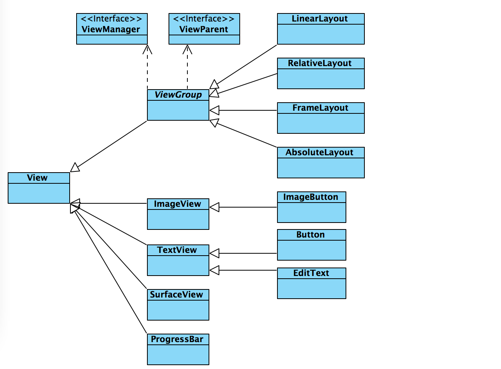
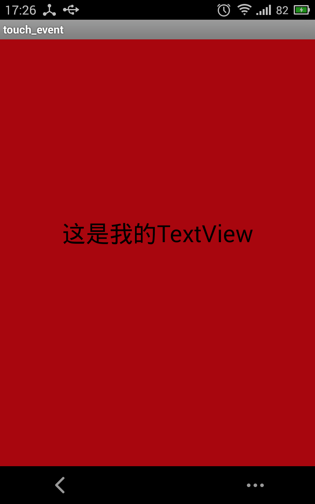
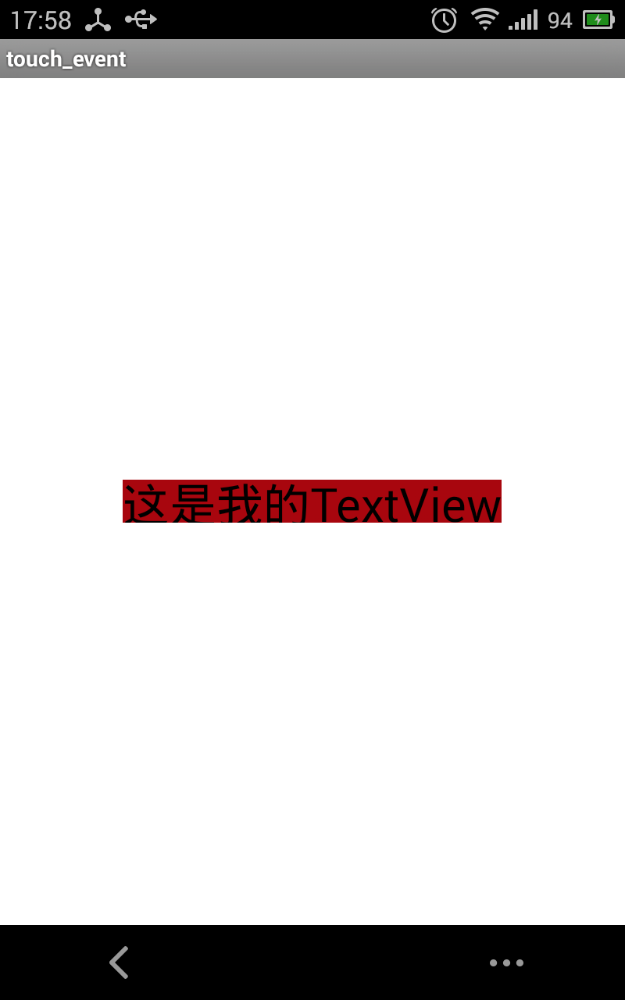
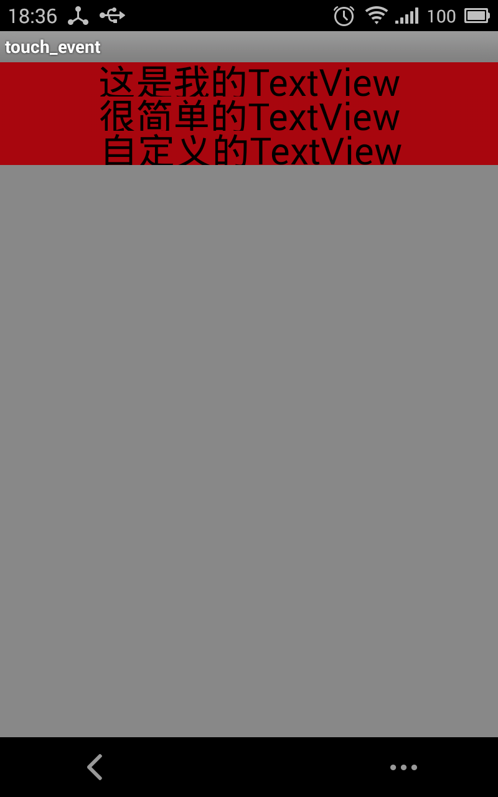
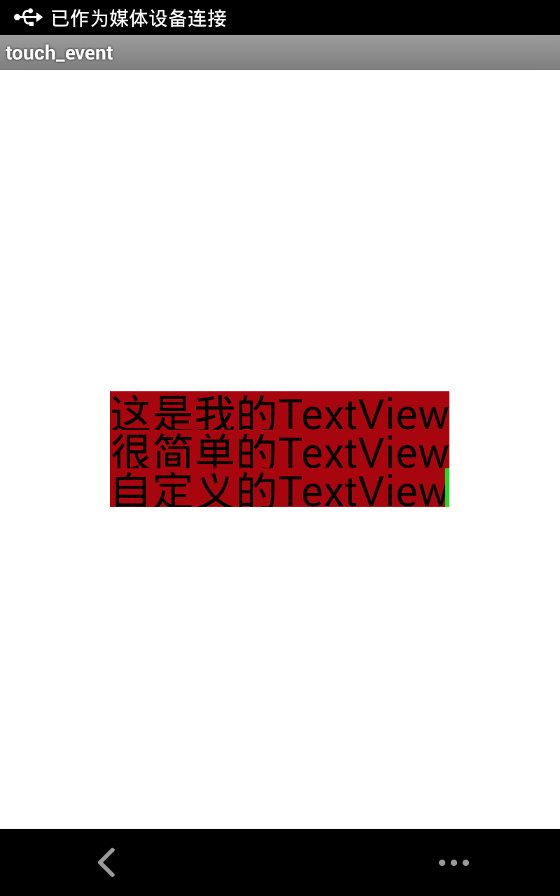

在Android View系统分析之从setContentView说开来(一)一文中，我们从setContentView开始阐述了Android中的视图层次，从设置内容布局到整个视图层次的建立的过程。并且对View和ViewGroup的关系进行了简单的介绍，今天我们继续来深入的了解Android中的View和ViewGroup。

## 1. ViewGroup与View的关系

我们在定义一个布局时，在它的顶层通常都是使用LinearLayout或者RelativeLayout等组件来包装一些子控件，例如TextView, Button, ImageView等。例如：

```xml
<RelativeLayout xmlns:android="http://schemas.android.com/apk/res/android"    
    xmlns:tools="http://schemas.android.com/tools"    
    android:layout_width="match_parent"    
    android:layout_height="match_parent"    
    android:gravity="center" >    

    <TextView    
        android:layout_width="match_parent"    
        android:layout_height="wrap_content"    
        android:text="@string/hello_world" />    

</RelativeLayout>
```

为什么是这样呢？如果不用RelativeLayout包裹可不可以呢？

在Android View系统分析之从setContentView说开来(一)中的ViewGroup章节中我们说了，Android中的视图树是按照如下结构来组织的，即对顶层的是一个ViewGroup，然后其子节点可以是ViewGroup、View，只有ViewGroup下能够包含子节点，View则是叶子节点。如图 :




View是屏幕上所有可见元素的根类，其中ViewGroup也是View的子类。View的官方说明如下 :

> This class represents the basic building block for user interface components. A View occupies a rectangular area on the screen and is responsible for drawing and event handling. View is the base class for widgets, which are used to create interactive UI components (buttons, text fields, etc.). The ViewGroup subclass is the base class for layouts, which are invisible containers that hold other Views (or other ViewGroups) and define their layout properties.

即一个View类的对象是一个包含了一定区域的可以在屏幕上绘制、并且处理事件的UI组件，所有可以放在屏幕上显示的都是View的子类。

而ViewGroup的子类则负责这些View类型对象的布局，即规定这些View放在屏幕的哪些地方。

因此，通常情况下我们都需要使用RelativeLayout，LinearLayout等ViewGroup来组织它的子节点，以约束子View的大小、显示位置等。当然也可以不用RelativeLayout来包裹，但是这样的话布局中只可以放置一个View或者ViewGroup元素,因为没有ViewGroup的组织，布局xml中只能有一个元素。例如 :

```xml
<TextView  
        xmlns:android="http://schemas.android.com/apk/res/android"    
        android:layout_width="match_parent"    
        android:layout_height="wrap_content"    
        android:text="@string/hello_world" />    
```

## 2. View与ViewGroup的显示过程

在我们通过Activity的setContentView设置了Activity的页面内容以后，随着Activity的onResume方法的调用，整个Activity的内容就会显示到屏幕上。那么在显示之前，整个视图过程经历了哪些阶段呢？

简单来说，View树解析完以后到显示的过程，主要会经历如下几个过程。

即ViewRoot首先会发送一个遍历视图树的消息，然后会调用performTraversals()函数来遍历整个视图树，并且调用DecorView的measure()、layout()、draw()方法，这三个过程分别为测量View的大小、计算View的显示过程、绘制内容，它们只是一个模板，具体的实现都是在onMeasure()、onLayout()、onDraw()中。遍历视图树中每个子View中的measure()、layout()、draw()这几个过程，如果子View是ViewGroup类型，那么又会遍历调用这个ViewGroup的所有子View的这三个过程，直到遍历完整个视图树为止。经历了这三个过程，UI系统就知道了View的大小和它所在的位置坐标以后，我们就可以把内容绘制到相应的地方，然后内容就显示出来了，就是这么回事！

## 3. View的测量 ( measure )
对于View类型，其主要的过程就是measure()和draw()，并没有layout()布局这个过程。在View中的onLayout()都是空实现，为什么是这样呢？

因为View类型的UI元素并不是一个View容器，只有ViewGroup类型的才是，而ViewGroup才负责View的布局和管理，因此布局操作只用在ViewGroup中。由ViewGroup来确定子View放在哪里，因此也就是为什么我们在xml中要用ViewGroup类型的RelativeLayout、LinearLayout等组件来包裹子元素的原因。

UI系统对View进行的第一个重要的操作就是View的丈量，即测量这个View的大小。在measure()方法调用的onMeasure(int widthMeasureSpec, int heightMeasureSpec)函数中实现具体的丈量操作，onMeasure函数中含有两个参数，分别为宽度的丈量规格、高度的丈量规格，它们分别代表了宽度和高度的约束，由它的上一层ViewGroup传递过来，我们在xml中写的layout_width和layout_height就是对应这两个参数。注意 : 默认情况下onMeasure函数只支持match_parent的规格，因此，如果你自定义View时需要支持wrap_content，那么你必须覆写onMeasure方法来实现。

一个View的大小由它设置的MeasureSpec规格和它的父控件共同决定，MeasureSpec是一个32位的int值，其中高2位为规格的模式，低30位为View的大小。规格模式由分为三种，分别为EXACTLY、AT_MOST、UNSPECIFIED，下面我们看看这几种规格的含义。

## 4. View的测量规格 ( MeasureSpec )
```java
    public static class MeasureSpec {  
        private static final int MODE_SHIFT = 30;  
        private static final int MODE_MASK  = 0x3 << MODE_SHIFT;// 模式遮罩，将0x3 ( 二进制为 0011 )左移30位，这样高两位就为模式  

        /**
         * Measure specification mode: The parent has not imposed any constraint
         * on the child. It can be whatever size it wants.
         */  
        public static final int UNSPECIFIED = 0 << MODE_SHIFT;// 模式被左移30位，因此模式在高2位上  

        /**
         * Measure specification mode: The parent has determined an exact size
         * for the child. The child is going to be given those bounds regardless
         * of how big it wants to be.
         */  
        public static final int EXACTLY     = 1 << MODE_SHIFT;  

        /**
         * Measure specification mode: The child can be as large as it wants up
         * to the specified size.
         */  
        public static final int AT_MOST     = 2 << MODE_SHIFT;  

        /**
         * Extracts the mode from the supplied measure specification. 获取规格中的丈量模式
         *
         * @param measureSpec the measure specification to extract the mode from
         * @return {@link android.view.View.MeasureSpec#UNSPECIFIED},
         *         {@link android.view.View.MeasureSpec#AT_MOST} or
         *         {@link android.view.View.MeasureSpec#EXACTLY}
         */  
        public static int getMode(int measureSpec) {  
            return (measureSpec & MODE_MASK);  
        }  

        /**
         * Extracts the size from the supplied measure specification. 获取规格中的大小
         *
         * @param measureSpec the measure specification to extract the size from
         * @return the size in pixels defined in the supplied measure specification
         */  
        public static int getSize(int measureSpec) {  
            return (measureSpec & ~MODE_MASK);  
        }  

   // 代码省略  
}  
```

### 4.1 EXACTLY

View的大小是一个确切的数值，表示父视图希望子视图的大小应该是由MeasureSpec解析出来的specSize的值来决定的，系统默认会按照这个规则来设置子视图的大小。例如用户设置的layout_width为match_parent和具体的数值( 例如 100dp ) ，那么这个规格的模式就是exactly的。

### 4.2 AT_MOST

表示父容器指定了一个大小， view 的大小不能大于这个值。对应的layout参数为wrap_content。

### 4.3 UNSPECIFIED

就表示当前视图没有指定它的大小测量模式，这时候就使用从规格参数中读出的size值。开发人员可以将视图按照自己的意愿设置成任意的大小，没有任何限制。这种情况比较少见，不太会用到。

## 5. View的绘制

View的绘制相对就容易了，就是用Canvas绘制各种图形呗。drawText、drawBitmap、drawArc、drawRect等。View的draw()函数是一个模板方法，在其中会依次绘制背景、自身内容( onDraw函数中实现 ) 、以及绘制子View( ViewGroup 类型的才有，在dispatchDraw中实现 ) 、绘制边界、绘制滚动条，代码如下 ：

```java
/**
    * Manually render this view (and all of its children) to the given Canvas.
    * The view must have already done a full layout before this function is
    * called.  When implementing a view, do not override this method; instead,
    * you should implement {@link #onDraw}.
    *
    * @param canvas The Canvas to which the View is rendered.
    */  
   public void draw(Canvas canvas) {  
       if (ViewDebug.TRACE_HIERARCHY) {  
           ViewDebug.trace(this, ViewDebug.HierarchyTraceType.DRAW);  
       }  

       final int privateFlags = mPrivateFlags;  
       final boolean dirtyOpaque = (privateFlags & DIRTY_MASK) == DIRTY_OPAQUE &&  
               (mAttachInfo == null || !mAttachInfo.mIgnoreDirtyState);  
       mPrivateFlags = (privateFlags & ~DIRTY_MASK) | DRAWN;  

       /*    这里就是绘制的步骤说明
        * Draw traversal performs several drawing steps which must be executed
        * in the appropriate order:
        *
        *      1. Draw the background
        *      2. If necessary, save the canvas' layers to prepare for fading
        *      3. Draw view's content
        *      4. Draw children
        *      5. If necessary, draw the fading edges and restore layers
        *      6. Draw decorations (scrollbars for instance)
        */  

       // Step 1, draw the background, if needed  
       int saveCount;  

       if (!dirtyOpaque) {  
           final Drawable background = mBGDrawable;  
           if (background != null) {  
               final int scrollX = mScrollX;  
               final int scrollY = mScrollY;  

               if (mBackgroundSizeChanged) {  
                   background.setBounds(0, 0,  mRight - mLeft, mBottom - mTop);  
                   mBackgroundSizeChanged = false;  
               }  

               if ((scrollX | scrollY) == 0) {  
                   background.draw(canvas);  
               } else {  
                   canvas.translate(scrollX, scrollY);  
                   background.draw(canvas);  
                   canvas.translate(-scrollX, -scrollY);  
               }  
           }  
       }  

       // skip step 2 & 5 if possible (common case)  
       final int viewFlags = mViewFlags;  
       boolean horizontalEdges = (viewFlags & FADING_EDGE_HORIZONTAL) != 0;  
       boolean verticalEdges = (viewFlags & FADING_EDGE_VERTICAL) != 0;  
       if (!verticalEdges && !horizontalEdges) {  
           // Step 3, draw the content  
           if (!dirtyOpaque) onDraw(canvas);  

           // Step 4, draw the children  
           dispatchDraw(canvas);  

           // Step 6, draw decorations (scrollbars)  
           onDrawScrollBars(canvas);  

           // we're done...  
           return;  
       }
```
关于Canvas的资料，可以参考Android--使用Canvas绘图、利用Canvas绘制各种图形。

## 6. ViewGroup对子View的管理

先看看ViewGroup的官方说明 :

> A ViewGroup is a special view that can contain other views (called children.) The view group is the base class for layouts and views containers. This class also defines the ViewGroup.LayoutParams class which serves as the base class for layouts parameters.

ViewGroup组织和管理它的子View，其实主要就是对子View进行布局（规定它们放在在哪里）以及迭代所有子元素让它们绘制自身，并且使用LayoutParams对象对子元素的大小、边距等进行约束。我们在xml中定义一个View或者ViewGroup时使用的layout_width、layout_height就是LayoutParams对象的属性。

同样，ViewGroup对于View的管理也是丈量、布局、绘制三个过程，只是这三个过程更为复杂一些。每个过程都会遍历所有的子View，然后对它的子View也进行这三个过程。这样，所有的子View就会在这三个过程都执行完毕之后，就会得到如下结果 : 

1、经历了onMeasure阶段，如果该ViewGroup是wrap_cotent的，那么由所有子View的的大小，否则根据丈量规格设置自身的大小 

2、计算出各个子View应该在的坐标 

3、绘制自身后，将所有子View绘制在相应的位置上

## 7. ViewGroup丈量 ( measure )

ViewGroup的丈量就是遍历所有的child view， 然后对每个child view进行丈量操作，如果ViewGroup自身的大小是wrap_content的话会根据每个child view的大小计算出自身的大小，否则根据自身的宽高规格设置自身的大小。

注意 : 默认情况下onMeasure函数只支持match_parent的规格，因此，如果你自定义View时需要支持wrap_content，那么你必须覆写onMeasure方法来实现。

ViewGroup类提供了几个方法，方便我们对子View进行丈量，如下 ：

```java
public abstract class ViewGroup extends View implements ViewParent, ViewManager {  

码省略  
/**
 * Ask all of the children of this view to measure themselves, taking into
 * account both the MeasureSpec requirements for this view and its padding.
 * We skip children that are in the GONE state The heavy lifting is done in
 * getChildMeasureSpec.
 *
 * @param widthMeasureSpec The width requirements for this view
 * @param heightMeasureSpec The height requirements for this view
 *  遍历所有子元素，并且对每个子元素进行丈量
 */  
protected void measureChildren(int widthMeasureSpec, int heightMeasureSpec) {  
    final int size = mChildrenCount;  
    final View[] children = mChildren;  
    for (int i = 0; i < size; ++i) {  
        final View child = children[i];  
        if ((child.mViewFlags & VISIBILITY_MASK) != GONE) {  
            // 调用measureChild进行丈量操作  
            measureChild(child, widthMeasureSpec, heightMeasureSpec);  
        }  
    }  
}  

/**
 * Ask one of the children of this view to measure itself, taking into
 * account both the MeasureSpec requirements for this view and its padding.
 * The heavy lifting is done in getChildMeasureSpec.
 *
 *  对单个元素进行丈量
 * @param child The child to measure
 * @param parentWidthMeasureSpec The width requirements for this view
 * @param parentHeightMeasureSpec The height requirements for this view
 */  
protected void measureChild(View child, int parentWidthMeasureSpec,  
        int parentHeightMeasureSpec) {  
    final LayoutParams lp = child.getLayoutParams();  

    final int childWidthMeasureSpec = getChildMeasureSpec(parentWidthMeasureSpec,  
            mPaddingLeft + mPaddingRight, lp.width);  
    final int childHeightMeasureSpec = getChildMeasureSpec(parentHeightMeasureSpec,  
            mPaddingTop + mPaddingBottom, lp.height);  
    // 对这个child 进行丈量操作  
    child.measure(childWidthMeasureSpec, childHeightMeasureSpec);  
}  

/**
 * Ask one of the children of this view to measure itself, taking into
 * account both the MeasureSpec requirements for this view and its padding
 * and margins. The child must have MarginLayoutParams The heavy lifting is
 * done in getChildMeasureSpec.
 * 对Child View进行丈量操作，并且算上margin。注意如果调用这个方法, 那你的LayoutParams必须是MarginLayoutParams的子类，
 * 否则会抛出强制转换的异常。
 *
 * @param child The child to measure
 * @param parentWidthMeasureSpec The width requirements for this view
 * @param widthUsed Extra space that has been used up by the parent
 *        horizontally (possibly by other children of the parent)
 * @param parentHeightMeasureSpec The height requirements for this view
 * @param heightUsed Extra space that has been used up by the parent
 *        vertically (possibly by other children of the parent)
 */  
protected void measureChildWithMargins(View child,  
        int parentWidthMeasureSpec, int widthUsed,  
        int parentHeightMeasureSpec, int heightUsed) {  
    final MarginLayoutParams lp = (MarginLayoutParams) child.getLayoutParams();  

    final int childWidthMeasureSpec = getChildMeasureSpec(parentWidthMeasureSpec,  
            mPaddingLeft + mPaddingRight + lp.leftMargin + lp.rightMargin  
                    + widthUsed, lp.width);  
    final int childHeightMeasureSpec = getChildMeasureSpec(parentHeightMeasureSpec,  
            mPaddingTop + mPaddingBottom + lp.topMargin + lp.bottomMargin  
                    + heightUsed, lp.height);  

    child.measure(childWidthMeasureSpec, childHeightMeasureSpec);  
}  

码省略  
}  
```

## 8. ViewGroup的布局( layout )
ViewGroup的布局就是对所有子View的布局，即指定子View放置的规则。在该函数中遍历所有子View，然后调用每个子View的layout(int left, int top, int right, int bottom)方法进行布局。例如竖直排列的LinearLayout对于子元素的布局操作核心代码如下 :

```java
// 布局   
 @Override  
protected void onLayout(boolean changed, int l, int t, int r, int b) {  
    if (mOrientation == VERTICAL) {  
        // 竖直方向的布局  
        layoutVertical();  
    } else {  
        layoutHorizontal();  
    }  
}  

/**
 * Position the children during a layout pass if the orientation of this
 * LinearLayout is set to {@link #VERTICAL}.
 * 竖直方向上的布局操作
 * @see #getOrientation()
 * @see #setOrientation(int)
 * @see #onLayout(boolean, int, int, int, int)
 */  
void layoutVertical() {  
    final int paddingLeft = mPaddingLeft;  

    int childTop;  
    int childLeft;  

    // Where right end of child should go  
    final int width = mRight - mLeft;  
    int childRight = width - mPaddingRight;  

    // Space available for child  
    int childSpace = width - paddingLeft - mPaddingRight;  

    final int count = getVirtualChildCount();  

    final int majorGravity = mGravity & Gravity.VERTICAL_GRAVITY_MASK;  
    final int minorGravity = mGravity & Gravity.RELATIVE_HORIZONTAL_GRAVITY_MASK;  

    // 根据gravity设置child的top起始位置  
    switch (majorGravity) {  
       case Gravity.BOTTOM:  
           // mTotalLength contains the padding already  
           childTop = mPaddingTop + mBottom - mTop - mTotalLength;  
           break;  

           // mTotalLength contains the padding already  
       case Gravity.CENTER_VERTICAL:  
           childTop = mPaddingTop + (mBottom - mTop - mTotalLength) / 2;  
           break;  

       case Gravity.TOP:  
       default:  
           childTop = mPaddingTop;  
           break;  
    }  

    // 遍历所有子View  
    for (int i = 0; i < count; i++) {  
        final View child = getVirtualChildAt(i);  
        if (child == null) {  
            childTop += measureNullChild(i);  
        } else if (child.getVisibility() != GONE) {  
            // 如果child不是隐藏的，那么获取child的宽度和高度  
            final int childWidth = child.getMeasuredWidth();  
            final int childHeight = child.getMeasuredHeight();  

            // 获取child的布局参数  
            final LinearLayout.LayoutParams lp =  
                    (LinearLayout.LayoutParams) child.getLayoutParams();  

            // child的gravity  
            int gravity = lp.gravity;  
            if (gravity < 0) {  
                gravity = minorGravity;  
            }  
            final int layoutDirection = getResolvedLayoutDirection();  
            final int absoluteGravity = Gravity.getAbsoluteGravity(gravity, layoutDirection);  
            // 根据child的gravity调整child的水平、左边界、右边界的位置  
            switch (absoluteGravity & Gravity.HORIZONTAL_GRAVITY_MASK) {  
                case Gravity.CENTER_HORIZONTAL:  
                    childLeft = paddingLeft + ((childSpace - childWidth) / 2)  
                            + lp.leftMargin - lp.rightMargin;  
                    break;  

                case Gravity.RIGHT:  
                    childLeft = childRight - childWidth - lp.rightMargin;  
                    break;  

                case Gravity.LEFT:  
                default:  
                    childLeft = paddingLeft + lp.leftMargin;  
                    break;  
            }  

            if (hasDividerBeforeChildAt(i)) {  
                childTop += mDividerHeight;  
            }  

            childTop += lp.topMargin;  
            // 最后调用setChildFrame函数来设置child的范围和坐标  
            setChildFrame(child, childLeft, childTop + getLocationOffset(child),  
                    childWidth, childHeight);  
            // 更新childTop，下个childTop为当期childTop + 当前child的高度 + 当前child的bottomMargin + 偏移量  
            // 这样下一个child就会被放在当前child的下面，即实现了竖直方向的排列  
            childTop += childHeight + lp.bottomMargin + getNextLocationOffset(child);  

            i += getChildrenSkipCount(child, i);  
        }  
    }  
}  

// 调用child的layout进行布局，即设定child的坐标与范围  
private void setChildFrame(View child, int left, int top, int width, int height) {       
    // 左边界为left, 上边界为top, 右边界是left + child的宽度，下边界是top + child的高度     
    child.layout(left, top, left + width, top + height);  
}  
```

## 9. ViewGroup的绘制 ( draw )
ViewGroup的绘制操作不需要我们来进行处理，ViewGroup的默认onDraw()是继承自View的，因此也是空实现。但是绘制子View的函数确实实现了的，即dispatchDraw方法。在View的draw模板方法中，dispatchDraw就是负责绘制子View的。它的核心代码如下 :

```java
/**
 * {@inheritDoc}
 */  
@Override  
protected void dispatchDraw(Canvas canvas) {  
    final int count = mChildrenCount;  
    final View[] children = mChildren;  
    int flags = mGroupFlags;  

    // 代码省略  
    final long drawingTime = getDrawingTime();  
    // 迭代所有子View， 并且绘制  
    if ((flags & FLAG_USE_CHILD_DRAWING_ORDER) == 0) {  
        for (int i = 0; i < count; i++) {  
            final View child = children[i];  
            if ((child.mViewFlags & VISIBILITY_MASK) == VISIBLE || child.getAnimation() != null) {  
                // 绘制子View  
                more |= drawChild(canvas, child, drawingTime);  
            }  
        }  
    } else {  
        for (int i = 0; i < count; i++) {  
            final View child = children[getChildDrawingOrder(count, i)];  
            if ((child.mViewFlags & VISIBILITY_MASK) == VISIBLE || child.getAnimation() != null) {  
                // 绘制子View  
                more |= drawChild(canvas, child, drawingTime);  
            }  
        }  
    }  

    // 代码省略  

    }  
}
```
其中drawChild就是绘制子view的函数了。

## 10. 自定义View

自定义一般情况下只需要覆写View类的onDraw方法绘制自身内容，但是如上文中关于View的丈量提到的，如果该View需要支持wrap_content，那么还需要覆写onMeasure方法实现。在很多情况下，我们还需要自定义View的属性，那么只需要在res/values中添加一个attrs.xml，在里面添加一个名字为你的自定义View类名的declare-styleable项，然后添加你的自定义的属性item。下面我们来自定义一个简单的TextView。

```java
public class MyTextView extends View {  

    /**
     * 要绘制的文本内容
     */  
    private String mText = "";  
    /**
     * 文字大小
     */  
    private int mTextSize = 60;  
    /**
     * 画笔
     */  
    private Paint mPaint = new Paint();  

    /**
     * 文本的区域，主要是宽度和高度
     */  
    Rect mTextRect = new Rect();  

    /**
     * @param context
     */  
    public MyTextView(Context context) {  
        this(context, null, 0);  
    }  

    public MyTextView(Context context, AttributeSet attrs) {  
        this(context, attrs, 0);  
    }  

    public MyTextView(Context context, AttributeSet attrs, int defStyle) {  
        super(context, attrs, defStyle);  
		// 获取属性集，即你在xml中设置的属性  
        initAttrs(attrs);  

        // 反锯齿  
        mPaint.setAntiAlias(true);  
        // 设置画笔的文字大小  
        mPaint.setTextSize(mTextSize);  
    }  

    /**
     * @param text
     */  
    public void setText(String text) {  
        mText = text;  
    }  

    /**
     * @param attrs
     */  
    private void initAttrs(AttributeSet attrs) {  
        // 获取自定义的属性  
        TypedArray typedArray = getContext().obtainStyledAttributes(attrs, R.styleable.MyTextView);  
        // 获得要绘制的文本内容  
        mText = typedArray.getString(R.styleable.MyTextView_text);  
        // 设置字体的大小  
        mTextSize = typedArray.getDimensionPixelSize(R.styleable.MyTextView_textSize, 60);  
        //  
        typedArray.recycle();  
    }  

    /*
     * @see android.view.View#onDraw(android.graphics.Canvas)
     */  
    @Override  
    protected void onDraw(Canvas canvas) {  
        int width = getWidth();  
        int height = getHeight();  
        // 获取要绘制文本的宽度和高度，存储在mTextRect中  
        mPaint.getTextBounds(mText, 0, mText.length(), mTextRect);  
        // 在view的中心绘制文本  
        canvas.drawText(mText, width / 2 - mTextRect.width() / 2, height / 2 + mTextRect.height()  
                / 2, mPaint);  
    }  
}
```

自定义的MyTextView属性, res/values/attrs.xml中定义。

```xml
<?xml version="1.0" encoding="utf-8"?>  
<resources>  

    <declare-styleable name="MyTextView">  
        <attr name="text" format="string" />  
        <attr name="textSize" format="dimension" />  
    </declare-styleable>  

</resources>
```
这个自定义属性的名字即为我们的自定义View的类名MyTextView， 这里只定义了两个属性，即text和textSize。在使用自定义View的属性时，我们需要引入该自定义View所在的包名，在xml中引入包名是这样的：

```xml
xmlns:别名="http://schemas.android.com/apk/res/这里写上你的自定义View的应用所在的工程的包名"
```
例如, android的包名是android，那么它的命名空间就是,

```xml
xmlns:android="http://schemas.android.com/apk/res/android"
```

呵，这个我们可见多了，每个布局用的xml中全都用这个。其实原理是这样的，res/values/attrs.xml中内容会被编译成R类，而R的完整路径就是工程的包名.R，注意，是工程的包名，而不是自定义View所在的包，因此你引入了工程的包名，Android系统就可以找到对应的R类，从而找到你的自定义属性，而你的自定义属性名又与你的自定义View类名一致，这样也就对应上了。

例如MyTextView所在的包为com.example.touch_event.viewsystem，但是我们的工程的包却是com.example.touch，因此R所在的路径就是com.example.touch.R，所以我在引入自定义属性的命名空间是需要引入的是com.example.touch，而不是com.example.touch_event.viewsystem。我们来试用一下吧：

main.xml :

```xml
<FrameLayout xmlns:android="http://schemas.android.com/apk/res/android"  
    xmlns:tools="http://schemas.android.com/tools"  
    xmlns:mytv="http://schemas.android.com/apk/res/com.example.touch"  
    android:id="@+id/container"  
    android:layout_width="match_parent"  
    android:layout_height="match_parent"  
    android:layout_gravity="center"  
    tools:context="com.example.touch_event.MainActivity"  
    tools:ignore="MergeRootFrame" >  

    <com.example.touch_event.viewsystem.MyTextView  
        android:id="@+id/my_button"  
        android:layout_width="wrap_content"  
        android:layout_height="wrap_content"  
        android:background="#aa0000"  
        mytv:text="这是我的TextView"  
        mytv:textSize="30sp" />  

</FrameLayout>
```

我们引入了命名空间mytv, 用法为  xmlns:mytv="http://schemas.android.com/apk/res/com.example.touch"。并且需要注意，MyTextView的layout_width和layout_height我们都是设置为wrap_content的。然后使用mytv:text设置文本内容，使用mytv:textSize来设置文本大小。

运行以后效果如下图:




可以看到，我们的View正常运行起来了。但是我们设置的layout_width和layout_height都是设置为wrap_content的，怎么就变成了match_parent了呢？其实上文已经多次提到，View的默认onMeasure都只是支持match_parent，如果需要wrap_content,你需要覆写onMeasure来实现。那我们给MyTextView加上自己的onMeasure吧。

```java
// 覆写onMeasure,最后必须调用setMeasuredDimension来设置该View的高度和高度  
   @Override  
   protected void onMeasure(int widthMeasureSpec, int heightMeasureSpec) {  

       // 获得文本的宽度和高度  
       mPaint.getTextBounds(mText, 0, mText.length(), mTextRect);  

       // 默认支持的是match_parent  
       super.onMeasure(widthMeasureSpec, heightMeasureSpec);  
       // 获取由widthMeasureSpec提供的模式和宽度  
       int widthSpecMode = MeasureSpec.getMode(widthMeasureSpec);  
       int widthSpecSize = MeasureSpec.getSize(widthMeasureSpec);  
       // 获取由heightMeasureSpec提供的模式和高度  
       int heightSpecMode = MeasureSpec.getMode(heightMeasureSpec);  
       int heightSpecSize = MeasureSpec.getSize(heightMeasureSpec);  
       // 如果都是宽高设置为wrap_content，那么都使用文本的宽高  
       if (widthSpecMode == MeasureSpec.AT_MOST && heightSpecMode == MeasureSpec.AT_MOST) {  
           setMeasuredDimension(mTextRect.width(), mTextRect.height());  
       } else if (widthSpecMode == MeasureSpec.AT_MOST) {  
           // 如果只是宽度是wrap_content，那么宽度使用文本的宽度，高度使用widthMeasureSpec中的高度  
           setMeasuredDimension(mTextRect.width(), heightSpecSize);  
       } else if (heightSpecMode == MeasureSpec.AT_MOST) {  
           // 如果只是高度是wrap_content，那么高度使用文本的高度，宽度使用heightMeasureSpec中的宽度  
           setMeasuredDimension(widthSpecSize, mTextRect.height());  
       }  
   }  
```

最后运行看效果 :




效果不怎样，但总归是支持wrap_content了，细节就先不管了。


## 11. 自定义ViewGroup

自定义ViewGroup主要覆写的方法也就是两个，即onMeasure和onLayout，其中只有onLayout是必须实现的，覆写onMeasure使其支持wrap_content，覆写onLayout以实现子View的布局规则。直接看个例子吧。

```java
/**
 * @author mrsimple
 */  
public class VerticalLinearLayout extends ViewGroup {  

    int mScreenWidth;  
    int mScreenHeight;  

    /**
     * @param context
     */  
    public VerticalLinearLayout(Context context) {  
        this(context, null, 0);  
    }  

    /**
     * @param context
     * @param attrs
     */  
    public VerticalLinearLayout(Context context, AttributeSet attrs) {  
        this(context, attrs, 0);  
    }  

    /**
     * @param context
     * @param attrs
     * @param defStyle
     */  
    public VerticalLinearLayout(Context context, AttributeSet attrs, int defStyle) {  
        super(context, attrs, defStyle);  

        mScreenWidth = context.getResources().getDisplayMetrics().widthPixels;  
        mScreenHeight = context.getResources().getDisplayMetrics().heightPixels;  
    }  

    @Override  
    protected void onMeasure(int widthMeasureSpec, int heightMeasureSpec) {  

        //  
        super.onMeasure(widthMeasureSpec, heightMeasureSpec);  

        //  
        int widthSpecMode = MeasureSpec.getMode(widthMeasureSpec);  
        int widthSpecSize = MeasureSpec.getSize(widthMeasureSpec);  
        int heightSpecMode = MeasureSpec.getMode(heightMeasureSpec);  
        int heightSpecSize = MeasureSpec.getSize(heightMeasureSpec);  

        int width = 0;  
        int height = 0;  
        int childCount = getChildCount();  
        for (int i = 0; i < childCount; i++) {  

            View child = getChildAt(i);  
            if (child.getVisibility() != View.GONE) {  
                // 丈量child的尺寸  
                measureChildWithMargins(child, widthMeasureSpec, 0, heightMeasureSpec, 0);  
                // 这里的LayoutParams就是我们自定义的LayoutParams  
                LayoutParams layoutParams = (LayoutParams) child.getLayoutParams();  
                if (widthSpecMode == MeasureSpec.AT_MOST) {  
                    width = Math.max(width, child.getMeasuredWidth() + layoutParams.leftMargin  
                            + layoutParams.rightMargin);  
                }  
                //  
                height += child.getMeasuredHeight() + layoutParams.topMargin  
                        + layoutParams.bottomMargin;  
            }  
        }  

        width += getPaddingLeft() + getPaddingRight();  
        height += getPaddingBottom() + getPaddingTop();  

        width = Math.min(width, mScreenWidth);  
        height = Math.min(height, mScreenHeight);  

        // 如果都是宽高设置为wrap_content，那么都使用文本的宽高  
        if (widthSpecMode == MeasureSpec.AT_MOST && heightSpecMode ==  
                MeasureSpec.AT_MOST) {  
            setMeasuredDimension(width, height);  
        } else if (widthSpecMode == MeasureSpec.AT_MOST) {  
            // 如果只是宽度是wrap_content，那么宽度使用文本的宽度，高度使用widthMeasureSpec中的高度  
            setMeasuredDimension(width, heightSpecSize);  
        } else if (heightSpecMode == MeasureSpec.AT_MOST) {  
            // 如果只是高度是wrap_content，那么高度使用文本的高度，宽度使用heightMeasureSpec中的宽度  
            setMeasuredDimension(widthSpecSize, height);  
        }  

        Log.d(VIEW_LOG_TAG, "### vertical, width = " + getMeasuredWidth() + ", height = "  
                + getMeasuredHeight());  
    }  

    @Override  
    protected void onLayout(boolean changed, int l, int t, int r, int b) {  

        //  
        int left = getPaddingLeft();  
        int top = getPaddingTop();  

        //  
        int childCount = getChildCount();  
        //  
        for (int i = 0; i < childCount; i++) {  
            View childView = getChildAt(i);  
            if (childView.getVisibility() != View.GONE) {  
                // 对child进行布局  
                childView.layout(left, top, left + childView.getMeasuredWidth(),  
                        top + childView.getMeasuredHeight());  

                Log.d(VIEW_LOG_TAG, "### left = " + left + ", top = " + top + ", right = " + (left  
                        + childView.getMeasuredWidth()));  
                // 下一次的top为这次的top 加上 当前childView的高度， 因此下一个child会放到这个child的下面.  
                top += childView.getMeasuredHeight();  
            }  
        }  
    }  

    /**
     * 注意覆写这几个方法，否则在进行measureChildWithMargins或者将child的LayoutParams进行转换时会出现转换异常
     */  
    @Override  
    protected android.view.ViewGroup.LayoutParams generateDefaultLayoutParams() {  
        return new VerticalLinearLayout.LayoutParams(ViewGroup.LayoutParams.MATCH_PARENT,  
                ViewGroup.LayoutParams.WRAP_CONTENT);  
    }  

    @Override  
    public android.view.ViewGroup.LayoutParams generateLayoutParams(AttributeSet attrs) {  
        return new VerticalLinearLayout.LayoutParams(getContext(), attrs);  
    }  

    @Override  
    protected android.view.ViewGroup.LayoutParams generateLayoutParams(  
            android.view.ViewGroup.LayoutParams p) {  
        return new VerticalLinearLayout.LayoutParams(p);  
    }  

    /**
     * 自定义LayoutParams，从而使你的Layout支持Margin等
     *  
     * @author mrsimple
     */  
    public static class LayoutParams extends ViewGroup.MarginLayoutParams {  

        public LayoutParams(Context c, AttributeSet attrs) {  
            super(c, attrs);  
        }  

        public LayoutParams(int width, int height) {  
            super(width, height);  
        }  

        /**
         * Copy constructor. Clones the width, height and margin values of the
         * source.
         *
         * @param source The layout params to copy from.
         */  
        public LayoutParams(MarginLayoutParams source) {  
            super(source);  
        }  

        public LayoutParams(ViewGroup.LayoutParams p) {  
            super(p);  
        }  
    }  

}  
```
main.xml的定义 :

```xml
<com.example.touch_event.viewsystem.VerticalLinearLayout xmlns:android="http://schemas.android.com/apk/res/android"  
    xmlns:tools="http://schemas.android.com/tools"  
    xmlns:mytv="http://schemas.android.com/apk/res/com.example.touch"  
    android:id="@+id/container"  
    android:layout_width="wrap_content"  
    android:layout_height="wrap_content"  
    android:layout_gravity="center"  
    android:background="#00dd00"  
     >  

    <com.example.touch_event.viewsystem.MyTextView  
        android:layout_width="wrap_content"  
        android:layout_height="wrap_content"  
        android:layout_gravity="center"  
        android:background="#aa0000"  
        mytv:text="这是我的TextView"  
        mytv:textSize="30sp" />  

    <com.example.touch_event.viewsystem.MyTextView  
        android:layout_width="wrap_content"  
        android:layout_height="wrap_content"  
        android:layout_gravity="center"  
        android:background="#aa0000"  
        mytv:text="很简单的TextView"  
        mytv:textSize="30sp" />  

    <com.example.touch_event.viewsystem.MyTextView  
        android:layout_width="wrap_content"  
        android:layout_height="wrap_content"  
        android:layout_gravity="center"  
        android:background="#aa0000"  
        mytv:text="自定义的TextView"  
        mytv:textSize="30sp" />  

</com.example.touch_event.viewsystem.VerticalLinearLayout>  
```

效果图 :

|         图1 ( 宽、高都为match_parent)         |          图2( 宽、高都为wrap_parent)          |
| :-------------------------------------: | :-------------------------------------: |
|  |  |

依然是很丑陋，不过不要紧，大致原理清晰就行。
