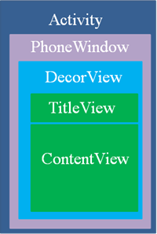
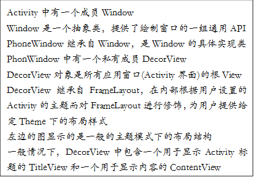
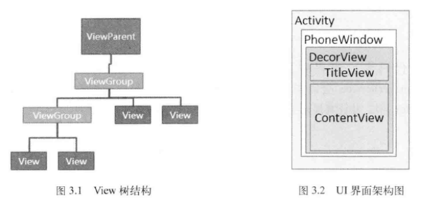

## Window

Window是一个抽象类，它的具体实现类是PhoneWindow。Android中的所有视图都是通过Window来呈现的，不管是Activity、Dialog还是Toast，它们的视图实际上都是附加在Window上的，因此，Window实际是View的直接管理者。

Window是一个抽象类，它概括了Android窗口的基本属性和基本功能。唯一实现了这个抽象类的是PhoneWindow，实例化PhoneWindow需要一个窗口，只需要通过WindowManager即可完成，Window类的具体实现位于WindowManagerService中，WindowManager和WindowManagerService的交互是一个IPC过程。Android中的所有视图都是通过Window来呈现的，不管是Activity，Dialog还是Toast，他们的视图实际上都是附加在Window上的，因此Window实际上是View的直接管理者，点击事件也是由Window传递给view的。

创建完Window之后，Activity会为该Window设置回调，Window接收到外界状态改变时就会回调到Activity中。在activity中会调用setContentView()函数，它是调用window.setContentView()完成的，而Window的具体实现是PhoneWindow，所以最终的具体操作是在PhoneWindow中，PhoneWindow的setContentView方法第一步会检测DecorView是否存在，如果不存在，就会调用generateDecor函数直接创建一个DecorView；第二步就是将Activity的视图添加到DecorView的mContentParent中；第三步是回调Activity中的onContentChanged方法通知Activity视图已经发生改变。这些步骤完成之后，DecorView还没有被WindowManager正式添加到Window中，最后调用Activity的onResume方法中的makeVisible方法才能真正地完成添加和现实过程，Activity的视图才能被用户看到。

 



```java
// 隐藏标题栏，必须在setContentView()之前调用
requestWindowFeature(Window.FEATURE_NO_TITLE);
activity.getWindow().getDecorView();
```

## WindowManager

WindowManager是外界访问Window的入口，Window的具体实现位于WindowManagerService中，WindowManager和WindowManagerService的交互是一个IPC过程。

WindowManager主要用来管理窗口的一些状态、属性、view增加、删除、更新、窗口顺序、消息收集和处理等。通过代码Context.getSystemService(Context.WINDOW_SERVICE)可以获得WindowManager的实例。WindowManager所提供的功能很简单，常用的只有三个方法，即添加View、更新View和删除View，这三个方法定义在ViewManager中，而WindowManager继承了ViewManager

| 方法声明                                     | 功能描述    |
| :--------------------------------------- | :------ |
| addView()                                | 添加view  |
| removeView()                             | 删除view  |
| updateViewLayout()                       | 更新view  |
| getSystemService(Context.WINDOW_SERVICE) | 获取窗口管理者 |

```java
WindowManager.LayoutParams params = new WindowManager.LayoutParams();
params.format = PixelFormat.TRANSLUCENT;//背景透明
manager.addView(imageView,params);
manager.removeView(imageView);
```

```java
Window window = getWindow();
WindowManager.LayoutParams layoutParams = window.getAttributes();
window.setAttributes(layoutParams);

WindowManager manager = (WindowManager) getSystemService(Context.WINDOW_SERVICE);
WindowManager.LayoutParams params = new WindowManager.LayoutParams();
params.flags |= WindowManager.LayoutParams.FLAG_NOT_FOCUSABLE;// 焦点
params.height = WindowManager.LayoutParams.WRAP_CONTENT;
params.width = WindowManager.LayoutParams.WRAP_CONTENT;
params.format = PixelFormat.TRANSLUCENT;
manager.addView(view,params);
manager.removeView(view);
manager.updateViewLayout(view,params);
```
## WindowManager.LayoutParams

- flags

  - FLAG_NOT_TOUCH_MODAL
  - FLAG_NOT_FOCUSABLE
  - FLAG_SHOW_WHEN_LOCKED
- type
  - 应用Window，Activity，层级1-99
  - 子Window，Dialog，层级1000-1999
  - 系统Window，Toast，系统状态栏，层级2000-2999，需要权限
- height
- width
- format

  - PixelFormat.TRANSLUCENT 背景透明
- gravity
- x
- y

| Flag                  | 作用                                       |
| :-------------------- | :--------------------------------------- |
| FLAG_NOT_TOUCH_MODAL  | 将当前Window区域外的单击事件传递给底层的Window，区域内的单击事件留给自己处理 |
| FLAG_NOT_FOCUSABLE    | 表示Window不需要获取焦点，也不需要接收各种输入事件             |
| FLAG_SHOW_WHEN_LOCKED | Window可显示在锁屏的界面上                         |

| Type                | 作用   |
| :------------------ | :--- |
| TYPE_SYSTEM_OVERLAY |      |
| TYPE_SYSTEM_ERROR   |      |
系统Window权限
```
<uses-permission android:name="android.permission.SYSTEM_ALERT_WINDOW"/>
```
可以拖动的Window效果

```java
import com.ryg.chapter_8.R;

import android.app.Activity;
import android.content.Context;
import android.graphics.PixelFormat;
import android.os.Bundle;
import android.view.Gravity;
import android.view.MotionEvent;
import android.view.View;
import android.view.View.OnTouchListener;
import android.view.WindowManager;
import android.view.WindowManager.LayoutParams;
import android.widget.Button;

public class TestActivity extends Activity implements OnTouchListener {

    private static final String TAG = "TestActivity";

    private Button mCreateWindowButton;

    private Button mFloatingButton;
    private WindowManager.LayoutParams mLayoutParams;
    private WindowManager mWindowManager;

    @Override
    protected void onCreate(Bundle savedInstanceState) {
        super.onCreate(savedInstanceState);
        setContentView(R.layout.activity_test);
        initView();
    }

    private void initView() {
        mCreateWindowButton = (Button) findViewById(R.id.button1);
        mWindowManager = (WindowManager) getSystemService(Context.WINDOW_SERVICE);
    }

    public void onButtonClick(View v) {
        if (v == mCreateWindowButton) {
            mFloatingButton = new Button(this);
            mFloatingButton.setText("click me");
            mLayoutParams = new WindowManager.LayoutParams(
                    LayoutParams.WRAP_CONTENT, LayoutParams.WRAP_CONTENT, 0, 0,
                    PixelFormat.TRANSPARENT);
            mLayoutParams.flags = LayoutParams.FLAG_NOT_TOUCH_MODAL
                    | LayoutParams.FLAG_NOT_FOCUSABLE
                    | LayoutParams.FLAG_SHOW_WHEN_LOCKED;
            mLayoutParams.type = LayoutParams.TYPE_SYSTEM_ERROR;
            mLayoutParams.gravity = Gravity.LEFT | Gravity.TOP;
            mLayoutParams.x = 100;
            mLayoutParams.y = 300;
            mFloatingButton.setOnTouchListener(this);
            mWindowManager.addView(mFloatingButton, mLayoutParams);
        }
    }

    @Override
    public boolean onTouch(View v, MotionEvent event) {
        int rawX = (int) event.getRawX();
        int rawY = (int) event.getRawY();
        switch (event.getAction()) {
        case MotionEvent.ACTION_DOWN: {
            break;
        }
        case MotionEvent.ACTION_MOVE: {
            int x = (int) event.getX();
            int y = (int) event.getY();
            mLayoutParams.x = rawX;
            mLayoutParams.y = rawY;
            mWindowManager.updateViewLayout(mFloatingButton, mLayoutParams);
            break;
        }
        case MotionEvent.ACTION_UP: {
            break;
        }
        default:
            break;
        }

        return false;
    }

    @Override
    protected void onDestroy() {
        try {
            mWindowManager.removeView(mFloatingButton);
        } catch (IllegalArgumentException e) {
            e.printStackTrace();
        }
        super.onDestroy();
    }
}
```