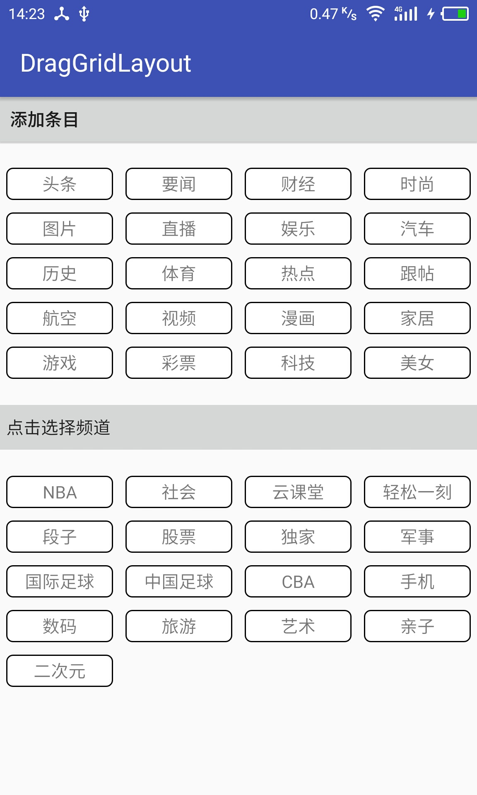

自定义GridLayout控件，可以在新闻咨询类APP中的管理页面使用到，也可以应用在类别管理中，总之，可以帮助我们设计更加规范和炫酷的手机页面。

新闻类app是最常见的应用之一，而频道管理又是其必不可少的功能，该自定义控件不仅可以带我们实现炫酷的频道管理功能，还可以让我们学习如何使用Android拖拽框架实现我们想要的多种功能，以及让我们对自定义控件会有更多的理解。

## **知识点**

1. GridLayout的使用

   - 从Google官方文档学习GridLayout的功能以及用法
   - 使用GridLayout实现子控件排列显示

2. View的拖拽功能实现

   - 通过查看Google文档，学会调用view的拖拽方法
   - 拖拽事件的处理
   - 使用View的拖拽框架实现实现频道切换位置效果

3. 自定义GridLayout控件

   自定义GridLayout控件，实现拖拽功能，继而实现频道管理操作

4. Rect类的使用

   使用Rect类确定被触摸到的子控件

## 新闻频道管理的多种实现

实现类似于网易新闻频道管理有几种方式

实现方案1：使用两个GridView实现，这是比较早的一种解决方案，比较复杂，具体可以参考 [Android 高仿 频道管理----网易、今日头条、腾讯视频 ](http://blog.csdn.net/vipzjyno1/article/details/25005851)

实现方案2：使用两个RecyclerView或ListView实现，这种实现方式好于于方案1

实现方案3：使用一个RecyclerView实现，这是我目前见过的比较好的方式，貌似比网易新闻等客户端的要流畅，具体可以参考：[高仿网易新闻栏目动画效果](http://blog.csdn.net/tyk0910/article/details/51460808) 、 [使用ItemTouchHelper高效地实现 今日头条 、网易新闻 的频道排序、移动](http://www.jianshu.com/p/d30fd8da4eac)

实现方案4：使用两个GridLayout实现，也就是本文要介绍的方式

## 拖拽

长按item开始拖拽

```java
private View.OnLongClickListener longClickListener = new View.OnLongClickListener() {
        @Override
        public boolean onLongClick(View v) {
            //长按时，开始拖拽操作，显示出阴影
            //被拖拽的视图其实就是v参数
            dragedView = v;
            v.startDrag(null, new View.DragShadowBuilder(v), null, 0);
            v.setEnabled(false);
            // v.startDragAndDrop(null, new View.DragShadowBuilder(v), null, 0);
            return false;
        }
    };
```
拖拽方法参数说明

- startDragAndDrop() api24
- startDrag(ClipData data, DragShadowBuilder shadowBuilder, Object myLocalState, int flag)

参数1：ClipData data 拖拽过程中可以transferred的数据，可以为空

参数2：DragShadowBuilder shadowBuilder，拖拽阴影效果创建者

参数3：Object myLocalState，拖拽状态

参数4：int flag，可以控制拖拽操作的flag，未定义，传0即可

## 拖拽监听

```java
private View.OnDragListener dragListener =  new View.OnDragListener() {
        /**
         * ACTION_DRAG_STARTED:当拖拽操作执行时，就会执行一次
         * DragEvent.ACTION_DRAG_ENDED：当拖拽事件结束，手指抬起时，就是执行一次
         * DragEvent.ACTION_DRAG_ENTERED：当手指进入设置了拖拽监听的控件范围内的瞬间执行一次
         * DragEvent.ACTION_DRAG_EXITED：当手指离开设置了拖拽监听的控件范围内的瞬间执行一次
         * DragEvent.ACTION_DRAG_LOCATION：当手指在设置了拖拽监听的控件范围内，移动时，实时会执行，执行N次
         * DragEvent.ACTION_DROP：当手指在设置了拖拽监听的控件范围内松开时，执行一次
         *
         *
         * @param v 当前监听拖拽事件的view(其实就是mGridLayout)
         * @param event 拖拽事件
         * @return
         */
        @Override
        public boolean onDrag(View v, DragEvent event) {
            String dragEventAction = getDragEventAction(event);
            System.out.println(dragEventAction);
            //            Rect rect = new Rect();
            //            rect.contains()
            switch (event.getAction()) {
                //当拖拽事件开始时，创建出与子控件对应的矩形数组
                case DragEvent.ACTION_DRAG_STARTED:
                    initRects();
                    break;
                case DragEvent.ACTION_DRAG_LOCATION:
                    //手指移动时，实时判断触摸是否进入了某一个子控件
                    int touchIndex = getTouchIndex(event);
                    //说明触摸点进入了某一个子控件,判断被拖拽的视图与进入的子控件对象不是同一个的时候才进行删除添加操作

                    if (touchIndex > -1&&dragedView != null&&dragedView != mGridLayout.getChildAt(touchIndex)) {
                        mGridLayout.removeView(dragedView);
                        mGridLayout.addView(dragedView,touchIndex);
                    }
                    break;
                case DragEvent.ACTION_DRAG_ENDED:
                    //拖拽事件结束后，让被拖拽的view设置为可用，否则背景变红，并且长按事件会失效
                    if (dragedView != null) {
                        dragedView.setEnabled(true);
                    }
                    break;
            }

            return true;
        }
    };
```

## DragEvent

| 拖拽事件                           | 说明                               |
| :----------------------------- | :------------------------------- |
| ACTION_DRAG_STARTED            | 当拖拽操作执行时，就会执行一次                  |
| DragEvent.ACTION_DRAG_ENDED    | 当拖拽事件结束，手指抬起时，就是执行一次             |
| DragEvent.ACTION_DRAG_ENTERED  | 当手指进入设置了拖拽监听的控件范围内的瞬间执行一次        |
| DragEvent.ACTION_DRAG_EXITED   | 当手指离开设置了拖拽监听的控件范围内的瞬间执行一次        |
| DragEvent.ACTION_DRAG_LOCATION | 当手指在设置了拖拽监听的控件范围内，移动时，实时会执行，执行N次 |
| DragEvent.ACTION_DROP          | 当手指在设置了拖拽监听的控件范围内松开时，执行一次        |

## 当拖拽事件开始时，创建出与子控件对应的矩形数组

```java
private Rect[] mRects;

    private void initRects() {
        mRects = new Rect[mGridLayout.getChildCount()];
        for (int i = 0; i < mGridLayout.getChildCount(); i++) {
            View childView = mGridLayout.getChildAt(i);
            //创建与每个子控件对应矩形对象
            Rect rect = new Rect(childView.getLeft(), childView.getTop(), childView.getRight(), childView.getBottom());
            mRects[i] = rect;
        }
    }
```

## 手指移动时，实时判断触摸是否进入了某一个子控件

```java
private int getTouchIndex(DragEvent event) {
        //遍历所有的数组，如果包含了当前的触摸点返回索引即可
        for (int i = 0; i < mRects.length; i++) {
            Rect rect = mRects[i];
            if (rect.contains((int)event.getX(), (int)event.getY())) {
                return i;
            }
        }
        return -1;
    }
```

## 是否允许拖拽

```java
public void setAllowDrag(boolean allowDrag) {
        this.allowdrag = allowDrag;
        if (this.allowdrag) {
            this.setOnDragListener(odl);
        } else {
            this.setOnDragListener(null);
        }

    }
```

## 设置列数和动画

```java
//初始化方法
private void init() {
    // android:columnCount="4"
    // android:animateLayoutChanges="true"
    this.setColumnCount(columnCount);
    this.setLayoutTransition(new LayoutTransition());
}
```

## DragGridlayout

```java
public class DragGridlayout extends GridLayout{

    private  static final int columnCount = 4;//列数
    private boolean isAllowDrag;//记录当前控件是否可以进行拖拽操作

    public DragGridlayout(Context context) {
        this(context,null);
    }

    public DragGridlayout(Context context, AttributeSet attrs) {
        this(context, attrs,0);
    }

    public DragGridlayout(Context context, AttributeSet attrs, int defStyleAttr) {
        super(context, attrs, defStyleAttr);
        init();
    }

/*  static SparseArray<String> dragEventType = new SparseArray<>();
    static{
        dragEventType.put(DragEvent.ACTION_DRAG_STARTED, "STARTED");
        dragEventType.put(DragEvent.ACTION_DRAG_ENDED, "ENDED");
        dragEventType.put(DragEvent.ACTION_DRAG_ENTERED, "ENTERED");
        dragEventType.put(DragEvent.ACTION_DRAG_EXITED, "EXITED");
        dragEventType.put(DragEvent.ACTION_DRAG_LOCATION, "LOCATION");
        dragEventType.put(DragEvent.ACTION_DROP, "DROP");
    }

    public static String getDragEventAction(DragEvent de){
        return dragEventType.get(de.getAction());
    }*/

    //初始化方法
    private void init() {
        //  android:columnCount="4"
        //  android:animateLayoutChanges="true"
        this.setColumnCount(columnCount);
        this.setLayoutTransition(new LayoutTransition());
    }

    public void setItems(List<String> items) {
        for (String item : items) {
            addItem(item);
        }
    }

    public void addItem(String content, int index) {
        TextView tv = newItemView();
        tv.setText(content);
        addView(tv,index);
    }

    public void addItem(String content) {
        TextView tv = newItemView();
        tv.setText(content);
        addView(tv);
    }

    private TextView newItemView() {
        TextView tv = new TextView(getContext());
        int margin = dip2px(5);
        tv.setBackgroundResource(R.drawable.selector_tv_bg);
        GridLayout.LayoutParams layoutParams = new GridLayout.LayoutParams();
        layoutParams.width = getResources().getDisplayMetrics().widthPixels/4 - 2*margin;//宽为屏幕宽的4分之一
        layoutParams.height = dip2px(25);
        layoutParams.setMargins(margin,margin,margin,margin);
        tv.setGravity(Gravity.CENTER);
        tv.setLayoutParams(layoutParams);

        if (isAllowDrag) {
            //给条目设置长按点击事件
            tv.setOnLongClickListener(mLongClickListener);
        } else {
            tv.setOnLongClickListener(null);
        }

        //设置条目的点击事件
        tv.setOnClickListener(onClickListener);
        return tv;
    }

    /** dip转换px */
    public int dip2px(int dip) {
        final float scale = getResources().getDisplayMetrics().density;
        return (int) (dip * scale + 0.5f);
    }

    private View dragedView;//被拖拽的视图

    private View.OnLongClickListener mLongClickListener = new View.OnLongClickListener() {
        @Override
        public boolean onLongClick(View v) {
            //长按时，开始拖拽操作，显示出阴影
            //被拖拽的视图其实就是v参数
            dragedView = v;
            v.startDrag(null, new View.DragShadowBuilder(v), null, 0);
            v.setEnabled(false);
            //v.startDragAndDrop(null, new View.DragShadowBuilder(v), null, 0); // api24
            return true;
        }
    };

    private OnClickListener onClickListener = new OnClickListener() {
        @Override
        public void onClick(View v) {
            if(onDragItemClickListener != null){
                onDragItemClickListener.onDragItemClick((TextView) v);
            }
        }
    };


    public void setAllowDrag(boolean isAllowDrag) {
        this.isAllowDrag = isAllowDrag;
        if (this.isAllowDrag) {
            this.setOnDragListener(mDragListener);
        } else {
            this.setOnDragListener(null);
        }
    }

    private View.OnDragListener mDragListener =  new View.OnDragListener() {
        /**
         * ACTION_DRAG_STARTED:当拖拽操作执行时，就会执行一次
         * DragEvent.ACTION_DRAG_ENDED：当拖拽事件结束，手指抬起时，就是执行一次
         * DragEvent.ACTION_DRAG_ENTERED：当手指进入设置了拖拽监听的控件范围内的瞬间执行一次
         * DragEvent.ACTION_DRAG_EXITED：当手指离开设置了拖拽监听的控件范围内的瞬间执行一次
         * DragEvent.ACTION_DRAG_LOCATION：当手指在设置了拖拽监听的控件范围内，移动时，实时会执行，执行N次
         * DragEvent.ACTION_DROP：当手指在设置了拖拽监听的控件范围内松开时，执行一次
         *
         * @param v 当前监听拖拽事件的view(其实就是mGridLayout)
         * @param event 拖拽事件
         * @return
         */
        @Override
        public boolean onDrag(View v, DragEvent event) {
            switch (event.getAction()) {
                //当拖拽事件开始时，创建出与子控件对应的矩形数组
                case DragEvent.ACTION_DRAG_STARTED:
                    initRects();
                    break;
                case DragEvent.ACTION_DRAG_LOCATION:
                    //手指移动时，实时判断触摸是否进入了某一个子控件
                    int touchIndex = getTouchIndex(event);
                    //说明触摸点进入了某一个子控件,判断被拖拽的视图与进入的子控件对象不是同一个的时候才进行删除添加操作

                    if (touchIndex > -1 && dragedView != null && dragedView != DragGridlayout.this.getChildAt(touchIndex)) {
                        DragGridlayout.this.removeView(dragedView);
                        DragGridlayout.this.addView(dragedView,touchIndex);
                    }
                    break;
                case DragEvent.ACTION_DRAG_ENDED:
                    //拖拽事件结束后，让被拖拽的view设置为可用，否则背景变红，并且长按事件会失效
                    if (dragedView != null) {
                        dragedView.setEnabled(true);
                    }
                    break;
            }

            return true;
        }
    };

    //手指移动时，实时判断触摸是否进入了某一个子控件
    private int getTouchIndex(DragEvent event) {
        //遍历所有的数组，如果包含了当前的触摸点返回索引即可
        for (int i = 0; i < mRects.length; i++) {
            Rect rect = mRects[i];
            if (rect.contains((int)event.getX(), (int)event.getY())) {
                return i;
            }
        }
        return -1;
    }


    //当拖拽事件开始时，创建出与子控件对应的矩形数组
    private Rect[] mRects;

    private void initRects() {
        mRects = new Rect[this.getChildCount()];
        for (int i = 0; i < this.getChildCount(); i++) {
            View childView = this.getChildAt(i);
            //创建与每个子控件对应矩形对象
            Rect rect = new Rect(childView.getLeft(), childView.getTop(), childView.getRight(), childView.getBottom());
            mRects[i] = rect;
        }
    }

    private OnDragItemClickListener onDragItemClickListener;

    public interface OnDragItemClickListener{
        public void onDragItemClick(TextView tv);
    }

    public void setOnDragItemClickListener(OnDragItemClickListener onDragItemClickListener) {
        this.onDragItemClickListener = onDragItemClickListener;
    }
}
```
## MainActivity

布局文件

```xml
<?xml version="1.0" encoding="utf-8"?>
<android.support.v4.widget.NestedScrollView
    xmlns:android="http://schemas.android.com/apk/res/android"
    android:layout_width="match_parent"
    android:layout_height="match_parent"
    >

    <LinearLayout
        android:id="@+id/activity_main"
        xmlns:android="http://schemas.android.com/apk/res/android"
        android:layout_width="match_parent"
        android:layout_height="match_parent"
        android:orientation="vertical">

        <Button
            android:layout_width="match_parent"
            android:layout_height="36dp"
            android:gravity="center_vertical"
            android:onClick="addItem"
            android:text="添加条目"
            android:textColor="?android:attr/textColorPrimary"/>

        <com.github.draggridlayout.DragGridlayout
            android:id="@+id/selectedChannel"
            android:layout_width="match_parent"
            android:layout_height="wrap_content"
            android:layout_marginBottom="16dp"
            android:layout_marginTop="16dp"/>


        <TextView
            android:id="@+id/textView"
            android:layout_width="match_parent"
            android:layout_height="36dp"
            android:background="?attr/colorButtonNormal"
            android:gravity="center_vertical"
            android:padding="5dp"
            android:text="点击选择频道"
            android:textColor="?android:attr/textColorPrimary"/>

        <com.github.draggridlayout.DragGridlayout
            android:id="@+id/unSelectedChannel"
            android:layout_width="match_parent"
            android:layout_height="wrap_content"
            android:layout_marginTop="16dp"/>

    </LinearLayout>

</android.support.v4.widget.NestedScrollView>
```
代码实现
```java
public class MainActivity extends AppCompatActivity {

    private DragGridlayout mSelectedChannel;
    private DragGridlayout mUnSelectedChannel;


    @Override
    protected void onCreate(Bundle savedInstanceState) {
        super.onCreate(savedInstanceState);
        initViews();
        initData();
        initEvent();
    }

    private void initViews() {
        setContentView(R.layout.activity_main);
        mSelectedChannel = (DragGridlayout) findViewById(R.id.selectedChannel);
        mUnSelectedChannel = (DragGridlayout) findViewById(R.id.unSelectedChannel);
        mSelectedChannel.setAllowDrag(true);
        mUnSelectedChannel.setAllowDrag(true);
    }

    private void initData() {
        List<String> selectedChannel = new ArrayList<>();
        selectedChannel.add("头条");
        ...
        mSelectedChannel.setItems(selectedChannel);

        List<String> unSelectedChannel = new ArrayList<>();
        unSelectedChannel.add("NBA");
        ...
        mUnSelectedChannel.setItems(unSelectedChannel);
    }

    public void initEvent(){
        //设置条目点击监听
        mSelectedChannel.setOnDragItemClickListener(new DragGridlayout.OnDragItemClickListener() {
            @Override
            public void onDragItemClick(TextView tv) {
                //移除点击的条目，把条目添加到下面的Gridlayout
                mSelectedChannel.removeView(tv);//移除是需要时间,不能直接添加
                mUnSelectedChannel.addItem(tv.getText().toString(),0);
            }
        });

        mUnSelectedChannel.setOnDragItemClickListener(new DragGridlayout.OnDragItemClickListener() {
            @Override
            public void onDragItemClick(TextView tv) {
                //移除点击的条目，把条目添加到上面的Gridlayout
                mUnSelectedChannel.removeView(tv);//移除是需要时间,不能直接添加
                mSelectedChannel.addItem(tv.getText().toString());
            }
        });
    }

    private int index = 0;

    public void addItem(View view) {
        mSelectedChannel.addItem("频道" + index++,0);
    }

}
```

## 源代码

https://github.com/JackChan1999/DragGridLayout